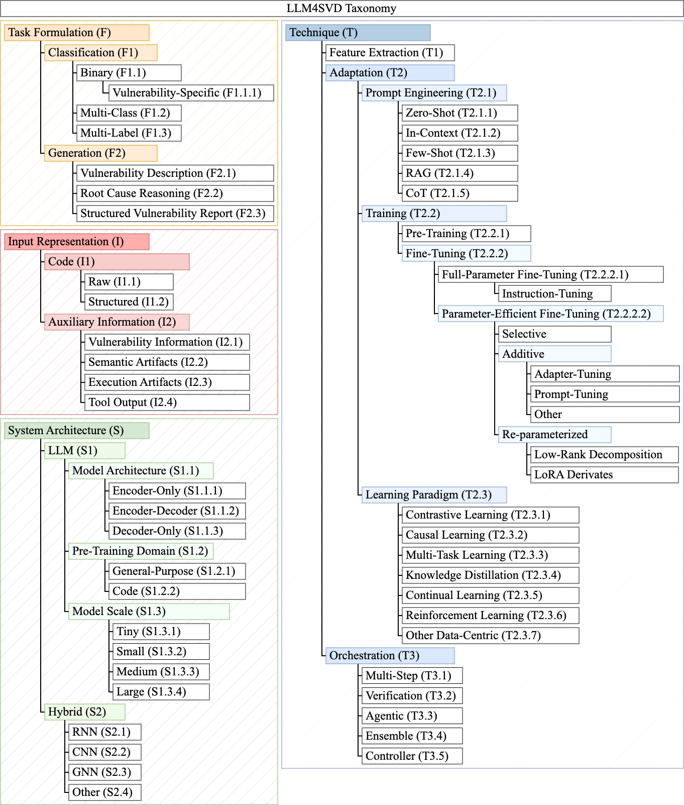

# LLM4SVD TAXONOMY 🗂️

We categorize existing LLM4SVD approaches according to detection task, input representation, system architecture, and technique. The presented [taxonomy](https://github.com/hs-esslingen-it-security/Awesome-LLM4SVD/tree/main/taxonomy/taxonomy.xlsx) allows for meaningful comparison and benchmarking of studies.   

## Papers by Taxonomy - Navigation

We list papers for selected categories below.

- [Generation (F2)](#generation-f2)
  - [F2.1 Description](#f21-description)
  - [F2.2 Reasoning](#f22-reasoning)
  - [F2.3 Report](#f23-report)
- [Auxiliary Information (I2)](#auxiliary-information-i2)
  - [I2.1 Vulnerability Information](#i21-vulnerability-information)
  - [I2.2 Semantic Artifacts](#i22-semantic-artifacts)
  - [I2.3 Execution Artifacts](#i23-execution-artifacts)
  - [I2.4 Tool Output](#i24-tool-output)
- [Hybrid (S2)](#hybrid-s2)
  - [S2.1 RNN](#s21-rnn)
  - [S2.2 CNN](#s22-cnn)
  - [S2.3 GNN](#s23-gnn)
  - [S2.4 Other](#s24-other)
- [Technique (T)](#technique-t)
  - [T1 Feature Extraction](#t1-feature-extraction)
    - [Feature Extraction](#feature-extraction)
  - [T2 Adaptation](#t2-adaptation)
    - [T2.1 Prompt Engineering](#t21-prompt-engineering)
      - [Zero-Shot](#zero-shot)
      - [In-Context](#in-context)
      - [Few-Shot](#few-shot)
      - [RAG](#rag)
      - [CoT](#cot)
    - [T2.2 Training](#t22-training)
      - [T2.2.1 Pre-Training](#t221-pre-training)
        - [Pre-Training](#pre-training)
      - [T2.2.2 Fine-Tuning](#t222-fine-tuning)
        - [T2.2.2.1 Full-Parameter Fine-Tuning](#t2221-full-parameter-fine-tuning)
          - [Full-Parameter Fine-Tuning](#full-parameter-fine-tuning)
          - [Instruction-Tuning](#instruction-tuning)
        - [T2.2.2.2 Parameter-Efficient Fine-Tuning (PEFT)](#t2222-parameter-efficient-fine-tuning-peft)
          - [T2.2.2.2.1 Selective](#t22221-selective)
            - [Selective](#selective)
          - [T2.2.2.2.2 Additive](#t22222-additive)
            - [Adapter-Tuning](#adapter-tuning)
            - [Prompt-Tuning](#prompt-tuning)
            - [Additive-Other](#additive-other)
          - [T2.2.2.2.3 Re-parameterized](#t22223-re-parameterized)
            - [Low-Rank Decomposition](#low-rank-decomposition)
            - [LoRA Derivates](#lora-derivates)
    - [T2.3 Learning Paradigms](#t23-learning-paradigms)
      - [Contrastive Learning](#contrastive-learning)
      - [Causal Learning](#causal-learning)
      - [Multi-Task Learning](#multi-task-learning)
      - [Knowledge Distillation](#knowledge-distillation)
      - [Continual Learning](#continual-learning)
      - [Reinforcement Learning](#reinforcement-learning)
      - [Other Data-Centric](#other-data-centric)
  - [T3 Orchestration](#t3-orchestration)
    - [Multi-Step](#multi-step)
    - [Verification](#verification)
    - [Agentic](#agentic)
    - [Ensemble](#ensemble)
    - [Controller](#controller)

## Papers by Taxonomy

## Generation (F2)

### F2.1 Description
- Transformer-based Vulnerability Detection in Code at EditTime: Zero-shot, Few-shot, or Fine-tuning?. **`arXiv 2023`** [[Paper](https://arxiv.org/abs/2306.01754)]
- Automating the Detection of Code Vulnerabilities by Analyzing GitHub Issues. **`ICSE 2025`** [[Paper](https://ieeexplore.ieee.org/abstract/document/11028308)]
- Exploring AI for Vulnerability Detection and Repair. **`CARS 2024`** [[Paper](https://ieeexplore.ieee.org/abstract/document/10778769)]
- VulExplainer: A Transformer-Based Hierarchical  Distillation for Explaining Vulnerability Types. **`TSE 2023`** [[Paper](https://ieeexplore.ieee.org/abstract/document/10220166)] [[Code](https://github.com/awsm-research/VulExplainer)]
- Bridging Semantics \& Structure for Software Vulnerability Detection using Hybrid Network Models. **`arXiv 2025`** [[Paper](https://arxiv.org/abs/2510.10321)] [[Code](https://zenodo.org/records/17259519)]
- Software Vulnerability and Functionality Assessment using Large Language Models. **`ICSE 2024`** [[Paper](https://dl.acm.org/doi/abs/10.1145/3643787.3648036)]
- An Unbiased Transformer Source Code Learning with Semantic Vulnerability Graph. **`EuroS&P 2023`** [[Paper](https://ieeexplore.ieee.org/abstract/document/10190505)] [[Code](https://github.com/pial08/SemVulDet)]
- Assessing the Effectiveness of LLMs in Android Application Vulnerability Analysis. **`ADIoT 2024`** [[Paper](https://link.springer.com/chapter/10.1007/978-3-031-85593-1_9)]
- Evaluating Large Language Models in Vulnerability Detection Under Variable Context Windows. **`ICMLA 2024`** [[Paper](https://ieeexplore.ieee.org/abstract/document/10903489)]
- Steering Large Language Models for Vulnerability Detection. **`ICASSP 2025`** [[Paper](https://ieeexplore.ieee.org/abstract/document/10887736)]
- VulnTeam: A Team Collaboration Framework for LLM-based Vulnerability Detection. **`IJCNN 2025`** [[Paper](https://ieeexplore.ieee.org/document/11229292)]
- Effectiveness of ChatGPT for Static Analysis: How Far Are We?. **`AIware 2024`** [[Paper](https://dl.acm.org/doi/abs/10.1145/3664646.3664777)] [[Code](https://zenodo.org/records/10828316)]
- On the Effectiveness of Instruction-Tuning Local LLMs for Identifying Software Vulnerabilities. **`arXiv 2025`** [[Paper](https://arxiv.org/abs/2512.20062)]
- Real-VulLLM: An LLM Based Assessment Framework in the Wild. **`arXiv 2025`** [[Paper](https://arxiv.org/abs/2510.04056)]
- Large Language Models for Multilingual Vulnerability Detection: How Far Are We?. **`arXiv 2025`** [[Paper](https://arxiv.org/abs/2506.07503)] [[Code](https://github.com/SpanShu96/Large-Language-Model-for-Multilingual-Vulnerability-Detection/tree/main)]
- Large Language Models for In-File Vulnerability Localization Can Be ""Lost in the End"". **`PACMSE 2025`** [[Paper](https://dl.acm.org/doi/abs/10.1145/3715758)] [[Code](https://zenodo.org/records/14840519)]
- Closing the Gap: A User Study on the Real-world Usefulness of AI-powered Vulnerability Detection \& Repair in the IDE. **`ICSE 2024`** [[Paper](https://ieeexplore.ieee.org/abstract/document/11029760)] [[Code](https://figshare.com/articles/dataset/Closing_the_Gap_A_User_Study_on_the_Real-world_Usefulness_of_AI-powered_Vulnerability_Detection_Repair_in_the_IDE/26367139?file=52478936)]
- Harnessing Large Language Models for Software Vulnerability Detection: A Comprehensive Benchmarking Study. **`IEEE Access 2024`** [[Paper](https://ieeexplore.ieee.org/abstract/document/10879492)]
- ANVIL: Anomaly-based Vulnerability Identification without Labelled Training Data. **`arXiv 2024`** [[Paper](https://arxiv.org/abs/2408.16028)] [[Code](https://anonymous.4open.science/r/anvil)]
- M2CVD: Enhancing Vulnerability Understanding through Multi-Model Collaboration for Code Vulnerability Detection. **`TOSEM 2024`** [[Paper](https://arxiv.org/abs/2406.05940)] [[Code](https://github.com/HotFrom/M2CVD)]
- Evaluating the Impact of Conventional Code Analysis Against Large Language Models in API Vulnerability Detection. **`EICC 2024`** [[Paper](https://dl.acm.org/doi/abs/10.1145/3655693.3655701)]
- Benchmarking LLMs and LLM-based Agents in Practical Vulnerability Detection for Code Repositories. **`Unknown 2025`** [[Paper](https://arxiv.org/abs/2503.03586)]

### F2.2 Reasoning
- SecVulEval: Benchmarking LLMs for Real-World C/C++ Vulnerability Detection. **`arXiv 2025`** [[Paper](https://arxiv.org/abs/2505.19828)] [[Code](https://github.com/basimbd/SecVulEval)]
- GPTVD: vulnerability detection and analysis method based on LLM’s chain of thoughts. **`ASE 2025`** [[Paper](https://link.springer.com/article/10.1007/s10515-025-00550-4)] [[Code](https://github.com/chenyn273/GPTVD)]
- Helping LLMs Improve Code Generation Using Feedback from Testing and Static Analysis. **`arXiv 2024`** [[Paper](https://arxiv.org/abs/2412.14841)]
- Vul-RAG: Enhancing LLM-based Vulnerability Detection via Knowledge-level RAG. **`arXiv 2024`** [[Paper](https://arxiv.org/abs/2406.11147)] [[Code](https://github.com/knowledgerag4llmvuld/knowledgerag4llmvuld)]
- May the Source Be with You: On ChatGPT, Cybersecurity, and Secure Coding. **`Information 2024`** [[Paper](https://www.mdpi.com/2078-2489/15/9/572)]
- Compressing Large Language Models for SQL Injection Detection: A Case Study on Deep Seek-Coder and Meta-llama-3-70b-instruct. **`FRUCT 2025`** [[Paper](https://ieeexplore.ieee.org/document/11239157)]
- Enhancing Source Code Security with LLMs: Demystifying The Challenges and Generating Reliable Repairs. **`arXiv 2024`** [[Paper](https://arxiv.org/abs/2409.00571)]
- LLaVul: A Multimodal LLM for Interpretable Vulnerability Reasoning about Source Code. **`ICSC 2025`** [[Paper](https://ieeexplore.ieee.org/abstract/document/11140501)]
- Boosting Cybersecurity Vulnerability Scanning based on LLM-supported Static Application Security Testing. **`arXiv 2024`** [[Paper](https://arxiv.org/abs/2409.15735)]
- Understanding the Effectiveness of Large Language Models in Detecting Security Vulnerabilities. **`ICST 2023`** [[Paper](https://ieeexplore.ieee.org/abstract/document/10988968)] [[Code](https://github.com/seal-research/secvul-llm-study/)]
- A Qualitative Study on Using ChatGPT for Software Security: Perception vs. Practicality. **`TPS-ISA 2024`** [[Paper](https://ieeexplore.ieee.org/abstract/document/10835695)] [[Code](https://figshare.com/articles/dataset/Reproduction_package_for_paper_A_Qualitative_Study_on_Using_ChatGPT_for_Software_Security_Perception_vs_Practicality_/24452365?file=48008890)]
- CryptoScope: Utilizing Large Language Models for Automated Cryptographic Logic Vulnerability Detection. **`arXiv 2025`** [[Paper](https://arxiv.org/abs/2508.11599)]
- Everything You Wanted to Know About LLM-based Vulnerability Detection But Were Afraid to Ask. **`arXiv 2025`** [[Paper](https://arxiv.org/abs/2504.13474)] [[Code](https://anonymous.4open.science/r/CORRECT/README.md)]
- IRIS: LLM-Assisted Static Analysis for Detecting Security Vulnerabilities. **`ICLR 2024`** [[Paper](https://arxiv.org/abs/2405.17238)] [[Code](https://github.com/iris-sast/iris)]
- MAVUL: Multi-Agent Vulnerability Detection via Contextual Reasoning and Interactive Refinement. **`arXiv 2025`** [[Paper](https://arxiv.org/abs/2510.00317)] [[Code](https://github.com/youpengl/MAVUL)]
- A Systematic Study of Code Obfuscation Against LLM-based Vulnerability Detection. **`arXiv 2025`** [[Paper](https://arxiv.org/abs/2512.16538)] [[Code](https://github.com/oxygen-hunter/SoK-Code-Obfuscation-in-LLM-VD-arxiv)]
- Software Vulnerability Detection with GPT and In-Context Learning. **`DSC 2023`** [[Paper](https://ieeexplore.ieee.org/abstract/document/10381286)]
- VulDetectBench: Evaluating the Deep Capability of Vulnerability Detection with Large Language Models. **`arXiv 2024`** [[Paper](https://arxiv.org/abs/2406.07595)] [[Code](https://github.com/Sweetaroo/VulDetectBench)]
- VulnTeam: A Team Collaboration Framework for LLM-based Vulnerability Detection. **`IJCNN 2025`** [[Paper](https://ieeexplore.ieee.org/document/11229292)]
- Towards Explainable Vulnerability Detection With Large Language Models. **`TSE 2024`** [[Paper](https://arxiv.org/abs/2406.09701)]
- LLbezpeky: Leveraging Large Language Models for Vulnerability Detection. **`arXiv 2024`** [[Paper](https://arxiv.org/abs/2401.01269)]
- LLM-GUARD: Large Language Model-Based Detection and Repair of Bugs and Security Vulnerabilities in C++ and Python. **`arXiv 2025`** [[Paper](https://arxiv.org/abs/2508.16419)] [[Code](https://github.com/NoujoudNader/LLM-Bugs-Detection)]
- Human-Understandable Explanation for Software Vulnerability Prediction. **`JSS 2025`** [[Paper](https://www.sciencedirect.com/science/article/pii/S0164121225001232)] [[Code](https://github.com/quy-ng/human-xai-software-vulnerability-prediction)]
- Distinguishing Look-Alike Innocent and Vulnerable Code by Subtle Semantic Representation Learning and Explanation. **`ESEC/FSE 2023`** [[Paper](https://dl.acm.org/doi/abs/10.1145/3611643.3616358)] [[Code](https://github.com/jacknichao/SVulD)]
- VulnLLM-R: Specialized Reasoning LLM with Agent Scaffold for Vulnerability Detection. **`arXiv 2025`** [[Paper](https://arxiv.org/abs/2512.07533)] [[Code](https://github.com/ucsb-mlsec/VulnLLM-R)]
- Real-VulLLM: An LLM Based Assessment Framework in the Wild. **`arXiv 2025`** [[Paper](https://arxiv.org/abs/2510.04056)]
- Think Broad, Act Narrow: CWE Identification with Multi-Agent Large Language Models. **`arXiv 2025`** [[Paper](https://arxiv.org/abs/2508.01451)] [[Code](https://zenodo.org/records/15871507)]
- Improving LLM Reasoning for Vulnerability Detection via Group Relative Policy Optimization. **`arXiv 2025`** [[Paper](https://arxiv.org/abs/2507.03051)]
- To Err is Machine: Vulnerability Detection Challenges LLM Reasoning. **`arXiv 2024`** [[Paper](https://arxiv.org/abs/2403.17218)] [[Code](https://figshare.com/articles/dataset/Data_Package_for_LLM_Vulnerability_Detection_Study/27368025)]
- LLM4Vuln: A Unified Evaluation Framework for Decoupling and Enhancing LLMs' Vulnerability Reasoning. **`arXiv 2024`** [[Paper](https://arxiv.org/abs/2401.16185)] [[Code](https://anonymous.4open.science/r/LLM4Vuln/README.md)]
- LLMs Cannot Reliably Identify and Reason About Security Vulnerabilities (Yet?): A Comprehensive Evaluation, Framework, and Benchmarks. **`SP 2023`** [[Paper](https://ieeexplore.ieee.org/abstract/document/10646663/)] [[Code](https://github.com/ai4cloudops/SecLLMHolmes)]
- Leveraging Large Language Models for Command Injection Vulnerability Analysis in Python: An Empirical Study on Popular Open-Source Projects. **`arXiv 2025`** [[Paper](https://arxiv.org/abs/2505.15088)]
- SecureMind: A Framework for Benchmarking Large Language Models in Memory Bug Detection and Repair. **`ISMM 2025`** [[Paper](https://dl.acm.org/doi/abs/10.1145/3735950.3735954)] [[Code](https://github.com/HuantWang/SecureMind)]
- VulAgent: Hypothesis-Validation based Multi-Agent Vulnerability Detection. **`arXiv 2025`** [[Paper](https://arxiv.org/abs/2509.11523)]
- Distilling Lightweight Language Models for C/C++ Vulnerabilities. **`arXiv 2025`** [[Paper](https://arxiv.org/abs/2510.06645)] [[Code](https://github.com/yangxiaoxuan123/ FineSec_detect)]
- Boosting Vulnerability Detection of LLMs via Curriculum Preference Optimization with Synthetic Reasoning Data. **`arXiv 2025`** [[Paper](https://arxiv.org/abs/2506.07390)] [[Code](https://github.com/Xin-Cheng-Wen/PO4Vul)]
- R2Vul: Learning to Reason about Software Vulnerabilities with Reinforcement Learning and Structured Reasoning Distillation. **`arXiv 2025`** [[Paper](https://arxiv.org/abs/2504.04699)] [[Code](https://github.com/martin-wey/R2Vul)]
- Beyond ChatGPT: Enhancing Software Quality Assurance Tasks with Diverse LLMs and Validation Techniques. **`arXiv 2024`** [[Paper](https://arxiv.org/abs/2409.01001)] [[Code](https://figshare.com/s/5da14b0776750c6fa787)]
- Context-Enhanced Vulnerability Detection Based on Large Language Models. **`TOSEM 2025`** [[Paper](https://arxiv.org/abs/2504.16877)] [[Code](https://github.com/DoeSEResearch/PacVD)]
- DLAP: A Deep Learning Augmented Large Language Model Prompting Framework for Software Vulnerability Detection. **`JSS 2024`** [[Paper]()] [[Code](https://github.com/Yang-Yanjing/DLAP)]
- Specification-Guided Vulnerability Detection with Large Language Models. **`arXiv 2025`** [[Paper](https://arxiv.org/abs/2511.04014)] [[Code](https://github.com/zhuhaopku/VulInstruct-temp)]
- Reasoning with LLMs for Zero-Shot Vulnerability Detection. **`arXiv 2025`** [[Paper](https://arxiv.org/abs/2503.17885)] [[Code](https://github.com/Erroristotle/VulnSage)]

### F2.3 Report
- CASTLE: Benchmarking Dataset for Static Code Analyzers and LLMs towards CWE Detection. **`TASE 2025`** [[Paper](https://link.springer.com/chapter/10.1007/978-3-031-98208-8_15)] [[Code](https://github.com/CASTLE-Benchmark)]
- Large Language Models Cannot Reliably Detect Vulnerabilities in JavaScript: The First Systematic Benchmark and Evaluation. **`arXiv 2025`** [[Paper](https://arxiv.org/abs/2512.01255)] [[Code](https://github.com/SecJS-Vuln-Benchmark/SecJS-Benchmark)] [[Code](https://secjs-vuln-benchmark.github.io/SecJS-Benchmark/)]
- MalCodeAI: Autonomous Vulnerability Detection and Remediation via Language Agnostic Code Reasoning. **`IRI 2025`** [[Paper](https://ieeexplore.ieee.org/abstract/document/11153184)]
- Large Language Models Versus Static Code Analysis Tools: A Systematic Benchmark for Vulnerability Detection. **`arXiv 2025`** [[Paper](https://arxiv.org/pdf/2508.04448)] [[Code](https://github.com/Damian0401/ProjectAnalyzer)]
- DeepVulHunter: Enhancing the Code Vulnerability Detection Capability of LLMs through Multi-Round Analysis. **`JIIS 2025`** [[Paper](https://link.springer.com/article/10.1007/s10844-025-00982-0)]
- Boosting Cybersecurity Vulnerability Scanning based on LLM-supported Static Application Security Testing. **`arXiv 2024`** [[Paper](https://arxiv.org/abs/2409.15735)]
- Understanding the Effectiveness of Large Language Models in Detecting Security Vulnerabilities. **`ICST 2023`** [[Paper](https://ieeexplore.ieee.org/abstract/document/10988968)] [[Code](https://github.com/seal-research/secvul-llm-study/)]
- An Ensemble Transformer Approach with Cross-Attention for Automated Code Security Vulnerability Detection and Documentation. **`ISDFS 2025`** [[Paper](https://ieeexplore.ieee.org/abstract/document/11012039)]
- Human-Understandable Explanation for Software Vulnerability Prediction. **`JSS 2025`** [[Paper](https://www.sciencedirect.com/science/article/pii/S0164121225001232)] [[Code](https://github.com/quy-ng/human-xai-software-vulnerability-prediction)]
- Can Large Language Models Find And Fix Vulnerable Software?. **`arXiv 2023`** [[Paper](https://arxiv.org/abs/2308.10345)]
- Automated Software Vulnerability Static Code Analysis Using Generative Pre-Trained Transformer Models. **`arXiv 2024`** [[Paper](https://arxiv.org/abs/2408.00197)]
- iCodeReviewer: Improving Secure Code Review with Mixture of Prompts. **`arXiv 2025`** [[Paper](https://arxiv.org/abs/2510.12186)]
- A Preliminary Study on Using Large Language Models in Software Pentesting. **`NDSS 2024`** [[Paper](https://arxiv.org/abs/2401.17459)]
- LLM4Vuln: A Unified Evaluation Framework for Decoupling and Enhancing LLMs' Vulnerability Reasoning. **`arXiv 2024`** [[Paper](https://arxiv.org/abs/2401.16185)] [[Code](https://anonymous.4open.science/r/LLM4Vuln/README.md)]
- Leveraging Intra-and Inter-References in Vulnerability Detection using Multi-Agent Collaboration Based on LLMs. **`Cluster Computing 2025`** [[Paper](https://link.springer.com/article/10.1007/s10586-025-05721-2)]
- Distilling Lightweight Language Models for C/C++ Vulnerabilities. **`arXiv 2025`** [[Paper](https://arxiv.org/abs/2510.06645)] [[Code](https://github.com/yangxiaoxuan123/ FineSec_detect)]
- R2Vul: Learning to Reason about Software Vulnerabilities with Reinforcement Learning and Structured Reasoning Distillation. **`arXiv 2025`** [[Paper](https://arxiv.org/abs/2504.04699)] [[Code](https://github.com/martin-wey/R2Vul)]
- Let the Trial Begin: A Mock-Court Approach to Vulnerability Detection using LLM-Based Agents. **`arXiv 2025`** [[Paper](https://arxiv.org/abs/2505.10961)] [[Code](https://figshare.com/s/1514bc9a7aa64b46d94e)]
- Beyond Static Pattern Matching? Rethinking Automatic Cryptographic API Misuse Detection in the Era of LLMs. **`PACMSE 2025`** [[Paper](https://dl.acm.org/doi/abs/10.1145/3728875)]
- DLAP: A Deep Learning Augmented Large Language Model Prompting Framework for Software Vulnerability Detection. **`JSS 2024`** [[Paper]()] [[Code](https://github.com/Yang-Yanjing/DLAP)]
- An Insight into Security Code Review with LLMs: Capabilities, Obstacles, and Influential Factors. **`arXiv 2024`** [[Paper](https://arxiv.org/abs/2401.16310)] [[Code](https://zenodo.org/records/15572151)]
- SSRFSeek: An LLM-based Static Analysis Framework for Detecting SSRF Vulnerabilities in PHP Applications. **`AINIT 2025`** [[Paper](https://ieeexplore.ieee.org/abstract/document/11035424)]
- Specification-Guided Vulnerability Detection with Large Language Models. **`arXiv 2025`** [[Paper](https://arxiv.org/abs/2511.04014)] [[Code](https://github.com/zhuhaopku/VulInstruct-temp)]
- Reasoning with LLMs for Zero-Shot Vulnerability Detection. **`arXiv 2025`** [[Paper](https://arxiv.org/abs/2503.17885)] [[Code](https://github.com/Erroristotle/VulnSage)]

## Auxiliary Information (I2)

### I2.1 Vulnerability Information
- Using ChatGPT as a Static Application Security Testing Tool. **`arXiv 2023`** [[Paper](https://arxiv.org/abs/2308.14434)] [[Code](https://github.com/abakhshandeh/ChatGPTasSAST)]
- LLM-CloudSec: Large Language Model Empowered Automatic and Deep Vulnerability Analysis for Intelligent Clouds. **`INFOCOM 2024`** [[Paper](https://ieeexplore.ieee.org/abstract/document/10620804)] [[Code](https://github.com/DPCa0/LLM-CloudSec)]
- Can LLM Prompting Serve as a Proxy for Static Analysis in Vulnerability Detection. **`arXiv 2024`** [[Paper](https://arxiv.org/abs/2412.12039)]
- Transformer-based Vulnerability Detection in Code at EditTime: Zero-shot, Few-shot, or Fine-tuning?. **`arXiv 2023`** [[Paper](https://arxiv.org/abs/2306.01754)]
- GPTVD: vulnerability detection and analysis method based on LLM’s chain of thoughts. **`ASE 2025`** [[Paper](https://link.springer.com/article/10.1007/s10515-025-00550-4)] [[Code](https://github.com/chenyn273/GPTVD)]
- Vulnerability Detection with Code Language Models: How Far are We?. **`ICSE 2024`** [[Paper](https://ieeexplore.ieee.org/abstract/document/11029911)] [[Code](https://github.com/DLVulDet/PrimeVul)]
- Helping LLMs Improve Code Generation Using Feedback from Testing and Static Analysis. **`arXiv 2024`** [[Paper](https://arxiv.org/abs/2412.14841)]
- Large Language Models for Secure Code Assessment: A Multi-Language Empirical Study. **`arXiv 2024`** [[Paper](https://arxiv.org/abs/2408.06428)]
- Vul-RAG: Enhancing LLM-based Vulnerability Detection via Knowledge-level RAG. **`arXiv 2024`** [[Paper](https://arxiv.org/abs/2406.11147)] [[Code](https://github.com/knowledgerag4llmvuld/knowledgerag4llmvuld)]
- Expert-in-the-Loop Systems with Cross-Domain and In-Domain Few-Shot Learning for Software Vulnerability Detection. **`arXiv 2025`** [[Paper](https://arxiv.org/abs/2506.10104)]
- ChatGPT for Vulnerability Detection, Classification, and Repair: How Far Are We?. **`APSEC 2023`** [[Paper](https://ieeexplore.ieee.org/abstract/document/10479409)] [[Code](https://github.com/awsm-research/ChatGPT4Vul)]
- Large Language Models Versus Static Code Analysis Tools: A Systematic Benchmark for Vulnerability Detection. **`arXiv 2025`** [[Paper](https://arxiv.org/pdf/2508.04448)] [[Code](https://github.com/Damian0401/ProjectAnalyzer)]
- On Selecting Few-Shot Examples for LLM-based Code Vulnerability Detection. **`arXiv 2025`** [[Paper](https://arxiv.org/abs/2510.27675)]
- DeepVulHunter: Enhancing the Code Vulnerability Detection Capability of LLMs through Multi-Round Analysis. **`JIIS 2025`** [[Paper](https://link.springer.com/article/10.1007/s10844-025-00982-0)]
- Boosting Cybersecurity Vulnerability Scanning based on LLM-supported Static Application Security Testing. **`arXiv 2024`** [[Paper](https://arxiv.org/abs/2409.15735)]
- Assessing the Effectiveness of LLMs in Android Application Vulnerability Analysis. **`ADIoT 2024`** [[Paper](https://link.springer.com/chapter/10.1007/978-3-031-85593-1_9)]
- Software Vulnerability Prediction in Low-Resource Languages: An Empirical Study of CodeBERT and ChatGPT. **`EASE 2024`** [[Paper](https://dl.acm.org/doi/abs/10.1145/3661167.3661281)] [[Code](https://github.com/lhmtriet/LLM4Vul)]
- CryptoScope: Utilizing Large Language Models for Automated Cryptographic Logic Vulnerability Detection. **`arXiv 2025`** [[Paper](https://arxiv.org/abs/2508.11599)]
- Everything You Wanted to Know About LLM-based Vulnerability Detection But Were Afraid to Ask. **`arXiv 2025`** [[Paper](https://arxiv.org/abs/2504.13474)] [[Code](https://anonymous.4open.science/r/CORRECT/README.md)]
- Revisiting Pre-trained Language Models for Vulnerability Detection. **`arXiv 2025`** [[Paper](https://arxiv.org/abs/2507.16887)]
- Exploration On Prompting LLM With Code-Specific Information For Vulnerability Detection. **`SSE 2024`** [[Paper](https://ieeexplore.ieee.org/abstract/document/10664399)]
- Software Vulnerability Detection with GPT and In-Context Learning. **`DSC 2023`** [[Paper](https://ieeexplore.ieee.org/abstract/document/10381286)]
- VulDetectBench: Evaluating the Deep Capability of Vulnerability Detection with Large Language Models. **`arXiv 2024`** [[Paper](https://arxiv.org/abs/2406.07595)] [[Code](https://github.com/Sweetaroo/VulDetectBench)]
- VulnTeam: A Team Collaboration Framework for LLM-based Vulnerability Detection. **`IJCNN 2025`** [[Paper](https://ieeexplore.ieee.org/document/11229292)]
- GRACE: Empowering LLM-based Software Vulnerability Detection with Graph Structure and In-Context Learning. **`JSS 2024`** [[Paper](https://www.sciencedirect.com/science/article/pii/S0164121224000748)] [[Code](https://github.com/P-E-Vul/GRACE)]
- HALURust: Exploiting Hallucinations of Large Language Models to Detect Vulnerabilities in Rust. **`arXiv 2025`** [[Paper](https://arxiv.org/abs/2503.10793)]
- Towards Explainable Vulnerability Detection With Large Language Models. **`TSE 2024`** [[Paper](https://arxiv.org/abs/2406.09701)]
- LLbezpeky: Leveraging Large Language Models for Vulnerability Detection. **`arXiv 2024`** [[Paper](https://arxiv.org/abs/2401.01269)]
- Effectiveness of ChatGPT for Static Analysis: How Far Are We?. **`AIware 2024`** [[Paper](https://dl.acm.org/doi/abs/10.1145/3664646.3664777)] [[Code](https://zenodo.org/records/10828316)]
- Learning-based Models for Vulnerability Detection: An Extensive Study. **`EMSE 2024`** [[Paper](https://arxiv.org/abs/2408.07526)] [[Code](https://figshare.com/s/bde8e41890e8179fbe5f?file=41894784)]
- Chain-of-Thought Prompting of Large Language Models for Discovering and Fixing Software Vulnerabilities. **`arXiv 2024`** [[Paper](https://arxiv.org/abs/2402.17230)]
- Llama-Based Source Code Vulnerability Detection: Prompt Engineering vs Fine Tuning. **`ESORICS 2025`** [[Paper](https://link.springer.com/chapter/10.1007/978-3-032-07884-1_15)] [[Code](https://github.com/DynaSoumhaneOuchebara/Llama-based-vulnerability-detection)]
- Automated Software Vulnerability Static Code Analysis Using Generative Pre-Trained Transformer Models. **`arXiv 2024`** [[Paper](https://arxiv.org/abs/2408.00197)]
- Real-VulLLM: An LLM Based Assessment Framework in the Wild. **`arXiv 2025`** [[Paper](https://arxiv.org/abs/2510.04056)]
- Think Broad, Act Narrow: CWE Identification with Multi-Agent Large Language Models. **`arXiv 2025`** [[Paper](https://arxiv.org/abs/2508.01451)] [[Code](https://zenodo.org/records/15871507)]
- A Preliminary Study on Using Large Language Models in Software Pentesting. **`NDSS 2024`** [[Paper](https://arxiv.org/abs/2401.17459)]
- Research on the LLM-Driven Vulnerability Detection System Using LProtector. **`ICDSCA 2024`** [[Paper](https://ieeexplore.ieee.org/abstract/document/10859408)]
- Software Vulnerability Detection Using LLM: Does Additional Information Help?. **`ACSAC 2024`** [[Paper](https://ieeexplore.ieee.org/abstract/document/10917361)] [[Code](https://github.com/research7485/vulnerability_detection)]
- Large Language Models for Multilingual Vulnerability Detection: How Far Are We?. **`arXiv 2025`** [[Paper](https://arxiv.org/abs/2506.07503)] [[Code](https://github.com/SpanShu96/Large-Language-Model-for-Multilingual-Vulnerability-Detection/tree/main)]
- Large Language Models for In-File Vulnerability Localization Can Be ""Lost in the End"". **`PACMSE 2025`** [[Paper](https://dl.acm.org/doi/abs/10.1145/3715758)] [[Code](https://zenodo.org/records/14840519)]
- To Err is Machine: Vulnerability Detection Challenges LLM Reasoning. **`arXiv 2024`** [[Paper](https://arxiv.org/abs/2403.17218)] [[Code](https://figshare.com/articles/dataset/Data_Package_for_LLM_Vulnerability_Detection_Study/27368025)]
- LLM4Vuln: A Unified Evaluation Framework for Decoupling and Enhancing LLMs' Vulnerability Reasoning. **`arXiv 2024`** [[Paper](https://arxiv.org/abs/2401.16185)] [[Code](https://anonymous.4open.science/r/LLM4Vuln/README.md)]
- Manual Prompt Engineering is Not Dead: A Case Study on Large Language Models for Code Vulnerability Detection with DSPy. **`CDMA 2025`** [[Paper](https://ieeexplore.ieee.org/abstract/document/10908746)]
- Leveraging Intra-and Inter-References in Vulnerability Detection using Multi-Agent Collaboration Based on LLMs. **`Cluster Computing 2025`** [[Paper](https://link.springer.com/article/10.1007/s10586-025-05721-2)]
- A Sequential Multi-Stage Approach for Code Vulnerability Detection via Confidence- and Collaboration-based Decision Making. **`EMNLP 2025`** [[Paper](https://aclanthology.org/2025.emnlp-main.1071/)]
- LLMs Cannot Reliably Identify and Reason About Security Vulnerabilities (Yet?): A Comprehensive Evaluation, Framework, and Benchmarks. **`SP 2023`** [[Paper](https://ieeexplore.ieee.org/abstract/document/10646663/)] [[Code](https://github.com/ai4cloudops/SecLLMHolmes)]
- Enhancing Large Language Models for Secure Code Generation: A Dataset-driven Study on Vulnerability Mitigation. **`arXiv 2023`** [[Paper](https://arxiv.org/abs/2310.16263)]
- SecureMind: A Framework for Benchmarking Large Language Models in Memory Bug Detection and Repair. **`ISMM 2025`** [[Paper](https://dl.acm.org/doi/abs/10.1145/3735950.3735954)] [[Code](https://github.com/HuantWang/SecureMind)]
- Beyond ChatGPT: Enhancing Software Quality Assurance Tasks with Diverse LLMs and Validation Techniques. **`arXiv 2024`** [[Paper](https://arxiv.org/abs/2409.01001)] [[Code](https://figshare.com/s/5da14b0776750c6fa787)]
- Let the Trial Begin: A Mock-Court Approach to Vulnerability Detection using LLM-Based Agents. **`arXiv 2025`** [[Paper](https://arxiv.org/abs/2505.10961)] [[Code](https://figshare.com/s/1514bc9a7aa64b46d94e)]
- Beyond Static Pattern Matching? Rethinking Automatic Cryptographic API Misuse Detection in the Era of LLMs. **`PACMSE 2025`** [[Paper](https://dl.acm.org/doi/abs/10.1145/3728875)]
- DLAP: A Deep Learning Augmented Large Language Model Prompting Framework for Software Vulnerability Detection. **`JSS 2024`** [[Paper]()] [[Code](https://github.com/Yang-Yanjing/DLAP)]
- Benchmarking LLMs and LLM-based Agents in Practical Vulnerability Detection for Code Repositories. **`Unknown 2025`** [[Paper](https://arxiv.org/abs/2503.03586)]
- Multitask-Based Evaluation of Open-Source LLM on Software Vulnerability. **`TSE 2024`** [[Paper](https://ieeexplore.ieee.org/abstract/document/10706805)] [[Code](https://github.com/vinci-grape/VulEmpirical)]
- An Insight into Security Code Review with LLMs: Capabilities, Obstacles, and Influential Factors. **`arXiv 2024`** [[Paper](https://arxiv.org/abs/2401.16310)] [[Code](https://zenodo.org/records/15572151)]
- Benchmarking Large Language Models for Multi-Language Software Vulnerability Detection. **`arXiv 2025`** [[Paper](https://arxiv.org/abs/2503.01449)] [[Code](https://github.com/soarsmu/SVD-Bench)]
- Comparison of Static Application Security Testing Tools and Large Language Models for Repo-level Vulnerability Detection. **`arXiv 2024`** [[Paper](https://arxiv.org/abs/2407.16235)]
- Large Language Model for Vulnerability Detection: Emerging Results and Future Directions. **`ICSE 2024`** [[Paper](https://dl.acm.org/doi/abs/10.1145/3639476.3639762)] [[Code](https://github.com/soarsmu/ChatGPT-VulDetection)]
- Specification-Guided Vulnerability Detection with Large Language Models. **`arXiv 2025`** [[Paper](https://arxiv.org/abs/2511.04014)] [[Code](https://github.com/zhuhaopku/VulInstruct-temp)]

### I2.2 Semantic Artifacts
- Vul-RAG: Enhancing LLM-based Vulnerability Detection via Knowledge-level RAG. **`arXiv 2024`** [[Paper](https://arxiv.org/abs/2406.11147)] [[Code](https://github.com/knowledgerag4llmvuld/knowledgerag4llmvuld)]
- Detecting Code Vulnerabilities using LLMs. **`DSN 2025`** [[Paper](https://ieeexplore.ieee.org/abstract/document/11068842)] [[Code](https://github.com/a24167566/LLMs-Code-Vulnerability-Detection)]
- LLaVul: A Multimodal LLM for Interpretable Vulnerability Reasoning about Source Code. **`ICSC 2025`** [[Paper](https://ieeexplore.ieee.org/abstract/document/11140501)]
- CLeVeR: Multi-modal Contrastive Learning for Vulnerability Code Representation. **`ACL 2025`** [[Paper](https://aclanthology.org/2025.findings-acl.414/)] [[Code](https://github.com/yoimiya-nlp/CLeVeR)]
- CryptoScope: Utilizing Large Language Models for Automated Cryptographic Logic Vulnerability Detection. **`arXiv 2025`** [[Paper](https://arxiv.org/abs/2508.11599)]
- LLM4Vuln: A Unified Evaluation Framework for Decoupling and Enhancing LLMs' Vulnerability Reasoning. **`arXiv 2024`** [[Paper](https://arxiv.org/abs/2401.16185)] [[Code](https://anonymous.4open.science/r/LLM4Vuln/README.md)]
- Streamlining Security Vulnerability Triage with Large Language Models. **`arXiv 2025`** [[Paper](https://arxiv.org/abs/2501.18908)] [[Code](https://zenodo.org/records/14776104)]

### I2.3 Execution Artifacts
- SecVulEval: Benchmarking LLMs for Real-World C/C++ Vulnerability Detection. **`arXiv 2025`** [[Paper](https://arxiv.org/abs/2505.19828)] [[Code](https://github.com/basimbd/SecVulEval)]
- Everything You Wanted to Know About LLM-based Vulnerability Detection But Were Afraid to Ask. **`arXiv 2025`** [[Paper](https://arxiv.org/abs/2504.13474)] [[Code](https://anonymous.4open.science/r/CORRECT/README.md)]
- IRIS: LLM-Assisted Static Analysis for Detecting Security Vulnerabilities. **`ICLR 2024`** [[Paper](https://arxiv.org/abs/2405.17238)] [[Code](https://github.com/iris-sast/iris)]
- Revisiting Pre-trained Language Models for Vulnerability Detection. **`arXiv 2025`** [[Paper](https://arxiv.org/abs/2507.16887)]
- LLM-GUARD: Large Language Model-Based Detection and Repair of Bugs and Security Vulnerabilities in C++ and Python. **`arXiv 2025`** [[Paper](https://arxiv.org/abs/2508.16419)] [[Code](https://github.com/NoujoudNader/LLM-Bugs-Detection)]
- Think Broad, Act Narrow: CWE Identification with Multi-Agent Large Language Models. **`arXiv 2025`** [[Paper](https://arxiv.org/abs/2508.01451)] [[Code](https://zenodo.org/records/15871507)]
- LLM4Vuln: A Unified Evaluation Framework for Decoupling and Enhancing LLMs' Vulnerability Reasoning. **`arXiv 2024`** [[Paper](https://arxiv.org/abs/2401.16185)] [[Code](https://anonymous.4open.science/r/LLM4Vuln/README.md)]
- Harnessing Large Language Models for Software Vulnerability Detection: A Comprehensive Benchmarking Study. **`IEEE Access 2024`** [[Paper](https://ieeexplore.ieee.org/abstract/document/10879492)]
- VulEval: Towards Repository-Level Evaluation of Software Vulnerability Detection. **`arXiv 2024`** [[Paper](https://arxiv.org/abs/2404.15596)]
- Context-Enhanced Vulnerability Detection Based on Large Language Models. **`TOSEM 2025`** [[Paper](https://arxiv.org/abs/2504.16877)] [[Code](https://github.com/DoeSEResearch/PacVD)]
- SSRFSeek: An LLM-based Static Analysis Framework for Detecting SSRF Vulnerabilities in PHP Applications. **`AINIT 2025`** [[Paper](https://ieeexplore.ieee.org/abstract/document/11035424)]

### I2.4 Tool Output
- Using ChatGPT as a Static Application Security Testing Tool. **`arXiv 2023`** [[Paper](https://arxiv.org/abs/2308.14434)] [[Code](https://github.com/abakhshandeh/ChatGPTasSAST)]
- Boosting Cybersecurity Vulnerability Scanning based on LLM-supported Static Application Security Testing. **`arXiv 2024`** [[Paper](https://arxiv.org/abs/2409.15735)]
- ♪ With a Little Help from My (LLM) Friends: Enhancing Static Analysis with LLMs to Detect Software Vulnerabilities. **`ICSE 2025`** [[Paper](https://ieeexplore.ieee.org/abstract/document/11028575)]
- VulnLLM-R: Specialized Reasoning LLM with Agent Scaffold for Vulnerability Detection. **`arXiv 2025`** [[Paper](https://arxiv.org/abs/2512.07533)] [[Code](https://github.com/ucsb-mlsec/VulnLLM-R)]
- VulAgent: Hypothesis-Validation based Multi-Agent Vulnerability Detection. **`arXiv 2025`** [[Paper](https://arxiv.org/abs/2509.11523)]
- DLAP: A Deep Learning Augmented Large Language Model Prompting Framework for Software Vulnerability Detection. **`JSS 2024`** [[Paper]()] [[Code](https://github.com/Yang-Yanjing/DLAP)]

## Hybrid (S2)

### S2.1 RNN
- DB-CBIL: A DistilBert-Based Transformer Hybrid Model Using CNN and BiLSTM for Software Vulnerability Detection. **`IEEE Access 2024`** [[Paper](https://ieeexplore.ieee.org/abstract/document/10517582)]
- Fine-Tuning Pre-trained Model with Optimizable Prompt Learning for Code Vulnerability Detection. **`ISSRE 2024`** [[Paper](https://ieeexplore.ieee.org/abstract/document/10771498)] [[Code](https://github.com/Exclusisve-V/PromptVulnerabilityDetection)]
- Leveraging Self-Paced Learning for Software Vulnerability Detection. **`arXiv 2025`** [[Paper](https://arxiv.org/abs/2511.09212)] [[Code](https://figshare.com/s/bef3211194fc18fe375e)]
- Code Defect Detection Method Based on BERT and Ensemble. **`ICCC 2023`** [[Paper](https://ieeexplore.ieee.org/abstract/document/10507306)]
- Automated Software Vulnerability Detection via Pre-trained Context Encoder and Self Attention. **`ICDF2C 2021`** [[Paper](https://link.springer.com/chapter/10.1007/978-3-031-06365-7_15)]
- Making Vulnerability Prediction more Practical: Prediction, Categorization, and Localization. **`IST 2024`** [[Paper](https://www.sciencedirect.com/science/article/pii/S0950584924000636)] [[Code](https://github.com/liucyy/VulPCL)]
- Detecting Vulnerabilities in IoT Software: New Hybrid Model and Comprehensive Data Analysis. **`JISA 2023`** [[Paper](https://www.sciencedirect.com/science/article/pii/S2214212623000510)]
- Defect-Scanner: A Comparative Empirical Study on Language Model and Deep Learning Approach for Software Vulnerability Detection. **`IJIS 2024`** [[Paper](https://link.springer.com/article/10.1007/s10207-024-00901-4)]
- VulD-CodeBERT: CodeBERT-Based Vulnerability Detection Model for C/C++ Code. **`CISCE 2024`** [[Paper](https://ieeexplore.ieee.org/abstract/document/10653337)]
- Security Vulnerability Detection Using Deep Learning Natural Language Processing. **`INFOCOM 2021`** [[Paper](https://ieeexplore.ieee.org/abstract/document/9484500)]

### S2.2 CNN
- DB-CBIL: A DistilBert-Based Transformer Hybrid Model Using CNN and BiLSTM for Software Vulnerability Detection. **`IEEE Access 2024`** [[Paper](https://ieeexplore.ieee.org/abstract/document/10517582)]
- DMVL4AVD: A Deep Multi-View Learning Model for Automated Vulnerability Detection. **`Neural Comput. Appl. 2025`** [[Paper](https://link.springer.com/article/10.1007/s00521-024-10892-x)] [[Code](https://drive.google.com/file/d/1-qWqmRuBi8kRAAE2yiG6JNiY8vLYxXlz/view)]
- VulBERTa: Simplified Source Code Pre-Training for Vulnerability Detection. **`IJCNN 2022`** [[Paper](https://ieeexplore.ieee.org/abstract/document/9892280)] [[Code](https://github.com/ICL-ml4csec/VulBERTa)]
- Code Defect Detection Method Based on BERT and Ensemble. **`ICCC 2023`** [[Paper](https://ieeexplore.ieee.org/abstract/document/10507306)]
- Detecting Vulnerabilities in IoT Software: New Hybrid Model and Comprehensive Data Analysis. **`JISA 2023`** [[Paper](https://www.sciencedirect.com/science/article/pii/S2214212623000510)]
- Defect-Scanner: A Comparative Empirical Study on Language Model and Deep Learning Approach for Software Vulnerability Detection. **`IJIS 2024`** [[Paper](https://link.springer.com/article/10.1007/s10207-024-00901-4)]
- DefectHunter: A Novel LLM-Driven Boosted-Conformer-based Code Vulnerability Detection Mechanism. **`arXiv 2023`** [[Paper](https://arxiv.org/abs/2309.15324)] [[Code](https://github.com/WJ-8/DefectHunter)]
- A Software Vulnerability Detection Model Combined with Graph Simplification. **`AIBDF 2025`** [[Paper](https://dl.acm.org/doi/full/10.1145/3718491.3718525)]
- A Vulnerability Detection Framework Based on Graph Decomposition Fusion and Augmented Abstract Syntax Tree. **`BDICN 2025`** [[Paper](https://dl.acm.org/doi/full/10.1145/3727353.3727471)]
- Vulnerability Detection by Learning From Syntax-Based Execution Paths of Code. **`TSE 2023`** [[Paper](https://ieeexplore.ieee.org/abstract/document/10153647)] [[Code](https://zenodo.org/records/7123322)]

### S2.3 GNN
- Fine-Tuning Pre-trained Model with Optimizable Prompt Learning for Code Vulnerability Detection. **`ISSRE 2024`** [[Paper](https://ieeexplore.ieee.org/abstract/document/10771498)] [[Code](https://github.com/Exclusisve-V/PromptVulnerabilityDetection)]
- DMVL4AVD: A Deep Multi-View Learning Model for Automated Vulnerability Detection. **`Neural Comput. Appl. 2025`** [[Paper](https://link.springer.com/article/10.1007/s00521-024-10892-x)] [[Code](https://drive.google.com/file/d/1-qWqmRuBi8kRAAE2yiG6JNiY8vLYxXlz/view)]
- Bridging Semantics \& Structure for Software Vulnerability Detection using Hybrid Network Models. **`arXiv 2025`** [[Paper](https://arxiv.org/abs/2510.10321)] [[Code](https://zenodo.org/records/17259519)]
- LineVD: Statement-level Vulnerability Detection using Graph Neural Networks. **`MSR 2022`** [[Paper](https://dl.acm.org/doi/abs/10.1145/3524842.3527949)] [[Code](https://github.com/davidhin/linevd)]
- An Unbiased Transformer Source Code Learning with Semantic Vulnerability Graph. **`EuroS&P 2023`** [[Paper](https://ieeexplore.ieee.org/abstract/document/10190505)] [[Code](https://github.com/pial08/SemVulDet)]
- Unintentional Security Flaws in Code: Automated Defense via Root Cause Analysis. **`arXiv 2024`** [[Paper](https://arxiv.org/abs/2409.00199)] [[Code](https://anonymous.4open.science/r/Threat_Detection_Modeling-BB7B/README.md)]
- DFEPT: Data Flow Embedding for Enhancing Pre-Trained Model Based Vulnerability Detection. **`Internetware 2024`** [[Paper](https://dl.acm.org/doi/abs/10.1145/3671016.3671388)] [[Code](https://github.com/GCVulnerability/DFEPT)]
- Code Defect Detection Method Based on BERT and Ensemble. **`ICCC 2023`** [[Paper](https://ieeexplore.ieee.org/abstract/document/10507306)]
- A Source Code Vulnerability Detection Method Based on Positive-Unlabeled Learning. **`RICAI 2024`** [[Paper](https://ieeexplore.ieee.org/abstract/document/10911761)]
- A Source Code Vulnerability Detection Method Based on Adaptive Graph Neural Networks. **`ASE 2024`** [[Paper](https://ieeexplore.ieee.org/abstract/document/10765114)]
- Vul-LMGNNs: Fusing Language Models and Online-distilled Graph Neural Networks for Code Vulnerability Detection. **`Information Fusion 2024`** [[Paper](https://www.sciencedirect.com/science/article/pii/S1566253524005268)] [[Code](https://github.com/Vul-LMGNN/vul-LMGGNN)]
- Multimodal Fusion for Vulnerability Detection: Integrating Sequence and Graph-Based Analysis with LLM Augmentation. **`MAPR 2025`** [[Paper](https://ieeexplore.ieee.org/abstract/document/11133833)]
- Function-Level Vulnerability Detection Through Fusing Multi-Modal Knowledge. **`ASE 2023`** [[Paper](https://ieeexplore.ieee.org/abstract/document/10298584)] [[Code](https://github.com/jacknichao/MVulD)]
- XGV-BERT: Leveraging Contextualized Language Model and Graph Neural Network for Efficient Software Vulnerability Detection. **`The Journal of Supercomputing 2023`** [[Paper](https://link.springer.com/article/10.1007/s11227-025-07198-7)]
- GraphCodeBERT-Augmented Graph Attention Networks for Code Vulnerability Detection. **`CAI 2025`** [[Paper](https://ieeexplore.ieee.org/abstract/document/11050748)]
- An Enhanced Vulnerability Detection in Software Using a Heterogeneous Encoding Ensemble. **`ISCC 2023`** [[Paper](https://ieeexplore.ieee.org/abstract/document/10217978)]
- HgtJIT: Just-in-Time Vulnerability Detection Based on Heterogeneous Graph Transformer. **`TDSC 2025`** [[Paper](https://ieeexplore.ieee.org/abstract/document/11072308)]
- EFVD: A Framework of Source Code Vulnerability Detection via Fusion of Enhanced Graph Representation Learning and Pre-trained Transformer-Based Model. **`CNSSE 2025`** [[Paper](https://dl.acm.org/doi/full/10.1145/3732365.3732421)]
- Security Vulnerability Detection with Multitask Self-Instructed Fine-Tuning of Large Language Models. **`arXiv 2024`** [[Paper](https://arxiv.org/abs/2406.05892)] [[Code](https://zenodo.org/records/11403208)]
- SVulDetector: Vulnerability Detection based on Similarity using Tree-based Attention and Weighted Graph Embedding Mechanisms. **`COSE 2024`** [[Paper](https://www.sciencedirect.com/science/article/pii/S0167404824002335)] [[Code](https://figshare.com/s/426156a96a83da1d38d0)]

### S2.4 Other
- Enhancing Fine-Grained Vulnerability Detection With Reinforcement Learning. **`TSE 2025`** [[Paper](https://ieeexplore.ieee.org/abstract/document/11145224)] [[Code](https://github.com/YuanJiangGit/RLFD)]
- Are Sparse Autoencoders Useful for Java Function Bug Detection?. **`arXiv 2025`** [[Paper](https://arxiv.org/abs/2505.10375)]
- PTLVD:Program Slicing and Transformer-based Line-level Vulnerability Detection System. **`SCAM 2023`** [[Paper](https://ieeexplore.ieee.org/abstract/document/10356694)] [[Code](https://github.com/chenshixu/PTLVD)]
- Defect-Scanner: A Comparative Empirical Study on Language Model and Deep Learning Approach for Software Vulnerability Detection. **`IJIS 2024`** [[Paper](https://link.springer.com/article/10.1007/s10207-024-00901-4)]
- AIDetectVul: Software Vulnerability Detection Method Based on Feature Fusion of Pre-trained Models. **`ICCECE 2025`** [[Paper](https://ieeexplore.ieee.org/abstract/document/10985370)]

## Technique (T)

### T1 Feature Extraction

#### Feature Extraction
- Joint Geometrical and Statistical Domain Adaptation for Cross-domain  Code Vulnerability Detection. **`EMNLP 2023`** [[Paper](https://aclanthology.org/2023.emnlp-main.788/)]
- DetectBERT: Code Vulnerability Detection. **`GCCIT 2024`** [[Paper](https://ieeexplore.ieee.org/abstract/document/10862235)]
- Transformer-Based Semantic Embeddings and Hybrid Neural Networks for Robust Software Vulnerability Detection. **`i-PACT 2025`** [[Paper](https://ieeexplore.ieee.org/document/11307989)]
- A Zero-Shot Framework for Cross-Project Vulnerability Detection in Source Code. **`EMSE 2025`** [[Paper](https://link.springer.com/article/10.1007/s10664-025-10749-4)] [[Code](https://github.com/Radowan98/ZSVulD)]
- LineVD: Statement-level Vulnerability Detection using Graph Neural Networks. **`MSR 2022`** [[Paper](https://dl.acm.org/doi/abs/10.1145/3524842.3527949)] [[Code](https://github.com/davidhin/linevd)]
- An Unbiased Transformer Source Code Learning with Semantic Vulnerability Graph. **`EuroS&P 2023`** [[Paper](https://ieeexplore.ieee.org/abstract/document/10190505)] [[Code](https://github.com/pial08/SemVulDet)]
- Unintentional Security Flaws in Code: Automated Defense via Root Cause Analysis. **`arXiv 2024`** [[Paper](https://arxiv.org/abs/2409.00199)] [[Code](https://anonymous.4open.science/r/Threat_Detection_Modeling-BB7B/README.md)]
- LLaVul: A Multimodal LLM for Interpretable Vulnerability Reasoning about Source Code. **`ICSC 2025`** [[Paper](https://ieeexplore.ieee.org/abstract/document/11140501)]
- Multi-view Pre-trained Model for Code Vulnerability Identification. **`WASA 2022`** [[Paper](https://link.springer.com/chapter/10.1007/978-3-031-19211-1_11)]
- DFEPT: Data Flow Embedding for Enhancing Pre-Trained Model Based Vulnerability Detection. **`Internetware 2024`** [[Paper](https://dl.acm.org/doi/abs/10.1145/3671016.3671388)] [[Code](https://github.com/GCVulnerability/DFEPT)]
- Enhancing Fine-Grained Vulnerability Detection With Reinforcement Learning. **`TSE 2025`** [[Paper](https://ieeexplore.ieee.org/abstract/document/11145224)] [[Code](https://github.com/YuanJiangGit/RLFD)]
- Fine-Tuning Transformer LLMs for Detecting SQL Injection and XSS Vulnerabilities. **`ICAIIC 2025`** [[Paper](https://ieeexplore.ieee.org/abstract/document/10920868)]
- A Source Code Vulnerability Detection Method Based on Adaptive Graph Neural Networks. **`ASE 2024`** [[Paper](https://ieeexplore.ieee.org/abstract/document/10765114)]
- An Ensemble Transformer Approach with Cross-Attention for Automated Code Security Vulnerability Detection and Documentation. **`ISDFS 2025`** [[Paper](https://ieeexplore.ieee.org/abstract/document/11012039)]
- Are Sparse Autoencoders Useful for Java Function Bug Detection?. **`arXiv 2025`** [[Paper](https://arxiv.org/abs/2505.10375)]
- Multimodal Fusion for Vulnerability Detection: Integrating Sequence and Graph-Based Analysis with LLM Augmentation. **`MAPR 2025`** [[Paper](https://ieeexplore.ieee.org/abstract/document/11133833)]
- MulVuln: Enhancing Pre-trained LMs with Shared and Language-Specific Knowledge for Multilingual Vulnerability Detection. **`arXiv 2025`** [[Paper](https://arxiv.org/abs/2510.04397)]
- Function-Level Vulnerability Detection Through Fusing Multi-Modal Knowledge. **`ASE 2023`** [[Paper](https://ieeexplore.ieee.org/abstract/document/10298584)] [[Code](https://github.com/jacknichao/MVulD)]
- PTLVD:Program Slicing and Transformer-based Line-level Vulnerability Detection System. **`SCAM 2023`** [[Paper](https://ieeexplore.ieee.org/abstract/document/10356694)] [[Code](https://github.com/chenshixu/PTLVD)]
- Defect-Scanner: A Comparative Empirical Study on Language Model and Deep Learning Approach for Software Vulnerability Detection. **`IJIS 2024`** [[Paper](https://link.springer.com/article/10.1007/s10207-024-00901-4)]
- GraphCodeBERT-Augmented Graph Attention Networks for Code Vulnerability Detection. **`CAI 2025`** [[Paper](https://ieeexplore.ieee.org/abstract/document/11050748)]
- Enhanced LLM-Based Framework for Predicting Null Pointer Dereference in Source Code. **`arXiv 2024`** [[Paper](https://arxiv.org/abs/2412.00216)]
- An Enhanced Vulnerability Detection in Software Using a Heterogeneous Encoding Ensemble. **`ISCC 2023`** [[Paper](https://ieeexplore.ieee.org/abstract/document/10217978)]
- HgtJIT: Just-in-Time Vulnerability Detection Based on Heterogeneous Graph Transformer. **`TDSC 2025`** [[Paper](https://ieeexplore.ieee.org/abstract/document/11072308)]
- EFVD: A Framework of Source Code Vulnerability Detection via Fusion of Enhanced Graph Representation Learning and Pre-trained Transformer-Based Model. **`CNSSE 2025`** [[Paper](https://dl.acm.org/doi/full/10.1145/3732365.3732421)]
- ANVIL: Anomaly-based Vulnerability Identification without Labelled Training Data. **`arXiv 2024`** [[Paper](https://arxiv.org/abs/2408.16028)] [[Code](https://anonymous.4open.science/r/anvil)]
- DefectHunter: A Novel LLM-Driven Boosted-Conformer-based Code Vulnerability Detection Mechanism. **`arXiv 2023`** [[Paper](https://arxiv.org/abs/2309.15324)] [[Code](https://github.com/WJ-8/DefectHunter)]
- A Software Vulnerability Detection Model Combined with Graph Simplification. **`AIBDF 2025`** [[Paper](https://dl.acm.org/doi/full/10.1145/3718491.3718525)]
- AIDetectVul: Software Vulnerability Detection Method Based on Feature Fusion of Pre-trained Models. **`ICCECE 2025`** [[Paper](https://ieeexplore.ieee.org/abstract/document/10985370)]
- A Vulnerability Detection Framework Based on Graph Decomposition Fusion and Augmented Abstract Syntax Tree. **`BDICN 2025`** [[Paper](https://dl.acm.org/doi/full/10.1145/3727353.3727471)]
- Vulnerability Detection by Learning From Syntax-Based Execution Paths of Code. **`TSE 2023`** [[Paper](https://ieeexplore.ieee.org/abstract/document/10153647)] [[Code](https://zenodo.org/records/7123322)]
- How To Get Better Embeddings with Code Pre-trained Models? An Empirical Study. **`arXiv 2023`** [[Paper](https://arxiv.org/abs/2311.08066)]
- An Automated Code Review Framework Based on BERT and Qianwen Large Model. **`CCAI 2025`** [[Paper](https://ieeexplore.ieee.org/document/11189422)]

### T2 Adaptation

#### T2.1 Prompt Engineering

##### Zero-Shot
- Navigating (In)Security of AI-Generated Code. **`CSR 2024`** [[Paper](https://ieeexplore.ieee.org/abstract/document/10679468)]
- Enhancing Software Code Vulnerability Detection Using GPT-4o and Claude-3.5 Sonnet: A Study on Prompt Engineering Techniques. **`Electronics 2024`** [[Paper](https://www.mdpi.com/2079-9292/13/13/2657)]
- Using ChatGPT as a Static Application Security Testing Tool. **`arXiv 2023`** [[Paper](https://arxiv.org/abs/2308.14434)] [[Code](https://github.com/abakhshandeh/ChatGPTasSAST)]
- Transformer-based Vulnerability Detection in Code at EditTime: Zero-shot, Few-shot, or Fine-tuning?. **`arXiv 2023`** [[Paper](https://arxiv.org/abs/2306.01754)]
- Evaluation of ChatGPT Model for Vulnerability Detection. **`arXiv 2023`** [[Paper](https://arxiv.org/abs/2304.07232)]
- Automating the Detection of Code Vulnerabilities by Analyzing GitHub Issues. **`ICSE 2025`** [[Paper](https://ieeexplore.ieee.org/abstract/document/11028308)]
- Large Language Models for Secure Code Assessment: A Multi-Language Empirical Study. **`arXiv 2024`** [[Paper](https://arxiv.org/abs/2408.06428)]
- CASTLE: Benchmarking Dataset for Static Code Analyzers and LLMs towards CWE Detection. **`TASE 2025`** [[Paper](https://link.springer.com/chapter/10.1007/978-3-031-98208-8_15)] [[Code](https://github.com/CASTLE-Benchmark)]
- VulnGPT: Enhancing Source Code Vulnerability Detection Using AutoGPT and Adaptive Supervision Strategies. **`DCOSS-IoT 2024`** [[Paper](https://ieeexplore.ieee.org/abstract/document/10621527)]
- May the Source Be with You: On ChatGPT, Cybersecurity, and Secure Coding. **`Information 2024`** [[Paper](https://www.mdpi.com/2078-2489/15/9/572)]
- Exploring AI for Vulnerability Detection and Repair. **`CARS 2024`** [[Paper](https://ieeexplore.ieee.org/abstract/document/10778769)]
- Expert-in-the-Loop Systems with Cross-Domain and In-Domain Few-Shot Learning for Software Vulnerability Detection. **`arXiv 2025`** [[Paper](https://arxiv.org/abs/2506.10104)]
- ChatGPT for Vulnerability Detection, Classification, and Repair: How Far Are We?. **`APSEC 2023`** [[Paper](https://ieeexplore.ieee.org/abstract/document/10479409)] [[Code](https://github.com/awsm-research/ChatGPT4Vul)]
- How Well Do Large Language Models Serve as End-to-End Secure Code Agents for Python?. **`arXiv 2024`** [[Paper](https://arxiv.org/abs/2408.10495)] [[Code](https://github.com/jianian0318/LLMSecureCode)]
- Outside the Comfort Zone: Analysing LLM Capabilities in Software Vulnerability Detection. **`ESORICS 2024`** [[Paper](https://link.springer.com/chapter/10.1007/978-3-031-70879-4_14)]
- Compressing Large Language Models for SQL Injection Detection: A Case Study on Deep Seek-Coder and Meta-llama-3-70b-instruct. **`FRUCT 2025`** [[Paper](https://ieeexplore.ieee.org/document/11239157)]
- Impact of Identifier Normalization on Vulnerability  Detection Techniques. **`SANER 2025`** [[Paper](https://ieeexplore.ieee.org/document/11272061)] [[Code](https://github.com/tuhh-softsec/Impact-of-Identifier-Normalization-on-Vulnerability-Detection-Techniques)]
- Detecting Code Vulnerabilities using LLMs. **`DSN 2025`** [[Paper](https://ieeexplore.ieee.org/abstract/document/11068842)] [[Code](https://github.com/a24167566/LLMs-Code-Vulnerability-Detection)]
- Software Vulnerability and Functionality Assessment using Large Language Models. **`ICSE 2024`** [[Paper](https://dl.acm.org/doi/abs/10.1145/3643787.3648036)]
- The Impact of Prompt Language and Representation on LLM Reasoning: A Multilingual Empirical Study. **`IEEE Access 2025`** [[Paper](https://ieeexplore.ieee.org/document/11318327)]
- Understanding the Effectiveness of Large Language Models in Detecting Security Vulnerabilities. **`ICST 2023`** [[Paper](https://ieeexplore.ieee.org/abstract/document/10988968)] [[Code](https://github.com/seal-research/secvul-llm-study/)]
- A Qualitative Study on Using ChatGPT for Software Security: Perception vs. Practicality. **`TPS-ISA 2024`** [[Paper](https://ieeexplore.ieee.org/abstract/document/10835695)] [[Code](https://figshare.com/articles/dataset/Reproduction_package_for_paper_A_Qualitative_Study_on_Using_ChatGPT_for_Software_Security_Perception_vs_Practicality_/24452365?file=48008890)]
- Assessing the Effectiveness of LLMs in Android Application Vulnerability Analysis. **`ADIoT 2024`** [[Paper](https://link.springer.com/chapter/10.1007/978-3-031-85593-1_9)]
- Evaluating Large Language Models in Vulnerability Detection Under Variable Context Windows. **`ICMLA 2024`** [[Paper](https://ieeexplore.ieee.org/abstract/document/10903489)]
- Revisiting Pre-trained Language Models for Vulnerability Detection. **`arXiv 2025`** [[Paper](https://arxiv.org/abs/2507.16887)]
- A Systematic Study of Code Obfuscation Against LLM-based Vulnerability Detection. **`arXiv 2025`** [[Paper](https://arxiv.org/abs/2512.16538)] [[Code](https://github.com/oxygen-hunter/SoK-Code-Obfuscation-in-LLM-VD-arxiv)]
- Exploration On Prompting LLM With Code-Specific Information For Vulnerability Detection. **`SSE 2024`** [[Paper](https://ieeexplore.ieee.org/abstract/document/10664399)]
- VulnTeam: A Team Collaboration Framework for LLM-based Vulnerability Detection. **`IJCNN 2025`** [[Paper](https://ieeexplore.ieee.org/document/11229292)]
- GRACE: Empowering LLM-based Software Vulnerability Detection with Graph Structure and In-Context Learning. **`JSS 2024`** [[Paper](https://www.sciencedirect.com/science/article/pii/S0164121224000748)] [[Code](https://github.com/P-E-Vul/GRACE)]
- From Lab to Reality: A Practical Evaluation of Deep Learning Models and LLMs for Vulnerability Detection. **`arXiv 2025`** [[Paper](https://arxiv.org/abs/2512.10485)] [[Code](https://github.com/Chaomeng-Lu/A-Practical-Evaluation-of-Deep-Learning-Models-and-LLMs-for-Vulnerability-Detection)]
- HALURust: Exploiting Hallucinations of Large Language Models to Detect Vulnerabilities in Rust. **`arXiv 2025`** [[Paper](https://arxiv.org/abs/2503.10793)]
- A Comparative Study of Machine Learning and Large Language Models for SQL and NoSQL Injection Vulnerability Detection. **`SIST 2025`** [[Paper](https://ieeexplore.ieee.org/abstract/document/11139190)]
- Learning-based Models for Vulnerability Detection: An Extensive Study. **`EMSE 2024`** [[Paper](https://arxiv.org/abs/2408.07526)] [[Code](https://figshare.com/s/bde8e41890e8179fbe5f?file=41894784)]
- Can Large Language Models Find And Fix Vulnerable Software?. **`arXiv 2023`** [[Paper](https://arxiv.org/abs/2308.10345)]
- Llama-Based Source Code Vulnerability Detection: Prompt Engineering vs Fine Tuning. **`ESORICS 2025`** [[Paper](https://link.springer.com/chapter/10.1007/978-3-032-07884-1_15)] [[Code](https://github.com/DynaSoumhaneOuchebara/Llama-based-vulnerability-detection)]
- New Tricks to Old Codes: Can AI Chatbots Replace Static Code Analysis Tools?. **`EICC 2023`** [[Paper](https://dl.acm.org/doi/abs/10.1145/3590777.3590780)] [[Code](https://github.com/New-Tricks-to-Old-Codes/Replace-Static-Analysis-Tools)]
- Software Vulnerability Detection using Large Language Models. **`ISSRE 2023`** [[Paper](https://ieeexplore.ieee.org/abstract/document/10301302)]
- Enhancing Code Security Through Open-source Large Language Models: A Comparative Study. **`FPS 2023`** [[Paper](https://link.springer.com/chapter/10.1007/978-3-031-57537-2_15)]
- Real-VulLLM: An LLM Based Assessment Framework in the Wild. **`arXiv 2025`** [[Paper](https://arxiv.org/abs/2510.04056)]
- VulnerAI: GPT Based Web Application Vulnerability Detection. **`ICAMAC 2024`** [[Paper](https://ieeexplore.ieee.org/abstract/document/10828788)]
- Large Language Models for Multilingual Vulnerability Detection: How Far Are We?. **`arXiv 2025`** [[Paper](https://arxiv.org/abs/2506.07503)] [[Code](https://github.com/SpanShu96/Large-Language-Model-for-Multilingual-Vulnerability-Detection/tree/main)]
- Improving LLM Reasoning for Vulnerability Detection via Group Relative Policy Optimization. **`arXiv 2025`** [[Paper](https://arxiv.org/abs/2507.03051)]
- Closing the Gap: A User Study on the Real-world Usefulness of AI-powered Vulnerability Detection \& Repair in the IDE. **`ICSE 2024`** [[Paper](https://ieeexplore.ieee.org/abstract/document/11029760)] [[Code](https://figshare.com/articles/dataset/Closing_the_Gap_A_User_Study_on_the_Real-world_Usefulness_of_AI-powered_Vulnerability_Detection_Repair_in_the_IDE/26367139?file=52478936)]
- To Err is Machine: Vulnerability Detection Challenges LLM Reasoning. **`arXiv 2024`** [[Paper](https://arxiv.org/abs/2403.17218)] [[Code](https://figshare.com/articles/dataset/Data_Package_for_LLM_Vulnerability_Detection_Study/27368025)]
- LLM4Vuln: A Unified Evaluation Framework for Decoupling and Enhancing LLMs' Vulnerability Reasoning. **`arXiv 2024`** [[Paper](https://arxiv.org/abs/2401.16185)] [[Code](https://anonymous.4open.science/r/LLM4Vuln/README.md)]
- Manual Prompt Engineering is Not Dead: A Case Study on Large Language Models for Code Vulnerability Detection with DSPy. **`CDMA 2025`** [[Paper](https://ieeexplore.ieee.org/abstract/document/10908746)]
- A Sequential Multi-Stage Approach for Code Vulnerability Detection via Confidence- and Collaboration-based Decision Making. **`EMNLP 2025`** [[Paper](https://aclanthology.org/2025.emnlp-main.1071/)]
- LLMs Cannot Reliably Identify and Reason About Security Vulnerabilities (Yet?): A Comprehensive Evaluation, Framework, and Benchmarks. **`SP 2023`** [[Paper](https://ieeexplore.ieee.org/abstract/document/10646663/)] [[Code](https://github.com/ai4cloudops/SecLLMHolmes)]
- Leveraging Large Language Models for Command Injection Vulnerability Analysis in Python: An Empirical Study on Popular Open-Source Projects. **`arXiv 2025`** [[Paper](https://arxiv.org/abs/2505.15088)]
- M2CVD: Enhancing Vulnerability Understanding through Multi-Model Collaboration for Code Vulnerability Detection. **`TOSEM 2024`** [[Paper](https://arxiv.org/abs/2406.05940)] [[Code](https://github.com/HotFrom/M2CVD)]
- SecureMind: A Framework for Benchmarking Large Language Models in Memory Bug Detection and Repair. **`ISMM 2025`** [[Paper](https://dl.acm.org/doi/abs/10.1145/3735950.3735954)] [[Code](https://github.com/HuantWang/SecureMind)]
- Distilling Lightweight Language Models for C/C++ Vulnerabilities. **`arXiv 2025`** [[Paper](https://arxiv.org/abs/2510.06645)] [[Code](https://github.com/yangxiaoxuan123/ FineSec_detect)]
- Exploring the Limits of ChatGPT in Software Security Applications. **`arXiv 2023`** [[Paper](https://arxiv.org/abs/2312.05275)]
- Evaluating the Impact of Conventional Code Analysis Against Large Language Models in API Vulnerability Detection. **`EICC 2024`** [[Paper](https://dl.acm.org/doi/abs/10.1145/3655693.3655701)]
- An Insight into Security Code Review with LLMs: Capabilities, Obstacles, and Influential Factors. **`arXiv 2024`** [[Paper](https://arxiv.org/abs/2401.16310)] [[Code](https://zenodo.org/records/15572151)]
- Benchmarking Large Language Models for Multi-Language Software Vulnerability Detection. **`arXiv 2025`** [[Paper](https://arxiv.org/abs/2503.01449)] [[Code](https://github.com/soarsmu/SVD-Bench)]
- Comparison of Static Application Security Testing Tools and Large Language Models for Repo-level Vulnerability Detection. **`arXiv 2024`** [[Paper](https://arxiv.org/abs/2407.16235)]
- Large Language Model for Vulnerability Detection: Emerging Results and Future Directions. **`ICSE 2024`** [[Paper](https://dl.acm.org/doi/abs/10.1145/3639476.3639762)] [[Code](https://github.com/soarsmu/ChatGPT-VulDetection)]
- Diverse LLMs vs. Vulnerabilities: Who Detects and Fixes Them Better?. **`arXiv 2025`** [[Paper](https://arxiv.org/abs/2512.12536)] [[Code](https://github.com/Erroristotle/DVDR_LLM)]
- Reasoning with LLMs for Zero-Shot Vulnerability Detection. **`arXiv 2025`** [[Paper](https://arxiv.org/abs/2503.17885)] [[Code](https://github.com/Erroristotle/VulnSage)]
- VulnLLMEval: A Framework for Evaluating Large Language Models in Software Vulnerability Detection and Patching. **`arXiv 2024`** [[Paper](https://arxiv.org/abs/2409.10756)]

##### In-Context
- SecVulEval: Benchmarking LLMs for Real-World C/C++ Vulnerability Detection. **`arXiv 2025`** [[Paper](https://arxiv.org/abs/2505.19828)] [[Code](https://github.com/basimbd/SecVulEval)]
- Using ChatGPT as a Static Application Security Testing Tool. **`arXiv 2023`** [[Paper](https://arxiv.org/abs/2308.14434)] [[Code](https://github.com/abakhshandeh/ChatGPTasSAST)]
- LLM-CloudSec: Large Language Model Empowered Automatic and Deep Vulnerability Analysis for Intelligent Clouds. **`INFOCOM 2024`** [[Paper](https://ieeexplore.ieee.org/abstract/document/10620804)] [[Code](https://github.com/DPCa0/LLM-CloudSec)]
- Large Language Models for Secure Code Assessment: A Multi-Language Empirical Study. **`arXiv 2024`** [[Paper](https://arxiv.org/abs/2408.06428)]
- Large Language Models Cannot Reliably Detect Vulnerabilities in JavaScript: The First Systematic Benchmark and Evaluation. **`arXiv 2025`** [[Paper](https://arxiv.org/abs/2512.01255)] [[Code](https://github.com/SecJS-Vuln-Benchmark/SecJS-Benchmark)] [[Code](https://secjs-vuln-benchmark.github.io/SecJS-Benchmark/)]
- ChatGPT for Vulnerability Detection, Classification, and Repair: How Far Are We?. **`APSEC 2023`** [[Paper](https://ieeexplore.ieee.org/abstract/document/10479409)] [[Code](https://github.com/awsm-research/ChatGPT4Vul)]
- Large Language Models Versus Static Code Analysis Tools: A Systematic Benchmark for Vulnerability Detection. **`arXiv 2025`** [[Paper](https://arxiv.org/pdf/2508.04448)] [[Code](https://github.com/Damian0401/ProjectAnalyzer)]
- Boosting Cybersecurity Vulnerability Scanning based on LLM-supported Static Application Security Testing. **`arXiv 2024`** [[Paper](https://arxiv.org/abs/2409.15735)]
- IRIS: LLM-Assisted Static Analysis for Detecting Security Vulnerabilities. **`ICLR 2024`** [[Paper](https://arxiv.org/abs/2405.17238)] [[Code](https://github.com/iris-sast/iris)]
- Exploration On Prompting LLM With Code-Specific Information For Vulnerability Detection. **`SSE 2024`** [[Paper](https://ieeexplore.ieee.org/abstract/document/10664399)]
- Software Vulnerability Detection with GPT and In-Context Learning. **`DSC 2023`** [[Paper](https://ieeexplore.ieee.org/abstract/document/10381286)]
- VulDetectBench: Evaluating the Deep Capability of Vulnerability Detection with Large Language Models. **`arXiv 2024`** [[Paper](https://arxiv.org/abs/2406.07595)] [[Code](https://github.com/Sweetaroo/VulDetectBench)]
- LLbezpeky: Leveraging Large Language Models for Vulnerability Detection. **`arXiv 2024`** [[Paper](https://arxiv.org/abs/2401.01269)]
- LLM-GUARD: Large Language Model-Based Detection and Repair of Bugs and Security Vulnerabilities in C++ and Python. **`arXiv 2025`** [[Paper](https://arxiv.org/abs/2508.16419)] [[Code](https://github.com/NoujoudNader/LLM-Bugs-Detection)]
- Effectiveness of ChatGPT for Static Analysis: How Far Are We?. **`AIware 2024`** [[Paper](https://dl.acm.org/doi/abs/10.1145/3664646.3664777)] [[Code](https://zenodo.org/records/10828316)]
- ♪ With a Little Help from My (LLM) Friends: Enhancing Static Analysis with LLMs to Detect Software Vulnerabilities. **`ICSE 2025`** [[Paper](https://ieeexplore.ieee.org/abstract/document/11028575)]
- VulnLLM-R: Specialized Reasoning LLM with Agent Scaffold for Vulnerability Detection. **`arXiv 2025`** [[Paper](https://arxiv.org/abs/2512.07533)] [[Code](https://github.com/ucsb-mlsec/VulnLLM-R)]
- Think Broad, Act Narrow: CWE Identification with Multi-Agent Large Language Models. **`arXiv 2025`** [[Paper](https://arxiv.org/abs/2508.01451)] [[Code](https://zenodo.org/records/15871507)]
- A Preliminary Study on Using Large Language Models in Software Pentesting. **`NDSS 2024`** [[Paper](https://arxiv.org/abs/2401.17459)]
- Software Vulnerability Detection Using LLM: Does Additional Information Help?. **`ACSAC 2024`** [[Paper](https://ieeexplore.ieee.org/abstract/document/10917361)] [[Code](https://github.com/research7485/vulnerability_detection)]
- To Err is Machine: Vulnerability Detection Challenges LLM Reasoning. **`arXiv 2024`** [[Paper](https://arxiv.org/abs/2403.17218)] [[Code](https://figshare.com/articles/dataset/Data_Package_for_LLM_Vulnerability_Detection_Study/27368025)]
- LLM4Vuln: A Unified Evaluation Framework for Decoupling and Enhancing LLMs' Vulnerability Reasoning. **`arXiv 2024`** [[Paper](https://arxiv.org/abs/2401.16185)] [[Code](https://anonymous.4open.science/r/LLM4Vuln/README.md)]
- Harnessing Large Language Models for Software Vulnerability Detection: A Comprehensive Benchmarking Study. **`IEEE Access 2024`** [[Paper](https://ieeexplore.ieee.org/abstract/document/10879492)]
- Streamlining Security Vulnerability Triage with Large Language Models. **`arXiv 2025`** [[Paper](https://arxiv.org/abs/2501.18908)] [[Code](https://zenodo.org/records/14776104)]
- LLMs Cannot Reliably Identify and Reason About Security Vulnerabilities (Yet?): A Comprehensive Evaluation, Framework, and Benchmarks. **`SP 2023`** [[Paper](https://ieeexplore.ieee.org/abstract/document/10646663/)] [[Code](https://github.com/ai4cloudops/SecLLMHolmes)]
- Enhancing Large Language Models for Secure Code Generation: A Dataset-driven Study on Vulnerability Mitigation. **`arXiv 2023`** [[Paper](https://arxiv.org/abs/2310.16263)]
- VulAgent: Hypothesis-Validation based Multi-Agent Vulnerability Detection. **`arXiv 2025`** [[Paper](https://arxiv.org/abs/2509.11523)]
- Let the Trial Begin: A Mock-Court Approach to Vulnerability Detection using LLM-Based Agents. **`arXiv 2025`** [[Paper](https://arxiv.org/abs/2505.10961)] [[Code](https://figshare.com/s/1514bc9a7aa64b46d94e)]
- Beyond Static Pattern Matching? Rethinking Automatic Cryptographic API Misuse Detection in the Era of LLMs. **`PACMSE 2025`** [[Paper](https://dl.acm.org/doi/abs/10.1145/3728875)]
- Context-Enhanced Vulnerability Detection Based on Large Language Models. **`TOSEM 2025`** [[Paper](https://arxiv.org/abs/2504.16877)] [[Code](https://github.com/DoeSEResearch/PacVD)]
- DLAP: A Deep Learning Augmented Large Language Model Prompting Framework for Software Vulnerability Detection. **`JSS 2024`** [[Paper]()] [[Code](https://github.com/Yang-Yanjing/DLAP)]
- An Insight into Security Code Review with LLMs: Capabilities, Obstacles, and Influential Factors. **`arXiv 2024`** [[Paper](https://arxiv.org/abs/2401.16310)] [[Code](https://zenodo.org/records/15572151)]

##### Few-Shot
- Can LLM Prompting Serve as a Proxy for Static Analysis in Vulnerability Detection. **`arXiv 2024`** [[Paper](https://arxiv.org/abs/2412.12039)]
- Transformer-based Vulnerability Detection in Code at EditTime: Zero-shot, Few-shot, or Fine-tuning?. **`arXiv 2023`** [[Paper](https://arxiv.org/abs/2306.01754)]
- GPTVD: vulnerability detection and analysis method based on LLM’s chain of thoughts. **`ASE 2025`** [[Paper](https://link.springer.com/article/10.1007/s10515-025-00550-4)] [[Code](https://github.com/chenyn273/GPTVD)]
- Vulnerability Detection with Code Language Models: How Far are We?. **`ICSE 2024`** [[Paper](https://ieeexplore.ieee.org/abstract/document/11029911)] [[Code](https://github.com/DLVulDet/PrimeVul)]
- Helping LLMs Improve Code Generation Using Feedback from Testing and Static Analysis. **`arXiv 2024`** [[Paper](https://arxiv.org/abs/2412.14841)]
- Expert-in-the-Loop Systems with Cross-Domain and In-Domain Few-Shot Learning for Software Vulnerability Detection. **`arXiv 2025`** [[Paper](https://arxiv.org/abs/2506.10104)]
- On Selecting Few-Shot Examples for LLM-based Code Vulnerability Detection. **`arXiv 2025`** [[Paper](https://arxiv.org/abs/2510.27675)]
- Software Vulnerability Prediction in Low-Resource Languages: An Empirical Study of CodeBERT and ChatGPT. **`EASE 2024`** [[Paper](https://dl.acm.org/doi/abs/10.1145/3661167.3661281)] [[Code](https://github.com/lhmtriet/LLM4Vul)]
- CryptoScope: Utilizing Large Language Models for Automated Cryptographic Logic Vulnerability Detection. **`arXiv 2025`** [[Paper](https://arxiv.org/abs/2508.11599)]
- Revisiting Pre-trained Language Models for Vulnerability Detection. **`arXiv 2025`** [[Paper](https://arxiv.org/abs/2507.16887)]
- Towards Explainable Vulnerability Detection With Large Language Models. **`TSE 2024`** [[Paper](https://arxiv.org/abs/2406.09701)]
- Effectiveness of ChatGPT for Static Analysis: How Far Are We?. **`AIware 2024`** [[Paper](https://dl.acm.org/doi/abs/10.1145/3664646.3664777)] [[Code](https://zenodo.org/records/10828316)]
- Learning-based Models for Vulnerability Detection: An Extensive Study. **`EMSE 2024`** [[Paper](https://arxiv.org/abs/2408.07526)] [[Code](https://figshare.com/s/bde8e41890e8179fbe5f?file=41894784)]
- Chain-of-Thought Prompting of Large Language Models for Discovering and Fixing Software Vulnerabilities. **`arXiv 2024`** [[Paper](https://arxiv.org/abs/2402.17230)]
- Llama-Based Source Code Vulnerability Detection: Prompt Engineering vs Fine Tuning. **`ESORICS 2025`** [[Paper](https://link.springer.com/chapter/10.1007/978-3-032-07884-1_15)] [[Code](https://github.com/DynaSoumhaneOuchebara/Llama-based-vulnerability-detection)]
- Large Language Models for Multilingual Vulnerability Detection: How Far Are We?. **`arXiv 2025`** [[Paper](https://arxiv.org/abs/2506.07503)] [[Code](https://github.com/SpanShu96/Large-Language-Model-for-Multilingual-Vulnerability-Detection/tree/main)]
- Large Language Models for In-File Vulnerability Localization Can Be ""Lost in the End"". **`PACMSE 2025`** [[Paper](https://dl.acm.org/doi/abs/10.1145/3715758)] [[Code](https://zenodo.org/records/14840519)]
- To Err is Machine: Vulnerability Detection Challenges LLM Reasoning. **`arXiv 2024`** [[Paper](https://arxiv.org/abs/2403.17218)] [[Code](https://figshare.com/articles/dataset/Data_Package_for_LLM_Vulnerability_Detection_Study/27368025)]
- Manual Prompt Engineering is Not Dead: A Case Study on Large Language Models for Code Vulnerability Detection with DSPy. **`CDMA 2025`** [[Paper](https://ieeexplore.ieee.org/abstract/document/10908746)]
- Leveraging Intra-and Inter-References in Vulnerability Detection using Multi-Agent Collaboration Based on LLMs. **`Cluster Computing 2025`** [[Paper](https://link.springer.com/article/10.1007/s10586-025-05721-2)]
- LLMs Cannot Reliably Identify and Reason About Security Vulnerabilities (Yet?): A Comprehensive Evaluation, Framework, and Benchmarks. **`SP 2023`** [[Paper](https://ieeexplore.ieee.org/abstract/document/10646663/)] [[Code](https://github.com/ai4cloudops/SecLLMHolmes)]
- SecureMind: A Framework for Benchmarking Large Language Models in Memory Bug Detection and Repair. **`ISMM 2025`** [[Paper](https://dl.acm.org/doi/abs/10.1145/3735950.3735954)] [[Code](https://github.com/HuantWang/SecureMind)]
- Beyond ChatGPT: Enhancing Software Quality Assurance Tasks with Diverse LLMs and Validation Techniques. **`arXiv 2024`** [[Paper](https://arxiv.org/abs/2409.01001)] [[Code](https://figshare.com/s/5da14b0776750c6fa787)]
- Context-Enhanced Vulnerability Detection Based on Large Language Models. **`TOSEM 2025`** [[Paper](https://arxiv.org/abs/2504.16877)] [[Code](https://github.com/DoeSEResearch/PacVD)]
- Benchmarking LLMs and LLM-based Agents in Practical Vulnerability Detection for Code Repositories. **`Unknown 2025`** [[Paper](https://arxiv.org/abs/2503.03586)]
- Multitask-Based Evaluation of Open-Source LLM on Software Vulnerability. **`TSE 2024`** [[Paper](https://ieeexplore.ieee.org/abstract/document/10706805)] [[Code](https://github.com/vinci-grape/VulEmpirical)]
- Comparison of Static Application Security Testing Tools and Large Language Models for Repo-level Vulnerability Detection. **`arXiv 2024`** [[Paper](https://arxiv.org/abs/2407.16235)]
- Large Language Model for Vulnerability Detection: Emerging Results and Future Directions. **`ICSE 2024`** [[Paper](https://dl.acm.org/doi/abs/10.1145/3639476.3639762)] [[Code](https://github.com/soarsmu/ChatGPT-VulDetection)]

##### RAG
- LLM-CloudSec: Large Language Model Empowered Automatic and Deep Vulnerability Analysis for Intelligent Clouds. **`INFOCOM 2024`** [[Paper](https://ieeexplore.ieee.org/abstract/document/10620804)] [[Code](https://github.com/DPCa0/LLM-CloudSec)]
- Vul-RAG: Enhancing LLM-based Vulnerability Detection via Knowledge-level RAG. **`arXiv 2024`** [[Paper](https://arxiv.org/abs/2406.11147)] [[Code](https://github.com/knowledgerag4llmvuld/knowledgerag4llmvuld)]
- DeepVulHunter: Enhancing the Code Vulnerability Detection Capability of LLMs through Multi-Round Analysis. **`JIIS 2025`** [[Paper](https://link.springer.com/article/10.1007/s10844-025-00982-0)]
- Boosting Cybersecurity Vulnerability Scanning based on LLM-supported Static Application Security Testing. **`arXiv 2024`** [[Paper](https://arxiv.org/abs/2409.15735)]
- Assessing the Effectiveness of LLMs in Android Application Vulnerability Analysis. **`ADIoT 2024`** [[Paper](https://link.springer.com/chapter/10.1007/978-3-031-85593-1_9)]
- CryptoScope: Utilizing Large Language Models for Automated Cryptographic Logic Vulnerability Detection. **`arXiv 2025`** [[Paper](https://arxiv.org/abs/2508.11599)]
- Exploration On Prompting LLM With Code-Specific Information For Vulnerability Detection. **`SSE 2024`** [[Paper](https://ieeexplore.ieee.org/abstract/document/10664399)]
- Software Vulnerability Detection with GPT and In-Context Learning. **`DSC 2023`** [[Paper](https://ieeexplore.ieee.org/abstract/document/10381286)]
- GRACE: Empowering LLM-based Software Vulnerability Detection with Graph Structure and In-Context Learning. **`JSS 2024`** [[Paper](https://www.sciencedirect.com/science/article/pii/S0164121224000748)] [[Code](https://github.com/P-E-Vul/GRACE)]
- LLbezpeky: Leveraging Large Language Models for Vulnerability Detection. **`arXiv 2024`** [[Paper](https://arxiv.org/abs/2401.01269)]
- Llama-Based Source Code Vulnerability Detection: Prompt Engineering vs Fine Tuning. **`ESORICS 2025`** [[Paper](https://link.springer.com/chapter/10.1007/978-3-032-07884-1_15)] [[Code](https://github.com/DynaSoumhaneOuchebara/Llama-based-vulnerability-detection)]
- Automated Software Vulnerability Static Code Analysis Using Generative Pre-Trained Transformer Models. **`arXiv 2024`** [[Paper](https://arxiv.org/abs/2408.00197)]
- Real-VulLLM: An LLM Based Assessment Framework in the Wild. **`arXiv 2025`** [[Paper](https://arxiv.org/abs/2510.04056)]
- Think Broad, Act Narrow: CWE Identification with Multi-Agent Large Language Models. **`arXiv 2025`** [[Paper](https://arxiv.org/abs/2508.01451)] [[Code](https://zenodo.org/records/15871507)]
- Research on the LLM-Driven Vulnerability Detection System Using LProtector. **`ICDSCA 2024`** [[Paper](https://ieeexplore.ieee.org/abstract/document/10859408)]
- Software Vulnerability Detection Using LLM: Does Additional Information Help?. **`ACSAC 2024`** [[Paper](https://ieeexplore.ieee.org/abstract/document/10917361)] [[Code](https://github.com/research7485/vulnerability_detection)]
- To Err is Machine: Vulnerability Detection Challenges LLM Reasoning. **`arXiv 2024`** [[Paper](https://arxiv.org/abs/2403.17218)] [[Code](https://figshare.com/articles/dataset/Data_Package_for_LLM_Vulnerability_Detection_Study/27368025)]
- LLM4Vuln: A Unified Evaluation Framework for Decoupling and Enhancing LLMs' Vulnerability Reasoning. **`arXiv 2024`** [[Paper](https://arxiv.org/abs/2401.16185)] [[Code](https://anonymous.4open.science/r/LLM4Vuln/README.md)]
- Leveraging Intra-and Inter-References in Vulnerability Detection using Multi-Agent Collaboration Based on LLMs. **`Cluster Computing 2025`** [[Paper](https://link.springer.com/article/10.1007/s10586-025-05721-2)]
- A Sequential Multi-Stage Approach for Code Vulnerability Detection via Confidence- and Collaboration-based Decision Making. **`EMNLP 2025`** [[Paper](https://aclanthology.org/2025.emnlp-main.1071/)]
- VulEval: Towards Repository-Level Evaluation of Software Vulnerability Detection. **`arXiv 2024`** [[Paper](https://arxiv.org/abs/2404.15596)]
- DLAP: A Deep Learning Augmented Large Language Model Prompting Framework for Software Vulnerability Detection. **`JSS 2024`** [[Paper]()] [[Code](https://github.com/Yang-Yanjing/DLAP)]
- Benchmarking Large Language Models for Multi-Language Software Vulnerability Detection. **`arXiv 2025`** [[Paper](https://arxiv.org/abs/2503.01449)] [[Code](https://github.com/soarsmu/SVD-Bench)]
- SSRFSeek: An LLM-based Static Analysis Framework for Detecting SSRF Vulnerabilities in PHP Applications. **`AINIT 2025`** [[Paper](https://ieeexplore.ieee.org/abstract/document/11035424)]
- Specification-Guided Vulnerability Detection with Large Language Models. **`arXiv 2025`** [[Paper](https://arxiv.org/abs/2511.04014)] [[Code](https://github.com/zhuhaopku/VulInstruct-temp)]

##### CoT
- Enhancing Software Code Vulnerability Detection Using GPT-4o and Claude-3.5 Sonnet: A Study on Prompt Engineering Techniques. **`Electronics 2024`** [[Paper](https://www.mdpi.com/2079-9292/13/13/2657)]
- Can LLM Prompting Serve as a Proxy for Static Analysis in Vulnerability Detection. **`arXiv 2024`** [[Paper](https://arxiv.org/abs/2412.12039)]
- GPTVD: vulnerability detection and analysis method based on LLM’s chain of thoughts. **`ASE 2025`** [[Paper](https://link.springer.com/article/10.1007/s10515-025-00550-4)] [[Code](https://github.com/chenyn273/GPTVD)]
- Vulnerability Detection with Code Language Models: How Far are We?. **`ICSE 2024`** [[Paper](https://ieeexplore.ieee.org/abstract/document/11029911)] [[Code](https://github.com/DLVulDet/PrimeVul)]
- Helping LLMs Improve Code Generation Using Feedback from Testing and Static Analysis. **`arXiv 2024`** [[Paper](https://arxiv.org/abs/2412.14841)]
- Generalization-Enhanced Code Vulnerability Detection via Multi-Task Instruction Fine-Tuning. **`ACL 2024`** [[Paper](https://arxiv.org/abs/2406.03718)] [[Code](https://github.com/CGCL-codes/VulLLM)]
- Large Language Models Cannot Reliably Detect Vulnerabilities in JavaScript: The First Systematic Benchmark and Evaluation. **`arXiv 2025`** [[Paper](https://arxiv.org/abs/2512.01255)] [[Code](https://github.com/SecJS-Vuln-Benchmark/SecJS-Benchmark)] [[Code](https://secjs-vuln-benchmark.github.io/SecJS-Benchmark/)]
- Detecting Code Vulnerabilities using LLMs. **`DSN 2025`** [[Paper](https://ieeexplore.ieee.org/abstract/document/11068842)] [[Code](https://github.com/a24167566/LLMs-Code-Vulnerability-Detection)]
- The Impact of Prompt Language and Representation on LLM Reasoning: A Multilingual Empirical Study. **`IEEE Access 2025`** [[Paper](https://ieeexplore.ieee.org/document/11318327)]
- Understanding the Effectiveness of Large Language Models in Detecting Security Vulnerabilities. **`ICST 2023`** [[Paper](https://ieeexplore.ieee.org/abstract/document/10988968)] [[Code](https://github.com/seal-research/secvul-llm-study/)]
- CryptoScope: Utilizing Large Language Models for Automated Cryptographic Logic Vulnerability Detection. **`arXiv 2025`** [[Paper](https://arxiv.org/abs/2508.11599)]
- Everything You Wanted to Know About LLM-based Vulnerability Detection But Were Afraid to Ask. **`arXiv 2025`** [[Paper](https://arxiv.org/abs/2504.13474)] [[Code](https://anonymous.4open.science/r/CORRECT/README.md)]
- MAVUL: Multi-Agent Vulnerability Detection via Contextual Reasoning and Interactive Refinement. **`arXiv 2025`** [[Paper](https://arxiv.org/abs/2510.00317)] [[Code](https://github.com/youpengl/MAVUL)]
- Exploration On Prompting LLM With Code-Specific Information For Vulnerability Detection. **`SSE 2024`** [[Paper](https://ieeexplore.ieee.org/abstract/document/10664399)]
- VulnTeam: A Team Collaboration Framework for LLM-based Vulnerability Detection. **`IJCNN 2025`** [[Paper](https://ieeexplore.ieee.org/document/11229292)]
- Towards Explainable Vulnerability Detection With Large Language Models. **`TSE 2024`** [[Paper](https://arxiv.org/abs/2406.09701)]
- ♪ With a Little Help from My (LLM) Friends: Enhancing Static Analysis with LLMs to Detect Software Vulnerabilities. **`ICSE 2025`** [[Paper](https://ieeexplore.ieee.org/abstract/document/11028575)]
- Learning-based Models for Vulnerability Detection: An Extensive Study. **`EMSE 2024`** [[Paper](https://arxiv.org/abs/2408.07526)] [[Code](https://figshare.com/s/bde8e41890e8179fbe5f?file=41894784)]
- Chain-of-Thought Prompting of Large Language Models for Discovering and Fixing Software Vulnerabilities. **`arXiv 2024`** [[Paper](https://arxiv.org/abs/2402.17230)]
- Automated Software Vulnerability Static Code Analysis Using Generative Pre-Trained Transformer Models. **`arXiv 2024`** [[Paper](https://arxiv.org/abs/2408.00197)]
- iCodeReviewer: Improving Secure Code Review with Mixture of Prompts. **`arXiv 2025`** [[Paper](https://arxiv.org/abs/2510.12186)]
- Real-VulLLM: An LLM Based Assessment Framework in the Wild. **`arXiv 2025`** [[Paper](https://arxiv.org/abs/2510.04056)]
- Research on the LLM-Driven Vulnerability Detection System Using LProtector. **`ICDSCA 2024`** [[Paper](https://ieeexplore.ieee.org/abstract/document/10859408)]
- Improving LLM Reasoning for Vulnerability Detection via Group Relative Policy Optimization. **`arXiv 2025`** [[Paper](https://arxiv.org/abs/2507.03051)]
- To Err is Machine: Vulnerability Detection Challenges LLM Reasoning. **`arXiv 2024`** [[Paper](https://arxiv.org/abs/2403.17218)] [[Code](https://figshare.com/articles/dataset/Data_Package_for_LLM_Vulnerability_Detection_Study/27368025)]
- LLM4Vuln: A Unified Evaluation Framework for Decoupling and Enhancing LLMs' Vulnerability Reasoning. **`arXiv 2024`** [[Paper](https://arxiv.org/abs/2401.16185)] [[Code](https://anonymous.4open.science/r/LLM4Vuln/README.md)]
- Harnessing Large Language Models for Software Vulnerability Detection: A Comprehensive Benchmarking Study. **`IEEE Access 2024`** [[Paper](https://ieeexplore.ieee.org/abstract/document/10879492)]
- Manual Prompt Engineering is Not Dead: A Case Study on Large Language Models for Code Vulnerability Detection with DSPy. **`CDMA 2025`** [[Paper](https://ieeexplore.ieee.org/abstract/document/10908746)]
- LLMs Cannot Reliably Identify and Reason About Security Vulnerabilities (Yet?): A Comprehensive Evaluation, Framework, and Benchmarks. **`SP 2023`** [[Paper](https://ieeexplore.ieee.org/abstract/document/10646663/)] [[Code](https://github.com/ai4cloudops/SecLLMHolmes)]
- SecureMind: A Framework for Benchmarking Large Language Models in Memory Bug Detection and Repair. **`ISMM 2025`** [[Paper](https://dl.acm.org/doi/abs/10.1145/3735950.3735954)] [[Code](https://github.com/HuantWang/SecureMind)]
- Boosting Vulnerability Detection of LLMs via Curriculum Preference Optimization with Synthetic Reasoning Data. **`arXiv 2025`** [[Paper](https://arxiv.org/abs/2506.07390)] [[Code](https://github.com/Xin-Cheng-Wen/PO4Vul)]
- Beyond ChatGPT: Enhancing Software Quality Assurance Tasks with Diverse LLMs and Validation Techniques. **`arXiv 2024`** [[Paper](https://arxiv.org/abs/2409.01001)] [[Code](https://figshare.com/s/5da14b0776750c6fa787)]
- Context-Enhanced Vulnerability Detection Based on Large Language Models. **`TOSEM 2025`** [[Paper](https://arxiv.org/abs/2504.16877)] [[Code](https://github.com/DoeSEResearch/PacVD)]
- DLAP: A Deep Learning Augmented Large Language Model Prompting Framework for Software Vulnerability Detection. **`JSS 2024`** [[Paper]()] [[Code](https://github.com/Yang-Yanjing/DLAP)]
- Benchmarking LLMs and LLM-based Agents in Practical Vulnerability Detection for Code Repositories. **`Unknown 2025`** [[Paper](https://arxiv.org/abs/2503.03586)]
- An Insight into Security Code Review with LLMs: Capabilities, Obstacles, and Influential Factors. **`arXiv 2024`** [[Paper](https://arxiv.org/abs/2401.16310)] [[Code](https://zenodo.org/records/15572151)]
- Comparison of Static Application Security Testing Tools and Large Language Models for Repo-level Vulnerability Detection. **`arXiv 2024`** [[Paper](https://arxiv.org/abs/2407.16235)]
- SSRFSeek: An LLM-based Static Analysis Framework for Detecting SSRF Vulnerabilities in PHP Applications. **`AINIT 2025`** [[Paper](https://ieeexplore.ieee.org/abstract/document/11035424)]
- Specification-Guided Vulnerability Detection with Large Language Models. **`arXiv 2025`** [[Paper](https://arxiv.org/abs/2511.04014)] [[Code](https://github.com/zhuhaopku/VulInstruct-temp)]
- Reasoning with LLMs for Zero-Shot Vulnerability Detection. **`arXiv 2025`** [[Paper](https://arxiv.org/abs/2503.17885)] [[Code](https://github.com/Erroristotle/VulnSage)]

#### T2.2 Training

##### T2.2.1 Pre-Training

###### Pre-Training
- Unified Pre-training for Program Understanding and Generation. **`NAACL 2021`** [[Paper](https://par.nsf.gov/servlets/purl/10336701)] [[Code](https://github.com/wasiahmad/PLBART)]
- Learning Defect Prediction from Unrealistic Data. **`SANER 2024`** [[Paper](https://ieeexplore.ieee.org/abstract/document/10589866)] [[Code](https://zenodo.org/records/10514652)]
- Exploring Software Naturalness through Neural Language Models. **`arXiv 2020`** [[Paper](https://arxiv.org/abs/2006.12641)]
- Leveraging Deep Learning Models for Cross-function Null Pointer Risks Detection. **`AITest 2023`** [[Paper](https://ieeexplore.ieee.org/abstract/document/10229470)]
- TRACED: Execution-aware Pre-training for Source Code. **`ICSE 2023`** [[Paper](https://dl.acm.org/doi/abs/10.1145/3597503.3608140)] [[Code](https://github.com/ARiSE-Lab/TRACED_ICSE_24)]
- VulBERTa: Simplified Source Code Pre-Training for Vulnerability Detection. **`IJCNN 2022`** [[Paper](https://ieeexplore.ieee.org/abstract/document/9892280)] [[Code](https://github.com/ICL-ml4csec/VulBERTa)]
- BBVD: A BERT-based Method for Vulnerability Detection. **`IJACSA 2022`** [[Paper](https://www.proquest.com/docview/2770373789?pq-origsite=gscholar&fromopenview=true&sourcetype=Scholarly%20Journals)]
- LLaVul: A Multimodal LLM for Interpretable Vulnerability Reasoning about Source Code. **`ICSC 2025`** [[Paper](https://ieeexplore.ieee.org/abstract/document/11140501)]
- StagedVulBERT: Multigranular Vulnerability Detection With a Novel Pretrained Code Model. **`TSE 2024`** [[Paper](https://ieeexplore.ieee.org/abstract/document/10746847)] [[Code](https://github.com/YuanJiangGit/StagedVulBERT)]
- CLeVeR: Multi-modal Contrastive Learning for Vulnerability Code Representation. **`ACL 2025`** [[Paper](https://aclanthology.org/2025.findings-acl.414/)] [[Code](https://github.com/yoimiya-nlp/CLeVeR)]
- Pre-training by Predicting Program Dependencies for Vulnerability Analysis Tasks. **`ICSE 2024`** [[Paper](https://ieeexplore.ieee.org/abstract/document/10548173)] [[Code](https://zenodo.org/records/10140638)]
- VuL-MCBERT: A Vulnerability Detection Method Based on Self-Supervised Contrastive Learning. **`CAIBDA 2025`** [[Paper](https://ieeexplore.ieee.org/abstract/document/11183103)]
- Software Vulnerabilities Detection Based on a Pre-trained Language Model. **`TrustCom 2023`** [[Paper](https://ieeexplore.ieee.org/abstract/document/10538979)]
- PATVD: Vulnerability Detection Based on Pre-training Techniques and Adversarial Training. **`SmartWorld/UIC/ScalCom/DigitalTwin/PriComp/Meta 2022`** [[Paper](https://ieeexplore.ieee.org/abstract/document/10189687/)]

##### T2.2.2 Fine-Tuning

###### T2.2.2.1 Full-Parameter Fine-Tuning

###### Full-Parameter Fine-Tuning
- Unified Pre-training for Program Understanding and Generation. **`NAACL 2021`** [[Paper](https://par.nsf.gov/servlets/purl/10336701)] [[Code](https://github.com/wasiahmad/PLBART)]
- Improving Software Security Through a LLM-Based Vulnerability Detection Model. **`DEXA 2025`** [[Paper](https://link.springer.com/chapter/10.1007/978-3-032-02049-9_9)]
- Learning Defect Prediction from Unrealistic Data. **`SANER 2024`** [[Paper](https://ieeexplore.ieee.org/abstract/document/10589866)] [[Code](https://zenodo.org/records/10514652)]
- Utilizing Large Programming Language Models on Software Vulnerability Detection. **`ASYU 2025`** [[Paper](https://ieeexplore.ieee.org/document/11208282)]
- From Generalist to Specialist: Exploring CWE-Specific Vulnerability Detection. **`arXiv 2024`** [[Paper](https://arxiv.org/abs/2408.02329)]
- Vulnerability Detection in Popular Programming Languages with Language Models. **`arXiv 2024`** [[Paper](https://arxiv.org/abs/2412.15905)] [[Code](https://github.com/syafiq/llm_vd)]
- DB-CBIL: A DistilBert-Based Transformer Hybrid Model Using CNN and BiLSTM for Software Vulnerability Detection. **`IEEE Access 2024`** [[Paper](https://ieeexplore.ieee.org/abstract/document/10517582)]
- Exploring Software Naturalness through Neural Language Models. **`arXiv 2020`** [[Paper](https://arxiv.org/abs/2006.12641)]
- Transformer-based Vulnerability Detection in Code at EditTime: Zero-shot, Few-shot, or Fine-tuning?. **`arXiv 2023`** [[Paper](https://arxiv.org/abs/2306.01754)]
- Bridge and Hint: Extending Pre-trained Language Models for Long-Range Code. **`ISSTA 2024`** [[Paper](https://dl.acm.org/doi/abs/10.1145/3650212.3652127)] [[Code](https://anonymous.4open.science/r/EXPO/README.md)]
- DiverseVul: A New Vulnerable Source Code Dataset for Deep Learning Based Vulnerability Detection. **`RAID 2023`** [[Paper](https://dl.acm.org/doi/abs/10.1145/3607199.3607242)] [[Code](https://github.com/wagner-group/diversevul)]
- Leveraging Self-Paced Learning for Software Vulnerability Detection. **`arXiv 2025`** [[Paper](https://arxiv.org/abs/2511.09212)] [[Code](https://figshare.com/s/bef3211194fc18fe375e)]
- Automating the Detection of Code Vulnerabilities by Analyzing GitHub Issues. **`ICSE 2025`** [[Paper](https://ieeexplore.ieee.org/abstract/document/11028308)]
- MultiVD: A Transformer-based Multitask Approach for Software Vulnerability Detection. **`SECRYPT 2024`** [[Paper](https://www.scitepress.org/Papers/2024/127194/127194.pdf)]
- On the Compression of Language Models for Code: An Empirical Study on CodeBERT. **`SANER 2025`** [[Paper](https://ieeexplore.ieee.org/abstract/document/10992473)] [[Code](https://zenodo.org/records/14357478)]
- Improving Long-Tail Vulnerability Detection Through Data Augmentation Based on Large Language Models. **`ICSME 2024`** [[Paper](https://ieeexplore.ieee.org/abstract/document/10795073)] [[Code](https://github.com/LuckyDengXiao/LERT)]
- Leveraging Deep Learning Models for Cross-function Null Pointer Risks Detection. **`AITest 2023`** [[Paper](https://ieeexplore.ieee.org/abstract/document/10229470)]
- TRACED: Execution-aware Pre-training for Source Code. **`ICSE 2023`** [[Paper](https://dl.acm.org/doi/abs/10.1145/3597503.3608140)] [[Code](https://github.com/ARiSE-Lab/TRACED_ICSE_24)]
- Vulnerability Detection with Code Language Models: How Far are We?. **`ICSE 2024`** [[Paper](https://ieeexplore.ieee.org/abstract/document/11029911)] [[Code](https://github.com/DLVulDet/PrimeVul)]
- DMVL4AVD: A Deep Multi-View Learning Model for Automated Vulnerability Detection. **`Neural Comput. Appl. 2025`** [[Paper](https://link.springer.com/article/10.1007/s00521-024-10892-x)] [[Code](https://drive.google.com/file/d/1-qWqmRuBi8kRAAE2yiG6JNiY8vLYxXlz/view)]
- Python Source Code Vulnerability Detection with Named Entity Recognition. **`COSE 2024`** [[Paper](https://www.sciencedirect.com/science/article/pii/S0167404824001032)] [[Code](https://github.com/mmeberg/PyVulDet-NER)]
- SecureFalcon: Are We There Yet in Automated Software Vulnerability Detection With LLMs?. **`TSE 2023`** [[Paper](https://ieeexplore.ieee.org/abstract/document/10910240)]
- AIBugHunter: A Practical Tool for Predicting, Classifying and Repairing Software Vulnerabilities. **`EMSE 2023`** [[Paper](https://link.springer.com/article/10.1007/s10664-023-10346-3)] [[Code](https://github.com/awsm-research/AIBugHunter)]
- LineVul: A Transformer-based Line-level Vulnerability Prediction. **`MSR 2022`** [[Paper](https://dl.acm.org/doi/abs/10.1145/3524842.3528452)] [[Code](https://github.com/awsm-research/LineVul)]
- VulExplainer: A Transformer-Based Hierarchical  Distillation for Explaining Vulnerability Types. **`TSE 2023`** [[Paper](https://ieeexplore.ieee.org/abstract/document/10220166)] [[Code](https://github.com/awsm-research/VulExplainer)]
- Bridging Semantics \& Structure for Software Vulnerability Detection using Hybrid Network Models. **`arXiv 2025`** [[Paper](https://arxiv.org/abs/2510.10321)] [[Code](https://zenodo.org/records/17259519)]
- Keeping Pace with Ever-Increasing Data: Towards Continual Learning of Code Intelligence Models. **`ICSE 2023`** [[Paper](https://ieeexplore.ieee.org/abstract/document/10172346)] [[Code](https://github.com/ReliableCoding/REPEAT)]
- The EarlyBIRD Catches the Bug: On Exploiting Early Layers of Encoder Models for More Efficient Code Classification. **`ESEC/FSE 2023`** [[Paper](https://dl.acm.org/doi/abs/10.1145/3611643.3616304)] [[Code](https://zenodo.org/records/10499843)]
- BiT5: A Bidirectional NLP Approach for Advanced Vulnerability Detection in Codebase. **`Procedia Computer Science 2024`** [[Paper](https://www.sciencedirect.com/science/article/pii/S1877050924006306)]
- Outside the Comfort Zone: Analysing LLM Capabilities in Software Vulnerability Detection. **`ESORICS 2024`** [[Paper](https://link.springer.com/chapter/10.1007/978-3-031-70879-4_14)]
- VULREM: Fine-Tuned BERT-Based Source-Code Potential Vulnerability Scanning System to Mitigate Attacks in Web Applications. **`Applied Sciences 2024`** [[Paper](https://www.mdpi.com/2076-3417/14/21/9697)]
- FuncVul: An Effective Function Level Vulnerability Detection Model using LLM and Code Chunk. **`ESORICS 2025`** [[Paper](https://arxiv.org/abs/2506.19453)] [[Code](https://github.com/sajalhalder/FuncVul)]
- An Automatic Classification Model for Long Code Vulnerabilities Based on the Teacher-Student Framework. **`QRS 2025`** [[Paper](https://ieeexplore.ieee.org/document/11216609)]
- VulBERTa: Simplified Source Code Pre-Training for Vulnerability Detection. **`IJCNN 2022`** [[Paper](https://ieeexplore.ieee.org/abstract/document/9892280)] [[Code](https://github.com/ICL-ml4csec/VulBERTa)]
- Impact of Identifier Normalization on Vulnerability  Detection Techniques. **`SANER 2025`** [[Paper](https://ieeexplore.ieee.org/document/11272061)] [[Code](https://github.com/tuhh-softsec/Impact-of-Identifier-Normalization-on-Vulnerability-Detection-Techniques)]
- BBVD: A BERT-based Method for Vulnerability Detection. **`IJACSA 2022`** [[Paper](https://www.proquest.com/docview/2770373789?pq-origsite=gscholar&fromopenview=true&sourcetype=Scholarly%20Journals)]
- LPASS: Linear Probes as Stepping Stones for Vulnerability Detection using Compressed LLMs. **`JISA 2025`** [[Paper](https://www.sciencedirect.com/science/article/pii/S2214212625001620)]
- StagedVulBERT: Multigranular Vulnerability Detection With a Novel Pretrained Code Model. **`TSE 2024`** [[Paper](https://ieeexplore.ieee.org/abstract/document/10746847)] [[Code](https://github.com/YuanJiangGit/StagedVulBERT)]
- Code Defect Detection Method Based on BERT and Ensemble. **`ICCC 2023`** [[Paper](https://ieeexplore.ieee.org/abstract/document/10507306)]
- Applying Contrastive Learning to Code Vulnerability Type Classification. **`EMNLP 2024`** [[Paper](https://aclanthology.org/2024.emnlp-main.666/)]
- LLM-Based Approach for Buffer Overflow Detection in Source Code. **`CIT 2024`** [[Paper](https://ieeexplore.ieee.org/abstract/document/11021816)]
- Vulnerability Classification on Source Code Using Text Mining and Deep Learning Techniques. **`QRS 2024`** [[Paper](https://ieeexplore.ieee.org/abstract/document/10727022)] [[Code](https://sites.google.com/view/vulnerabilityclassification/)]
- Vulnerability Prediction using Pre-trained Models: An Empirical Evaluation. **`MASCOTS 2024`** [[Paper](https://ieeexplore.ieee.org/abstract/document/10786510)] [[Code](https://sites.google.com/view/vpllm/)]
- VulDeBERT: A Vulnerability Detection System Using BERT. **`ISSRE 2022`** [[Paper](https://ieeexplore.ieee.org/abstract/document/9985089)] [[Code](https://github.com/SKKU-SecLab/VulDeBERT)]
- A Source Code Vulnerability Detection Method Based on Positive-Unlabeled Learning. **`RICAI 2024`** [[Paper](https://ieeexplore.ieee.org/abstract/document/10911761)]
- Smart Cuts: Enhance Active Learning for Vulnerability Detection by Pruning Bad Seeds. **`arXiv 2025`** [[Paper](https://arxiv.org/abs/2506.20444)]
- Software Vulnerability Prediction in Low-Resource Languages: An Empirical Study of CodeBERT and ChatGPT. **`EASE 2024`** [[Paper](https://dl.acm.org/doi/abs/10.1145/3661167.3661281)] [[Code](https://github.com/lhmtriet/LLM4Vul)]
- Automated Software Vulnerability Detection via Pre-trained Context Encoder and Self Attention. **`ICDF2C 2021`** [[Paper](https://link.springer.com/chapter/10.1007/978-3-031-06365-7_15)]
- CleanVul: Automatic Function-Level Vulnerability Detection in Code Commits Using LLM Heuristics. **`arXiv 2024`** [[Paper](https://arxiv.org/abs/2411.17274)] [[Code](https://github.com/yikun-li/CleanVul)]
- Distilled and Contextualized Neural Models Benchmarked for Vulnerable Function Detection. **`Mathematics 2022`** [[Paper](https://www.mdpi.com/2227-7390/10/23/4482)]
- Out of Distribution, Out of Luck: How Well Can LLMs Trained on Vulnerability Datasets Detect Top 25 CWE Weaknesses?. **`arXiv 2025`** [[Paper](https://arxiv.org/abs/2507.21817)] [[Code](https://github.com/yikun-li/TitanVul-BenchVul)]
- Revisiting Pre-trained Language Models for Vulnerability Detection. **`arXiv 2025`** [[Paper](https://arxiv.org/abs/2507.16887)]
- Enhancing Vulnerability Detection Efficiency: An Exploration of Light-weight LLMs with Hybrid Code Features. **`JISA 2024`** [[Paper](https://www.sciencedirect.com/science/article/pii/S2214212624002278)] [[Code](https://github.com/JNL-28/Enhancing-Vulnerability-Detection-Efficiency)]
- Making Vulnerability Prediction more Practical: Prediction, Categorization, and Localization. **`IST 2024`** [[Paper](https://www.sciencedirect.com/science/article/pii/S0950584924000636)] [[Code](https://github.com/liucyy/VulPCL)]
- PIONEER: Improving the Robustness of Student Models when Compressing Pre-Trained Models of Code. **`ASE 2025`** [[Paper](https://link.springer.com/article/10.1007/s10515-025-00560-2)] [[Code](https://github.com/illsui1on/PIONEER)]
- Pre-training by Predicting Program Dependencies for Vulnerability Analysis Tasks. **`ICSE 2024`** [[Paper](https://ieeexplore.ieee.org/abstract/document/10548173)] [[Code](https://zenodo.org/records/10140638)]
- Vul-LMGNNs: Fusing Language Models and Online-distilled Graph Neural Networks for Code Vulnerability Detection. **`Information Fusion 2024`** [[Paper](https://www.sciencedirect.com/science/article/pii/S1566253524005268)] [[Code](https://github.com/Vul-LMGNN/vul-LMGGNN)]
- Assessing the Effectiveness of Vulnerability Detection via Prompt Tuning: An Empirical Study. **`APSEC 2023`** [[Paper](https://ieeexplore.ieee.org/abstract/document/10479384)] [[Code](https://github.com/P-E-Vul/prompt-empircial-vulnerability)]
- Detecting Integer Overflow Errors in Java Source Code via Machine Learning. **`ICTAI 2021`** [[Paper](https://ieeexplore.ieee.org/abstract/document/9643278)]
- Trace Gadgets: Minimizing Code Context for Machine Learning-Based Vulnerability Prediction. **`arXiv 2025`** [[Paper](https://arxiv.org/abs/2504.13676)]
- A Comparative Study of Machine Learning and Large Language Models for SQL and NoSQL Injection Vulnerability Detection. **`SIST 2025`** [[Paper](https://ieeexplore.ieee.org/abstract/document/11139190)]
- Exploring Transformers for Multi-Label Classification of Java Vulnerabilities. **`QRS 2022`** [[Paper](https://ieeexplore.ieee.org/abstract/document/10062434)] [[Code](https://github.com/TQRG/VDET-for-Java)]
- SecureQwen: Leveraging LLMs for Vulnerability Detection in Python Codebases. **`COSE 2024`** [[Paper](https://www.sciencedirect.com/science/article/pii/S0167404824004565)]
- Detecting Vulnerabilities in IoT Software: New Hybrid Model and Comprehensive Data Analysis. **`JISA 2023`** [[Paper](https://www.sciencedirect.com/science/article/pii/S2214212623000510)]
- Cross-Domain Evaluation of Transformer-Based Vulnerability Detection on Open and Industry Data. **`PROFES 2025`** [[Paper](https://arxiv.org/abs/2509.09313)] [[Code](https://github.com/CybersecurityLab-unibz/cross_domain_evaluation)]
- Human-Understandable Explanation for Software Vulnerability Prediction. **`JSS 2025`** [[Paper](https://www.sciencedirect.com/science/article/pii/S0164121225001232)] [[Code](https://github.com/quy-ng/human-xai-software-vulnerability-prediction)]
- SAFE: A Novel Approach For Software Vulnerability Detection from Enhancing The Capability of Large Language Models. **`ASIACCS 2024`** [[Paper](https://arxiv.org/abs/2409.00882)]
- Distinguishing Look-Alike Innocent and Vulnerable Code by Subtle Semantic Representation Learning and Explanation. **`ESEC/FSE 2023`** [[Paper](https://dl.acm.org/doi/abs/10.1145/3611643.3616358)] [[Code](https://github.com/jacknichao/SVulD)]
- VulnLLM-R: Specialized Reasoning LLM with Agent Scaffold for Vulnerability Detection. **`arXiv 2025`** [[Paper](https://arxiv.org/abs/2512.07533)] [[Code](https://github.com/ucsb-mlsec/VulnLLM-R)]
- VulDefend: A Novel Technique based on Pattern-exploiting Training for Detecting Software Vulnerabilities Using Language Models. **`JEEIT 2023`** [[Paper](https://ieeexplore.ieee.org/abstract/document/10185860)]
- VulDetect: A novel technique for detecting software vulnerabilities using Language Models. **`CSR 2023`** [[Paper](https://ieeexplore.ieee.org/abstract/document/10224924)]
- Metamorphic-Based Many-Objective Distillation of LLMs for Code-Related Tasks. **`ICSE 2025`** [[Paper](https://ieeexplore.ieee.org/document/11029766)] [[Code](https://zenodo.org/records/14857610)]
- Software Vulnerability Detection using Large Language Models. **`ISSRE 2023`** [[Paper](https://ieeexplore.ieee.org/abstract/document/10301302)]
- Software Vulnerability Detection using Large Language Models. **`SecureComm 2024`** [[Paper](https://arxiv.org/abs/2410.00249)]
- XGV-BERT: Leveraging Contextualized Language Model and Graph Neural Network for Efficient Software Vulnerability Detection. **`The Journal of Supercomputing 2023`** [[Paper](https://link.springer.com/article/10.1007/s11227-025-07198-7)]
- Towards Causal Deep Learning for Vulnerability Detection. **`ICSE 2023`** [[Paper](https://dl.acm.org/doi/abs/10.1145/3597503.3639170)] [[Code](https://figshare.com/s/0ffda320dcb96c249ef2?file=41801019)]
- EnStack: An Ensemble Stacking Framework of Large Language Models for Enhanced Vulnerability Detection in Source Code. **`BigData 2024`** [[Paper](https://ieeexplore.ieee.org/abstract/document/10825609)]
- Uncovering the Limits of Machine Learning for Automatic Vulnerability Detection. **`USENIX Security 2023`** [[Paper](https://www.usenix.org/conference/usenixsecurity24/presentation/risse)] [[Code](https://github.com/niklasrisse/USENIX_2024)] [[Code](https://github.com/niklasrisse/VPP)]
- Leveraging Multi-Task Learning to Improve the Detection of SATD and Vulnerability. **`ICPC 2025`** [[Paper](https://ieeexplore.ieee.org/abstract/document/11025930)] [[Code](https://github.com/moritzmock/multitask-vulberability-detection)]
- Data and Context Matter: Towards Generalizing AI-based Software Vulnerability Detection. **`arXiv 2025`** [[Paper](https://arxiv.org/abs/2508.16625)]
- Finetuning Large Language Models for Vulnerability Detection. **`IEEE Access 2024`** [[Paper](https://ieeexplore.ieee.org/abstract/document/10908394)] [[Code](https://github.com/rmusab/vul-llm-finetune)]
- Greening Large Language Models of Code. **`ICSE 2023`** [[Paper](https://dl.acm.org/doi/abs/10.1145/3639475.3640097)] [[Code](https://github.com/soarsmu/Avatar)]
- Software Vulnerability Detection Using LLM: Does Additional Information Help?. **`ACSAC 2024`** [[Paper](https://ieeexplore.ieee.org/abstract/document/10917361)] [[Code](https://github.com/research7485/vulnerability_detection)]
- VulSim: Leveraging Similarity of {Multi-Dimensional. **`USENIX Security 2024`** [[Paper](https://www.usenix.org/conference/usenixsecurity24/presentation/shimmi)] [[Code](https://github.com/SamihaShimmi/VulSim)]
- Improving LLM Reasoning for Vulnerability Detection via Group Relative Policy Optimization. **`arXiv 2025`** [[Paper](https://arxiv.org/abs/2507.03051)]
- Cyber Security Vulnerability Detection Using Natural Language Processing. **`AIIoT 2022`** [[Paper](https://ieeexplore.ieee.org/abstract/document/9817336)]
- Closing the Gap: A User Study on the Real-world Usefulness of AI-powered Vulnerability Detection \& Repair in the IDE. **`ICSE 2024`** [[Paper](https://ieeexplore.ieee.org/abstract/document/11029760)] [[Code](https://figshare.com/articles/dataset/Closing_the_Gap_A_User_Study_on_the_Real-world_Usefulness_of_AI-powered_Vulnerability_Detection_Repair_in_the_IDE/26367139?file=52478936)]
- An Empirical Study of Deep Learning Models for Vulnerability Detection. **`ICSE 2022`** [[Paper](https://ieeexplore.ieee.org/abstract/document/10172583)] [[Code](https://figshare.com/articles/dataset/An_Empirical_Study_of_Deep_Learning_Models_for_Vulnerability_Detection/20791240?file=39183863)]
- Do Language Models Learn Semantics of Code? A Case Study in Vulnerability Detection. **`arXiv 2023`** [[Paper](https://arxiv.org/abs/2311.04109)] [[Code](https://figshare.com/s/4a16a528d6874aad51a0)]
- Code Vulnerability Detection: A Comparative Analysis of Emerging Large Language Models. **`arXiv 2024`** [[Paper](https://arxiv.org/abs/2409.10490)]
- Enhancing Source Code Vulnerability Detection Using Flattened Code Graph Structures. **`ICFTIC 2024`** [[Paper](https://ieeexplore.ieee.org/abstract/document/10913325)]
- Optimizing Pre-trained Language Models for Efficient Vulnerability Detection in Code Snippets. **`ICCC 2023`** [[Paper](https://ieeexplore.ieee.org/abstract/document/10507456)]
- AI-Powered Vulnerability Detection in Code Using BERT-Based LLM with Transparency Measures. **`ITC-Egypt 2025`** [[Paper](https://ieeexplore.ieee.org/document/11186618)]
- Transformer-Based Language Models for Software Vulnerability Detection. **`ACSAC 2022`** [[Paper](https://dl.acm.org/doi/abs/10.1145/3564625.3567985)] [[Code](https://bitbucket.csiro.au/users/jan087/repos/acsac-2022-submission/browse)]
- You Only Train Once: A Flexible Training Framework for Code Vulnerability Detection Driven by Vul-Vector. **`arXiv 2025`** [[Paper](https://arxiv.org/abs/2506.10988)]
- Streamlining Security Vulnerability Triage with Large Language Models. **`arXiv 2025`** [[Paper](https://arxiv.org/abs/2501.18908)] [[Code](https://zenodo.org/records/14776104)]
- Line-level Semantic Structure Learning for Code Vulnerability Detection. **`Internetware 2024`** [[Paper](https://arxiv.org/abs/2407.18877)] [[Code](https://figshare.com/articles/dataset/CSLS_model_code_and_data/26391658)]
- M2CVD: Enhancing Vulnerability Understanding through Multi-Model Collaboration for Code Vulnerability Detection. **`TOSEM 2024`** [[Paper](https://arxiv.org/abs/2406.05940)] [[Code](https://github.com/HotFrom/M2CVD)]
- Structural Semantic Enhancement: Better Integrating Code Semantics for Vulnerability Detection. **`InfSof 2025`** [[Paper](https://www.sciencedirect.com/science/article/pii/S0950584925001636?via%3Dihub)]
- VuL-MCBERT: A Vulnerability Detection Method Based on Self-Supervised Contrastive Learning. **`CAIBDA 2025`** [[Paper](https://ieeexplore.ieee.org/abstract/document/11183103)]
- Boosting Vulnerability Detection of LLMs via Curriculum Preference Optimization with Synthetic Reasoning Data. **`arXiv 2025`** [[Paper](https://arxiv.org/abs/2506.07390)] [[Code](https://github.com/Xin-Cheng-Wen/PO4Vul)]
- SCALE: Constructing Structured Natural Language Comment Trees for Software Vulnerability Detection. **`ISSTA 2024`** [[Paper](https://dl.acm.org/doi/abs/10.1145/3650212.3652124)] [[Code](https://github.com/Xin-Cheng-Wen/Comment4Vul)]
- VulEval: Towards Repository-Level Evaluation of Software Vulnerability Detection. **`arXiv 2024`** [[Paper](https://arxiv.org/abs/2404.15596)]
- When Less is Enough: Positive and Unlabeled Learning Model for Vulnerability Detection. **`ASE 2023`** [[Paper](https://ieeexplore.ieee.org/abstract/document/10298363)] [[Code](https://github.com/PILOT-VD-2023/PILOT)]
- Sparse-MoE: Syntax-Aware Multi-view Mixture of Experts for Long-Sequence Software Vulnerability Detection. **`ADMA 2025`** [[Paper](https://link.springer.com/chapter/10.1007/978-981-95-3456-2_24)]
- VulD-CodeBERT: CodeBERT-Based Vulnerability Detection Model for C/C++ Code. **`CISCE 2024`** [[Paper](https://ieeexplore.ieee.org/abstract/document/10653337)]
- Software Vulnerabilities Detection Based on a Pre-trained Language Model. **`TrustCom 2023`** [[Paper](https://ieeexplore.ieee.org/abstract/document/10538979)]
- One-for-All Does Not Work! Enhancing Vulnerability Detection by Mixture-of-Experts (MoE). **`PACMSE 2025`** [[Paper](https://arxiv.org/abs/2501.16454)]
- Multitask-Based Evaluation of Open-Source LLM on Software Vulnerability. **`TSE 2024`** [[Paper](https://ieeexplore.ieee.org/abstract/document/10706805)] [[Code](https://github.com/vinci-grape/VulEmpirical)]
- Deep Neural Embedding for Software Vulnerability Discovery: Comparison and Optimization. **`Security and Communication Networks 2022`** [[Paper](https://onlinelibrary.wiley.com/doi/full/10.1155/2022/5203217)] [[Code](https://cybercodeintelligence.github.io/CyberCI/)]
- Intelligent Detection of Vulnerable Functions in Software through Neural Embedding-based Code Analysis. **`IJNM 2022`** [[Paper](https://onlinelibrary.wiley.com/doi/full/10.1002/nem.2198)] [[Code](https://cybercodeintelligence.github.io/CyberCI/)]
- MVD: A Multi-Lingual Software Vulnerability Detection Framework. **`arXiv 2024`** [[Paper](https://arxiv.org/abs/2412.06166)] [[Code](https://figshare.com/s/10ec70108294a225f391)]
- Adversarial Training for Robustness Enhancement in LLM-Based Code Vulnerability Detection. **`CISCE 2025`** [[Paper](https://ieeexplore.ieee.org/abstract/document/11065803)]
- Python Source Code Vulnerability Detection Based on CodeBERT Language Model. **`ACAI 2024`** [[Paper](https://ieeexplore.ieee.org/abstract/document/10899694)]
- Learning to Focus: Context Extraction for Efficient Code Vulnerability Detection with Language Models. **`arXiv 2025`** [[Paper](https://arxiv.org/abs/2505.17460)]
- SVulDetector: Vulnerability Detection based on Similarity using Tree-based Attention and Weighted Graph Embedding Mechanisms. **`COSE 2024`** [[Paper](https://www.sciencedirect.com/science/article/pii/S0167404824002335)] [[Code](https://figshare.com/s/426156a96a83da1d38d0)]
- Comparison of Static Application Security Testing Tools and Large Language Models for Repo-level Vulnerability Detection. **`arXiv 2024`** [[Paper](https://arxiv.org/abs/2407.16235)]
- An Automated Code Review Framework Based on BERT and Qianwen Large Model. **`CCAI 2025`** [[Paper](https://ieeexplore.ieee.org/document/11189422)]
- BERT-Based Vulnerability Type Identification with Effective Program Representation. **`WASA 2022`** [[Paper](https://link.springer.com/chapter/10.1007/978-3-031-19208-1_23#citeas)]
- Security Vulnerability Detection Using Deep Learning Natural Language Processing. **`INFOCOM 2021`** [[Paper](https://ieeexplore.ieee.org/abstract/document/9484500)]

###### Instruction-Tuning
- Case Study: Fine-tuning Small Language Models for Accurate and Private CWE Detection in Python Code. **`arXiv 2025`** [[Paper](https://arxiv.org/abs/2504.16584)] [[Code](https://huggingface.co/floxihunter/codegen-mono-CWEdetect)] [[Code](https://huggingface.co/datasets/floxihunter/synthetic_python_cwe)]
- Generalization-Enhanced Code Vulnerability Detection via Multi-Task Instruction Fine-Tuning. **`ACL 2024`** [[Paper](https://arxiv.org/abs/2406.03718)] [[Code](https://github.com/CGCL-codes/VulLLM)]
- Enhancing Source Code Security with LLMs: Demystifying The Challenges and Generating Reliable Repairs. **`arXiv 2024`** [[Paper](https://arxiv.org/abs/2409.00571)]
- Investigating Large Language Models for Code Vulnerability Detection: An Experimental Study. **`arXiv 2024`** [[Paper](https://arxiv.org/abs/2412.18260)] [[Code](https://github.com/SakiRinn/LLM4CVD)] [[Code](https://huggingface.co/datasets/xuefen/VulResource)]
- VulnTeam: A Team Collaboration Framework for LLM-based Vulnerability Detection. **`IJCNN 2025`** [[Paper](https://ieeexplore.ieee.org/document/11229292)]
- Towards Explainable Vulnerability Detection With Large Language Models. **`TSE 2024`** [[Paper](https://arxiv.org/abs/2406.09701)]
- On the Effectiveness of Instruction-Tuning Local LLMs for Identifying Software Vulnerabilities. **`arXiv 2025`** [[Paper](https://arxiv.org/abs/2512.20062)]
- Large Language Models for Multilingual Vulnerability Detection: How Far Are We?. **`arXiv 2025`** [[Paper](https://arxiv.org/abs/2506.07503)] [[Code](https://github.com/SpanShu96/Large-Language-Model-for-Multilingual-Vulnerability-Detection/tree/main)]
- To Err is Machine: Vulnerability Detection Challenges LLM Reasoning. **`arXiv 2024`** [[Paper](https://arxiv.org/abs/2403.17218)] [[Code](https://figshare.com/articles/dataset/Data_Package_for_LLM_Vulnerability_Detection_Study/27368025)]
- SQL Injection Vulnerability Detection Based on Pissa-Tuned Llama 3 Large Language Model. **`ICFTIC 2024`** [[Paper](https://ieeexplore.ieee.org/abstract/document/10912886)]
- Let the Trial Begin: A Mock-Court Approach to Vulnerability Detection using LLM-Based Agents. **`arXiv 2025`** [[Paper](https://arxiv.org/abs/2505.10961)] [[Code](https://figshare.com/s/1514bc9a7aa64b46d94e)]
- Your Instructions Are Not Always Helpful: Assessing the Efficacy of Instruction Fine-tuning for Software Vulnerability Detection. **`arXiv 2024`** [[Paper](https://arxiv.org/abs/2401.07466)]
- Benchmarking Large Language Models for Multi-Language Software Vulnerability Detection. **`arXiv 2025`** [[Paper](https://arxiv.org/abs/2503.01449)] [[Code](https://github.com/soarsmu/SVD-Bench)]
- A Method of SQL Injection Attack Detection Based on Large Language Models. **`CNTEIE 2024`** [[Paper](https://ieeexplore.ieee.org/abstract/document/10987904)]

###### T2.2.2.2 Parameter-Efficient Fine-Tuning (PEFT)

###### T2.2.2.2.1 Selective

###### Selective
- Improving Vulnerability Type Prediction and Line-Level Detection via Adversarial Training-based Data Augmentation and Multi-Task Learning. **`arXiv 2025`** [[Paper](https://arxiv.org/abs/2506.23534)] [[Code](https://github.com/Karelye/EDAT-MLT)]
- VulTrLM: LLM-assisted Vulnerability Detection via AST Decomposition and Comment Enhancement. **`EMSE 2025`** [[Paper](https://link.springer.com/article/10.1007/s10664-025-10738-7)]

###### T2.2.2.2.2 Additive

###### Adapter-Tuning
- AutoAdapt: On the Application of AutoML for Parameter-Efficient Fine-Tuning of Pre-Trained Code Models. **`TOSEM 2025`** [[Paper](https://dl.acm.org/doi/abs/10.1145/3734867)] [[Code](https://github.com/serval-uni-lu/AutoAdapt)]
- CLeVeR: Multi-modal Contrastive Learning for Vulnerability Code Representation. **`ACL 2025`** [[Paper](https://aclanthology.org/2025.findings-acl.414/)] [[Code](https://github.com/yoimiya-nlp/CLeVeR)]

###### Prompt-Tuning
- Fine-Tuning Pre-trained Model with Optimizable Prompt Learning for Code Vulnerability Detection. **`ISSRE 2024`** [[Paper](https://ieeexplore.ieee.org/abstract/document/10771498)] [[Code](https://github.com/Exclusisve-V/PromptVulnerabilityDetection)]
- VulPr: A Prompt Learning-based Method for Vulnerability Detection. **`EIT 2025`** [[Paper](https://ieeexplore.ieee.org/document/11231886)]
- CGP-Tuning: Structure-Aware Soft Prompt Tuning for Code Vulnerability Detection. **`arXiv 2025`** [[Paper](https://arxiv.org/abs/2501.04510)]
- Assessing the Effectiveness of Vulnerability Detection via Prompt Tuning: An Empirical Study. **`APSEC 2023`** [[Paper](https://ieeexplore.ieee.org/abstract/document/10479384)] [[Code](https://github.com/P-E-Vul/prompt-empircial-vulnerability)]
- ProRLearn: Boosting Prompt Tuning-based Vulnerability Detection by Reinforcement Learning. **`ASE 2024`** [[Paper](https://link.springer.com/article/10.1007/s10515-024-00438-9)] [[Code](https://github.com/ProRLearn/ProRLearn001)]

###### Additive-Other
- Steering Large Language Models for Vulnerability Detection. **`ICASSP 2025`** [[Paper](https://ieeexplore.ieee.org/abstract/document/10887736)]

###### T2.2.2.2.3 Re-parameterized

###### Low-Rank Decomposition
- An Advanced Detection Framework for Embedded System Vulnerabilities. **`IEEE Access 2025`** [[Paper](https://ieeexplore.ieee.org/abstract/document/11153853)]
- Utilizing Large Programming Language Models on Software Vulnerability Detection. **`ASYU 2025`** [[Paper](https://ieeexplore.ieee.org/document/11208282)]
- RealVul: Can We Detect Vulnerabilities in Web Applications with LLM?. **`EMNLP 2024`** [[Paper](https://arxiv.org/abs/2410.07573)]
- VulPr: A Prompt Learning-based Method for Vulnerability Detection. **`EIT 2025`** [[Paper](https://ieeexplore.ieee.org/document/11231886)]
- Can a Llama Be a Watchdog? Exploring Llama 3 and Code Llama for Static Application Security Testing. **`CSR 2024`** [[Paper](https://ieeexplore.ieee.org/abstract/document/10679444)]
- Generalization-Enhanced Code Vulnerability Detection via Multi-Task Instruction Fine-Tuning. **`ACL 2024`** [[Paper](https://arxiv.org/abs/2406.03718)] [[Code](https://github.com/CGCL-codes/VulLLM)]
- MalCodeAI: Autonomous Vulnerability Detection and Remediation via Language Agnostic Code Reasoning. **`IRI 2025`** [[Paper](https://ieeexplore.ieee.org/abstract/document/11153184)]
- Evaluating LLaMA 3.2 for Software Vulnerability Detection. **`EICC 2025`** [[Paper](https://link.springer.com/chapter/10.1007/978-3-031-94855-8_3)]
- Outside the Comfort Zone: Analysing LLM Capabilities in Software Vulnerability Detection. **`ESORICS 2024`** [[Paper](https://link.springer.com/chapter/10.1007/978-3-031-70879-4_14)]
- LLaVul: A Multimodal LLM for Interpretable Vulnerability Reasoning about Source Code. **`ICSC 2025`** [[Paper](https://ieeexplore.ieee.org/abstract/document/11140501)]
- Investigating Large Language Models for Code Vulnerability Detection: An Experimental Study. **`arXiv 2024`** [[Paper](https://arxiv.org/abs/2412.18260)] [[Code](https://github.com/SakiRinn/LLM4CVD)] [[Code](https://huggingface.co/datasets/xuefen/VulResource)]
- LLMxCPG: Context-Aware Vulnerability Detection Through Code Property Graph-Guided Large Language Models. **`USENIX Security 2025`** [[Paper](https://arxiv.org/abs/2507.16585)] [[Code](https://github.com/qcri/llmxcpg)] [[Code](https://zenodo.org/records/15614095)]
- Revisiting Pre-trained Language Models for Vulnerability Detection. **`arXiv 2025`** [[Paper](https://arxiv.org/abs/2507.16887)]
- Enhancing Vulnerability Detection Efficiency: An Exploration of Light-weight LLMs with Hybrid Code Features. **`JISA 2024`** [[Paper](https://www.sciencedirect.com/science/article/pii/S2214212624002278)] [[Code](https://github.com/JNL-28/Enhancing-Vulnerability-Detection-Efficiency)]
- VulnTeam: A Team Collaboration Framework for LLM-based Vulnerability Detection. **`IJCNN 2025`** [[Paper](https://ieeexplore.ieee.org/document/11229292)]
- HALURust: Exploiting Hallucinations of Large Language Models to Detect Vulnerabilities in Rust. **`arXiv 2025`** [[Paper](https://arxiv.org/abs/2503.10793)]
- Towards Explainable Vulnerability Detection With Large Language Models. **`TSE 2024`** [[Paper](https://arxiv.org/abs/2406.09701)]
- Sink Vulnerability Type Prediction Using Small Language Model (SLM). **`IC3ECSBHI 2025`** [[Paper](https://ieeexplore.ieee.org/abstract/document/10991300)]
- A Comprehensive Comparison of LLaMA 3.1 and Traditional ML Approaches in Automated Vulnerability Detection. **`AICCSA 2025`** [[Paper](https://ieeexplore.ieee.org/document/11315404)]
- Finetuning Large Language Models for Vulnerability Detection. **`IEEE Access 2024`** [[Paper](https://ieeexplore.ieee.org/abstract/document/10908394)] [[Code](https://github.com/rmusab/vul-llm-finetune)]
- Large Language Models for Multilingual Vulnerability Detection: How Far Are We?. **`arXiv 2025`** [[Paper](https://arxiv.org/abs/2506.07503)] [[Code](https://github.com/SpanShu96/Large-Language-Model-for-Multilingual-Vulnerability-Detection/tree/main)]
- SCL-CVD: Supervised Contrastive Learning for Code Vulnerability Detection via GraphCodeBERT. **`COSE 2024`** [[Paper](https://www.sciencedirect.com/science/article/pii/S0167404824002992)]
- Boosting Vulnerability Detection of LLMs via Curriculum Preference Optimization with Synthetic Reasoning Data. **`arXiv 2025`** [[Paper](https://arxiv.org/abs/2506.07390)] [[Code](https://github.com/Xin-Cheng-Wen/PO4Vul)]
- R2Vul: Learning to Reason about Software Vulnerabilities with Reinforcement Learning and Structured Reasoning Distillation. **`arXiv 2025`** [[Paper](https://arxiv.org/abs/2504.04699)] [[Code](https://github.com/martin-wey/R2Vul)]
- Your Instructions Are Not Always Helpful: Assessing the Efficacy of Instruction Fine-tuning for Software Vulnerability Detection. **`arXiv 2024`** [[Paper](https://arxiv.org/abs/2401.07466)]
- A Method of SQL Injection Attack Detection Based on Large Language Models. **`CNTEIE 2024`** [[Paper](https://ieeexplore.ieee.org/abstract/document/10987904)]
- Comparison of Static Application Security Testing Tools and Large Language Models for Repo-level Vulnerability Detection. **`arXiv 2024`** [[Paper](https://arxiv.org/abs/2407.16235)]
- Detecting Source Code Vulnerabilities Using Fine-Tuned Pre-Trained LLMs. **`ICSP 2024`** [[Paper](https://ieeexplore.ieee.org/abstract/document/10846595)]

###### LoRA Derivates
- LPASS: Linear Probes as Stepping Stones for Vulnerability Detection using Compressed LLMs. **`JISA 2025`** [[Paper](https://www.sciencedirect.com/science/article/pii/S2214212625001620)]
- Llama-Based Source Code Vulnerability Detection: Prompt Engineering vs Fine Tuning. **`ESORICS 2025`** [[Paper](https://link.springer.com/chapter/10.1007/978-3-032-07884-1_15)] [[Code](https://github.com/DynaSoumhaneOuchebara/Llama-based-vulnerability-detection)]
- Code Vulnerability Detection: A Comparative Analysis of Emerging Large Language Models. **`arXiv 2024`** [[Paper](https://arxiv.org/abs/2409.10490)]
- Ensembling Large Language Models for Code Vulnerability Detection: An Empirical Evaluation. **`arXiv 2025`** [[Paper](https://arxiv.org/abs/2509.12629)] [[Code](https://github.com/sssszh/ELVul4LLM)]
- SQL Injection Vulnerability Detection Based on Pissa-Tuned Llama 3 Large Language Model. **`ICFTIC 2024`** [[Paper](https://ieeexplore.ieee.org/abstract/document/10912886)]
- Distilling Lightweight Language Models for C/C++ Vulnerabilities. **`arXiv 2025`** [[Paper](https://arxiv.org/abs/2510.06645)] [[Code](https://github.com/yangxiaoxuan123/ FineSec_detect)]
- Security Vulnerability Detection with Multitask Self-Instructed Fine-Tuning of Large Language Models. **`arXiv 2024`** [[Paper](https://arxiv.org/abs/2406.05892)] [[Code](https://zenodo.org/records/11403208)]
- Benchmarking Large Language Models for Multi-Language Software Vulnerability Detection. **`arXiv 2025`** [[Paper](https://arxiv.org/abs/2503.01449)] [[Code](https://github.com/soarsmu/SVD-Bench)]

#### T2.3 Learning Paradigms

##### Contrastive Learning
- Vulnerability Detection with Code Language Models: How Far are We?. **`ICSE 2024`** [[Paper](https://ieeexplore.ieee.org/abstract/document/11029911)] [[Code](https://github.com/DLVulDet/PrimeVul)]
- Joint Geometrical and Statistical Domain Adaptation for Cross-domain  Code Vulnerability Detection. **`EMNLP 2023`** [[Paper](https://aclanthology.org/2023.emnlp-main.788/)]
- Bridging Semantics \& Structure for Software Vulnerability Detection using Hybrid Network Models. **`arXiv 2025`** [[Paper](https://arxiv.org/abs/2510.10321)] [[Code](https://zenodo.org/records/17259519)]
- Multi-view Pre-trained Model for Code Vulnerability Identification. **`WASA 2022`** [[Paper](https://link.springer.com/chapter/10.1007/978-3-031-19211-1_11)]
- Applying Contrastive Learning to Code Vulnerability Type Classification. **`EMNLP 2024`** [[Paper](https://aclanthology.org/2024.emnlp-main.666/)]
- CLeVeR: Multi-modal Contrastive Learning for Vulnerability Code Representation. **`ACL 2025`** [[Paper](https://aclanthology.org/2025.findings-acl.414/)] [[Code](https://github.com/yoimiya-nlp/CLeVeR)]
- Distinguishing Look-Alike Innocent and Vulnerable Code by Subtle Semantic Representation Learning and Explanation. **`ESEC/FSE 2023`** [[Paper](https://dl.acm.org/doi/abs/10.1145/3611643.3616358)] [[Code](https://github.com/jacknichao/SVulD)]
- SCL-CVD: Supervised Contrastive Learning for Code Vulnerability Detection via GraphCodeBERT. **`COSE 2024`** [[Paper](https://www.sciencedirect.com/science/article/pii/S0167404824002992)]
- VuL-MCBERT: A Vulnerability Detection Method Based on Self-Supervised Contrastive Learning. **`CAIBDA 2025`** [[Paper](https://ieeexplore.ieee.org/abstract/document/11183103)]
- Sparse-MoE: Syntax-Aware Multi-view Mixture of Experts for Long-Sequence Software Vulnerability Detection. **`ADMA 2025`** [[Paper](https://link.springer.com/chapter/10.1007/978-981-95-3456-2_24)]

##### Causal Learning
- Towards Causal Deep Learning for Vulnerability Detection. **`ICSE 2023`** [[Paper](https://dl.acm.org/doi/abs/10.1145/3597503.3639170)] [[Code](https://figshare.com/s/0ffda320dcb96c249ef2?file=41801019)]

##### Multi-Task Learning
- An Advanced Detection Framework for Embedded System Vulnerabilities. **`IEEE Access 2025`** [[Paper](https://ieeexplore.ieee.org/abstract/document/11153853)]
- Improving Vulnerability Type Prediction and Line-Level Detection via Adversarial Training-based Data Augmentation and Multi-Task Learning. **`arXiv 2025`** [[Paper](https://arxiv.org/abs/2506.23534)] [[Code](https://github.com/Karelye/EDAT-MLT)]
- MultiVD: A Transformer-based Multitask Approach for Software Vulnerability Detection. **`SECRYPT 2024`** [[Paper](https://www.scitepress.org/Papers/2024/127194/127194.pdf)]
- TRACED: Execution-aware Pre-training for Source Code. **`ICSE 2023`** [[Paper](https://dl.acm.org/doi/abs/10.1145/3597503.3608140)] [[Code](https://github.com/ARiSE-Lab/TRACED_ICSE_24)]
- Generalization-Enhanced Code Vulnerability Detection via Multi-Task Instruction Fine-Tuning. **`ACL 2024`** [[Paper](https://arxiv.org/abs/2406.03718)] [[Code](https://github.com/CGCL-codes/VulLLM)]
- AIBugHunter: A Practical Tool for Predicting, Classifying and Repairing Software Vulnerabilities. **`EMSE 2023`** [[Paper](https://link.springer.com/article/10.1007/s10664-023-10346-3)] [[Code](https://github.com/awsm-research/AIBugHunter)]
- Transformer-Based Semantic Embeddings and Hybrid Neural Networks for Robust Software Vulnerability Detection. **`i-PACT 2025`** [[Paper](https://ieeexplore.ieee.org/document/11307989)]
- An Unbiased Transformer Source Code Learning with Semantic Vulnerability Graph. **`EuroS&P 2023`** [[Paper](https://ieeexplore.ieee.org/abstract/document/10190505)] [[Code](https://github.com/pial08/SemVulDet)]
- Leveraging Multi-Task Learning to Improve the Detection of SATD and Vulnerability. **`ICPC 2025`** [[Paper](https://ieeexplore.ieee.org/abstract/document/11025930)] [[Code](https://github.com/moritzmock/multitask-vulberability-detection)]
- Closing the Gap: A User Study on the Real-world Usefulness of AI-powered Vulnerability Detection \& Repair in the IDE. **`ICSE 2024`** [[Paper](https://ieeexplore.ieee.org/abstract/document/11029760)] [[Code](https://figshare.com/articles/dataset/Closing_the_Gap_A_User_Study_on_the_Real-world_Usefulness_of_AI-powered_Vulnerability_Detection_Repair_in_the_IDE/26367139?file=52478936)]
- Security Vulnerability Detection with Multitask Self-Instructed Fine-Tuning of Large Language Models. **`arXiv 2024`** [[Paper](https://arxiv.org/abs/2406.05892)] [[Code](https://zenodo.org/records/11403208)]

##### Knowledge Distillation
- On the Compression of Language Models for Code: An Empirical Study on CodeBERT. **`SANER 2025`** [[Paper](https://ieeexplore.ieee.org/abstract/document/10992473)] [[Code](https://zenodo.org/records/14357478)]
- VulExplainer: A Transformer-Based Hierarchical  Distillation for Explaining Vulnerability Types. **`TSE 2023`** [[Paper](https://ieeexplore.ieee.org/abstract/document/10220166)] [[Code](https://github.com/awsm-research/VulExplainer)]
- An Automatic Classification Model for Long Code Vulnerabilities Based on the Teacher-Student Framework. **`QRS 2025`** [[Paper](https://ieeexplore.ieee.org/document/11216609)]
- Distilled and Contextualized Neural Models Benchmarked for Vulnerable Function Detection. **`Mathematics 2022`** [[Paper](https://www.mdpi.com/2227-7390/10/23/4482)]
- Enhancing Vulnerability Detection Efficiency: An Exploration of Light-weight LLMs with Hybrid Code Features. **`JISA 2024`** [[Paper](https://www.sciencedirect.com/science/article/pii/S2214212624002278)] [[Code](https://github.com/JNL-28/Enhancing-Vulnerability-Detection-Efficiency)]
- PIONEER: Improving the Robustness of Student Models when Compressing Pre-Trained Models of Code. **`ASE 2025`** [[Paper](https://link.springer.com/article/10.1007/s10515-025-00560-2)] [[Code](https://github.com/illsui1on/PIONEER)]
- Vul-LMGNNs: Fusing Language Models and Online-distilled Graph Neural Networks for Code Vulnerability Detection. **`Information Fusion 2024`** [[Paper](https://www.sciencedirect.com/science/article/pii/S1566253524005268)] [[Code](https://github.com/Vul-LMGNN/vul-LMGGNN)]
- SAFE: A Novel Approach For Software Vulnerability Detection from Enhancing The Capability of Large Language Models. **`ASIACCS 2024`** [[Paper](https://arxiv.org/abs/2409.00882)]
- VulnLLM-R: Specialized Reasoning LLM with Agent Scaffold for Vulnerability Detection. **`arXiv 2025`** [[Paper](https://arxiv.org/abs/2512.07533)] [[Code](https://github.com/ucsb-mlsec/VulnLLM-R)]
- VulDefend: A Novel Technique based on Pattern-exploiting Training for Detecting Software Vulnerabilities Using Language Models. **`JEEIT 2023`** [[Paper](https://ieeexplore.ieee.org/abstract/document/10185860)]
- Metamorphic-Based Many-Objective Distillation of LLMs for Code-Related Tasks. **`ICSE 2025`** [[Paper](https://ieeexplore.ieee.org/document/11029766)] [[Code](https://zenodo.org/records/14857610)]
- Greening Large Language Models of Code. **`ICSE 2023`** [[Paper](https://dl.acm.org/doi/abs/10.1145/3639475.3640097)] [[Code](https://github.com/soarsmu/Avatar)]
- Distilling Lightweight Language Models for C/C++ Vulnerabilities. **`arXiv 2025`** [[Paper](https://arxiv.org/abs/2510.06645)] [[Code](https://github.com/yangxiaoxuan123/ FineSec_detect)]
- R2Vul: Learning to Reason about Software Vulnerabilities with Reinforcement Learning and Structured Reasoning Distillation. **`arXiv 2025`** [[Paper](https://arxiv.org/abs/2504.04699)] [[Code](https://github.com/martin-wey/R2Vul)]

##### Continual Learning
- Keeping Pace with Ever-Increasing Data: Towards Continual Learning of Code Intelligence Models. **`ICSE 2023`** [[Paper](https://ieeexplore.ieee.org/abstract/document/10172346)] [[Code](https://github.com/ReliableCoding/REPEAT)]
- SQL Injection Vulnerability Detection Based on Pissa-Tuned Llama 3 Large Language Model. **`ICFTIC 2024`** [[Paper](https://ieeexplore.ieee.org/abstract/document/10912886)]
- Distilling Lightweight Language Models for C/C++ Vulnerabilities. **`arXiv 2025`** [[Paper](https://arxiv.org/abs/2510.06645)] [[Code](https://github.com/yangxiaoxuan123/ FineSec_detect)]
- MVD: A Multi-Lingual Software Vulnerability Detection Framework. **`arXiv 2024`** [[Paper](https://arxiv.org/abs/2412.06166)] [[Code](https://figshare.com/s/10ec70108294a225f391)]

##### Reinforcement Learning
- Enhancing Fine-Grained Vulnerability Detection With Reinforcement Learning. **`TSE 2025`** [[Paper](https://ieeexplore.ieee.org/abstract/document/11145224)] [[Code](https://github.com/YuanJiangGit/RLFD)]
- ProRLearn: Boosting Prompt Tuning-based Vulnerability Detection by Reinforcement Learning. **`ASE 2024`** [[Paper](https://link.springer.com/article/10.1007/s10515-024-00438-9)] [[Code](https://github.com/ProRLearn/ProRLearn001)]
- Improving LLM Reasoning for Vulnerability Detection via Group Relative Policy Optimization. **`arXiv 2025`** [[Paper](https://arxiv.org/abs/2507.03051)]
- R2Vul: Learning to Reason about Software Vulnerabilities with Reinforcement Learning and Structured Reasoning Distillation. **`arXiv 2025`** [[Paper](https://arxiv.org/abs/2504.04699)] [[Code](https://github.com/martin-wey/R2Vul)]
- Adversarial Training for Robustness Enhancement in LLM-Based Code Vulnerability Detection. **`CISCE 2025`** [[Paper](https://ieeexplore.ieee.org/abstract/document/11065803)]

##### Other Data-Centric
- Learning Defect Prediction from Unrealistic Data. **`SANER 2024`** [[Paper](https://ieeexplore.ieee.org/abstract/document/10589866)] [[Code](https://zenodo.org/records/10514652)]
- Leveraging Self-Paced Learning for Software Vulnerability Detection. **`arXiv 2025`** [[Paper](https://arxiv.org/abs/2511.09212)] [[Code](https://figshare.com/s/bef3211194fc18fe375e)]
- Improving Vulnerability Type Prediction and Line-Level Detection via Adversarial Training-based Data Augmentation and Multi-Task Learning. **`arXiv 2025`** [[Paper](https://arxiv.org/abs/2506.23534)] [[Code](https://github.com/Karelye/EDAT-MLT)]
- Generalization-Enhanced Code Vulnerability Detection via Multi-Task Instruction Fine-Tuning. **`ACL 2024`** [[Paper](https://arxiv.org/abs/2406.03718)] [[Code](https://github.com/CGCL-codes/VulLLM)]
- A Source Code Vulnerability Detection Method Based on Positive-Unlabeled Learning. **`RICAI 2024`** [[Paper](https://ieeexplore.ieee.org/abstract/document/10911761)]
- Smart Cuts: Enhance Active Learning for Vulnerability Detection by Pruning Bad Seeds. **`arXiv 2025`** [[Paper](https://arxiv.org/abs/2506.20444)]
- PIONEER: Improving the Robustness of Student Models when Compressing Pre-Trained Models of Code. **`ASE 2025`** [[Paper](https://link.springer.com/article/10.1007/s10515-025-00560-2)] [[Code](https://github.com/illsui1on/PIONEER)]
- When Less is Enough: Positive and Unlabeled Learning Model for Vulnerability Detection. **`ASE 2023`** [[Paper](https://ieeexplore.ieee.org/abstract/document/10298363)] [[Code](https://github.com/PILOT-VD-2023/PILOT)]
- PATVD: Vulnerability Detection Based on Pre-training Techniques and Adversarial Training. **`SmartWorld/UIC/ScalCom/DigitalTwin/PriComp/Meta 2022`** [[Paper](https://ieeexplore.ieee.org/abstract/document/10189687/)]
- Adversarial Training for Robustness Enhancement in LLM-Based Code Vulnerability Detection. **`CISCE 2025`** [[Paper](https://ieeexplore.ieee.org/abstract/document/11065803)]

### T3 Orchestration

#### Multi-Step
- Vulnerability Detection with Code Language Models: How Far are We?. **`ICSE 2024`** [[Paper](https://ieeexplore.ieee.org/abstract/document/11029911)] [[Code](https://github.com/DLVulDet/PrimeVul)]
- May the Source Be with You: On ChatGPT, Cybersecurity, and Secure Coding. **`Information 2024`** [[Paper](https://www.mdpi.com/2078-2489/15/9/572)]
- Detecting Code Vulnerabilities using LLMs. **`DSN 2025`** [[Paper](https://ieeexplore.ieee.org/abstract/document/11068842)] [[Code](https://github.com/a24167566/LLMs-Code-Vulnerability-Detection)]
- DeepVulHunter: Enhancing the Code Vulnerability Detection Capability of LLMs through Multi-Round Analysis. **`JIIS 2025`** [[Paper](https://link.springer.com/article/10.1007/s10844-025-00982-0)]
- Exploration On Prompting LLM With Code-Specific Information For Vulnerability Detection. **`SSE 2024`** [[Paper](https://ieeexplore.ieee.org/abstract/document/10664399)]
- Software Vulnerability Detection with GPT and In-Context Learning. **`DSC 2023`** [[Paper](https://ieeexplore.ieee.org/abstract/document/10381286)]
- LLM-GUARD: Large Language Model-Based Detection and Repair of Bugs and Security Vulnerabilities in C++ and Python. **`arXiv 2025`** [[Paper](https://arxiv.org/abs/2508.16419)] [[Code](https://github.com/NoujoudNader/LLM-Bugs-Detection)]
- iCodeReviewer: Improving Secure Code Review with Mixture of Prompts. **`arXiv 2025`** [[Paper](https://arxiv.org/abs/2510.12186)]
- A Sequential Multi-Stage Approach for Code Vulnerability Detection via Confidence- and Collaboration-based Decision Making. **`EMNLP 2025`** [[Paper](https://aclanthology.org/2025.emnlp-main.1071/)]
- SecureMind: A Framework for Benchmarking Large Language Models in Memory Bug Detection and Repair. **`ISMM 2025`** [[Paper](https://dl.acm.org/doi/abs/10.1145/3735950.3735954)] [[Code](https://github.com/HuantWang/SecureMind)]
- Context-Enhanced Vulnerability Detection Based on Large Language Models. **`TOSEM 2025`** [[Paper](https://arxiv.org/abs/2504.16877)] [[Code](https://github.com/DoeSEResearch/PacVD)]
- An Insight into Security Code Review with LLMs: Capabilities, Obstacles, and Influential Factors. **`arXiv 2024`** [[Paper](https://arxiv.org/abs/2401.16310)] [[Code](https://zenodo.org/records/15572151)]

#### Verification
- Navigating (In)Security of AI-Generated Code. **`CSR 2024`** [[Paper](https://ieeexplore.ieee.org/abstract/document/10679468)]
- LLM-CloudSec: Large Language Model Empowered Automatic and Deep Vulnerability Analysis for Intelligent Clouds. **`INFOCOM 2024`** [[Paper](https://ieeexplore.ieee.org/abstract/document/10620804)] [[Code](https://github.com/DPCa0/LLM-CloudSec)]
- Generalization-Enhanced Code Vulnerability Detection via Multi-Task Instruction Fine-Tuning. **`ACL 2024`** [[Paper](https://arxiv.org/abs/2406.03718)] [[Code](https://github.com/CGCL-codes/VulLLM)]
- VulnGPT: Enhancing Source Code Vulnerability Detection Using AutoGPT and Adaptive Supervision Strategies. **`DCOSS-IoT 2024`** [[Paper](https://ieeexplore.ieee.org/abstract/document/10621527)]
- Think Broad, Act Narrow: CWE Identification with Multi-Agent Large Language Models. **`arXiv 2025`** [[Paper](https://arxiv.org/abs/2508.01451)] [[Code](https://zenodo.org/records/15871507)]
- Harnessing Large Language Models for Software Vulnerability Detection: A Comprehensive Benchmarking Study. **`IEEE Access 2024`** [[Paper](https://ieeexplore.ieee.org/abstract/document/10879492)]
- Leveraging Intra-and Inter-References in Vulnerability Detection using Multi-Agent Collaboration Based on LLMs. **`Cluster Computing 2025`** [[Paper](https://link.springer.com/article/10.1007/s10586-025-05721-2)]
- M2CVD: Enhancing Vulnerability Understanding through Multi-Model Collaboration for Code Vulnerability Detection. **`TOSEM 2024`** [[Paper](https://arxiv.org/abs/2406.05940)] [[Code](https://github.com/HotFrom/M2CVD)]
- Beyond ChatGPT: Enhancing Software Quality Assurance Tasks with Diverse LLMs and Validation Techniques. **`arXiv 2024`** [[Paper](https://arxiv.org/abs/2409.01001)] [[Code](https://figshare.com/s/5da14b0776750c6fa787)]
- Beyond Static Pattern Matching? Rethinking Automatic Cryptographic API Misuse Detection in the Era of LLMs. **`PACMSE 2025`** [[Paper](https://dl.acm.org/doi/abs/10.1145/3728875)]

#### Agentic
- SecVulEval: Benchmarking LLMs for Real-World C/C++ Vulnerability Detection. **`arXiv 2025`** [[Paper](https://arxiv.org/abs/2505.19828)] [[Code](https://github.com/basimbd/SecVulEval)]
- LLM-CloudSec: Large Language Model Empowered Automatic and Deep Vulnerability Analysis for Intelligent Clouds. **`INFOCOM 2024`** [[Paper](https://ieeexplore.ieee.org/abstract/document/10620804)] [[Code](https://github.com/DPCa0/LLM-CloudSec)]
- VulnGPT: Enhancing Source Code Vulnerability Detection Using AutoGPT and Adaptive Supervision Strategies. **`DCOSS-IoT 2024`** [[Paper](https://ieeexplore.ieee.org/abstract/document/10621527)]
- MAVUL: Multi-Agent Vulnerability Detection via Contextual Reasoning and Interactive Refinement. **`arXiv 2025`** [[Paper](https://arxiv.org/abs/2510.00317)] [[Code](https://github.com/youpengl/MAVUL)]
- VulnLLM-R: Specialized Reasoning LLM with Agent Scaffold for Vulnerability Detection. **`arXiv 2025`** [[Paper](https://arxiv.org/abs/2512.07533)] [[Code](https://github.com/ucsb-mlsec/VulnLLM-R)]
- Think Broad, Act Narrow: CWE Identification with Multi-Agent Large Language Models. **`arXiv 2025`** [[Paper](https://arxiv.org/abs/2508.01451)] [[Code](https://zenodo.org/records/15871507)]
- Leveraging Intra-and Inter-References in Vulnerability Detection using Multi-Agent Collaboration Based on LLMs. **`Cluster Computing 2025`** [[Paper](https://link.springer.com/article/10.1007/s10586-025-05721-2)]
- A Sequential Multi-Stage Approach for Code Vulnerability Detection via Confidence- and Collaboration-based Decision Making. **`EMNLP 2025`** [[Paper](https://aclanthology.org/2025.emnlp-main.1071/)]
- VulAgent: Hypothesis-Validation based Multi-Agent Vulnerability Detection. **`arXiv 2025`** [[Paper](https://arxiv.org/abs/2509.11523)]
- Let the Trial Begin: A Mock-Court Approach to Vulnerability Detection using LLM-Based Agents. **`arXiv 2025`** [[Paper](https://arxiv.org/abs/2505.10961)] [[Code](https://figshare.com/s/1514bc9a7aa64b46d94e)]
- Benchmarking LLMs and LLM-based Agents in Practical Vulnerability Detection for Code Repositories. **`Unknown 2025`** [[Paper](https://arxiv.org/abs/2503.03586)]

#### Ensemble
- DMVL4AVD: A Deep Multi-View Learning Model for Automated Vulnerability Detection. **`Neural Comput. Appl. 2025`** [[Paper](https://link.springer.com/article/10.1007/s00521-024-10892-x)] [[Code](https://drive.google.com/file/d/1-qWqmRuBi8kRAAE2yiG6JNiY8vLYxXlz/view)]
- An Ensemble Transformer Approach with Cross-Attention for Automated Code Security Vulnerability Detection and Documentation. **`ISDFS 2025`** [[Paper](https://ieeexplore.ieee.org/abstract/document/11012039)]
- EnStack: An Ensemble Stacking Framework of Large Language Models for Enhanced Vulnerability Detection in Source Code. **`BigData 2024`** [[Paper](https://ieeexplore.ieee.org/abstract/document/10825609)]
- VulSim: Leveraging Similarity of {Multi-Dimensional. **`USENIX Security 2024`** [[Paper](https://www.usenix.org/conference/usenixsecurity24/presentation/shimmi)] [[Code](https://github.com/SamihaShimmi/VulSim)]
- An Enhanced Vulnerability Detection in Software Using a Heterogeneous Encoding Ensemble. **`ISCC 2023`** [[Paper](https://ieeexplore.ieee.org/abstract/document/10217978)]
- You Only Train Once: A Flexible Training Framework for Code Vulnerability Detection Driven by Vul-Vector. **`arXiv 2025`** [[Paper](https://arxiv.org/abs/2506.10988)]
- Beyond ChatGPT: Enhancing Software Quality Assurance Tasks with Diverse LLMs and Validation Techniques. **`arXiv 2024`** [[Paper](https://arxiv.org/abs/2409.01001)] [[Code](https://figshare.com/s/5da14b0776750c6fa787)]
- Sparse-MoE: Syntax-Aware Multi-view Mixture of Experts for Long-Sequence Software Vulnerability Detection. **`ADMA 2025`** [[Paper](https://link.springer.com/chapter/10.1007/978-981-95-3456-2_24)]
- VulD-CodeBERT: CodeBERT-Based Vulnerability Detection Model for C/C++ Code. **`CISCE 2024`** [[Paper](https://ieeexplore.ieee.org/abstract/document/10653337)]
- Benchmarking Large Language Models for Multi-Language Software Vulnerability Detection. **`arXiv 2025`** [[Paper](https://arxiv.org/abs/2503.01449)] [[Code](https://github.com/soarsmu/SVD-Bench)]
- Comparison of Static Application Security Testing Tools and Large Language Models for Repo-level Vulnerability Detection. **`arXiv 2024`** [[Paper](https://arxiv.org/abs/2407.16235)]
- Diverse LLMs vs. Vulnerabilities: Who Detects and Fixes Them Better?. **`arXiv 2025`** [[Paper](https://arxiv.org/abs/2512.12536)] [[Code](https://github.com/Erroristotle/DVDR_LLM)]

#### Controller
- Expert-in-the-Loop Systems with Cross-Domain and In-Domain Few-Shot Learning for Software Vulnerability Detection. **`arXiv 2025`** [[Paper](https://arxiv.org/abs/2506.10104)]
- VulnTeam: A Team Collaboration Framework for LLM-based Vulnerability Detection. **`IJCNN 2025`** [[Paper](https://ieeexplore.ieee.org/document/11229292)]
- iCodeReviewer: Improving Secure Code Review with Mixture of Prompts. **`arXiv 2025`** [[Paper](https://arxiv.org/abs/2510.12186)]
- VulAgent: Hypothesis-Validation based Multi-Agent Vulnerability Detection. **`arXiv 2025`** [[Paper](https://arxiv.org/abs/2509.11523)]
- Sparse-MoE: Syntax-Aware Multi-view Mixture of Experts for Long-Sequence Software Vulnerability Detection. **`ADMA 2025`** [[Paper](https://link.springer.com/chapter/10.1007/978-981-95-3456-2_24)]
- One-for-All Does Not Work! Enhancing Vulnerability Detection by Mixture-of-Experts (MoE). **`PACMSE 2025`** [[Paper](https://arxiv.org/abs/2501.16454)]
