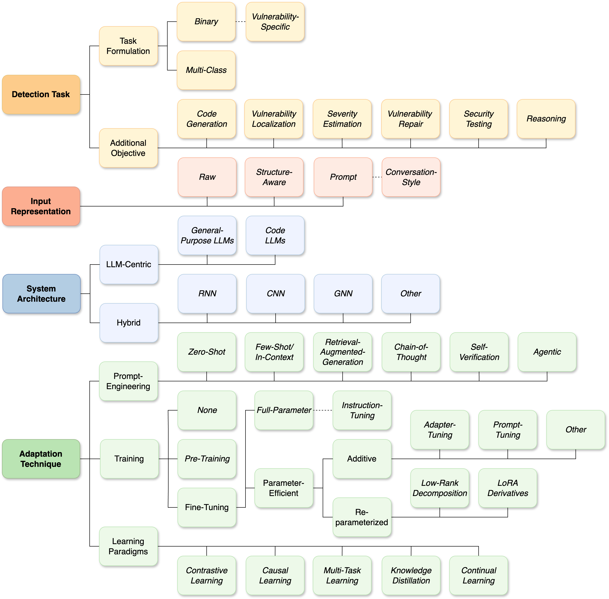

# LLM4SVD TAXONOMY 🗂️

We categorize existing LLM4SVD approaches according to detection task, input representation, system architecture, and adaptation technique. The presented taxonomy allows for meaningful comparison and benchmarking of studies.

## Jump to

### 🔍 Detection Task
- ✏️ [Task Formulation](#task-formulation)
  - [Binary](#binary)
  - [Vulnerability-Specific](#vulnerability-specific)
  - [Multi-Class](#multi-class)
- 🎯 [Additional Objective](#additional-objective)
  - [Code Generation](#code-generation)
  - [Vulnerability Localization](#vulnerability-localization)
  - [Severity Estimation](#severity-estimation)
  - [Vulnerability Repair](#vulnerability-repair)
  - [Security Testing](#security-testing)
  - [Reasoning](#reasoning)

### 🧾 Input Representation
- [Raw](#raw)
- [Structure-Aware](#structure-aware)
- [Prompt](#prompt)
- [Conversation-Style](#conversation-style)

### 🏗️ System Architecture
- 🤖 [LLM-Centric](#llm-centric)
  - [Code LLMs](#code-llms)
  - [General-Purpose LLMs](#general-purpose-llms)
- 🧬 [Hybrid](#hybrid)
  - [CNN](#cnn)
  - [RNN](#rnn)
  - [GNN](#gnn)
  - [Other](#other)

### 🛠️ Adaptation Technique
- 💬 [Prompt-Engineering](#prompt-engineering)
  - [Zero-Shot](#zero-shot)
  - [Few-Shot](#few-shot)
  - [Retrieval Augmented Generation (RAG)](#rag)
  - [Chain-of-Thought (CoT)](#cot)
  - [Self-Verification](#self-verification)
  - [Agentic](#agentic)
- 🧪 [Training](#training)
  - [`None`](#none)
  - [Pre-Training](#pre-training)
  - [Full-Parameter Fine-Tuning](#full-parameter-fine-tuning)
  - [Instruction-Tuning](#instruction-tuning)
  - [Adapter-Tuning](#adapter-tuning)
  - [Prompt-Tuning](#prompt-tuning)
  - [Additive-Other](#additive-other)
  - [Low-Rank Decomposition](#low-rank-decomposition)
  - [LoRA Derivatives](#lora-derivatives)
- 🧠 [Learning Paradigms](#learning-paradigms)
  - [Contrastive Learning](#contrastive-learning)
  - [Causal Learning](#causal-learning)
  - [Multi-Task Learning](#multi-task-learning)
  - [Knowledge Distillation](#knowledge-distillation)
  - [Continual Learning](#continual-learning)

--------------------------
--------------------------

## Detection Task
### Task Formulation
#### Binary
- Unified Pre-training for Program Understanding and Generation.  **`NAACL HLT 2021`** [[Paper](https://par.nsf.gov/servlets/purl/10336701)] [[Code](https://github.com/wasiahmad/PLBART)]
- SecVulEval: Benchmarking LLMs for Real-World C/C++ Vulnerability Detection.  **`arXiv 2025`** [[Paper](https://arxiv.org/abs/2505.19828)] [[Code](https://github.com/basimbd/SecVulEval)]
- AutoAdapt: On the Application of AutoML for Parameter-Efficient Fine-Tuning of Pre-Trained Code Models.  **`TOSEM 2025`** [[Paper](https://dl.acm.org/doi/abs/10.1145/3734867)] [[Code](https://github.com/serval-uni-lu/AutoAdapt)]
- Navigating (In)Security of AI-Generated Code.  **`CSR 2024`** [[Paper](https://ieeexplore.ieee.org/abstract/document/10679468)] 
- Vulnerability Detection in Popular Programming Languages with Language Models.  **`arXiv 2024`** [[Paper](https://arxiv.org/abs/2412.15905)] [[Code](https://github.com/syafiq/llm_vd)]
- DB-CBIL: A DistilBert-Based Transformer Hybrid Model Using CNN and BiLSTM for Software Vulnerability Detection.  **`IEEE Access 2024`** [[Paper](https://ieeexplore.ieee.org/abstract/document/10517582)] 
- Using ChatGPT as a Static Application Security Testing Tool.  **`arXiv 2023`** [[Paper](https://arxiv.org/abs/2308.14434)] [[Code](https://github.com/abakhshandeh/ChatGPTasSAST)]
- Exploring Software Naturalness through Neural Language Models.  **`arXiv 2020`** [[Paper](https://arxiv.org/abs/2006.12641)] 
- Fine-Tuning Pre-trained Model with Optimizable Prompt Learning for Code Vulnerability Detection.  **`ISSRE 2024`** [[Paper](https://ieeexplore.ieee.org/abstract/document/10771498)] [[Code](https://github.com/Exclusisve-V/PromptVulnerabilityDetection)]
- Transformer-based Vulnerability Detection in Code at EditTime: Zero-shot, Few-shot, or Fine-tuning?.  **`arXiv 2023`** [[Paper](https://arxiv.org/abs/2306.01754)] 
- Bridge and Hint: Extending Pre-trained Language Models for Long-Range Code.  **`ISSTA 2024`** [[Paper](https://dl.acm.org/doi/abs/10.1145/3650212.3652127)] [[Code](https://anonymous.4open.science/r/EXPO/README.md)]
- DiverseVul: A New Vulnerable Source Code Dataset for Deep Learning Based Vulnerability Detection.  **`RAID 2023`** [[Paper](https://dl.acm.org/doi/abs/10.1145/3607199.3607242)] [[Code](https://github.com/wagner-group/diversevul)]
- Evaluation of ChatGPT Model for Vulnerability Detection.  **`arXiv 2023`** [[Paper](https://arxiv.org/abs/2304.07232)] 
- Automating the Detection of Code Vulnerabilities by Analyzing GitHub Issues.  **`LLM4Code 2025`** [[Paper](https://ieeexplore.ieee.org/abstract/document/11028308)] 
- Can a Llama Be a Watchdog? Exploring Llama 3 and Code Llama for Static Application Security Testing.  **`CSR 2024`** [[Paper](https://ieeexplore.ieee.org/abstract/document/10679444)] 
- MultiVD: A Transformer-based Multitask Approach for Software Vulnerability Detection.  **`SECRYPT 2024`** [[Paper](https://www.scitepress.org/Papers/2024/127194/127194.pdf)] 
- A Comprehensive Study of LLM Secure Code Generation.  **`arXiv 2025`** [[Paper](https://arxiv.org/abs/2503.15554)] 
- On the Compression of Language Models for Code: An Empirical Study on CodeBERT.  **`SANER 2024`** [[Paper](https://ieeexplore.ieee.org/abstract/document/10992473)] [[Code](https://zenodo.org/records/14357478)]
- Improving Long-Tail Vulnerability Detection Through Data Augmentation Based on Large Language Models.  **`ICSME 2024`** [[Paper](https://ieeexplore.ieee.org/abstract/document/10795073)] [[Code](https://github.com/LuckyDengXiao/LERT)]
- Leveraging Deep Learning Models for Cross-function Null Pointer Risks Detection.  **`AITest 2023`** [[Paper](https://ieeexplore.ieee.org/abstract/document/10229470)] 
- TRACED: Execution-aware Pre-training for Source Code.  **`ICSE 2024`** [[Paper](https://dl.acm.org/doi/abs/10.1145/3597503.3608140)] [[Code](https://github.com/ARiSE-Lab/TRACED_ICSE_24)]
- Vulnerability Detection with Code Language Models: How Far are We?.  **`ICSE 2025`** [[Paper](https://ieeexplore.ieee.org/abstract/document/11029911)] [[Code](https://github.com/DLVulDet/PrimeVul)]
- Large Language Models for Secure Code Assessment: A Multi-Language Empirical Study.  **`arXiv 2024`** [[Paper](https://arxiv.org/abs/2408.06428)] 
- Generalization-Enhanced Code Vulnerability Detection via Multi-Task Instruction Fine-Tuning.  **`arXiv 2024`** [[Paper](https://arxiv.org/abs/2406.03718)] [[Code](https://github.com/CGCL-codes/VulLLM)]
- Joint Geometrical and Statistical Domain Adaptation for Cross-domain  Code Vulnerability Detection.  **`EMNLP 2023`** [[Paper](https://aclanthology.org/2023.emnlp-main.788/)] 
- Vul-RAG: Enhancing LLM-based Vulnerability Detection via Knowledge-level RAG.  **`arXiv 2025`** [[Paper](https://arxiv.org/abs/2406.11147)] [[Code](https://github.com/knowledgerag4llmvuld/knowledgerag4llmvuld)]
- VulnGPT: Enhancing Source Code Vulnerability Detection Using AutoGPT and Adaptive Supervision Strategies.  **`DCOSS-IoT 2024`** [[Paper](https://ieeexplore.ieee.org/abstract/document/10621527)] 
- May the Source Be with You: On ChatGPT, Cybersecurity, and Secure Coding.  **`Information 2024`** [[Paper](https://www.mdpi.com/2078-2489/15/9/572)] 
- Expert-in-the-Loop Systems with Cross-Domain and In-Domain Few-Shot Learning for Software Vulnerability Detection.  **`arXiv 2025`** [[Paper](https://arxiv.org/abs/2506.10104)] 
- CGP-Tuning: Structure-Aware Soft Prompt Tuning for Code Vulnerability Detection.  **`arXiv 2025`** [[Paper](https://arxiv.org/abs/2501.04510)] 
- SecureFalcon: Are We There Yet in Automated Software Vulnerability Detection With LLMs?.  **`TSE 2025`** [[Paper](https://ieeexplore.ieee.org/abstract/document/10910240)] 
- ChatGPT for Vulnerability Detection, Classification, and Repair: How Far Are We?.  **`APSEC 2023`** [[Paper](https://ieeexplore.ieee.org/abstract/document/10479409)] [[Code](https://github.com/awsm-research/ChatGPT4Vul)]
- LineVul: A Transformer-based Line-level Vulnerability Prediction.  **`MSR 2022`** [[Paper](https://dl.acm.org/doi/abs/10.1145/3524842.3528452)] [[Code](https://github.com/awsm-research/LineVul)]
- How Far Have We Gone in Vulnerability Detection Using Large Language Models.  **`arXiv 2023`** [[Paper](https://arxiv.org/abs/2311.12420)] [[Code](https://github.com/Hustcw/VulBench)]
- Keeping Pace with Ever-Increasing Data: Towards Continual Learning of Code Intelligence Models.  **`ICSE 2023`** [[Paper](https://ieeexplore.ieee.org/abstract/document/10172346)] [[Code](https://github.com/ReliableCoding/REPEAT)]
- Evaluating LLaMA 3.2 for Software Vulnerability Detection.  **`EICC 2025`** [[Paper](https://link.springer.com/chapter/10.1007/978-3-031-94855-8_3)] 
- The EarlyBIRD Catches the Bug: On Exploiting Early Layers of Encoder Models for More Efficient Code Classification.  **`ESEC/FSE 2023`** [[Paper](https://dl.acm.org/doi/abs/10.1145/3611643.3616304)] [[Code](https://zenodo.org/records/10499843)]
- Outside the Comfort Zone: Analysing LLM Capabilities in Software Vulnerability Detection.  **`ESORICS 2024`** [[Paper](https://link.springer.com/chapter/10.1007/978-3-031-70879-4_14)] 
- FuncVul: An Effective Function Level Vulnerability Detection Model using LLM and Code Chunk.  **`arXiv 2025`** [[Paper](https://arxiv.org/abs/2506.19453)] [[Code](https://github.com/sajalhalder/FuncVul)]
- VulBERTa: Simplified Source Code Pre-Training for Vulnerability Detection.  **`IJCNN 2022`** [[Paper](https://ieeexplore.ieee.org/abstract/document/9892280)] [[Code](https://github.com/ICL-ml4csec/VulBERTa)]
- LineVD: Statement-level Vulnerability Detection using Graph Neural Networks.  **`MSR 2022`** [[Paper](https://dl.acm.org/doi/abs/10.1145/3524842.3527949)] [[Code](https://github.com/davidhin/linevd)]
- BBVD: A BERT-based Method for Vulnerability Detection.  **`IJACSA 2022`** [[Paper](https://www.proquest.com/docview/2770373789?pq-origsite=gscholar&fromopenview=true&sourcetype=Scholarly%20Journals)] 
- Leveraging an Enhanced CodeBERT-Based Model for Multiclass Software Defect Prediction via Defect Classification.  **`IEEE Access 2025`** [[Paper](https://ieeexplore.ieee.org/abstract/document/10820528)] 
- Detecting Code Vulnerabilities using LLMs.  **`DSN 2025`** [[Paper](https://ieeexplore.ieee.org/abstract/document/11068842)] [[Code](https://github.com/a24167566/LLMs-Code-Vulnerability-Detection)]
- Software Vulnerability and Functionality Assessment using Large Language Models.  **`NLBSE 2024`** [[Paper](https://dl.acm.org/doi/abs/10.1145/3643787.3648036)] 
- Enhancing Source Code Security with LLMs: Demystifying The Challenges and Generating Reliable Repairs.  **`arXiv 2024`** [[Paper](https://arxiv.org/abs/2409.00571)] 
- An Unbiased Transformer Source Code Learning with Semantic Vulnerability Graph.  **`EuroS\&P 2023`** [[Paper](https://ieeexplore.ieee.org/abstract/document/10190505)] [[Code](https://github.com/pial08/SemVulDet)]
- DFEPT: Data Flow Embedding for Enhancing Pre-Trained Model Based Vulnerability Detection.  **`Internetware 2024`** [[Paper](https://dl.acm.org/doi/abs/10.1145/3671016.3671388)] [[Code](https://github.com/GCVulnerability/DFEPT)]
- Investigating Large Language Models for Code Vulnerability Detection: An Experimental Study.  **`arXiv 2025`** [[Paper](https://arxiv.org/abs/2412.18260)] [[Code](https://github.com/SakiRinn/LLM4CVD)] [[Code](https://huggingface.co/datasets/xuefen/VulResource)]
- StagedVulBERT: Multigranular Vulnerability Detection With a Novel Pretrained Code Model.  **`TSE 2024`** [[Paper](https://ieeexplore.ieee.org/abstract/document/10746847)] [[Code](https://github.com/YuanJiangGit/StagedVulBERT)]
- Code Defect Detection Method Based on BERT and Ensemble.  **`ICCC 2023`** [[Paper](https://ieeexplore.ieee.org/abstract/document/10507306)] 
- LLM-Based Approach for Buffer Overflow Detection in Source Code.  **`ICCIT 2024`** [[Paper](https://ieeexplore.ieee.org/abstract/document/11021816)] 
- Vulnerability Prediction using Pre-trained Models: An Empirical Evaluation.  **`MASCOTS 2024`** [[Paper](https://ieeexplore.ieee.org/abstract/document/10786510)] [[Code](https://sites.google.com/view/vpllm/)]
- Code Vulnerability Repair with Large Language Model Using Context-Aware Prompt Tuning.  **`SPW 2025`** [[Paper](https://ieeexplore.ieee.org/abstract/document/11050839)] 
- VulDeBERT: A Vulnerability Detection System Using BERT.  **`ISSREW 2022`** [[Paper](https://ieeexplore.ieee.org/abstract/document/9985089)] [[Code](https://github.com/SKKU-SecLab/VulDeBERT)]
- A Source Code Vulnerability Detection Method Based on Positive-Unlabeled Learning.  **`RICAI 2024`** [[Paper](https://ieeexplore.ieee.org/abstract/document/10911761)] 
- Assessing the Effectiveness of LLMs in Android Application Vulnerability Analysis.  **`ADIoT 2025`** [[Paper](https://link.springer.com/chapter/10.1007/978-3-031-85593-1_9)] 
- Smart Cuts: Enhance Active Learning for Vulnerability Detection by Pruning Bad Seeds.  **`arXiv 2025`** [[Paper](https://arxiv.org/abs/2506.20444)] 
- Software Vulnerability Prediction in Low-Resource Languages: An Empirical Study of CodeBERT and ChatGPT.  **`EASE 2024`** [[Paper](https://dl.acm.org/doi/abs/10.1145/3661167.3661281)] [[Code](https://github.com/lhmtriet/LLM4Vul)]
- Automated Software Vulnerability Detection via Pre-trained Context Encoder and Self Attention.  **`ICDF2C 2021`** [[Paper](https://link.springer.com/chapter/10.1007/978-3-031-06365-7_15)] 
- CleanVul: Automatic Function-Level Vulnerability Detection in Code Commits Using LLM Heuristics.  **`arXiv 2025`** [[Paper](https://arxiv.org/abs/2411.17274)] [[Code](https://github.com/yikun-li/CleanVul)]
- Enhancing Static Analysis for Practical Bug Detection: An LLM-Integrated Approach.  **`PACMPL 2024`** [[Paper](https://dl.acm.org/doi/full/10.1145/3649828)] [[Code](https://sites.google.com/view/llift-open/home)]
- Everything You Wanted to Know About LLM-based Vulnerability Detection But Were Afraid to Ask.  **`arXiv 2025`** [[Paper](https://arxiv.org/abs/2504.13474)] 
- Distilled and Contextualized Neural Models Benchmarked for Vulnerable Function Detection.  **`Mathematics 2022`** [[Paper](https://www.mdpi.com/2227-7390/10/23/4482)] 
- Evaluating Large Language Models in Vulnerability Detection Under Variable Context Windows.  **`ICMLA 2024`** [[Paper](https://ieeexplore.ieee.org/abstract/document/10903489)] 
- SAVANT: Vulnerability Detection in Application Dependencies through Semantic-Guided Reachability Analysis.  **`arXiv 2025`** [[Paper](https://arxiv.org/abs/2506.17798)] 
- Steering Large Language Models for Vulnerability Detection.  **`ICASSP 2025`** [[Paper](https://ieeexplore.ieee.org/abstract/document/10887736)] 
- Enhancing Vulnerability Detection Efficiency: An Exploration of Light-weight LLMs with Hybrid Code Features.  **`JISA 2024`** [[Paper](https://www.sciencedirect.com/science/article/pii/S2214212624002278)] [[Code](https://github.com/JNL-28/Enhancing-Vulnerability-Detection-Efficiency)]
- Exploration On Prompting LLM With Code-Specific Information For Vulnerability Detection.  **`SSE 2024`** [[Paper](https://ieeexplore.ieee.org/abstract/document/10664399)] 
- Pre-training by Predicting Program Dependencies for Vulnerability Analysis Tasks.  **`ICSE 2024`** [[Paper](https://ieeexplore.ieee.org/abstract/document/10548173)] [[Code](https://zenodo.org/records/10140638)]
- Software Vulnerability Detection with GPT and In-Context Learning.  **`DSC 2023`** [[Paper](https://ieeexplore.ieee.org/abstract/document/10381286)] 
- VulDetectBench: Evaluating the Deep Capability of Vulnerability Detection with Large Language Models.  **`arXiv 2024`** [[Paper](https://arxiv.org/abs/2406.07595)] [[Code](https://github.com/Sweetaroo/VulDetectBench)]
- Vul-LMGNNs: Fusing Language Models and Online-distilled Graph Neural Networks for Code Vulnerability Detection.  **`Information Fusion 2024`** [[Paper](https://www.sciencedirect.com/science/article/pii/S1566253524005268)] [[Code](https://github.com/Vul-LMGNN/vul-LMGGNN)]
- Assessing the Effectiveness of Vulnerability Detection via Prompt Tuning: An Empirical Study.  **`APSEC 2023`** [[Paper](https://ieeexplore.ieee.org/abstract/document/10479384)] [[Code](https://github.com/P-E-Vul/prompt-empircial-vulnerability)]
- GRACE: Empowering LLM-based Software Vulnerability Detection with Graph Structure and In-Context Learning.  **`JSS 2024`** [[Paper](https://www.sciencedirect.com/science/article/pii/S0164121224000748)] [[Code](https://github.com/P-E-Vul/GRACE)]
- Detecting Integer Overflow Errors in Java Source Code via Machine Learning.  **`ICTAI 2021`** [[Paper](https://ieeexplore.ieee.org/abstract/document/9643278)] 
- HALURust: Exploiting Hallucinations of Large Language Models to Detect Vulnerabilities in Rust.  **`arXiv 2025`** [[Paper](https://arxiv.org/abs/2503.10793)] 
- An Ensemble Transformer Approach with Cross-Attention for Automated Code Security Vulnerability Detection and Documentation.  **`ISDFS 2025`** [[Paper](https://ieeexplore.ieee.org/abstract/document/11012039)] 
- Exploring Transformers for Multi-Label Classification of Java Vulnerabilities.  **`QRS 2022`** [[Paper](https://ieeexplore.ieee.org/abstract/document/10062434)] [[Code](https://github.com/TQRG/VDET-for-Java)]
- Enhancing Reverse Engineering: Investigating and Benchmarking Large Language Models for Vulnerability Analysis in Decompiled Binaries.  **`arXiv 2024`** [[Paper](https://arxiv.org/abs/2411.04981)] 
- LLbezpeky: Leveraging Large Language Models for Vulnerability Detection.  **`arXiv 2024`** [[Paper](https://arxiv.org/abs/2401.01269)] 
- Detecting Vulnerabilities in IoT Software: New Hybrid Model and Comprehensive Data Analysis.  **`JISA 2023`** [[Paper](https://www.sciencedirect.com/science/article/pii/S2214212623000510)] 
- Are Sparse Autoencoders Useful for Java Function Bug Detection?.  **`arXiv 2025`** [[Paper](https://arxiv.org/abs/2505.10375)] 
- SAFE: Advancing Large Language Models in Leveraging Semantic and Syntactic Relationships for Software Vulnerability Detection.  **`arXiv 2024`** [[Paper](https://arxiv.org/abs/2409.00882)] 
- Distinguishing Look-Alike Innocent and Vulnerable Code by Subtle Semantic Representation Learning and Explanation.  **`ESEC/FSE 2023`** [[Paper](https://dl.acm.org/doi/abs/10.1145/3611643.3616358)] [[Code](https://github.com/jacknichao/SVulD)]
- Function-Level Vulnerability Detection Through Fusing Multi-Modal Knowledge.  **`ASE 2023`** [[Paper](https://ieeexplore.ieee.org/abstract/document/10298584)] [[Code](https://github.com/jacknichao/MVulD)]
- Learning-based Models for Vulnerability Detection: An Extensive Study.  **`arXiv 2024`** [[Paper](https://arxiv.org/abs/2408.07526)] [[Code](https://figshare.com/s/bde8e41890e8179fbe5f?file=41894784)]
- An Empirical Study on Software Defect Prediction Using CodeBERT Model.  **`Applied Sciences 2021`** [[Paper](https://www.mdpi.com/2076-3417/11/11/4793)] [[Code](https://gitee.com/penguinc/applsci-code-bert-defect-prediciton)]
- Metamorphic-Based Many-Objective Distillation of LLMs for Code-Related Tasks.  **`ICSE 2025`** [[Paper](https://ieeexplore.ieee.org/document/11029766)] [[Code](https://zenodo.org/records/14857610)]
- PTLVD:Program Slicing and Transformer-based Line-level Vulnerability Detection System.  **`SCAM 2023`** [[Paper](https://ieeexplore.ieee.org/abstract/document/10356694)] [[Code](https://github.com/chenshixu/PTLVD)]
- Software Vulnerability Detection using Large Language Models.  **`ISSREW 2023`** [[Paper](https://ieeexplore.ieee.org/abstract/document/10301302)] 
- Enhancing Pre-Trained Language Models for Vulnerability Detection via Semantic-Preserving Data Augmentation.  **`arXiv 2024`** [[Paper](https://arxiv.org/abs/2410.00249)] 
- XGV-BERT: Leveraging Contextualized Language Model and Graph Neural Network for Efficient Software Vulnerability Detection.  **`The Journal of Supercomputing 2025`** [[Paper](https://link.springer.com/article/10.1007/s11227-025-07198-7)] 
- Towards Causal Deep Learning for Vulnerability Detection.  **`ICSE 2024`** [[Paper](https://dl.acm.org/doi/abs/10.1145/3597503.3639170)] [[Code](https://figshare.com/s/0ffda320dcb96c249ef2?file=41801019)]
- GraphCodeBERT-Augmented Graph Attention Networks for Code Vulnerability Detection.  **`CAI 2025`** [[Paper](https://ieeexplore.ieee.org/abstract/document/11050748)] 
- ProRLearn: Boosting Prompt Tuning-based Vulnerability Detection by Reinforcement Learning.  **`ASE 2024`** [[Paper](https://link.springer.com/article/10.1007/s10515-024-00438-9)] [[Code](https://github.com/ProRLearn/ProRLearn001)]
- Uncovering the Limits of Machine Learning for Automatic Vulnerability Detection.  **`USENIX Security 2024`** [[Paper](https://www.usenix.org/conference/usenixsecurity24/presentation/risse)] [[Code](https://github.com/niklasrisse/USENIX_2024)] [[Code](https://github.com/niklasrisse/VPP)]
- Leveraging Multi-Task Learning to Improve the Detection of SATD and Vulnerability.  **`ICPC 2025`** [[Paper](https://ieeexplore.ieee.org/abstract/document/11025930)] [[Code](https://github.com/moritzmock/multitask-vulberability-detection)]
- Deep Learning-Based Framework for Automated Vulnerability Detection in Android Applications.  **`IBCAST 2023`** [[Paper](https://ieeexplore.ieee.org/abstract/document/10713017)] 
- DP-CCL: A Supervised Contrastive Learning Approach Using CodeBERT Model in Software Defect Prediction.  **`IEEE Access 2024`** [[Paper](https://ieeexplore.ieee.org/abstract/document/10422975)] [[Code](https://github.com/saharsadia/DP-CCL)]
- Research on the LLM-Driven Vulnerability Detection System Using LProtector.  **`ICDSCA 2024`** [[Paper](https://ieeexplore.ieee.org/abstract/document/10859408)] 
- Finetuning Large Language Models for Vulnerability Detection.  **`IEEE Access 2025`** [[Paper](https://ieeexplore.ieee.org/abstract/document/10908394)] [[Code](https://github.com/rmusab/vul-llm-finetune)]
- Greening Large Language Models of Code.  **`ICSE-SEIS 2024`** [[Paper](https://dl.acm.org/doi/abs/10.1145/3639475.3640097)] [[Code](https://github.com/soarsmu/Avatar)]
- Software Vulnerability Detection Using LLM: Does Additional Information Help?.  **`ACSAC Workshops 2024`** [[Paper](https://ieeexplore.ieee.org/abstract/document/10917361)] [[Code](https://github.com/research7485/vulnerability_detection)]
- VulSim: Leveraging Similarity of {Multi-Dimensional.  **`USENIX Security 2024`** [[Paper](https://www.usenix.org/conference/usenixsecurity24/presentation/shimmi)] [[Code](https://github.com/SamihaShimmi/VulSim)]
- Large Language Models for Multilingual Vulnerability Detection: How Far Are We?.  **`arXiv 2025`** [[Paper](https://arxiv.org/abs/2506.07503)] [[Code](https://github.com/SpanShu96/Large-Language-Model-for-Multilingual-Vulnerability-Detection/tree/main)]
- Cyber Security Vulnerability Detection Using Natural Language Processing.  **`AIIoT 2022`** [[Paper](https://ieeexplore.ieee.org/abstract/document/9817336)] 
- Software Defect Prediction via Code Language Models.  **`ICCTIT 2023`** [[Paper](https://ieeexplore.ieee.org/abstract/document/10435711)] 
- Large Language Models for In-File Vulnerability Localization Can Be ""Lost in the End"".  **`PACMSE 2025`** [[Paper](https://dl.acm.org/doi/abs/10.1145/3715758)] [[Code](https://zenodo.org/records/14840519)]
- To Err is Machine: Vulnerability Detection Challenges LLM Reasoning.  **`arXiv 2025`** [[Paper](https://arxiv.org/abs/2403.17218)] [[Code](https://figshare.com/articles/dataset/Data_Package_for_LLM_Vulnerability_Detection_Study/27368025)]
- Do Language Models Learn Semantics of Code? A Case Study in Vulnerability Detection.  **`arXiv 2023`** [[Paper](https://arxiv.org/abs/2311.04109)] [[Code](https://figshare.com/s/4a16a528d6874aad51a0)]
- Code Vulnerability Detection: A Comparative Analysis of Emerging Large Language Models.  **`arXiv 2024`** [[Paper](https://arxiv.org/abs/2409.10490)] 
- Enhanced LLM-Based Framework for Predicting Null Pointer Dereference in Source Code.  **`arXiv 2024`** [[Paper](https://arxiv.org/abs/2412.00216)] 
- An Enhanced Vulnerability Detection in Software Using a Heterogeneous Encoding Ensemble.  **`ISCC 2023`** [[Paper](https://ieeexplore.ieee.org/abstract/document/10217978)] 
- Enhancing Source Code Vulnerability Detection Using Flattened Code Graph Structures.  **`ICFTIC 2024`** [[Paper](https://ieeexplore.ieee.org/abstract/document/10913325)] 
- LLM4Vuln: A Unified Evaluation Framework for Decoupling and Enhancing LLMs' Vulnerability Reasoning.  **`arXiv 2025`** [[Paper](https://arxiv.org/abs/2401.16185)] [[Code](https://anonymous.4open.science/r/LLM4Vuln/README.md)]
- Optimizing Pre-trained Language Models for Efficient Vulnerability Detection in Code Snippets.  **`ICCC 2023`** [[Paper](https://ieeexplore.ieee.org/abstract/document/10507456)] 
- Transformer-Based Language Models for Software Vulnerability Detection.  **`ACSAC 2022`** [[Paper](https://dl.acm.org/doi/abs/10.1145/3564625.3567985)] [[Code](https://bitbucket.csiro.au/users/jan087/repos/acsac-2022-submission/browse)]
- SQL Injection Vulnerability Detection Based on Pissa-Tuned Llama 3 Large Language Model.  **`ICFTIC 2024`** [[Paper](https://ieeexplore.ieee.org/abstract/document/10912886)] 
- Manual Prompt Engineering is Not Dead: A Case Study on Large Language Models for Code Vulnerability Detection with DSPy.  **`CDMA 2025`** [[Paper](https://ieeexplore.ieee.org/abstract/document/10908746)] 
- Software Defect Prediction Employing BiLSTM and BERT-based Semantic Feature.  **`Soft Computing 2022`** [[Paper](https://link.springer.com/article/10.1007/s00500-022-06830-5)] 
- LLMs Cannot Reliably Identify and Reason About Security Vulnerabilities (Yet?): A Comprehensive Evaluation, Framework, and Benchmarks.  **`SP 2024`** [[Paper](https://ieeexplore.ieee.org/abstract/document/10646663/)] [[Code](https://github.com/ai4cloudops/SecLLMHolmes)]
- ANVIL: Anomaly-based Vulnerability Identification without Labelled Training Data.  **`arXiv 2025`** [[Paper](https://arxiv.org/abs/2408.16028)] [[Code](https://anonymous.4open.science/r/anvil)]
- Enhancing Large Language Models for Secure Code Generation: A Dataset-driven Study on Vulnerability Mitigation.  **`arXiv 2023`** [[Paper](https://arxiv.org/abs/2310.16263)] 
- Line-level Semantic Structure Learning for Code Vulnerability Detection.  **`arXiv 2024`** [[Paper](https://arxiv.org/abs/2407.18877)] [[Code](https://figshare.com/articles/dataset/CSLS_model_code_and_data/26391658)]
- M2CVD: Enhancing Vulnerability Semantic through Multi-Model Collaboration for Code Vulnerability Detection.  **`arXiv 2024`** [[Paper](https://arxiv.org/abs/2406.05940)] [[Code](https://github.com/HotFrom/M2CVD)]
- Prompt Tuning in Code Intelligence: An Experimental Evaluation.  **`TSE 2023`** [[Paper](https://ieeexplore.ieee.org/abstract/document/10269066)] [[Code](https://github.com/adf1178/PT4Code)]
- SCL-CVD: Supervised Contrastive Learning for Code Vulnerability Detection via GraphCodeBERT.  **`COSE 2024`** [[Paper](https://www.sciencedirect.com/science/article/pii/S0167404824002992)] 
- Boosting Vulnerability Detection of LLMs via Curriculum Preference Optimization with Synthetic Reasoning Data.  **`arXiv 2025`** [[Paper](https://arxiv.org/abs/2506.07390)] [[Code](https://github.com/Xin-Cheng-Wen/PO4Vul)]
- SCALE: Constructing Structured Natural Language Comment Trees for Software Vulnerability Detection.  **`ISSTA 2024`** [[Paper](https://dl.acm.org/doi/abs/10.1145/3650212.3652124)] [[Code](https://github.com/Xin-Cheng-Wen/Comment4Vul)]
- VulEval: Towards Repository-Level Evaluation of Software Vulnerability Detection.  **`arXiv 2024`** [[Paper](https://arxiv.org/abs/2404.15596)] 
- When Less is Enough: Positive and Unlabeled Learning Model for Vulnerability Detection.  **`ASE 2023`** [[Paper](https://ieeexplore.ieee.org/abstract/document/10298363)] [[Code](https://github.com/PILOT-VD-2023/PILOT)]
- Beyond ChatGPT: Enhancing Software Quality Assurance Tasks with Diverse LLMs and Validation Techniques.  **`arXiv 2024`** [[Paper](https://arxiv.org/abs/2409.01001)] [[Code](https://figshare.com/s/5da14b0776750c6fa787)]
- Exploring the Limits of ChatGPT in Software Security Applications.  **`arXiv 2023`** [[Paper](https://arxiv.org/abs/2312.05275)] 
- VulD-CodeBERT: CodeBERT-Based Vulnerability Detection Model for C/C++ Code.  **`CISCE 2024`** [[Paper](https://ieeexplore.ieee.org/abstract/document/10653337)] 
- AIDetectVul: Software Vulnerability Detection Method Based on Feature Fusion of Pre-trained Models.  **`ICCECE 2025`** [[Paper](https://ieeexplore.ieee.org/abstract/document/10985370)] 
- Context-Enhanced Vulnerability Detection Based on Large Language Model.  **`arXiv 2025`** [[Paper](https://arxiv.org/abs/2504.16877)] [[Code](https://github.com/DoeSEResearch/PacVD)]
- DLAP: A Deep Learning Augmented Large Language Model Prompting Framework for Software Vulnerability Detection.  **`JSS 2024`** [[Paper](None)] [[Code](https://github.com/Yang-Yanjing/DLAP)]
- Security Vulnerability Detection with Multitask Self-Instructed Fine-Tuning of Large Language Models.  **`arXiv 2024`** [[Paper](https://arxiv.org/abs/2406.05892)] [[Code](https://zenodo.org/records/11403208)]
- Benchmarking LLMs and LLM-based Agents in Practical Vulnerability Detection for Code Repositories.  **`arXiv 2025`** [[Paper](https://arxiv.org/abs/2503.03586)] 
- Multitask-Based Evaluation of Open-Source LLM on Software Vulnerability.  **`TSE 2024`** [[Paper](https://ieeexplore.ieee.org/abstract/document/10706805)] [[Code](https://github.com/vinci-grape/VulEmpirical)]
- Deep Neural Embedding for Software Vulnerability Discovery: Comparison and Optimization.  **`Security and Communication Networks 2022`** [[Paper](https://onlinelibrary.wiley.com/doi/full/10.1155/2022/5203217)] [[Code](https://cybercodeintelligence.github.io/CyberCI/)]
- Fight Fire With Fire: How Much Can We Trust ChatGPT on Source Code-Related Tasks?.  **`TSE 2024`** [[Paper](https://ieeexplore.ieee.org/abstract/document/10745266)] [[Code](https://figshare.com/s/4b51f0b8a2cda17d08be)]
- PATVD: Vulnerability Detection Based on Pre-training Techniques and Adversarial Training.  **`SmartWorld/UIC/ScalCom/DigitalTwin/PriComp/Meta 2022`** [[Paper](https://ieeexplore.ieee.org/abstract/document/10189687/)] 
- Your Instructions Are Not Always Helpful: Assessing the Efficacy of Instruction Fine-tuning for Software Vulnerability Detection.  **`arXiv 2024`** [[Paper](https://arxiv.org/abs/2401.07466)] 
- Intelligent Detection of Vulnerable Functions in Software through Neural Embedding-based Code Analysis.  **`IJNM 2022`** [[Paper](https://onlinelibrary.wiley.com/doi/full/10.1002/nem.2198)] [[Code](https://cybercodeintelligence.github.io/CyberCI/)]
- Benchmarking Large Language Models for Multi-Language Software Vulnerability Detection.  **`arXiv 2025`** [[Paper](https://arxiv.org/abs/2503.01449)] [[Code](https://github.com/soarsmu/SVD-Bench)]
- MVD: A Multi-Lingual Software Vulnerability Detection Framework.  **`arXiv 2024`** [[Paper](https://arxiv.org/abs/2412.06166)] [[Code](https://figshare.com/s/10ec70108294a225f391)]
- Vulnerability Detection by Learning From Syntax-Based Execution Paths of Code.  **`TSE 2023`** [[Paper](https://ieeexplore.ieee.org/abstract/document/10153647)] [[Code](https://zenodo.org/records/7123322)]
- Adversarial Training for Robustness Enhancement in LLM-Based Code Vulnerability Detection.  **`CISCE 2025`** [[Paper](https://ieeexplore.ieee.org/abstract/document/11065803)] 
- Learning to Focus: Context Extraction for Efficient Code Vulnerability Detection with Language Models.  **`arXiv 2025`** [[Paper](https://arxiv.org/abs/2505.17460)] 
- SVulDetector: Vulnerability Detection based on Similarity using Tree-based Attention and Weighted Graph Embedding Mechanisms.  **`COSE 2024`** [[Paper](https://www.sciencedirect.com/science/article/pii/S0167404824002335)] [[Code](https://figshare.com/s/426156a96a83da1d38d0)]
- Comparison of Static Application Security Testing Tools and Large Language Models for Repo-level Vulnerability Detection.  **`arXiv 2024`** [[Paper](https://arxiv.org/abs/2407.16235)] 
- Large Language Model for Vulnerability Detection: Emerging Results and Future Directions.  **`ICSE-NIER 2024`** [[Paper](https://dl.acm.org/doi/abs/10.1145/3639476.3639762)] [[Code](https://github.com/soarsmu/ChatGPT-VulDetection)]
- Reasoning with LLMs for Zero-Shot Vulnerability Detection.  **`arXiv 2025`** [[Paper](https://arxiv.org/abs/2503.17885)] [[Code](https://github.com/Erroristotle/VulnSage)]
- VulnLLMEval: A Framework for Evaluating Large Language Models in Software Vulnerability Detection and Patching.  **`arXiv 2024`** [[Paper](https://arxiv.org/abs/2409.10756)] 

#### Vulnerability-Specific
- From Generalist to Specialist: Exploring CWE-Specific Vulnerability Detection.  **`arXiv 2024`** [[Paper](https://arxiv.org/abs/2408.02329)] 
- Enhancing Software Code Vulnerability Detection Using GPT-4o and Claude-3.5 Sonnet: A Study on Prompt Engineering Techniques.  **`Electronics 2024`** [[Paper](https://www.mdpi.com/2079-9292/13/13/2657)] 
- RealVul: Can We Detect Vulnerabilities in Web Applications with LLM?.  **`arXiv 2024`** [[Paper](https://arxiv.org/abs/2410.07573)] 
- Can LLM Prompting Serve as a Proxy for Static Analysis in Vulnerability Detection.  **`arXiv 2025`** [[Paper](https://arxiv.org/abs/2412.12039)] 
- Helping LLMs Improve Code Generation Using Feedback from Testing and Static Analysis.  **`arXiv 2025`** [[Paper](https://arxiv.org/abs/2412.14841)] 
- How Well Do Large Language Models Serve as End-to-End Secure Code Agents for Python?.  **`arXiv 2025`** [[Paper](https://arxiv.org/abs/2408.10495)] [[Code](https://github.com/jianian0318/LLMSecureCode)]
- RepoAudit: An Autonomous LLM-Agent for Repository-Level Code Auditing.  **`arXiv 2025`** [[Paper](https://arxiv.org/abs/2501.18160)] [[Code](https://github.com/PurCL/RepoAudit)]
- Understanding the Effectiveness of Large Language Models in Detecting Security Vulnerabilities.  **`ICST 2025`** [[Paper](https://ieeexplore.ieee.org/abstract/document/10988968)] [[Code](https://github.com/seal-research/secvul-llm-study/)]
- IRIS: LLM-Assisted Static Analysis for Detecting Security Vulnerabilities.  **`arXiv 2025`** [[Paper](https://arxiv.org/abs/2405.17238)] [[Code](https://github.com/iris-sast/iris)]
- SafeGenBench: A Benchmark Framework for Security Vulnerability Detection in LLM-Generated Code.  **`arXiv 2025`** [[Paper](https://arxiv.org/abs/2506.05692)] 
- SV-TrustEval-C: Evaluating Structure and Semantic Reasoning in Large Language Models for Source Code Vulnerability Analysis.  **`SP 2025`** [[Paper](https://ieeexplore.ieee.org/abstract/document/11023455)] [[Code](https://github.com/Jackline97/SV-TrustEval-C)] [[Code](https://huggingface.co/datasets/LLMs4CodeSecurity/SV-TrustEval-C-1.0)]
- Trace Gadgets: Minimizing Code Context for Machine Learning-Based Vulnerability Prediction.  **`arXiv 2025`** [[Paper](https://arxiv.org/abs/2504.13676)] 
- Towards Explainable Vulnerability Detection with Large Language Models.  **`arXiv 2025`** [[Paper](https://arxiv.org/abs/2406.09701)] 
- Effectiveness of ChatGPT for Static Analysis: How Far Are We?.  **`AIware 2024`** [[Paper](https://dl.acm.org/doi/abs/10.1145/3664646.3664777)] [[Code](https://zenodo.org/records/10828316)]
- Can You Really Trust Code Copilots? Evaluating Large Language Models from a Code Security Perspective.  **`arXiv 2025`** [[Paper](https://arxiv.org/abs/2505.10494)] [[Code](https://github.com/MurrayTom/CoV-Eval)]
- ♪ With a Little Help from My (LLM) Friends: Enhancing Static Analysis with LLMs to Detect Software Vulnerabilities.  **`LLM4Code 2025`** [[Paper](https://ieeexplore.ieee.org/abstract/document/11028575)] 
- Chain-of-Thought Prompting of Large Language Models for Discovering and Fixing Software Vulnerabilities.  **`arXiv 2024`** [[Paper](https://arxiv.org/abs/2402.17230)] 
- AutoPatch: Multi-Agent Framework for Patching Real-World CVE Vulnerabilities.  **`arXiv 2025`** [[Paper](https://arxiv.org/abs/2505.04195)] [[Code](https://github.com/ai-llm-research/autopatch)]
- A New Approach to Web Application Security: Utilizing GPT Language Models for Source Code Inspection.  **`Future Internet 2023`** [[Paper](https://www.mdpi.com/1999-5903/15/10/326)] 
- You Only Train Once: A Flexible Training Framework for Code Vulnerability Detection Driven by Vul-Vector.  **`arXiv 2025`** [[Paper](https://arxiv.org/abs/2506.10988)] 
- LLMs Cannot Reliably Identify and Reason About Security Vulnerabilities (Yet?): A Comprehensive Evaluation, Framework, and Benchmarks.  **`SP 2024`** [[Paper](https://ieeexplore.ieee.org/abstract/document/10646663/)] [[Code](https://github.com/ai4cloudops/SecLLMHolmes)]
- Leveraging Large Language Models for Command Injection Vulnerability Analysis in Python: An Empirical Study on Popular Open-Source Projects.  **`arXiv 2025`** [[Paper](https://arxiv.org/abs/2505.15088)] 
- SecureMind: A Framework for Benchmarking Large Language Models in Memory Bug Detection and Repair.  **`ISMM 2025`** [[Paper](https://dl.acm.org/doi/abs/10.1145/3735950.3735954)] [[Code](https://github.com/HuantWang/SecureMind)]
- One-for-All Does Not Work! Enhancing Vulnerability Detection by Mixture-of-Experts (MoE).  **`arXiv 2025`** [[Paper](https://arxiv.org/abs/2501.16454)] 
- A Method of SQL Injection Attack Detection Based on Large Language Models.  **`CNTEIE 2024`** [[Paper](https://ieeexplore.ieee.org/abstract/document/10987904)] 
- SSRFSeek: An LLM-based Static Analysis Framework for Detecting SSRF Vulnerabilities in PHP Applications.  **`AINIT 2025`** [[Paper](https://ieeexplore.ieee.org/abstract/document/11035424)] 
- VulnLLMEval: A Framework for Evaluating Large Language Models in Software Vulnerability Detection and Patching.  **`arXiv 2024`** [[Paper](https://arxiv.org/abs/2409.10756)] 

#### Multi-Class
- Navigating (In)Security of AI-Generated Code.  **`CSR 2024`** [[Paper](https://ieeexplore.ieee.org/abstract/document/10679468)] 
- From Generalist to Specialist: Exploring CWE-Specific Vulnerability Detection.  **`arXiv 2024`** [[Paper](https://arxiv.org/abs/2408.02329)] 
- Using ChatGPT as a Static Application Security Testing Tool.  **`arXiv 2023`** [[Paper](https://arxiv.org/abs/2308.14434)] [[Code](https://github.com/abakhshandeh/ChatGPTasSAST)]
- Case Study: Fine-tuning Small Language Models for Accurate and Private CWE Detection in Python Code.  **`arXiv 2025`** [[Paper](https://arxiv.org/abs/2504.16584)] [[Code](https://huggingface.co/floxihunter/codegen-mono-CWEdetect)] [[Code](https://huggingface.co/datasets/floxihunter/synthetic_python_cwe)]
- LLM-CloudSec: Large Language Model Empowered Automatic and Deep Vulnerability Analysis for Intelligent Clouds.  **`INFOCOM WKSHPS 2024`** [[Paper](https://ieeexplore.ieee.org/abstract/document/10620804)] [[Code](https://github.com/DPCa0/LLM-CloudSec)]
- Transformer-based Vulnerability Detection in Code at EditTime: Zero-shot, Few-shot, or Fine-tuning?.  **`arXiv 2023`** [[Paper](https://arxiv.org/abs/2306.01754)] 
- DiverseVul: A New Vulnerable Source Code Dataset for Deep Learning Based Vulnerability Detection.  **`RAID 2023`** [[Paper](https://dl.acm.org/doi/abs/10.1145/3607199.3607242)] [[Code](https://github.com/wagner-group/diversevul)]
- Improving Vulnerability Type Prediction and Line-Level Detection via Adversarial Training-based Data Augmentation and Multi-Task Learning.  **`arXiv 2025`** [[Paper](https://arxiv.org/abs/2506.23534)] [[Code](https://github.com/Karelye/EDAT-MLT)]
- Evaluation of ChatGPT Model for Vulnerability Detection.  **`arXiv 2023`** [[Paper](https://arxiv.org/abs/2304.07232)] 
- Can a Llama Be a Watchdog? Exploring Llama 3 and Code Llama for Static Application Security Testing.  **`CSR 2024`** [[Paper](https://ieeexplore.ieee.org/abstract/document/10679444)] 
- MultiVD: A Transformer-based Multitask Approach for Software Vulnerability Detection.  **`SECRYPT 2024`** [[Paper](https://www.scitepress.org/Papers/2024/127194/127194.pdf)] 
- A Comprehensive Study of LLM Secure Code Generation.  **`arXiv 2025`** [[Paper](https://arxiv.org/abs/2503.15554)] 
- Large Language Models for Secure Code Assessment: A Multi-Language Empirical Study.  **`arXiv 2024`** [[Paper](https://arxiv.org/abs/2408.06428)] 
- CASTLE: Benchmarking Dataset for Static Code Analyzers and LLMs towards CWE Detection.  **`TASE 2025`** [[Paper](https://link.springer.com/chapter/10.1007/978-3-031-98208-8_15)] [[Code](https://github.com/CASTLE-Benchmark)]
- Python Source Code Vulnerability Detection with Named Entity Recognition.  **`COSE 2024`** [[Paper](https://www.sciencedirect.com/science/article/pii/S0167404824001032)] [[Code](https://github.com/mmeberg/PyVulDet-NER)]
- May the Source Be with You: On ChatGPT, Cybersecurity, and Secure Coding.  **`Information 2024`** [[Paper](https://www.mdpi.com/2078-2489/15/9/572)] 
- Exploring AI for Vulnerability Detection and Repair.  **`CARS 2024`** [[Paper](https://ieeexplore.ieee.org/abstract/document/10778769)] 
- SecureFalcon: Are We There Yet in Automated Software Vulnerability Detection With LLMs?.  **`TSE 2025`** [[Paper](https://ieeexplore.ieee.org/abstract/document/10910240)] 
- AIBugHunter: A Practical Tool for Predicting, Classifying and Repairing Software Vulnerabilities.  **`EMSE 2023`** [[Paper](https://link.springer.com/article/10.1007/s10664-023-10346-3)] [[Code](https://github.com/awsm-research/AIBugHunter)]
- ChatGPT for Vulnerability Detection, Classification, and Repair: How Far Are We?.  **`APSEC 2023`** [[Paper](https://ieeexplore.ieee.org/abstract/document/10479409)] [[Code](https://github.com/awsm-research/ChatGPT4Vul)]
- VulExplainer: A Transformer-Based Hierarchical  Distillation for Explaining Vulnerability Types.  **`TSE 2023`** [[Paper](https://ieeexplore.ieee.org/abstract/document/10220166)] [[Code](https://github.com/awsm-research/VulExplainer)]
- How Far Have We Gone in Vulnerability Detection Using Large Language Models.  **`arXiv 2023`** [[Paper](https://arxiv.org/abs/2311.12420)] [[Code](https://github.com/Hustcw/VulBench)]
- The EarlyBIRD Catches the Bug: On Exploiting Early Layers of Encoder Models for More Efficient Code Classification.  **`ESEC/FSE 2023`** [[Paper](https://dl.acm.org/doi/abs/10.1145/3611643.3616304)] [[Code](https://zenodo.org/records/10499843)]
- BiT5: A Bidirectional NLP Approach for Advanced Vulnerability Detection in Codebase.  **`Procedia Computer Science 2024`** [[Paper](https://www.sciencedirect.com/science/article/pii/S1877050924006306)] 
- DetectBERT: Code Vulnerability Detection.  **`GCCIT 2024`** [[Paper](https://ieeexplore.ieee.org/abstract/document/10862235)] 
- VULREM: Fine-Tuned BERT-Based Source-Code Potential Vulnerability Scanning System to Mitigate Attacks in Web Applications.  **`Applied Sciences 2024`** [[Paper](https://www.mdpi.com/2076-3417/14/21/9697)] 
- VulBERTa: Simplified Source Code Pre-Training for Vulnerability Detection.  **`IJCNN 2022`** [[Paper](https://ieeexplore.ieee.org/abstract/document/9892280)] [[Code](https://github.com/ICL-ml4csec/VulBERTa)]
- Leveraging an Enhanced CodeBERT-Based Model for Multiclass Software Defect Prediction via Defect Classification.  **`IEEE Access 2025`** [[Paper](https://ieeexplore.ieee.org/abstract/document/10820528)] 
- Detecting Code Vulnerabilities using LLMs.  **`DSN 2025`** [[Paper](https://ieeexplore.ieee.org/abstract/document/11068842)] [[Code](https://github.com/a24167566/LLMs-Code-Vulnerability-Detection)]
- LPASS: Linear Probes as Stepping Stones for Vulnerability Detection using Compressed LLMs.  **`JISA 2025`** [[Paper](https://www.sciencedirect.com/science/article/pii/S2214212625001620)] 
- Software Vulnerability and Functionality Assessment using Large Language Models.  **`NLBSE 2024`** [[Paper](https://dl.acm.org/doi/abs/10.1145/3643787.3648036)] 
- Unintentional Security Flaws in Code: Automated Defense via Root Cause Analysis.  **`arXiv 2024`** [[Paper](https://arxiv.org/abs/2409.00199)] 
- Applying Contrastive Learning to Code Vulnerability Type Classification.  **`EMNLP 2024`** [[Paper](https://aclanthology.org/2024.emnlp-main.666/)] 
- Vulnerability Classification on Source Code Using Text Mining and Deep Learning Techniques.  **`QRS-C 2024`** [[Paper](https://ieeexplore.ieee.org/abstract/document/10727022)] [[Code](https://sites.google.com/view/vulnerabilityclassification/)]
- Boosting Cybersecurity Vulnerability Scanning based on LLM-supported Static Application Security Testing.  **`arXiv 2024`** [[Paper](https://arxiv.org/abs/2409.15735)] 
- Understanding the Effectiveness of Large Language Models in Detecting Security Vulnerabilities.  **`ICST 2025`** [[Paper](https://ieeexplore.ieee.org/abstract/document/10988968)] [[Code](https://github.com/seal-research/secvul-llm-study/)]
- A Qualitative Study on Using ChatGPT for Software Security: Perception vs. Practicality.  **`TPS-ISA 2024`** [[Paper](https://ieeexplore.ieee.org/abstract/document/10835695)] [[Code](https://figshare.com/articles/dataset/Reproduction_package_for_paper_A_Qualitative_Study_on_Using_ChatGPT_for_Software_Security_Perception_vs_Practicality_/24452365?file=48008890)]
- Fine-Tuning Transformer LLMs for Detecting SQL Injection and XSS Vulnerabilities.  **`ICAIIC 2025`** [[Paper](https://ieeexplore.ieee.org/abstract/document/10920868)] 
- Distilled and Contextualized Neural Models Benchmarked for Vulnerable Function Detection.  **`Mathematics 2022`** [[Paper](https://www.mdpi.com/2227-7390/10/23/4482)] 
- SV-TrustEval-C: Evaluating Structure and Semantic Reasoning in Large Language Models for Source Code Vulnerability Analysis.  **`SP 2025`** [[Paper](https://ieeexplore.ieee.org/abstract/document/11023455)] [[Code](https://github.com/Jackline97/SV-TrustEval-C)] [[Code](https://huggingface.co/datasets/LLMs4CodeSecurity/SV-TrustEval-C-1.0)]
- Pre-training by Predicting Program Dependencies for Vulnerability Analysis Tasks.  **`ICSE 2024`** [[Paper](https://ieeexplore.ieee.org/abstract/document/10548173)] [[Code](https://zenodo.org/records/10140638)]
- From Solitary Directives to Interactive Encouragement! LLM Secure Code Generation by Natural Language Prompting.  **`arXiv 2024`** [[Paper](https://arxiv.org/abs/2410.14321)] 
- VADER: A Human-Evaluated Benchmark for Vulnerability Assessment, Detection, Explanation, and Remediation.  **`arXiv 2025`** [[Paper](https://arxiv.org/abs/2505.19395)] [[Code](https://github.com/AfterQuery/vader)]
- VulDetectBench: Evaluating the Deep Capability of Vulnerability Detection with Large Language Models.  **`arXiv 2024`** [[Paper](https://arxiv.org/abs/2406.07595)] [[Code](https://github.com/Sweetaroo/VulDetectBench)]
- Assessing the Effectiveness of Vulnerability Detection via Prompt Tuning: An Empirical Study.  **`APSEC 2023`** [[Paper](https://ieeexplore.ieee.org/abstract/document/10479384)] [[Code](https://github.com/P-E-Vul/prompt-empircial-vulnerability)]
- GRACE: Empowering LLM-based Software Vulnerability Detection with Graph Structure and In-Context Learning.  **`JSS 2024`** [[Paper](https://www.sciencedirect.com/science/article/pii/S0164121224000748)] [[Code](https://github.com/P-E-Vul/GRACE)]
- An Ensemble Transformer Approach with Cross-Attention for Automated Code Security Vulnerability Detection and Documentation.  **`ISDFS 2025`** [[Paper](https://ieeexplore.ieee.org/abstract/document/11012039)] 
- Exploring Transformers for Multi-Label Classification of Java Vulnerabilities.  **`QRS 2022`** [[Paper](https://ieeexplore.ieee.org/abstract/document/10062434)] [[Code](https://github.com/TQRG/VDET-for-Java)]
- Enhancing Reverse Engineering: Investigating and Benchmarking Large Language Models for Vulnerability Analysis in Decompiled Binaries.  **`arXiv 2024`** [[Paper](https://arxiv.org/abs/2411.04981)] 
- Towards Explainable Vulnerability Detection with Large Language Models.  **`arXiv 2025`** [[Paper](https://arxiv.org/abs/2406.09701)] 
- SecureQwen: Leveraging LLMs for Vulnerability Detection in Python Codebases.  **`COSE 2024`** [[Paper](https://www.sciencedirect.com/science/article/pii/S0167404824004565)] 
- Can You Really Trust Code Copilots? Evaluating Large Language Models from a Code Security Perspective.  **`arXiv 2025`** [[Paper](https://arxiv.org/abs/2505.10494)] [[Code](https://github.com/MurrayTom/CoV-Eval)]
- Can Large Language Models Find And Fix Vulnerable Software?.  **`arXiv 2023`** [[Paper](https://arxiv.org/abs/2308.10345)] 
- Chain-of-Thought Prompting of Large Language Models for Discovering and Fixing Software Vulnerabilities.  **`arXiv 2024`** [[Paper](https://arxiv.org/abs/2402.17230)] 
- AutoSafeCoder: A Multi-Agent Framework for Securing LLM Code Generation through Static Analysis and Fuzz Testing.  **`arXiv 2024`** [[Paper](https://arxiv.org/abs/2409.10737)] [[Code](https://github.com/SecureAIAutonomyLab/AutoSafeCoder)]
- VulDefend: A Novel Technique based on Pattern-exploiting Training for Detecting Software Vulnerabilities Using Language Models.  **`JEEIT 2023`** [[Paper](https://ieeexplore.ieee.org/abstract/document/10185860)] 
- VulDetect: A novel technique for detecting software vulnerabilities using Language Models.  **`CSR 2023`** [[Paper](https://ieeexplore.ieee.org/abstract/document/10224924)] 
- New Tricks to Old Codes: Can AI Chatbots Replace Static Code Analysis Tools?.  **`EICC 2023`** [[Paper](https://dl.acm.org/doi/abs/10.1145/3590777.3590780)] [[Code](https://github.com/New-Tricks-to-Old-Codes/Replace-Static-Analysis-Tools)]
- Automated Software Vulnerability Static Code Analysis Using Generative Pre-Trained Transformer Models.  **`arXiv 2024`** [[Paper](https://arxiv.org/abs/2408.00197)] 
- Enhancing Code Security Through Open-source Large Language Models: A Comparative Study.  **`FPS 2023`** [[Paper](https://link.springer.com/chapter/10.1007/978-3-031-57537-2_15)] 
- EnStack: An Ensemble Stacking Framework of Large Language Models for Enhanced Vulnerability Detection in Source Code.  **`BigData 2024`** [[Paper](https://ieeexplore.ieee.org/abstract/document/10825609)] 
- Deep Learning-Based Framework for Automated Vulnerability Detection in Android Applications.  **`IBCAST 2023`** [[Paper](https://ieeexplore.ieee.org/abstract/document/10713017)] 
- VulnerAI: GPT Based Web Application Vulnerability Detection.  **`ICAMAC 2024`** [[Paper](https://ieeexplore.ieee.org/abstract/document/10828788)] 
- A Preliminary Study on Using Large Language Models in Software Pentesting.  **`arXiv 2024`** [[Paper](https://arxiv.org/abs/2401.17459)] 
- Cyber Security Vulnerability Detection Using Natural Language Processing.  **`AIIoT 2022`** [[Paper](https://ieeexplore.ieee.org/abstract/document/9817336)] 
- Closing the Gap: A User Study on the Real-world Usefulness of AI-powered Vulnerability Detection \& Repair in the IDE.  **`ICSE 2025`** [[Paper](https://ieeexplore.ieee.org/abstract/document/11029760)] [[Code](https://figshare.com/articles/dataset/Closing_the_Gap_A_User_Study_on_the_Real-world_Usefulness_of_AI-powered_Vulnerability_Detection_Repair_in_the_IDE/26367139?file=52478936)]
- To Err is Machine: Vulnerability Detection Challenges LLM Reasoning.  **`arXiv 2025`** [[Paper](https://arxiv.org/abs/2403.17218)] [[Code](https://figshare.com/articles/dataset/Data_Package_for_LLM_Vulnerability_Detection_Study/27368025)]
- LLM4Vuln: A Unified Evaluation Framework for Decoupling and Enhancing LLMs' Vulnerability Reasoning.  **`arXiv 2025`** [[Paper](https://arxiv.org/abs/2401.16185)] [[Code](https://anonymous.4open.science/r/LLM4Vuln/README.md)]
- Harnessing Large Language Models for Software Vulnerability Detection: A Comprehensive Benchmarking Study.  **`IEEE Access 2025`** [[Paper](https://ieeexplore.ieee.org/abstract/document/10879492)] 
- Transformer-Based Language Models for Software Vulnerability Detection.  **`ACSAC 2022`** [[Paper](https://dl.acm.org/doi/abs/10.1145/3564625.3567985)] [[Code](https://bitbucket.csiro.au/users/jan087/repos/acsac-2022-submission/browse)]
- You Only Train Once: A Flexible Training Framework for Code Vulnerability Detection Driven by Vul-Vector.  **`arXiv 2025`** [[Paper](https://arxiv.org/abs/2506.10988)] 
- Streamlining Security Vulnerability Triage with Large Language Models.  **`arXiv 2025`** [[Paper](https://arxiv.org/abs/2501.18908)] [[Code](https://zenodo.org/records/14776104)]
- DefectHunter: A Novel LLM-Driven Boosted-Conformer-based Code Vulnerability Detection Mechanism.  **`arXiv 2023`** [[Paper](https://arxiv.org/abs/2309.15324)] [[Code](https://github.com/WJ-8/DefectHunter)]
- Enhancing Large Language Models for Secure Code Generation: A Dataset-driven Study on Vulnerability Mitigation.  **`arXiv 2023`** [[Paper](https://arxiv.org/abs/2310.16263)] 
- Parameter-efficient Multi-classification Software Defect Detection Method based on Pre-trained LLMs.  **`IJCIS 2024`** [[Paper](https://link.springer.com/article/10.1007/s44196-024-00551-3)] [[Code](https://gitee.com/wxyzjp123/msdd-ia3/)]
- R2Vul: Learning to Reason about Software Vulnerabilities with Reinforcement Learning and Structured Reasoning Distillation.  **`arXiv 2025`** [[Paper](https://arxiv.org/abs/2504.04699)] [[Code](https://github.com/martin-wey/R2Vul)]
- Let the Trial Begin: A Mock-Court Approach to Vulnerability Detection using LLM-Based Agents.  **`arXiv 2025`** [[Paper](https://arxiv.org/abs/2505.10961)] [[Code](https://figshare.com/s/1514bc9a7aa64b46d94e)]
- Beyond Static Pattern Matching? Rethinking Automatic Cryptographic API Misuse Detection in the Era of LLMs.  **`PACMSE 2025`** [[Paper](https://dl.acm.org/doi/abs/10.1145/3728875)] 
- Software Vulnerabilities Detection Based on a Pre-trained Language Model.  **`TrustCom 2023`** [[Paper](https://ieeexplore.ieee.org/abstract/document/10538979)] 
- One-for-All Does Not Work! Enhancing Vulnerability Detection by Mixture-of-Experts (MoE).  **`arXiv 2025`** [[Paper](https://arxiv.org/abs/2501.16454)] 
- Evaluating the Impact of Conventional Code Analysis Against Large Language Models in API Vulnerability Detection.  **`EICC 2024`** [[Paper](https://dl.acm.org/doi/abs/10.1145/3655693.3655701)] 
- An Insight into Security Code Review with LLMs: Capabilities, Obstacles, and Influential Factors.  **`arXiv 2025`** [[Paper](https://arxiv.org/abs/2401.16310)] [[Code](https://zenodo.org/records/15572151)]
- MVD: A Multi-Lingual Software Vulnerability Detection Framework.  **`arXiv 2024`** [[Paper](https://arxiv.org/abs/2412.06166)] [[Code](https://figshare.com/s/10ec70108294a225f391)]
- Python Source Code Vulnerability Detection Based on CodeBERT Language Model.  **`ACAI 2024`** [[Paper](https://ieeexplore.ieee.org/abstract/document/10899694)] 
- SVulDetector: Vulnerability Detection based on Similarity using Tree-based Attention and Weighted Graph Embedding Mechanisms.  **`COSE 2024`** [[Paper](https://www.sciencedirect.com/science/article/pii/S0167404824002335)] [[Code](https://figshare.com/s/426156a96a83da1d38d0)]
- BERT-Based Vulnerability Type Identification with Effective Program Representation.  **`WASA 2022`** [[Paper](https://link.springer.com/chapter/10.1007/978-3-031-19208-1_23#citeas)] 
- Detecting Source Code Vulnerabilities Using Fine-Tuned Pre-Trained LLMs.  **`ICSP 2024`** [[Paper](https://ieeexplore.ieee.org/abstract/document/10846595)] 
- Reasoning with LLMs for Zero-Shot Vulnerability Detection.  **`arXiv 2025`** [[Paper](https://arxiv.org/abs/2503.17885)] [[Code](https://github.com/Erroristotle/VulnSage)]
- VulnLLMEval: A Framework for Evaluating Large Language Models in Software Vulnerability Detection and Patching.  **`arXiv 2024`** [[Paper](https://arxiv.org/abs/2409.10756)] 
- Security Vulnerability Detection Using Deep Learning Natural Language Processing.  **`INFOCOM WKSHPS 2021`** [[Paper](https://ieeexplore.ieee.org/abstract/document/9484500)] 

### Additional Objective
#### Code Generation
- Navigating (In)Security of AI-Generated Code.  **`CSR 2024`** [[Paper](https://ieeexplore.ieee.org/abstract/document/10679468)] 
- A Comprehensive Study of LLM Secure Code Generation.  **`arXiv 2025`** [[Paper](https://arxiv.org/abs/2503.15554)] 
- Helping LLMs Improve Code Generation Using Feedback from Testing and Static Analysis.  **`arXiv 2025`** [[Paper](https://arxiv.org/abs/2412.14841)] 
- How Well Do Large Language Models Serve as End-to-End Secure Code Agents for Python?.  **`arXiv 2025`** [[Paper](https://arxiv.org/abs/2408.10495)] [[Code](https://github.com/jianian0318/LLMSecureCode)]
- SafeGenBench: A Benchmark Framework for Security Vulnerability Detection in LLM-Generated Code.  **`arXiv 2025`** [[Paper](https://arxiv.org/abs/2506.05692)] 
- From Solitary Directives to Interactive Encouragement! LLM Secure Code Generation by Natural Language Prompting.  **`arXiv 2024`** [[Paper](https://arxiv.org/abs/2410.14321)] 
- Can You Really Trust Code Copilots? Evaluating Large Language Models from a Code Security Perspective.  **`arXiv 2025`** [[Paper](https://arxiv.org/abs/2505.10494)] [[Code](https://github.com/MurrayTom/CoV-Eval)]
- AutoSafeCoder: A Multi-Agent Framework for Securing LLM Code Generation through Static Analysis and Fuzz Testing.  **`arXiv 2024`** [[Paper](https://arxiv.org/abs/2409.10737)] [[Code](https://github.com/SecureAIAutonomyLab/AutoSafeCoder)]
- Enhancing Large Language Models for Secure Code Generation: A Dataset-driven Study on Vulnerability Mitigation.  **`arXiv 2023`** [[Paper](https://arxiv.org/abs/2310.16263)] 
- Fight Fire With Fire: How Much Can We Trust ChatGPT on Source Code-Related Tasks?.  **`TSE 2024`** [[Paper](https://ieeexplore.ieee.org/abstract/document/10745266)] [[Code](https://figshare.com/s/4b51f0b8a2cda17d08be)]

#### Vulnerability Localization
- SecVulEval: Benchmarking LLMs for Real-World C/C++ Vulnerability Detection.  **`arXiv 2025`** [[Paper](https://arxiv.org/abs/2505.19828)] [[Code](https://github.com/basimbd/SecVulEval)]
- DB-CBIL: A DistilBert-Based Transformer Hybrid Model Using CNN and BiLSTM for Software Vulnerability Detection.  **`IEEE Access 2024`** [[Paper](https://ieeexplore.ieee.org/abstract/document/10517582)] 
- Using ChatGPT as a Static Application Security Testing Tool.  **`arXiv 2023`** [[Paper](https://arxiv.org/abs/2308.14434)] [[Code](https://github.com/abakhshandeh/ChatGPTasSAST)]
- Improving Vulnerability Type Prediction and Line-Level Detection via Adversarial Training-based Data Augmentation and Multi-Task Learning.  **`arXiv 2025`** [[Paper](https://arxiv.org/abs/2506.23534)] [[Code](https://github.com/Karelye/EDAT-MLT)]
- MultiVD: A Transformer-based Multitask Approach for Software Vulnerability Detection.  **`SECRYPT 2024`** [[Paper](https://www.scitepress.org/Papers/2024/127194/127194.pdf)] 
- Leveraging Deep Learning Models for Cross-function Null Pointer Risks Detection.  **`AITest 2023`** [[Paper](https://ieeexplore.ieee.org/abstract/document/10229470)] 
- Generalization-Enhanced Code Vulnerability Detection via Multi-Task Instruction Fine-Tuning.  **`arXiv 2024`** [[Paper](https://arxiv.org/abs/2406.03718)] [[Code](https://github.com/CGCL-codes/VulLLM)]
- AIBugHunter: A Practical Tool for Predicting, Classifying and Repairing Software Vulnerabilities.  **`EMSE 2023`** [[Paper](https://link.springer.com/article/10.1007/s10664-023-10346-3)] [[Code](https://github.com/awsm-research/AIBugHunter)]
- LineVul: A Transformer-based Line-level Vulnerability Prediction.  **`MSR 2022`** [[Paper](https://dl.acm.org/doi/abs/10.1145/3524842.3528452)] [[Code](https://github.com/awsm-research/LineVul)]
- FuncVul: An Effective Function Level Vulnerability Detection Model using LLM and Code Chunk.  **`arXiv 2025`** [[Paper](https://arxiv.org/abs/2506.19453)] [[Code](https://github.com/sajalhalder/FuncVul)]
- Unintentional Security Flaws in Code: Automated Defense via Root Cause Analysis.  **`arXiv 2024`** [[Paper](https://arxiv.org/abs/2409.00199)] 
- Software Vulnerability Prediction in Low-Resource Languages: An Empirical Study of CodeBERT and ChatGPT.  **`EASE 2024`** [[Paper](https://dl.acm.org/doi/abs/10.1145/3661167.3661281)] [[Code](https://github.com/lhmtriet/LLM4Vul)]
- Enhancing Static Analysis for Practical Bug Detection: An LLM-Integrated Approach.  **`PACMPL 2024`** [[Paper](https://dl.acm.org/doi/full/10.1145/3649828)] [[Code](https://sites.google.com/view/llift-open/home)]
- VulDetectBench: Evaluating the Deep Capability of Vulnerability Detection with Large Language Models.  **`arXiv 2024`** [[Paper](https://arxiv.org/abs/2406.07595)] [[Code](https://github.com/Sweetaroo/VulDetectBench)]
- Trace Gadgets: Minimizing Code Context for Machine Learning-Based Vulnerability Prediction.  **`arXiv 2025`** [[Paper](https://arxiv.org/abs/2504.13676)] 
- Towards Explainable Vulnerability Detection with Large Language Models.  **`arXiv 2025`** [[Paper](https://arxiv.org/abs/2406.09701)] 
- Effectiveness of ChatGPT for Static Analysis: How Far Are We?.  **`AIware 2024`** [[Paper](https://dl.acm.org/doi/abs/10.1145/3664646.3664777)] [[Code](https://zenodo.org/records/10828316)]
- Can You Really Trust Code Copilots? Evaluating Large Language Models from a Code Security Perspective.  **`arXiv 2025`** [[Paper](https://arxiv.org/abs/2505.10494)] [[Code](https://github.com/MurrayTom/CoV-Eval)]
- Automated Software Vulnerability Static Code Analysis Using Generative Pre-Trained Transformer Models.  **`arXiv 2024`** [[Paper](https://arxiv.org/abs/2408.00197)] 
- PTLVD:Program Slicing and Transformer-based Line-level Vulnerability Detection System.  **`SCAM 2023`** [[Paper](https://ieeexplore.ieee.org/abstract/document/10356694)] [[Code](https://github.com/chenshixu/PTLVD)]
- A Preliminary Study on Using Large Language Models in Software Pentesting.  **`arXiv 2024`** [[Paper](https://arxiv.org/abs/2401.17459)] 
- Large Language Models for In-File Vulnerability Localization Can Be ""Lost in the End"".  **`PACMSE 2025`** [[Paper](https://dl.acm.org/doi/abs/10.1145/3715758)] [[Code](https://zenodo.org/records/14840519)]
- Closing the Gap: A User Study on the Real-world Usefulness of AI-powered Vulnerability Detection \& Repair in the IDE.  **`ICSE 2025`** [[Paper](https://ieeexplore.ieee.org/abstract/document/11029760)] [[Code](https://figshare.com/articles/dataset/Closing_the_Gap_A_User_Study_on_the_Real-world_Usefulness_of_AI-powered_Vulnerability_Detection_Repair_in_the_IDE/26367139?file=52478936)]
- To Err is Machine: Vulnerability Detection Challenges LLM Reasoning.  **`arXiv 2025`** [[Paper](https://arxiv.org/abs/2403.17218)] [[Code](https://figshare.com/articles/dataset/Data_Package_for_LLM_Vulnerability_Detection_Study/27368025)]
- Harnessing Large Language Models for Software Vulnerability Detection: A Comprehensive Benchmarking Study.  **`IEEE Access 2025`** [[Paper](https://ieeexplore.ieee.org/abstract/document/10879492)] 
- Boosting Vulnerability Detection of LLMs via Curriculum Preference Optimization with Synthetic Reasoning Data.  **`arXiv 2025`** [[Paper](https://arxiv.org/abs/2506.07390)] [[Code](https://github.com/Xin-Cheng-Wen/PO4Vul)]
- Beyond ChatGPT: Enhancing Software Quality Assurance Tasks with Diverse LLMs and Validation Techniques.  **`arXiv 2024`** [[Paper](https://arxiv.org/abs/2409.01001)] [[Code](https://figshare.com/s/5da14b0776750c6fa787)]
- Multitask-Based Evaluation of Open-Source LLM on Software Vulnerability.  **`TSE 2024`** [[Paper](https://ieeexplore.ieee.org/abstract/document/10706805)] [[Code](https://github.com/vinci-grape/VulEmpirical)]
- An Insight into Security Code Review with LLMs: Capabilities, Obstacles, and Influential Factors.  **`arXiv 2025`** [[Paper](https://arxiv.org/abs/2401.16310)] [[Code](https://zenodo.org/records/15572151)]

#### Severity Estimation
- AIBugHunter: A Practical Tool for Predicting, Classifying and Repairing Software Vulnerabilities.  **`EMSE 2023`** [[Paper](https://link.springer.com/article/10.1007/s10664-023-10346-3)] [[Code](https://github.com/awsm-research/AIBugHunter)]
- ChatGPT for Vulnerability Detection, Classification, and Repair: How Far Are We?.  **`APSEC 2023`** [[Paper](https://ieeexplore.ieee.org/abstract/document/10479409)] [[Code](https://github.com/awsm-research/ChatGPT4Vul)]
- VADER: A Human-Evaluated Benchmark for Vulnerability Assessment, Detection, Explanation, and Remediation.  **`arXiv 2025`** [[Paper](https://arxiv.org/abs/2505.19395)] [[Code](https://github.com/AfterQuery/vader)]
- An Ensemble Transformer Approach with Cross-Attention for Automated Code Security Vulnerability Detection and Documentation.  **`ISDFS 2025`** [[Paper](https://ieeexplore.ieee.org/abstract/document/11012039)] 
- Streamlining Security Vulnerability Triage with Large Language Models.  **`arXiv 2025`** [[Paper](https://arxiv.org/abs/2501.18908)] [[Code](https://zenodo.org/records/14776104)]
- Let the Trial Begin: A Mock-Court Approach to Vulnerability Detection using LLM-Based Agents.  **`arXiv 2025`** [[Paper](https://arxiv.org/abs/2505.10961)] [[Code](https://figshare.com/s/1514bc9a7aa64b46d94e)]

#### Vulnerability Repair
- Navigating (In)Security of AI-Generated Code.  **`CSR 2024`** [[Paper](https://ieeexplore.ieee.org/abstract/document/10679468)] 
- Helping LLMs Improve Code Generation Using Feedback from Testing and Static Analysis.  **`arXiv 2025`** [[Paper](https://arxiv.org/abs/2412.14841)] 
- Vul-RAG: Enhancing LLM-based Vulnerability Detection via Knowledge-level RAG.  **`arXiv 2025`** [[Paper](https://arxiv.org/abs/2406.11147)] [[Code](https://github.com/knowledgerag4llmvuld/knowledgerag4llmvuld)]
- May the Source Be with You: On ChatGPT, Cybersecurity, and Secure Coding.  **`Information 2024`** [[Paper](https://www.mdpi.com/2078-2489/15/9/572)] 
- Exploring AI for Vulnerability Detection and Repair.  **`CARS 2024`** [[Paper](https://ieeexplore.ieee.org/abstract/document/10778769)] 
- AIBugHunter: A Practical Tool for Predicting, Classifying and Repairing Software Vulnerabilities.  **`EMSE 2023`** [[Paper](https://link.springer.com/article/10.1007/s10664-023-10346-3)] [[Code](https://github.com/awsm-research/AIBugHunter)]
- ChatGPT for Vulnerability Detection, Classification, and Repair: How Far Are We?.  **`APSEC 2023`** [[Paper](https://ieeexplore.ieee.org/abstract/document/10479409)] [[Code](https://github.com/awsm-research/ChatGPT4Vul)]
- How Well Do Large Language Models Serve as End-to-End Secure Code Agents for Python?.  **`arXiv 2025`** [[Paper](https://arxiv.org/abs/2408.10495)] [[Code](https://github.com/jianian0318/LLMSecureCode)]
- Detecting Code Vulnerabilities using LLMs.  **`DSN 2025`** [[Paper](https://ieeexplore.ieee.org/abstract/document/11068842)] [[Code](https://github.com/a24167566/LLMs-Code-Vulnerability-Detection)]
- Enhancing Source Code Security with LLMs: Demystifying The Challenges and Generating Reliable Repairs.  **`arXiv 2024`** [[Paper](https://arxiv.org/abs/2409.00571)] 
- Code Vulnerability Repair with Large Language Model Using Context-Aware Prompt Tuning.  **`SPW 2025`** [[Paper](https://ieeexplore.ieee.org/abstract/document/11050839)] 
- Assessing the Effectiveness of LLMs in Android Application Vulnerability Analysis.  **`ADIoT 2025`** [[Paper](https://link.springer.com/chapter/10.1007/978-3-031-85593-1_9)] 
- From Solitary Directives to Interactive Encouragement! LLM Secure Code Generation by Natural Language Prompting.  **`arXiv 2024`** [[Paper](https://arxiv.org/abs/2410.14321)] 
- VADER: A Human-Evaluated Benchmark for Vulnerability Assessment, Detection, Explanation, and Remediation.  **`arXiv 2025`** [[Paper](https://arxiv.org/abs/2505.19395)] [[Code](https://github.com/AfterQuery/vader)]
- Towards Explainable Vulnerability Detection with Large Language Models.  **`arXiv 2025`** [[Paper](https://arxiv.org/abs/2406.09701)] 
- Can You Really Trust Code Copilots? Evaluating Large Language Models from a Code Security Perspective.  **`arXiv 2025`** [[Paper](https://arxiv.org/abs/2505.10494)] [[Code](https://github.com/MurrayTom/CoV-Eval)]
- Can Large Language Models Find And Fix Vulnerable Software?.  **`arXiv 2023`** [[Paper](https://arxiv.org/abs/2308.10345)] 
- AutoSafeCoder: A Multi-Agent Framework for Securing LLM Code Generation through Static Analysis and Fuzz Testing.  **`arXiv 2024`** [[Paper](https://arxiv.org/abs/2409.10737)] [[Code](https://github.com/SecureAIAutonomyLab/AutoSafeCoder)]
- AutoPatch: Multi-Agent Framework for Patching Real-World CVE Vulnerabilities.  **`arXiv 2025`** [[Paper](https://arxiv.org/abs/2505.04195)] [[Code](https://github.com/ai-llm-research/autopatch)]
- Closing the Gap: A User Study on the Real-world Usefulness of AI-powered Vulnerability Detection \& Repair in the IDE.  **`ICSE 2025`** [[Paper](https://ieeexplore.ieee.org/abstract/document/11029760)] [[Code](https://figshare.com/articles/dataset/Closing_the_Gap_A_User_Study_on_the_Real-world_Usefulness_of_AI-powered_Vulnerability_Detection_Repair_in_the_IDE/26367139?file=52478936)]
- Harnessing Large Language Models for Software Vulnerability Detection: A Comprehensive Benchmarking Study.  **`IEEE Access 2025`** [[Paper](https://ieeexplore.ieee.org/abstract/document/10879492)] 
- SecureMind: A Framework for Benchmarking Large Language Models in Memory Bug Detection and Repair.  **`ISMM 2025`** [[Paper](https://dl.acm.org/doi/abs/10.1145/3735950.3735954)] [[Code](https://github.com/HuantWang/SecureMind)]
- Exploring the Limits of ChatGPT in Software Security Applications.  **`arXiv 2023`** [[Paper](https://arxiv.org/abs/2312.05275)] 
- Security Vulnerability Detection with Multitask Self-Instructed Fine-Tuning of Large Language Models.  **`arXiv 2024`** [[Paper](https://arxiv.org/abs/2406.05892)] [[Code](https://zenodo.org/records/11403208)]
- An Insight into Security Code Review with LLMs: Capabilities, Obstacles, and Influential Factors.  **`arXiv 2025`** [[Paper](https://arxiv.org/abs/2401.16310)] [[Code](https://zenodo.org/records/15572151)]
- VulnLLMEval: A Framework for Evaluating Large Language Models in Software Vulnerability Detection and Patching.  **`arXiv 2024`** [[Paper](https://arxiv.org/abs/2409.10756)] 

#### Security Testing
- VADER: A Human-Evaluated Benchmark for Vulnerability Assessment, Detection, Explanation, and Remediation.  **`arXiv 2025`** [[Paper](https://arxiv.org/abs/2505.19395)] [[Code](https://github.com/AfterQuery/vader)]
- Leveraging Large Language Models for Command Injection Vulnerability Analysis in Python: An Empirical Study on Popular Open-Source Projects.  **`arXiv 2025`** [[Paper](https://arxiv.org/abs/2505.15088)] 

#### Reasoning
- SecVulEval: Benchmarking LLMs for Real-World C/C++ Vulnerability Detection.  **`arXiv 2025`** [[Paper](https://arxiv.org/abs/2505.19828)] [[Code](https://github.com/basimbd/SecVulEval)]
- Automating the Detection of Code Vulnerabilities by Analyzing GitHub Issues.  **`LLM4Code 2025`** [[Paper](https://ieeexplore.ieee.org/abstract/document/11028308)] 
- Generalization-Enhanced Code Vulnerability Detection via Multi-Task Instruction Fine-Tuning.  **`arXiv 2024`** [[Paper](https://arxiv.org/abs/2406.03718)] [[Code](https://github.com/CGCL-codes/VulLLM)]
- Vul-RAG: Enhancing LLM-based Vulnerability Detection via Knowledge-level RAG.  **`arXiv 2025`** [[Paper](https://arxiv.org/abs/2406.11147)] [[Code](https://github.com/knowledgerag4llmvuld/knowledgerag4llmvuld)]
- Software Vulnerability and Functionality Assessment using Large Language Models.  **`NLBSE 2024`** [[Paper](https://dl.acm.org/doi/abs/10.1145/3643787.3648036)] 
- Unintentional Security Flaws in Code: Automated Defense via Root Cause Analysis.  **`arXiv 2024`** [[Paper](https://arxiv.org/abs/2409.00199)] 
- Everything You Wanted to Know About LLM-based Vulnerability Detection But Were Afraid to Ask.  **`arXiv 2025`** [[Paper](https://arxiv.org/abs/2504.13474)] 
- IRIS: LLM-Assisted Static Analysis for Detecting Security Vulnerabilities.  **`arXiv 2025`** [[Paper](https://arxiv.org/abs/2405.17238)] [[Code](https://github.com/iris-sast/iris)]
- SAVANT: Vulnerability Detection in Application Dependencies through Semantic-Guided Reachability Analysis.  **`arXiv 2025`** [[Paper](https://arxiv.org/abs/2506.17798)] 
- SV-TrustEval-C: Evaluating Structure and Semantic Reasoning in Large Language Models for Source Code Vulnerability Analysis.  **`SP 2025`** [[Paper](https://ieeexplore.ieee.org/abstract/document/11023455)] [[Code](https://github.com/Jackline97/SV-TrustEval-C)] [[Code](https://huggingface.co/datasets/LLMs4CodeSecurity/SV-TrustEval-C-1.0)]
- From Solitary Directives to Interactive Encouragement! LLM Secure Code Generation by Natural Language Prompting.  **`arXiv 2024`** [[Paper](https://arxiv.org/abs/2410.14321)] 
- VADER: A Human-Evaluated Benchmark for Vulnerability Assessment, Detection, Explanation, and Remediation.  **`arXiv 2025`** [[Paper](https://arxiv.org/abs/2505.19395)] [[Code](https://github.com/AfterQuery/vader)]
- Trace Gadgets: Minimizing Code Context for Machine Learning-Based Vulnerability Prediction.  **`arXiv 2025`** [[Paper](https://arxiv.org/abs/2504.13676)] 
- Towards Explainable Vulnerability Detection with Large Language Models.  **`arXiv 2025`** [[Paper](https://arxiv.org/abs/2406.09701)] 
- Effectiveness of ChatGPT for Static Analysis: How Far Are We?.  **`AIware 2024`** [[Paper](https://dl.acm.org/doi/abs/10.1145/3664646.3664777)] [[Code](https://zenodo.org/records/10828316)]
- Can You Really Trust Code Copilots? Evaluating Large Language Models from a Code Security Perspective.  **`arXiv 2025`** [[Paper](https://arxiv.org/abs/2505.10494)] [[Code](https://github.com/MurrayTom/CoV-Eval)]
- Distinguishing Look-Alike Innocent and Vulnerable Code by Subtle Semantic Representation Learning and Explanation.  **`ESEC/FSE 2023`** [[Paper](https://dl.acm.org/doi/abs/10.1145/3611643.3616358)] [[Code](https://github.com/jacknichao/SVulD)]
- AutoPatch: Multi-Agent Framework for Patching Real-World CVE Vulnerabilities.  **`arXiv 2025`** [[Paper](https://arxiv.org/abs/2505.04195)] [[Code](https://github.com/ai-llm-research/autopatch)]
- A Preliminary Study on Using Large Language Models in Software Pentesting.  **`arXiv 2024`** [[Paper](https://arxiv.org/abs/2401.17459)] 
- To Err is Machine: Vulnerability Detection Challenges LLM Reasoning.  **`arXiv 2025`** [[Paper](https://arxiv.org/abs/2403.17218)] [[Code](https://figshare.com/articles/dataset/Data_Package_for_LLM_Vulnerability_Detection_Study/27368025)]
- LLM4Vuln: A Unified Evaluation Framework for Decoupling and Enhancing LLMs' Vulnerability Reasoning.  **`arXiv 2025`** [[Paper](https://arxiv.org/abs/2401.16185)] [[Code](https://anonymous.4open.science/r/LLM4Vuln/README.md)]
- Harnessing Large Language Models for Software Vulnerability Detection: A Comprehensive Benchmarking Study.  **`IEEE Access 2025`** [[Paper](https://ieeexplore.ieee.org/abstract/document/10879492)] 
- LLMs Cannot Reliably Identify and Reason About Security Vulnerabilities (Yet?): A Comprehensive Evaluation, Framework, and Benchmarks.  **`SP 2024`** [[Paper](https://ieeexplore.ieee.org/abstract/document/10646663/)] [[Code](https://github.com/ai4cloudops/SecLLMHolmes)]
- Leveraging Large Language Models for Command Injection Vulnerability Analysis in Python: An Empirical Study on Popular Open-Source Projects.  **`arXiv 2025`** [[Paper](https://arxiv.org/abs/2505.15088)] 
- SecureMind: A Framework for Benchmarking Large Language Models in Memory Bug Detection and Repair.  **`ISMM 2025`** [[Paper](https://dl.acm.org/doi/abs/10.1145/3735950.3735954)] [[Code](https://github.com/HuantWang/SecureMind)]
- Boosting Vulnerability Detection of LLMs via Curriculum Preference Optimization with Synthetic Reasoning Data.  **`arXiv 2025`** [[Paper](https://arxiv.org/abs/2506.07390)] [[Code](https://github.com/Xin-Cheng-Wen/PO4Vul)]
- R2Vul: Learning to Reason about Software Vulnerabilities with Reinforcement Learning and Structured Reasoning Distillation.  **`arXiv 2025`** [[Paper](https://arxiv.org/abs/2504.04699)] [[Code](https://github.com/martin-wey/R2Vul)]
- Let the Trial Begin: A Mock-Court Approach to Vulnerability Detection using LLM-Based Agents.  **`arXiv 2025`** [[Paper](https://arxiv.org/abs/2505.10961)] [[Code](https://figshare.com/s/1514bc9a7aa64b46d94e)]
- Exploring the Limits of ChatGPT in Software Security Applications.  **`arXiv 2023`** [[Paper](https://arxiv.org/abs/2312.05275)] 
- DLAP: A Deep Learning Augmented Large Language Model Prompting Framework for Software Vulnerability Detection.  **`JSS 2024`** [[Paper](None)] [[Code](https://github.com/Yang-Yanjing/DLAP)]
- Benchmarking LLMs and LLM-based Agents in Practical Vulnerability Detection for Code Repositories.  **`arXiv 2025`** [[Paper](https://arxiv.org/abs/2503.03586)] 
- An Insight into Security Code Review with LLMs: Capabilities, Obstacles, and Influential Factors.  **`arXiv 2025`** [[Paper](https://arxiv.org/abs/2401.16310)] [[Code](https://zenodo.org/records/15572151)]
- SSRFSeek: An LLM-based Static Analysis Framework for Detecting SSRF Vulnerabilities in PHP Applications.  **`AINIT 2025`** [[Paper](https://ieeexplore.ieee.org/abstract/document/11035424)] 
- Reasoning with LLMs for Zero-Shot Vulnerability Detection.  **`arXiv 2025`** [[Paper](https://arxiv.org/abs/2503.17885)] [[Code](https://github.com/Erroristotle/VulnSage)]

## Input Representation
#### Raw
- Unified Pre-training for Program Understanding and Generation.  **`NAACL HLT 2021`** [[Paper](https://par.nsf.gov/servlets/purl/10336701)] [[Code](https://github.com/wasiahmad/PLBART)]
- AutoAdapt: On the Application of AutoML for Parameter-Efficient Fine-Tuning of Pre-Trained Code Models.  **`TOSEM 2025`** [[Paper](https://dl.acm.org/doi/abs/10.1145/3734867)] [[Code](https://github.com/serval-uni-lu/AutoAdapt)]
- From Generalist to Specialist: Exploring CWE-Specific Vulnerability Detection.  **`arXiv 2024`** [[Paper](https://arxiv.org/abs/2408.02329)] 
- Vulnerability Detection in Popular Programming Languages with Language Models.  **`arXiv 2024`** [[Paper](https://arxiv.org/abs/2412.15905)] [[Code](https://github.com/syafiq/llm_vd)]
- Case Study: Fine-tuning Small Language Models for Accurate and Private CWE Detection in Python Code.  **`arXiv 2025`** [[Paper](https://arxiv.org/abs/2504.16584)] [[Code](https://huggingface.co/floxihunter/codegen-mono-CWEdetect)] [[Code](https://huggingface.co/datasets/floxihunter/synthetic_python_cwe)]
- Exploring Software Naturalness through Neural Language Models.  **`arXiv 2020`** [[Paper](https://arxiv.org/abs/2006.12641)] 
- RealVul: Can We Detect Vulnerabilities in Web Applications with LLM?.  **`arXiv 2024`** [[Paper](https://arxiv.org/abs/2410.07573)] 
- Transformer-based Vulnerability Detection in Code at EditTime: Zero-shot, Few-shot, or Fine-tuning?.  **`arXiv 2023`** [[Paper](https://arxiv.org/abs/2306.01754)] 
- Bridge and Hint: Extending Pre-trained Language Models for Long-Range Code.  **`ISSTA 2024`** [[Paper](https://dl.acm.org/doi/abs/10.1145/3650212.3652127)] [[Code](https://anonymous.4open.science/r/EXPO/README.md)]
- DiverseVul: A New Vulnerable Source Code Dataset for Deep Learning Based Vulnerability Detection.  **`RAID 2023`** [[Paper](https://dl.acm.org/doi/abs/10.1145/3607199.3607242)] [[Code](https://github.com/wagner-group/diversevul)]
- Automating the Detection of Code Vulnerabilities by Analyzing GitHub Issues.  **`LLM4Code 2025`** [[Paper](https://ieeexplore.ieee.org/abstract/document/11028308)] 
- Can a Llama Be a Watchdog? Exploring Llama 3 and Code Llama for Static Application Security Testing.  **`CSR 2024`** [[Paper](https://ieeexplore.ieee.org/abstract/document/10679444)] 
- MultiVD: A Transformer-based Multitask Approach for Software Vulnerability Detection.  **`SECRYPT 2024`** [[Paper](https://www.scitepress.org/Papers/2024/127194/127194.pdf)] 
- On the Compression of Language Models for Code: An Empirical Study on CodeBERT.  **`SANER 2024`** [[Paper](https://ieeexplore.ieee.org/abstract/document/10992473)] [[Code](https://zenodo.org/records/14357478)]
- Improving Long-Tail Vulnerability Detection Through Data Augmentation Based on Large Language Models.  **`ICSME 2024`** [[Paper](https://ieeexplore.ieee.org/abstract/document/10795073)] [[Code](https://github.com/LuckyDengXiao/LERT)]
- Vulnerability Detection with Code Language Models: How Far are We?.  **`ICSE 2025`** [[Paper](https://ieeexplore.ieee.org/abstract/document/11029911)] [[Code](https://github.com/DLVulDet/PrimeVul)]
- Joint Geometrical and Statistical Domain Adaptation for Cross-domain  Code Vulnerability Detection.  **`EMNLP 2023`** [[Paper](https://aclanthology.org/2023.emnlp-main.788/)] 
- Python Source Code Vulnerability Detection with Named Entity Recognition.  **`COSE 2024`** [[Paper](https://www.sciencedirect.com/science/article/pii/S0167404824001032)] [[Code](https://github.com/mmeberg/PyVulDet-NER)]
- SecureFalcon: Are We There Yet in Automated Software Vulnerability Detection With LLMs?.  **`TSE 2025`** [[Paper](https://ieeexplore.ieee.org/abstract/document/10910240)] 
- AIBugHunter: A Practical Tool for Predicting, Classifying and Repairing Software Vulnerabilities.  **`EMSE 2023`** [[Paper](https://link.springer.com/article/10.1007/s10664-023-10346-3)] [[Code](https://github.com/awsm-research/AIBugHunter)]
- LineVul: A Transformer-based Line-level Vulnerability Prediction.  **`MSR 2022`** [[Paper](https://dl.acm.org/doi/abs/10.1145/3524842.3528452)] [[Code](https://github.com/awsm-research/LineVul)]
- VulExplainer: A Transformer-Based Hierarchical  Distillation for Explaining Vulnerability Types.  **`TSE 2023`** [[Paper](https://ieeexplore.ieee.org/abstract/document/10220166)] [[Code](https://github.com/awsm-research/VulExplainer)]
- Keeping Pace with Ever-Increasing Data: Towards Continual Learning of Code Intelligence Models.  **`ICSE 2023`** [[Paper](https://ieeexplore.ieee.org/abstract/document/10172346)] [[Code](https://github.com/ReliableCoding/REPEAT)]
- Evaluating LLaMA 3.2 for Software Vulnerability Detection.  **`EICC 2025`** [[Paper](https://link.springer.com/chapter/10.1007/978-3-031-94855-8_3)] 
- The EarlyBIRD Catches the Bug: On Exploiting Early Layers of Encoder Models for More Efficient Code Classification.  **`ESEC/FSE 2023`** [[Paper](https://dl.acm.org/doi/abs/10.1145/3611643.3616304)] [[Code](https://zenodo.org/records/10499843)]
- BiT5: A Bidirectional NLP Approach for Advanced Vulnerability Detection in Codebase.  **`Procedia Computer Science 2024`** [[Paper](https://www.sciencedirect.com/science/article/pii/S1877050924006306)] 
- DetectBERT: Code Vulnerability Detection.  **`GCCIT 2024`** [[Paper](https://ieeexplore.ieee.org/abstract/document/10862235)] 
- Outside the Comfort Zone: Analysing LLM Capabilities in Software Vulnerability Detection.  **`ESORICS 2024`** [[Paper](https://link.springer.com/chapter/10.1007/978-3-031-70879-4_14)] 
- VulBERTa: Simplified Source Code Pre-Training for Vulnerability Detection.  **`IJCNN 2022`** [[Paper](https://ieeexplore.ieee.org/abstract/document/9892280)] [[Code](https://github.com/ICL-ml4csec/VulBERTa)]
- LineVD: Statement-level Vulnerability Detection using Graph Neural Networks.  **`MSR 2022`** [[Paper](https://dl.acm.org/doi/abs/10.1145/3524842.3527949)] [[Code](https://github.com/davidhin/linevd)]
- Leveraging an Enhanced CodeBERT-Based Model for Multiclass Software Defect Prediction via Defect Classification.  **`IEEE Access 2025`** [[Paper](https://ieeexplore.ieee.org/abstract/document/10820528)] 
- LPASS: Linear Probes as Stepping Stones for Vulnerability Detection using Compressed LLMs.  **`JISA 2025`** [[Paper](https://www.sciencedirect.com/science/article/pii/S2214212625001620)] 
- Enhancing Source Code Security with LLMs: Demystifying The Challenges and Generating Reliable Repairs.  **`arXiv 2024`** [[Paper](https://arxiv.org/abs/2409.00571)] 
- Unintentional Security Flaws in Code: Automated Defense via Root Cause Analysis.  **`arXiv 2024`** [[Paper](https://arxiv.org/abs/2409.00199)] 
- DFEPT: Data Flow Embedding for Enhancing Pre-Trained Model Based Vulnerability Detection.  **`Internetware 2024`** [[Paper](https://dl.acm.org/doi/abs/10.1145/3671016.3671388)] [[Code](https://github.com/GCVulnerability/DFEPT)]
- Investigating Large Language Models for Code Vulnerability Detection: An Experimental Study.  **`arXiv 2025`** [[Paper](https://arxiv.org/abs/2412.18260)] [[Code](https://github.com/SakiRinn/LLM4CVD)] [[Code](https://huggingface.co/datasets/xuefen/VulResource)]
- StagedVulBERT: Multigranular Vulnerability Detection With a Novel Pretrained Code Model.  **`TSE 2024`** [[Paper](https://ieeexplore.ieee.org/abstract/document/10746847)] [[Code](https://github.com/YuanJiangGit/StagedVulBERT)]
- Applying Contrastive Learning to Code Vulnerability Type Classification.  **`EMNLP 2024`** [[Paper](https://aclanthology.org/2024.emnlp-main.666/)] 
- LLM-Based Approach for Buffer Overflow Detection in Source Code.  **`ICCIT 2024`** [[Paper](https://ieeexplore.ieee.org/abstract/document/11021816)] 
- Vulnerability Classification on Source Code Using Text Mining and Deep Learning Techniques.  **`QRS-C 2024`** [[Paper](https://ieeexplore.ieee.org/abstract/document/10727022)] [[Code](https://sites.google.com/view/vulnerabilityclassification/)]
- Vulnerability Prediction using Pre-trained Models: An Empirical Evaluation.  **`MASCOTS 2024`** [[Paper](https://ieeexplore.ieee.org/abstract/document/10786510)] [[Code](https://sites.google.com/view/vpllm/)]
- A Source Code Vulnerability Detection Method Based on Positive-Unlabeled Learning.  **`RICAI 2024`** [[Paper](https://ieeexplore.ieee.org/abstract/document/10911761)] 
- Smart Cuts: Enhance Active Learning for Vulnerability Detection by Pruning Bad Seeds.  **`arXiv 2025`** [[Paper](https://arxiv.org/abs/2506.20444)] 
- Fine-Tuning Transformer LLMs for Detecting SQL Injection and XSS Vulnerabilities.  **`ICAIIC 2025`** [[Paper](https://ieeexplore.ieee.org/abstract/document/10920868)] 
- Software Vulnerability Prediction in Low-Resource Languages: An Empirical Study of CodeBERT and ChatGPT.  **`EASE 2024`** [[Paper](https://dl.acm.org/doi/abs/10.1145/3661167.3661281)] [[Code](https://github.com/lhmtriet/LLM4Vul)]
- CleanVul: Automatic Function-Level Vulnerability Detection in Code Commits Using LLM Heuristics.  **`arXiv 2025`** [[Paper](https://arxiv.org/abs/2411.17274)] [[Code](https://github.com/yikun-li/CleanVul)]
- Distilled and Contextualized Neural Models Benchmarked for Vulnerable Function Detection.  **`Mathematics 2022`** [[Paper](https://www.mdpi.com/2227-7390/10/23/4482)] 
- Steering Large Language Models for Vulnerability Detection.  **`ICASSP 2025`** [[Paper](https://ieeexplore.ieee.org/abstract/document/10887736)] 
- Pre-training by Predicting Program Dependencies for Vulnerability Analysis Tasks.  **`ICSE 2024`** [[Paper](https://ieeexplore.ieee.org/abstract/document/10548173)] [[Code](https://zenodo.org/records/10140638)]
- Assessing the Effectiveness of Vulnerability Detection via Prompt Tuning: An Empirical Study.  **`APSEC 2023`** [[Paper](https://ieeexplore.ieee.org/abstract/document/10479384)] [[Code](https://github.com/P-E-Vul/prompt-empircial-vulnerability)]
- Detecting Integer Overflow Errors in Java Source Code via Machine Learning.  **`ICTAI 2021`** [[Paper](https://ieeexplore.ieee.org/abstract/document/9643278)] 
- HALURust: Exploiting Hallucinations of Large Language Models to Detect Vulnerabilities in Rust.  **`arXiv 2025`** [[Paper](https://arxiv.org/abs/2503.10793)] 
- An Ensemble Transformer Approach with Cross-Attention for Automated Code Security Vulnerability Detection and Documentation.  **`ISDFS 2025`** [[Paper](https://ieeexplore.ieee.org/abstract/document/11012039)] 
- Exploring Transformers for Multi-Label Classification of Java Vulnerabilities.  **`QRS 2022`** [[Paper](https://ieeexplore.ieee.org/abstract/document/10062434)] [[Code](https://github.com/TQRG/VDET-for-Java)]
- Enhancing Reverse Engineering: Investigating and Benchmarking Large Language Models for Vulnerability Analysis in Decompiled Binaries.  **`arXiv 2024`** [[Paper](https://arxiv.org/abs/2411.04981)] 
- Towards Explainable Vulnerability Detection with Large Language Models.  **`arXiv 2025`** [[Paper](https://arxiv.org/abs/2406.09701)] 
- SecureQwen: Leveraging LLMs for Vulnerability Detection in Python Codebases.  **`COSE 2024`** [[Paper](https://www.sciencedirect.com/science/article/pii/S0167404824004565)] 
- Detecting Vulnerabilities in IoT Software: New Hybrid Model and Comprehensive Data Analysis.  **`JISA 2023`** [[Paper](https://www.sciencedirect.com/science/article/pii/S2214212623000510)] 
- Are Sparse Autoencoders Useful for Java Function Bug Detection?.  **`arXiv 2025`** [[Paper](https://arxiv.org/abs/2505.10375)] 
- SAFE: Advancing Large Language Models in Leveraging Semantic and Syntactic Relationships for Software Vulnerability Detection.  **`arXiv 2024`** [[Paper](https://arxiv.org/abs/2409.00882)] 
- An Empirical Study on Software Defect Prediction Using CodeBERT Model.  **`Applied Sciences 2021`** [[Paper](https://www.mdpi.com/2076-3417/11/11/4793)] [[Code](https://gitee.com/penguinc/applsci-code-bert-defect-prediciton)]
- Metamorphic-Based Many-Objective Distillation of LLMs for Code-Related Tasks.  **`ICSE 2025`** [[Paper](https://ieeexplore.ieee.org/document/11029766)] [[Code](https://zenodo.org/records/14857610)]
- Enhancing Pre-Trained Language Models for Vulnerability Detection via Semantic-Preserving Data Augmentation.  **`arXiv 2024`** [[Paper](https://arxiv.org/abs/2410.00249)] 
- Towards Causal Deep Learning for Vulnerability Detection.  **`ICSE 2024`** [[Paper](https://dl.acm.org/doi/abs/10.1145/3597503.3639170)] [[Code](https://figshare.com/s/0ffda320dcb96c249ef2?file=41801019)]
- EnStack: An Ensemble Stacking Framework of Large Language Models for Enhanced Vulnerability Detection in Source Code.  **`BigData 2024`** [[Paper](https://ieeexplore.ieee.org/abstract/document/10825609)] 
- Uncovering the Limits of Machine Learning for Automatic Vulnerability Detection.  **`USENIX Security 2024`** [[Paper](https://www.usenix.org/conference/usenixsecurity24/presentation/risse)] [[Code](https://github.com/niklasrisse/USENIX_2024)] [[Code](https://github.com/niklasrisse/VPP)]
- Leveraging Multi-Task Learning to Improve the Detection of SATD and Vulnerability.  **`ICPC 2025`** [[Paper](https://ieeexplore.ieee.org/abstract/document/11025930)] [[Code](https://github.com/moritzmock/multitask-vulberability-detection)]
- Deep Learning-Based Framework for Automated Vulnerability Detection in Android Applications.  **`IBCAST 2023`** [[Paper](https://ieeexplore.ieee.org/abstract/document/10713017)] 
- Finetuning Large Language Models for Vulnerability Detection.  **`IEEE Access 2025`** [[Paper](https://ieeexplore.ieee.org/abstract/document/10908394)] [[Code](https://github.com/rmusab/vul-llm-finetune)]
- Greening Large Language Models of Code.  **`ICSE-SEIS 2024`** [[Paper](https://dl.acm.org/doi/abs/10.1145/3639475.3640097)] [[Code](https://github.com/soarsmu/Avatar)]
- VulSim: Leveraging Similarity of {Multi-Dimensional.  **`USENIX Security 2024`** [[Paper](https://www.usenix.org/conference/usenixsecurity24/presentation/shimmi)] [[Code](https://github.com/SamihaShimmi/VulSim)]
- Cyber Security Vulnerability Detection Using Natural Language Processing.  **`AIIoT 2022`** [[Paper](https://ieeexplore.ieee.org/abstract/document/9817336)] 
- Closing the Gap: A User Study on the Real-world Usefulness of AI-powered Vulnerability Detection \& Repair in the IDE.  **`ICSE 2025`** [[Paper](https://ieeexplore.ieee.org/abstract/document/11029760)] [[Code](https://figshare.com/articles/dataset/Closing_the_Gap_A_User_Study_on_the_Real-world_Usefulness_of_AI-powered_Vulnerability_Detection_Repair_in_the_IDE/26367139?file=52478936)]
- Do Language Models Learn Semantics of Code? A Case Study in Vulnerability Detection.  **`arXiv 2023`** [[Paper](https://arxiv.org/abs/2311.04109)] [[Code](https://figshare.com/s/4a16a528d6874aad51a0)]
- Code Vulnerability Detection: A Comparative Analysis of Emerging Large Language Models.  **`arXiv 2024`** [[Paper](https://arxiv.org/abs/2409.10490)] 
- Enhanced LLM-Based Framework for Predicting Null Pointer Dereference in Source Code.  **`arXiv 2024`** [[Paper](https://arxiv.org/abs/2412.00216)] 
- Optimizing Pre-trained Language Models for Efficient Vulnerability Detection in Code Snippets.  **`ICCC 2023`** [[Paper](https://ieeexplore.ieee.org/abstract/document/10507456)] 
- SQL Injection Vulnerability Detection Based on Pissa-Tuned Llama 3 Large Language Model.  **`ICFTIC 2024`** [[Paper](https://ieeexplore.ieee.org/abstract/document/10912886)] 
- You Only Train Once: A Flexible Training Framework for Code Vulnerability Detection Driven by Vul-Vector.  **`arXiv 2025`** [[Paper](https://arxiv.org/abs/2506.10988)] 
- Streamlining Security Vulnerability Triage with Large Language Models.  **`arXiv 2025`** [[Paper](https://arxiv.org/abs/2501.18908)] [[Code](https://zenodo.org/records/14776104)]
- Software Defect Prediction Employing BiLSTM and BERT-based Semantic Feature.  **`Soft Computing 2022`** [[Paper](https://link.springer.com/article/10.1007/s00500-022-06830-5)] 
- ANVIL: Anomaly-based Vulnerability Identification without Labelled Training Data.  **`arXiv 2025`** [[Paper](https://arxiv.org/abs/2408.16028)] [[Code](https://anonymous.4open.science/r/anvil)]
- Line-level Semantic Structure Learning for Code Vulnerability Detection.  **`arXiv 2024`** [[Paper](https://arxiv.org/abs/2407.18877)] [[Code](https://figshare.com/articles/dataset/CSLS_model_code_and_data/26391658)]
- M2CVD: Enhancing Vulnerability Semantic through Multi-Model Collaboration for Code Vulnerability Detection.  **`arXiv 2024`** [[Paper](https://arxiv.org/abs/2406.05940)] [[Code](https://github.com/HotFrom/M2CVD)]
- Parameter-efficient Multi-classification Software Defect Detection Method based on Pre-trained LLMs.  **`IJCIS 2024`** [[Paper](https://link.springer.com/article/10.1007/s44196-024-00551-3)] [[Code](https://gitee.com/wxyzjp123/msdd-ia3/)]
- Prompt Tuning in Code Intelligence: An Experimental Evaluation.  **`TSE 2023`** [[Paper](https://ieeexplore.ieee.org/abstract/document/10269066)] [[Code](https://github.com/adf1178/PT4Code)]
- VulEval: Towards Repository-Level Evaluation of Software Vulnerability Detection.  **`arXiv 2024`** [[Paper](https://arxiv.org/abs/2404.15596)] 
- When Less is Enough: Positive and Unlabeled Learning Model for Vulnerability Detection.  **`ASE 2023`** [[Paper](https://ieeexplore.ieee.org/abstract/document/10298363)] [[Code](https://github.com/PILOT-VD-2023/PILOT)]
- R2Vul: Learning to Reason about Software Vulnerabilities with Reinforcement Learning and Structured Reasoning Distillation.  **`arXiv 2025`** [[Paper](https://arxiv.org/abs/2504.04699)] [[Code](https://github.com/martin-wey/R2Vul)]
- VulD-CodeBERT: CodeBERT-Based Vulnerability Detection Model for C/C++ Code.  **`CISCE 2024`** [[Paper](https://ieeexplore.ieee.org/abstract/document/10653337)] 
- Software Vulnerabilities Detection Based on a Pre-trained Language Model.  **`TrustCom 2023`** [[Paper](https://ieeexplore.ieee.org/abstract/document/10538979)] 
- DLAP: A Deep Learning Augmented Large Language Model Prompting Framework for Software Vulnerability Detection.  **`JSS 2024`** [[Paper](None)] [[Code](https://github.com/Yang-Yanjing/DLAP)]
- One-for-All Does Not Work! Enhancing Vulnerability Detection by Mixture-of-Experts (MoE).  **`arXiv 2025`** [[Paper](https://arxiv.org/abs/2501.16454)] 
- Security Vulnerability Detection with Multitask Self-Instructed Fine-Tuning of Large Language Models.  **`arXiv 2024`** [[Paper](https://arxiv.org/abs/2406.05892)] [[Code](https://zenodo.org/records/11403208)]
- Multitask-Based Evaluation of Open-Source LLM on Software Vulnerability.  **`TSE 2024`** [[Paper](https://ieeexplore.ieee.org/abstract/document/10706805)] [[Code](https://github.com/vinci-grape/VulEmpirical)]
- Deep Neural Embedding for Software Vulnerability Discovery: Comparison and Optimization.  **`Security and Communication Networks 2022`** [[Paper](https://onlinelibrary.wiley.com/doi/full/10.1155/2022/5203217)] [[Code](https://cybercodeintelligence.github.io/CyberCI/)]
- Your Instructions Are Not Always Helpful: Assessing the Efficacy of Instruction Fine-tuning for Software Vulnerability Detection.  **`arXiv 2024`** [[Paper](https://arxiv.org/abs/2401.07466)] 
- Intelligent Detection of Vulnerable Functions in Software through Neural Embedding-based Code Analysis.  **`IJNM 2022`** [[Paper](https://onlinelibrary.wiley.com/doi/full/10.1002/nem.2198)] [[Code](https://cybercodeintelligence.github.io/CyberCI/)]
- Benchmarking Large Language Models for Multi-Language Software Vulnerability Detection.  **`arXiv 2025`** [[Paper](https://arxiv.org/abs/2503.01449)] [[Code](https://github.com/soarsmu/SVD-Bench)]
- MVD: A Multi-Lingual Software Vulnerability Detection Framework.  **`arXiv 2024`** [[Paper](https://arxiv.org/abs/2412.06166)] [[Code](https://figshare.com/s/10ec70108294a225f391)]
- Python Source Code Vulnerability Detection Based on CodeBERT Language Model.  **`ACAI 2024`** [[Paper](https://ieeexplore.ieee.org/abstract/document/10899694)] 
- Learning to Focus: Context Extraction for Efficient Code Vulnerability Detection with Language Models.  **`arXiv 2025`** [[Paper](https://arxiv.org/abs/2505.17460)] 
- Comparison of Static Application Security Testing Tools and Large Language Models for Repo-level Vulnerability Detection.  **`arXiv 2024`** [[Paper](https://arxiv.org/abs/2407.16235)] 
- Large Language Model for Vulnerability Detection: Emerging Results and Future Directions.  **`ICSE-NIER 2024`** [[Paper](https://dl.acm.org/doi/abs/10.1145/3639476.3639762)] [[Code](https://github.com/soarsmu/ChatGPT-VulDetection)]
- Detecting Source Code Vulnerabilities Using Fine-Tuned Pre-Trained LLMs.  **`ICSP 2024`** [[Paper](https://ieeexplore.ieee.org/abstract/document/10846595)] 
- Security Vulnerability Detection Using Deep Learning Natural Language Processing.  **`INFOCOM WKSHPS 2021`** [[Paper](https://ieeexplore.ieee.org/abstract/document/9484500)] 

#### Structure-Aware
- SecVulEval: Benchmarking LLMs for Real-World C/C++ Vulnerability Detection.  **`arXiv 2025`** [[Paper](https://arxiv.org/abs/2505.19828)] [[Code](https://github.com/basimbd/SecVulEval)]
- DB-CBIL: A DistilBert-Based Transformer Hybrid Model Using CNN and BiLSTM for Software Vulnerability Detection.  **`IEEE Access 2024`** [[Paper](https://ieeexplore.ieee.org/abstract/document/10517582)] 
- Improving Vulnerability Type Prediction and Line-Level Detection via Adversarial Training-based Data Augmentation and Multi-Task Learning.  **`arXiv 2025`** [[Paper](https://arxiv.org/abs/2506.23534)] [[Code](https://github.com/Karelye/EDAT-MLT)]
- Leveraging Deep Learning Models for Cross-function Null Pointer Risks Detection.  **`AITest 2023`** [[Paper](https://ieeexplore.ieee.org/abstract/document/10229470)] 
- TRACED: Execution-aware Pre-training for Source Code.  **`ICSE 2024`** [[Paper](https://dl.acm.org/doi/abs/10.1145/3597503.3608140)] [[Code](https://github.com/ARiSE-Lab/TRACED_ICSE_24)]
- Generalization-Enhanced Code Vulnerability Detection via Multi-Task Instruction Fine-Tuning.  **`arXiv 2024`** [[Paper](https://arxiv.org/abs/2406.03718)] [[Code](https://github.com/CGCL-codes/VulLLM)]
- CGP-Tuning: Structure-Aware Soft Prompt Tuning for Code Vulnerability Detection.  **`arXiv 2025`** [[Paper](https://arxiv.org/abs/2501.04510)] 
- VULREM: Fine-Tuned BERT-Based Source-Code Potential Vulnerability Scanning System to Mitigate Attacks in Web Applications.  **`Applied Sciences 2024`** [[Paper](https://www.mdpi.com/2076-3417/14/21/9697)] 
- FuncVul: An Effective Function Level Vulnerability Detection Model using LLM and Code Chunk.  **`arXiv 2025`** [[Paper](https://arxiv.org/abs/2506.19453)] [[Code](https://github.com/sajalhalder/FuncVul)]
- BBVD: A BERT-based Method for Vulnerability Detection.  **`IJACSA 2022`** [[Paper](https://www.proquest.com/docview/2770373789?pq-origsite=gscholar&fromopenview=true&sourcetype=Scholarly%20Journals)] 
- An Unbiased Transformer Source Code Learning with Semantic Vulnerability Graph.  **`EuroS\&P 2023`** [[Paper](https://ieeexplore.ieee.org/abstract/document/10190505)] [[Code](https://github.com/pial08/SemVulDet)]
- Code Defect Detection Method Based on BERT and Ensemble.  **`ICCC 2023`** [[Paper](https://ieeexplore.ieee.org/abstract/document/10507306)] 
- VulDeBERT: A Vulnerability Detection System Using BERT.  **`ISSREW 2022`** [[Paper](https://ieeexplore.ieee.org/abstract/document/9985089)] [[Code](https://github.com/SKKU-SecLab/VulDeBERT)]
- Automated Software Vulnerability Detection via Pre-trained Context Encoder and Self Attention.  **`ICDF2C 2021`** [[Paper](https://link.springer.com/chapter/10.1007/978-3-031-06365-7_15)] 
- IRIS: LLM-Assisted Static Analysis for Detecting Security Vulnerabilities.  **`arXiv 2025`** [[Paper](https://arxiv.org/abs/2405.17238)] [[Code](https://github.com/iris-sast/iris)]
- SAVANT: Vulnerability Detection in Application Dependencies through Semantic-Guided Reachability Analysis.  **`arXiv 2025`** [[Paper](https://arxiv.org/abs/2506.17798)] 
- Enhancing Vulnerability Detection Efficiency: An Exploration of Light-weight LLMs with Hybrid Code Features.  **`JISA 2024`** [[Paper](https://www.sciencedirect.com/science/article/pii/S2214212624002278)] [[Code](https://github.com/JNL-28/Enhancing-Vulnerability-Detection-Efficiency)]
- Exploration On Prompting LLM With Code-Specific Information For Vulnerability Detection.  **`SSE 2024`** [[Paper](https://ieeexplore.ieee.org/abstract/document/10664399)] 
- Vul-LMGNNs: Fusing Language Models and Online-distilled Graph Neural Networks for Code Vulnerability Detection.  **`Information Fusion 2024`** [[Paper](https://www.sciencedirect.com/science/article/pii/S1566253524005268)] [[Code](https://github.com/Vul-LMGNN/vul-LMGGNN)]
- GRACE: Empowering LLM-based Software Vulnerability Detection with Graph Structure and In-Context Learning.  **`JSS 2024`** [[Paper](https://www.sciencedirect.com/science/article/pii/S0164121224000748)] [[Code](https://github.com/P-E-Vul/GRACE)]
- Trace Gadgets: Minimizing Code Context for Machine Learning-Based Vulnerability Prediction.  **`arXiv 2025`** [[Paper](https://arxiv.org/abs/2504.13676)] 
- Distinguishing Look-Alike Innocent and Vulnerable Code by Subtle Semantic Representation Learning and Explanation.  **`ESEC/FSE 2023`** [[Paper](https://dl.acm.org/doi/abs/10.1145/3611643.3616358)] [[Code](https://github.com/jacknichao/SVulD)]
- Function-Level Vulnerability Detection Through Fusing Multi-Modal Knowledge.  **`ASE 2023`** [[Paper](https://ieeexplore.ieee.org/abstract/document/10298584)] [[Code](https://github.com/jacknichao/MVulD)]
- VulDefend: A Novel Technique based on Pattern-exploiting Training for Detecting Software Vulnerabilities Using Language Models.  **`JEEIT 2023`** [[Paper](https://ieeexplore.ieee.org/abstract/document/10185860)] 
- VulDetect: A novel technique for detecting software vulnerabilities using Language Models.  **`CSR 2023`** [[Paper](https://ieeexplore.ieee.org/abstract/document/10224924)] 
- PTLVD:Program Slicing and Transformer-based Line-level Vulnerability Detection System.  **`SCAM 2023`** [[Paper](https://ieeexplore.ieee.org/abstract/document/10356694)] [[Code](https://github.com/chenshixu/PTLVD)]
- Software Vulnerability Detection using Large Language Models.  **`ISSREW 2023`** [[Paper](https://ieeexplore.ieee.org/abstract/document/10301302)] 
- XGV-BERT: Leveraging Contextualized Language Model and Graph Neural Network for Efficient Software Vulnerability Detection.  **`The Journal of Supercomputing 2025`** [[Paper](https://link.springer.com/article/10.1007/s11227-025-07198-7)] 
- GraphCodeBERT-Augmented Graph Attention Networks for Code Vulnerability Detection.  **`CAI 2025`** [[Paper](https://ieeexplore.ieee.org/abstract/document/11050748)] 
- DP-CCL: A Supervised Contrastive Learning Approach Using CodeBERT Model in Software Defect Prediction.  **`IEEE Access 2024`** [[Paper](https://ieeexplore.ieee.org/abstract/document/10422975)] [[Code](https://github.com/saharsadia/DP-CCL)]
- An Enhanced Vulnerability Detection in Software Using a Heterogeneous Encoding Ensemble.  **`ISCC 2023`** [[Paper](https://ieeexplore.ieee.org/abstract/document/10217978)] 
- Enhancing Source Code Vulnerability Detection Using Flattened Code Graph Structures.  **`ICFTIC 2024`** [[Paper](https://ieeexplore.ieee.org/abstract/document/10913325)] 
- Transformer-Based Language Models for Software Vulnerability Detection.  **`ACSAC 2022`** [[Paper](https://dl.acm.org/doi/abs/10.1145/3564625.3567985)] [[Code](https://bitbucket.csiro.au/users/jan087/repos/acsac-2022-submission/browse)]
- DefectHunter: A Novel LLM-Driven Boosted-Conformer-based Code Vulnerability Detection Mechanism.  **`arXiv 2023`** [[Paper](https://arxiv.org/abs/2309.15324)] [[Code](https://github.com/WJ-8/DefectHunter)]
- SCL-CVD: Supervised Contrastive Learning for Code Vulnerability Detection via GraphCodeBERT.  **`COSE 2024`** [[Paper](https://www.sciencedirect.com/science/article/pii/S0167404824002992)] 
- SCALE: Constructing Structured Natural Language Comment Trees for Software Vulnerability Detection.  **`ISSTA 2024`** [[Paper](https://dl.acm.org/doi/abs/10.1145/3650212.3652124)] [[Code](https://github.com/Xin-Cheng-Wen/Comment4Vul)]
- AIDetectVul: Software Vulnerability Detection Method Based on Feature Fusion of Pre-trained Models.  **`ICCECE 2025`** [[Paper](https://ieeexplore.ieee.org/abstract/document/10985370)] 
- Context-Enhanced Vulnerability Detection Based on Large Language Model.  **`arXiv 2025`** [[Paper](https://arxiv.org/abs/2504.16877)] [[Code](https://github.com/DoeSEResearch/PacVD)]
- PATVD: Vulnerability Detection Based on Pre-training Techniques and Adversarial Training.  **`SmartWorld/UIC/ScalCom/DigitalTwin/PriComp/Meta 2022`** [[Paper](https://ieeexplore.ieee.org/abstract/document/10189687/)] 
- Vulnerability Detection by Learning From Syntax-Based Execution Paths of Code.  **`TSE 2023`** [[Paper](https://ieeexplore.ieee.org/abstract/document/10153647)] [[Code](https://zenodo.org/records/7123322)]
- Adversarial Training for Robustness Enhancement in LLM-Based Code Vulnerability Detection.  **`CISCE 2025`** [[Paper](https://ieeexplore.ieee.org/abstract/document/11065803)] 
- SVulDetector: Vulnerability Detection based on Similarity using Tree-based Attention and Weighted Graph Embedding Mechanisms.  **`COSE 2024`** [[Paper](https://www.sciencedirect.com/science/article/pii/S0167404824002335)] [[Code](https://figshare.com/s/426156a96a83da1d38d0)]
- BERT-Based Vulnerability Type Identification with Effective Program Representation.  **`WASA 2022`** [[Paper](https://link.springer.com/chapter/10.1007/978-3-031-19208-1_23#citeas)] 

#### Prompt
- Navigating (In)Security of AI-Generated Code.  **`CSR 2024`** [[Paper](https://ieeexplore.ieee.org/abstract/document/10679468)] 
- Enhancing Software Code Vulnerability Detection Using GPT-4o and Claude-3.5 Sonnet: A Study on Prompt Engineering Techniques.  **`Electronics 2024`** [[Paper](https://www.mdpi.com/2079-9292/13/13/2657)] 
- Using ChatGPT as a Static Application Security Testing Tool.  **`arXiv 2023`** [[Paper](https://arxiv.org/abs/2308.14434)] [[Code](https://github.com/abakhshandeh/ChatGPTasSAST)]
- LLM-CloudSec: Large Language Model Empowered Automatic and Deep Vulnerability Analysis for Intelligent Clouds.  **`INFOCOM WKSHPS 2024`** [[Paper](https://ieeexplore.ieee.org/abstract/document/10620804)] [[Code](https://github.com/DPCa0/LLM-CloudSec)]
- Can LLM Prompting Serve as a Proxy for Static Analysis in Vulnerability Detection.  **`arXiv 2025`** [[Paper](https://arxiv.org/abs/2412.12039)] 
- Fine-Tuning Pre-trained Model with Optimizable Prompt Learning for Code Vulnerability Detection.  **`ISSRE 2024`** [[Paper](https://ieeexplore.ieee.org/abstract/document/10771498)] [[Code](https://github.com/Exclusisve-V/PromptVulnerabilityDetection)]
- Transformer-based Vulnerability Detection in Code at EditTime: Zero-shot, Few-shot, or Fine-tuning?.  **`arXiv 2023`** [[Paper](https://arxiv.org/abs/2306.01754)] 
- Evaluation of ChatGPT Model for Vulnerability Detection.  **`arXiv 2023`** [[Paper](https://arxiv.org/abs/2304.07232)] 
- Automating the Detection of Code Vulnerabilities by Analyzing GitHub Issues.  **`LLM4Code 2025`** [[Paper](https://ieeexplore.ieee.org/abstract/document/11028308)] 
- A Comprehensive Study of LLM Secure Code Generation.  **`arXiv 2025`** [[Paper](https://arxiv.org/abs/2503.15554)] 
- Vulnerability Detection with Code Language Models: How Far are We?.  **`ICSE 2025`** [[Paper](https://ieeexplore.ieee.org/abstract/document/11029911)] [[Code](https://github.com/DLVulDet/PrimeVul)]
- Helping LLMs Improve Code Generation Using Feedback from Testing and Static Analysis.  **`arXiv 2025`** [[Paper](https://arxiv.org/abs/2412.14841)] 
- Large Language Models for Secure Code Assessment: A Multi-Language Empirical Study.  **`arXiv 2024`** [[Paper](https://arxiv.org/abs/2408.06428)] 
- CASTLE: Benchmarking Dataset for Static Code Analyzers and LLMs towards CWE Detection.  **`TASE 2025`** [[Paper](https://link.springer.com/chapter/10.1007/978-3-031-98208-8_15)] [[Code](https://github.com/CASTLE-Benchmark)]
- Vul-RAG: Enhancing LLM-based Vulnerability Detection via Knowledge-level RAG.  **`arXiv 2025`** [[Paper](https://arxiv.org/abs/2406.11147)] [[Code](https://github.com/knowledgerag4llmvuld/knowledgerag4llmvuld)]
- Exploring AI for Vulnerability Detection and Repair.  **`CARS 2024`** [[Paper](https://ieeexplore.ieee.org/abstract/document/10778769)] 
- Expert-in-the-Loop Systems with Cross-Domain and In-Domain Few-Shot Learning for Software Vulnerability Detection.  **`arXiv 2025`** [[Paper](https://arxiv.org/abs/2506.10104)] 
- CGP-Tuning: Structure-Aware Soft Prompt Tuning for Code Vulnerability Detection.  **`arXiv 2025`** [[Paper](https://arxiv.org/abs/2501.04510)] 
- ChatGPT for Vulnerability Detection, Classification, and Repair: How Far Are We?.  **`APSEC 2023`** [[Paper](https://ieeexplore.ieee.org/abstract/document/10479409)] [[Code](https://github.com/awsm-research/ChatGPT4Vul)]
- How Well Do Large Language Models Serve as End-to-End Secure Code Agents for Python?.  **`arXiv 2025`** [[Paper](https://arxiv.org/abs/2408.10495)] [[Code](https://github.com/jianian0318/LLMSecureCode)]
- Outside the Comfort Zone: Analysing LLM Capabilities in Software Vulnerability Detection.  **`ESORICS 2024`** [[Paper](https://link.springer.com/chapter/10.1007/978-3-031-70879-4_14)] 
- RepoAudit: An Autonomous LLM-Agent for Repository-Level Code Auditing.  **`arXiv 2025`** [[Paper](https://arxiv.org/abs/2501.18160)] [[Code](https://github.com/PurCL/RepoAudit)]
- FuncVul: An Effective Function Level Vulnerability Detection Model using LLM and Code Chunk.  **`arXiv 2025`** [[Paper](https://arxiv.org/abs/2506.19453)] [[Code](https://github.com/sajalhalder/FuncVul)]
- Detecting Code Vulnerabilities using LLMs.  **`DSN 2025`** [[Paper](https://ieeexplore.ieee.org/abstract/document/11068842)] [[Code](https://github.com/a24167566/LLMs-Code-Vulnerability-Detection)]
- Software Vulnerability and Functionality Assessment using Large Language Models.  **`NLBSE 2024`** [[Paper](https://dl.acm.org/doi/abs/10.1145/3643787.3648036)] 
- Boosting Cybersecurity Vulnerability Scanning based on LLM-supported Static Application Security Testing.  **`arXiv 2024`** [[Paper](https://arxiv.org/abs/2409.15735)] 
- Code Vulnerability Repair with Large Language Model Using Context-Aware Prompt Tuning.  **`SPW 2025`** [[Paper](https://ieeexplore.ieee.org/abstract/document/11050839)] 
- Understanding the Effectiveness of Large Language Models in Detecting Security Vulnerabilities.  **`ICST 2025`** [[Paper](https://ieeexplore.ieee.org/abstract/document/10988968)] [[Code](https://github.com/seal-research/secvul-llm-study/)]
- A Qualitative Study on Using ChatGPT for Software Security: Perception vs. Practicality.  **`TPS-ISA 2024`** [[Paper](https://ieeexplore.ieee.org/abstract/document/10835695)] [[Code](https://figshare.com/articles/dataset/Reproduction_package_for_paper_A_Qualitative_Study_on_Using_ChatGPT_for_Software_Security_Perception_vs_Practicality_/24452365?file=48008890)]
- Assessing the Effectiveness of LLMs in Android Application Vulnerability Analysis.  **`ADIoT 2025`** [[Paper](https://link.springer.com/chapter/10.1007/978-3-031-85593-1_9)] 
- Software Vulnerability Prediction in Low-Resource Languages: An Empirical Study of CodeBERT and ChatGPT.  **`EASE 2024`** [[Paper](https://dl.acm.org/doi/abs/10.1145/3661167.3661281)] [[Code](https://github.com/lhmtriet/LLM4Vul)]
- Enhancing Static Analysis for Practical Bug Detection: An LLM-Integrated Approach.  **`PACMPL 2024`** [[Paper](https://dl.acm.org/doi/full/10.1145/3649828)] [[Code](https://sites.google.com/view/llift-open/home)]
- Everything You Wanted to Know About LLM-based Vulnerability Detection But Were Afraid to Ask.  **`arXiv 2025`** [[Paper](https://arxiv.org/abs/2504.13474)] 
- IRIS: LLM-Assisted Static Analysis for Detecting Security Vulnerabilities.  **`arXiv 2025`** [[Paper](https://arxiv.org/abs/2405.17238)] [[Code](https://github.com/iris-sast/iris)]
- Evaluating Large Language Models in Vulnerability Detection Under Variable Context Windows.  **`ICMLA 2024`** [[Paper](https://ieeexplore.ieee.org/abstract/document/10903489)] 
- SafeGenBench: A Benchmark Framework for Security Vulnerability Detection in LLM-Generated Code.  **`arXiv 2025`** [[Paper](https://arxiv.org/abs/2506.05692)] 
- SV-TrustEval-C: Evaluating Structure and Semantic Reasoning in Large Language Models for Source Code Vulnerability Analysis.  **`SP 2025`** [[Paper](https://ieeexplore.ieee.org/abstract/document/11023455)] [[Code](https://github.com/Jackline97/SV-TrustEval-C)] [[Code](https://huggingface.co/datasets/LLMs4CodeSecurity/SV-TrustEval-C-1.0)]
- VADER: A Human-Evaluated Benchmark for Vulnerability Assessment, Detection, Explanation, and Remediation.  **`arXiv 2025`** [[Paper](https://arxiv.org/abs/2505.19395)] [[Code](https://github.com/AfterQuery/vader)]
- VulDetectBench: Evaluating the Deep Capability of Vulnerability Detection with Large Language Models.  **`arXiv 2024`** [[Paper](https://arxiv.org/abs/2406.07595)] [[Code](https://github.com/Sweetaroo/VulDetectBench)]
- Assessing the Effectiveness of Vulnerability Detection via Prompt Tuning: An Empirical Study.  **`APSEC 2023`** [[Paper](https://ieeexplore.ieee.org/abstract/document/10479384)] [[Code](https://github.com/P-E-Vul/prompt-empircial-vulnerability)]
- GRACE: Empowering LLM-based Software Vulnerability Detection with Graph Structure and In-Context Learning.  **`JSS 2024`** [[Paper](https://www.sciencedirect.com/science/article/pii/S0164121224000748)] [[Code](https://github.com/P-E-Vul/GRACE)]
- HALURust: Exploiting Hallucinations of Large Language Models to Detect Vulnerabilities in Rust.  **`arXiv 2025`** [[Paper](https://arxiv.org/abs/2503.10793)] 
- Towards Explainable Vulnerability Detection with Large Language Models.  **`arXiv 2025`** [[Paper](https://arxiv.org/abs/2406.09701)] 
- LLbezpeky: Leveraging Large Language Models for Vulnerability Detection.  **`arXiv 2024`** [[Paper](https://arxiv.org/abs/2401.01269)] 
- Effectiveness of ChatGPT for Static Analysis: How Far Are We?.  **`AIware 2024`** [[Paper](https://dl.acm.org/doi/abs/10.1145/3664646.3664777)] [[Code](https://zenodo.org/records/10828316)]
- Can You Really Trust Code Copilots? Evaluating Large Language Models from a Code Security Perspective.  **`arXiv 2025`** [[Paper](https://arxiv.org/abs/2505.10494)] [[Code](https://github.com/MurrayTom/CoV-Eval)]
- ♪ With a Little Help from My (LLM) Friends: Enhancing Static Analysis with LLMs to Detect Software Vulnerabilities.  **`LLM4Code 2025`** [[Paper](https://ieeexplore.ieee.org/abstract/document/11028575)] 
- Learning-based Models for Vulnerability Detection: An Extensive Study.  **`arXiv 2024`** [[Paper](https://arxiv.org/abs/2408.07526)] [[Code](https://figshare.com/s/bde8e41890e8179fbe5f?file=41894784)]
- Can Large Language Models Find And Fix Vulnerable Software?.  **`arXiv 2023`** [[Paper](https://arxiv.org/abs/2308.10345)] 
- Chain-of-Thought Prompting of Large Language Models for Discovering and Fixing Software Vulnerabilities.  **`arXiv 2024`** [[Paper](https://arxiv.org/abs/2402.17230)] 
- AutoSafeCoder: A Multi-Agent Framework for Securing LLM Code Generation through Static Analysis and Fuzz Testing.  **`arXiv 2024`** [[Paper](https://arxiv.org/abs/2409.10737)] [[Code](https://github.com/SecureAIAutonomyLab/AutoSafeCoder)]
- New Tricks to Old Codes: Can AI Chatbots Replace Static Code Analysis Tools?.  **`EICC 2023`** [[Paper](https://dl.acm.org/doi/abs/10.1145/3590777.3590780)] [[Code](https://github.com/New-Tricks-to-Old-Codes/Replace-Static-Analysis-Tools)]
- Automated Software Vulnerability Static Code Analysis Using Generative Pre-Trained Transformer Models.  **`arXiv 2024`** [[Paper](https://arxiv.org/abs/2408.00197)] 
- Software Vulnerability Detection using Large Language Models.  **`ISSREW 2023`** [[Paper](https://ieeexplore.ieee.org/abstract/document/10301302)] 
- ProRLearn: Boosting Prompt Tuning-based Vulnerability Detection by Reinforcement Learning.  **`ASE 2024`** [[Paper](https://link.springer.com/article/10.1007/s10515-024-00438-9)] [[Code](https://github.com/ProRLearn/ProRLearn001)]
- Enhancing Code Security Through Open-source Large Language Models: A Comparative Study.  **`FPS 2023`** [[Paper](https://link.springer.com/chapter/10.1007/978-3-031-57537-2_15)] 
- VulnerAI: GPT Based Web Application Vulnerability Detection.  **`ICAMAC 2024`** [[Paper](https://ieeexplore.ieee.org/abstract/document/10828788)] 
- AutoPatch: Multi-Agent Framework for Patching Real-World CVE Vulnerabilities.  **`arXiv 2025`** [[Paper](https://arxiv.org/abs/2505.04195)] [[Code](https://github.com/ai-llm-research/autopatch)]
- A Preliminary Study on Using Large Language Models in Software Pentesting.  **`arXiv 2024`** [[Paper](https://arxiv.org/abs/2401.17459)] 
- Research on the LLM-Driven Vulnerability Detection System Using LProtector.  **`ICDSCA 2024`** [[Paper](https://ieeexplore.ieee.org/abstract/document/10859408)] 
- Software Vulnerability Detection Using LLM: Does Additional Information Help?.  **`ACSAC Workshops 2024`** [[Paper](https://ieeexplore.ieee.org/abstract/document/10917361)] [[Code](https://github.com/research7485/vulnerability_detection)]
- Large Language Models for Multilingual Vulnerability Detection: How Far Are We?.  **`arXiv 2025`** [[Paper](https://arxiv.org/abs/2506.07503)] [[Code](https://github.com/SpanShu96/Large-Language-Model-for-Multilingual-Vulnerability-Detection/tree/main)]
- Software Defect Prediction via Code Language Models.  **`ICCTIT 2023`** [[Paper](https://ieeexplore.ieee.org/abstract/document/10435711)] 
- Large Language Models for In-File Vulnerability Localization Can Be ""Lost in the End"".  **`PACMSE 2025`** [[Paper](https://dl.acm.org/doi/abs/10.1145/3715758)] [[Code](https://zenodo.org/records/14840519)]
- To Err is Machine: Vulnerability Detection Challenges LLM Reasoning.  **`arXiv 2025`** [[Paper](https://arxiv.org/abs/2403.17218)] [[Code](https://figshare.com/articles/dataset/Data_Package_for_LLM_Vulnerability_Detection_Study/27368025)]
- Code Vulnerability Detection: A Comparative Analysis of Emerging Large Language Models.  **`arXiv 2024`** [[Paper](https://arxiv.org/abs/2409.10490)] 
- LLM4Vuln: A Unified Evaluation Framework for Decoupling and Enhancing LLMs' Vulnerability Reasoning.  **`arXiv 2025`** [[Paper](https://arxiv.org/abs/2401.16185)] [[Code](https://anonymous.4open.science/r/LLM4Vuln/README.md)]
- A New Approach to Web Application Security: Utilizing GPT Language Models for Source Code Inspection.  **`Future Internet 2023`** [[Paper](https://www.mdpi.com/1999-5903/15/10/326)] 
- Harnessing Large Language Models for Software Vulnerability Detection: A Comprehensive Benchmarking Study.  **`IEEE Access 2025`** [[Paper](https://ieeexplore.ieee.org/abstract/document/10879492)] 
- Streamlining Security Vulnerability Triage with Large Language Models.  **`arXiv 2025`** [[Paper](https://arxiv.org/abs/2501.18908)] [[Code](https://zenodo.org/records/14776104)]
- Manual Prompt Engineering is Not Dead: A Case Study on Large Language Models for Code Vulnerability Detection with DSPy.  **`CDMA 2025`** [[Paper](https://ieeexplore.ieee.org/abstract/document/10908746)] 
- LLMs Cannot Reliably Identify and Reason About Security Vulnerabilities (Yet?): A Comprehensive Evaluation, Framework, and Benchmarks.  **`SP 2024`** [[Paper](https://ieeexplore.ieee.org/abstract/document/10646663/)] [[Code](https://github.com/ai4cloudops/SecLLMHolmes)]
- Enhancing Large Language Models for Secure Code Generation: A Dataset-driven Study on Vulnerability Mitigation.  **`arXiv 2023`** [[Paper](https://arxiv.org/abs/2310.16263)] 
- Leveraging Large Language Models for Command Injection Vulnerability Analysis in Python: An Empirical Study on Popular Open-Source Projects.  **`arXiv 2025`** [[Paper](https://arxiv.org/abs/2505.15088)] 
- M2CVD: Enhancing Vulnerability Semantic through Multi-Model Collaboration for Code Vulnerability Detection.  **`arXiv 2024`** [[Paper](https://arxiv.org/abs/2406.05940)] [[Code](https://github.com/HotFrom/M2CVD)]
- Prompt Tuning in Code Intelligence: An Experimental Evaluation.  **`TSE 2023`** [[Paper](https://ieeexplore.ieee.org/abstract/document/10269066)] [[Code](https://github.com/adf1178/PT4Code)]
- SecureMind: A Framework for Benchmarking Large Language Models in Memory Bug Detection and Repair.  **`ISMM 2025`** [[Paper](https://dl.acm.org/doi/abs/10.1145/3735950.3735954)] [[Code](https://github.com/HuantWang/SecureMind)]
- Boosting Vulnerability Detection of LLMs via Curriculum Preference Optimization with Synthetic Reasoning Data.  **`arXiv 2025`** [[Paper](https://arxiv.org/abs/2506.07390)] [[Code](https://github.com/Xin-Cheng-Wen/PO4Vul)]
- VulEval: Towards Repository-Level Evaluation of Software Vulnerability Detection.  **`arXiv 2024`** [[Paper](https://arxiv.org/abs/2404.15596)] 
- Beyond ChatGPT: Enhancing Software Quality Assurance Tasks with Diverse LLMs and Validation Techniques.  **`arXiv 2024`** [[Paper](https://arxiv.org/abs/2409.01001)] [[Code](https://figshare.com/s/5da14b0776750c6fa787)]
- Let the Trial Begin: A Mock-Court Approach to Vulnerability Detection using LLM-Based Agents.  **`arXiv 2025`** [[Paper](https://arxiv.org/abs/2505.10961)] [[Code](https://figshare.com/s/1514bc9a7aa64b46d94e)]
- Exploring the Limits of ChatGPT in Software Security Applications.  **`arXiv 2023`** [[Paper](https://arxiv.org/abs/2312.05275)] 
- Beyond Static Pattern Matching? Rethinking Automatic Cryptographic API Misuse Detection in the Era of LLMs.  **`PACMSE 2025`** [[Paper](https://dl.acm.org/doi/abs/10.1145/3728875)] 
- Context-Enhanced Vulnerability Detection Based on Large Language Model.  **`arXiv 2025`** [[Paper](https://arxiv.org/abs/2504.16877)] [[Code](https://github.com/DoeSEResearch/PacVD)]
- DLAP: A Deep Learning Augmented Large Language Model Prompting Framework for Software Vulnerability Detection.  **`JSS 2024`** [[Paper](None)] [[Code](https://github.com/Yang-Yanjing/DLAP)]
- Evaluating the Impact of Conventional Code Analysis Against Large Language Models in API Vulnerability Detection.  **`EICC 2024`** [[Paper](https://dl.acm.org/doi/abs/10.1145/3655693.3655701)] 
- Benchmarking LLMs and LLM-based Agents in Practical Vulnerability Detection for Code Repositories.  **`arXiv 2025`** [[Paper](https://arxiv.org/abs/2503.03586)] 
- Multitask-Based Evaluation of Open-Source LLM on Software Vulnerability.  **`TSE 2024`** [[Paper](https://ieeexplore.ieee.org/abstract/document/10706805)] [[Code](https://github.com/vinci-grape/VulEmpirical)]
- An Insight into Security Code Review with LLMs: Capabilities, Obstacles, and Influential Factors.  **`arXiv 2025`** [[Paper](https://arxiv.org/abs/2401.16310)] [[Code](https://zenodo.org/records/15572151)]
- Benchmarking Large Language Models for Multi-Language Software Vulnerability Detection.  **`arXiv 2025`** [[Paper](https://arxiv.org/abs/2503.01449)] [[Code](https://github.com/soarsmu/SVD-Bench)]
- A Method of SQL Injection Attack Detection Based on Large Language Models.  **`CNTEIE 2024`** [[Paper](https://ieeexplore.ieee.org/abstract/document/10987904)] 
- Comparison of Static Application Security Testing Tools and Large Language Models for Repo-level Vulnerability Detection.  **`arXiv 2024`** [[Paper](https://arxiv.org/abs/2407.16235)] 
- Large Language Model for Vulnerability Detection: Emerging Results and Future Directions.  **`ICSE-NIER 2024`** [[Paper](https://dl.acm.org/doi/abs/10.1145/3639476.3639762)] [[Code](https://github.com/soarsmu/ChatGPT-VulDetection)]
- SSRFSeek: An LLM-based Static Analysis Framework for Detecting SSRF Vulnerabilities in PHP Applications.  **`AINIT 2025`** [[Paper](https://ieeexplore.ieee.org/abstract/document/11035424)] 
- Reasoning with LLMs for Zero-Shot Vulnerability Detection.  **`arXiv 2025`** [[Paper](https://arxiv.org/abs/2503.17885)] [[Code](https://github.com/Erroristotle/VulnSage)]
- VulnLLMEval: A Framework for Evaluating Large Language Models in Software Vulnerability Detection and Patching.  **`arXiv 2024`** [[Paper](https://arxiv.org/abs/2409.10756)] 

#### Conversation-Style
- Generalization-Enhanced Code Vulnerability Detection via Multi-Task Instruction Fine-Tuning.  **`arXiv 2024`** [[Paper](https://arxiv.org/abs/2406.03718)] [[Code](https://github.com/CGCL-codes/VulLLM)]
- VulnGPT: Enhancing Source Code Vulnerability Detection Using AutoGPT and Adaptive Supervision Strategies.  **`DCOSS-IoT 2024`** [[Paper](https://ieeexplore.ieee.org/abstract/document/10621527)] 
- May the Source Be with You: On ChatGPT, Cybersecurity, and Secure Coding.  **`Information 2024`** [[Paper](https://www.mdpi.com/2078-2489/15/9/572)] 
- How Far Have We Gone in Vulnerability Detection Using Large Language Models.  **`arXiv 2023`** [[Paper](https://arxiv.org/abs/2311.12420)] [[Code](https://github.com/Hustcw/VulBench)]
- Detecting Code Vulnerabilities using LLMs.  **`DSN 2025`** [[Paper](https://ieeexplore.ieee.org/abstract/document/11068842)] [[Code](https://github.com/a24167566/LLMs-Code-Vulnerability-Detection)]
- Enhancing Static Analysis for Practical Bug Detection: An LLM-Integrated Approach.  **`PACMPL 2024`** [[Paper](https://dl.acm.org/doi/full/10.1145/3649828)] [[Code](https://sites.google.com/view/llift-open/home)]
- Exploration On Prompting LLM With Code-Specific Information For Vulnerability Detection.  **`SSE 2024`** [[Paper](https://ieeexplore.ieee.org/abstract/document/10664399)] 
- Software Vulnerability Detection with GPT and In-Context Learning.  **`DSC 2023`** [[Paper](https://ieeexplore.ieee.org/abstract/document/10381286)] 
- From Solitary Directives to Interactive Encouragement! LLM Secure Code Generation by Natural Language Prompting.  **`arXiv 2024`** [[Paper](https://arxiv.org/abs/2410.14321)] 
- Harnessing Large Language Models for Software Vulnerability Detection: A Comprehensive Benchmarking Study.  **`IEEE Access 2025`** [[Paper](https://ieeexplore.ieee.org/abstract/document/10879492)] 
- LLMs Cannot Reliably Identify and Reason About Security Vulnerabilities (Yet?): A Comprehensive Evaluation, Framework, and Benchmarks.  **`SP 2024`** [[Paper](https://ieeexplore.ieee.org/abstract/document/10646663/)] [[Code](https://github.com/ai4cloudops/SecLLMHolmes)]
- SecureMind: A Framework for Benchmarking Large Language Models in Memory Bug Detection and Repair.  **`ISMM 2025`** [[Paper](https://dl.acm.org/doi/abs/10.1145/3735950.3735954)] [[Code](https://github.com/HuantWang/SecureMind)]
- Fight Fire With Fire: How Much Can We Trust ChatGPT on Source Code-Related Tasks?.  **`TSE 2024`** [[Paper](https://ieeexplore.ieee.org/abstract/document/10745266)] [[Code](https://figshare.com/s/4b51f0b8a2cda17d08be)]

## System Architecture
### LLM-Centric
#### Code LLMs
- Unified Pre-training for Program Understanding and Generation.  **`NAACL HLT 2021`** [[Paper](https://par.nsf.gov/servlets/purl/10336701)] [[Code](https://github.com/wasiahmad/PLBART)]
- SecVulEval: Benchmarking LLMs for Real-World C/C++ Vulnerability Detection.  **`arXiv 2025`** [[Paper](https://arxiv.org/abs/2505.19828)] [[Code](https://github.com/basimbd/SecVulEval)]
- AutoAdapt: On the Application of AutoML for Parameter-Efficient Fine-Tuning of Pre-Trained Code Models.  **`TOSEM 2025`** [[Paper](https://dl.acm.org/doi/abs/10.1145/3734867)] [[Code](https://github.com/serval-uni-lu/AutoAdapt)]
- From Generalist to Specialist: Exploring CWE-Specific Vulnerability Detection.  **`arXiv 2024`** [[Paper](https://arxiv.org/abs/2408.02329)] 
- Vulnerability Detection in Popular Programming Languages with Language Models.  **`arXiv 2024`** [[Paper](https://arxiv.org/abs/2412.15905)] [[Code](https://github.com/syafiq/llm_vd)]
- Case Study: Fine-tuning Small Language Models for Accurate and Private CWE Detection in Python Code.  **`arXiv 2025`** [[Paper](https://arxiv.org/abs/2504.16584)] [[Code](https://huggingface.co/floxihunter/codegen-mono-CWEdetect)] [[Code](https://huggingface.co/datasets/floxihunter/synthetic_python_cwe)]
- Exploring Software Naturalness through Neural Language Models.  **`arXiv 2020`** [[Paper](https://arxiv.org/abs/2006.12641)] 
- RealVul: Can We Detect Vulnerabilities in Web Applications with LLM?.  **`arXiv 2024`** [[Paper](https://arxiv.org/abs/2410.07573)] 
- Transformer-based Vulnerability Detection in Code at EditTime: Zero-shot, Few-shot, or Fine-tuning?.  **`arXiv 2023`** [[Paper](https://arxiv.org/abs/2306.01754)] 
- Bridge and Hint: Extending Pre-trained Language Models for Long-Range Code.  **`ISSTA 2024`** [[Paper](https://dl.acm.org/doi/abs/10.1145/3650212.3652127)] [[Code](https://anonymous.4open.science/r/EXPO/README.md)]
- DiverseVul: A New Vulnerable Source Code Dataset for Deep Learning Based Vulnerability Detection.  **`RAID 2023`** [[Paper](https://dl.acm.org/doi/abs/10.1145/3607199.3607242)] [[Code](https://github.com/wagner-group/diversevul)]
- Improving Vulnerability Type Prediction and Line-Level Detection via Adversarial Training-based Data Augmentation and Multi-Task Learning.  **`arXiv 2025`** [[Paper](https://arxiv.org/abs/2506.23534)] [[Code](https://github.com/Karelye/EDAT-MLT)]
- Can a Llama Be a Watchdog? Exploring Llama 3 and Code Llama for Static Application Security Testing.  **`CSR 2024`** [[Paper](https://ieeexplore.ieee.org/abstract/document/10679444)] 
- MultiVD: A Transformer-based Multitask Approach for Software Vulnerability Detection.  **`SECRYPT 2024`** [[Paper](https://www.scitepress.org/Papers/2024/127194/127194.pdf)] 
- On the Compression of Language Models for Code: An Empirical Study on CodeBERT.  **`SANER 2024`** [[Paper](https://ieeexplore.ieee.org/abstract/document/10992473)] [[Code](https://zenodo.org/records/14357478)]
- Improving Long-Tail Vulnerability Detection Through Data Augmentation Based on Large Language Models.  **`ICSME 2024`** [[Paper](https://ieeexplore.ieee.org/abstract/document/10795073)] [[Code](https://github.com/LuckyDengXiao/LERT)]
- TRACED: Execution-aware Pre-training for Source Code.  **`ICSE 2024`** [[Paper](https://dl.acm.org/doi/abs/10.1145/3597503.3608140)] [[Code](https://github.com/ARiSE-Lab/TRACED_ICSE_24)]
- Vulnerability Detection with Code Language Models: How Far are We?.  **`ICSE 2025`** [[Paper](https://ieeexplore.ieee.org/abstract/document/11029911)] [[Code](https://github.com/DLVulDet/PrimeVul)]
- Large Language Models for Secure Code Assessment: A Multi-Language Empirical Study.  **`arXiv 2024`** [[Paper](https://arxiv.org/abs/2408.06428)] 
- Generalization-Enhanced Code Vulnerability Detection via Multi-Task Instruction Fine-Tuning.  **`arXiv 2024`** [[Paper](https://arxiv.org/abs/2406.03718)] [[Code](https://github.com/CGCL-codes/VulLLM)]
- Joint Geometrical and Statistical Domain Adaptation for Cross-domain  Code Vulnerability Detection.  **`EMNLP 2023`** [[Paper](https://aclanthology.org/2023.emnlp-main.788/)] 
- Python Source Code Vulnerability Detection with Named Entity Recognition.  **`COSE 2024`** [[Paper](https://www.sciencedirect.com/science/article/pii/S0167404824001032)] [[Code](https://github.com/mmeberg/PyVulDet-NER)]
- Exploring AI for Vulnerability Detection and Repair.  **`CARS 2024`** [[Paper](https://ieeexplore.ieee.org/abstract/document/10778769)] 
- CGP-Tuning: Structure-Aware Soft Prompt Tuning for Code Vulnerability Detection.  **`arXiv 2025`** [[Paper](https://arxiv.org/abs/2501.04510)] 
- AIBugHunter: A Practical Tool for Predicting, Classifying and Repairing Software Vulnerabilities.  **`EMSE 2023`** [[Paper](https://link.springer.com/article/10.1007/s10664-023-10346-3)] [[Code](https://github.com/awsm-research/AIBugHunter)]
- LineVul: A Transformer-based Line-level Vulnerability Prediction.  **`MSR 2022`** [[Paper](https://dl.acm.org/doi/abs/10.1145/3524842.3528452)] [[Code](https://github.com/awsm-research/LineVul)]
- VulExplainer: A Transformer-Based Hierarchical  Distillation for Explaining Vulnerability Types.  **`TSE 2023`** [[Paper](https://ieeexplore.ieee.org/abstract/document/10220166)] [[Code](https://github.com/awsm-research/VulExplainer)]
- How Far Have We Gone in Vulnerability Detection Using Large Language Models.  **`arXiv 2023`** [[Paper](https://arxiv.org/abs/2311.12420)] [[Code](https://github.com/Hustcw/VulBench)]
- Keeping Pace with Ever-Increasing Data: Towards Continual Learning of Code Intelligence Models.  **`ICSE 2023`** [[Paper](https://ieeexplore.ieee.org/abstract/document/10172346)] [[Code](https://github.com/ReliableCoding/REPEAT)]
- The EarlyBIRD Catches the Bug: On Exploiting Early Layers of Encoder Models for More Efficient Code Classification.  **`ESEC/FSE 2023`** [[Paper](https://dl.acm.org/doi/abs/10.1145/3611643.3616304)] [[Code](https://zenodo.org/records/10499843)]
- BiT5: A Bidirectional NLP Approach for Advanced Vulnerability Detection in Codebase.  **`Procedia Computer Science 2024`** [[Paper](https://www.sciencedirect.com/science/article/pii/S1877050924006306)] 
- Outside the Comfort Zone: Analysing LLM Capabilities in Software Vulnerability Detection.  **`ESORICS 2024`** [[Paper](https://link.springer.com/chapter/10.1007/978-3-031-70879-4_14)] 
- FuncVul: An Effective Function Level Vulnerability Detection Model using LLM and Code Chunk.  **`arXiv 2025`** [[Paper](https://arxiv.org/abs/2506.19453)] [[Code](https://github.com/sajalhalder/FuncVul)]
- VulBERTa: Simplified Source Code Pre-Training for Vulnerability Detection.  **`IJCNN 2022`** [[Paper](https://ieeexplore.ieee.org/abstract/document/9892280)] [[Code](https://github.com/ICL-ml4csec/VulBERTa)]
- LineVD: Statement-level Vulnerability Detection using Graph Neural Networks.  **`MSR 2022`** [[Paper](https://dl.acm.org/doi/abs/10.1145/3524842.3527949)] [[Code](https://github.com/davidhin/linevd)]
- Leveraging an Enhanced CodeBERT-Based Model for Multiclass Software Defect Prediction via Defect Classification.  **`IEEE Access 2025`** [[Paper](https://ieeexplore.ieee.org/abstract/document/10820528)] 
- Enhancing Source Code Security with LLMs: Demystifying The Challenges and Generating Reliable Repairs.  **`arXiv 2024`** [[Paper](https://arxiv.org/abs/2409.00571)] 
- Investigating Large Language Models for Code Vulnerability Detection: An Experimental Study.  **`arXiv 2025`** [[Paper](https://arxiv.org/abs/2412.18260)] [[Code](https://github.com/SakiRinn/LLM4CVD)] [[Code](https://huggingface.co/datasets/xuefen/VulResource)]
- StagedVulBERT: Multigranular Vulnerability Detection With a Novel Pretrained Code Model.  **`TSE 2024`** [[Paper](https://ieeexplore.ieee.org/abstract/document/10746847)] [[Code](https://github.com/YuanJiangGit/StagedVulBERT)]
- Applying Contrastive Learning to Code Vulnerability Type Classification.  **`EMNLP 2024`** [[Paper](https://aclanthology.org/2024.emnlp-main.666/)] 
- LLM-Based Approach for Buffer Overflow Detection in Source Code.  **`ICCIT 2024`** [[Paper](https://ieeexplore.ieee.org/abstract/document/11021816)] 
- Vulnerability Classification on Source Code Using Text Mining and Deep Learning Techniques.  **`QRS-C 2024`** [[Paper](https://ieeexplore.ieee.org/abstract/document/10727022)] [[Code](https://sites.google.com/view/vulnerabilityclassification/)]
- Vulnerability Prediction using Pre-trained Models: An Empirical Evaluation.  **`MASCOTS 2024`** [[Paper](https://ieeexplore.ieee.org/abstract/document/10786510)] [[Code](https://sites.google.com/view/vpllm/)]
- Code Vulnerability Repair with Large Language Model Using Context-Aware Prompt Tuning.  **`SPW 2025`** [[Paper](https://ieeexplore.ieee.org/abstract/document/11050839)] 
- Understanding the Effectiveness of Large Language Models in Detecting Security Vulnerabilities.  **`ICST 2025`** [[Paper](https://ieeexplore.ieee.org/abstract/document/10988968)] [[Code](https://github.com/seal-research/secvul-llm-study/)]
- Assessing the Effectiveness of LLMs in Android Application Vulnerability Analysis.  **`ADIoT 2025`** [[Paper](https://link.springer.com/chapter/10.1007/978-3-031-85593-1_9)] 
- Smart Cuts: Enhance Active Learning for Vulnerability Detection by Pruning Bad Seeds.  **`arXiv 2025`** [[Paper](https://arxiv.org/abs/2506.20444)] 
- Software Vulnerability Prediction in Low-Resource Languages: An Empirical Study of CodeBERT and ChatGPT.  **`EASE 2024`** [[Paper](https://dl.acm.org/doi/abs/10.1145/3661167.3661281)] [[Code](https://github.com/lhmtriet/LLM4Vul)]
- CleanVul: Automatic Function-Level Vulnerability Detection in Code Commits Using LLM Heuristics.  **`arXiv 2025`** [[Paper](https://arxiv.org/abs/2411.17274)] [[Code](https://github.com/yikun-li/CleanVul)]
- IRIS: LLM-Assisted Static Analysis for Detecting Security Vulnerabilities.  **`arXiv 2025`** [[Paper](https://arxiv.org/abs/2405.17238)] [[Code](https://github.com/iris-sast/iris)]
- Distilled and Contextualized Neural Models Benchmarked for Vulnerable Function Detection.  **`Mathematics 2022`** [[Paper](https://www.mdpi.com/2227-7390/10/23/4482)] 
- Evaluating Large Language Models in Vulnerability Detection Under Variable Context Windows.  **`ICMLA 2024`** [[Paper](https://ieeexplore.ieee.org/abstract/document/10903489)] 
- Steering Large Language Models for Vulnerability Detection.  **`ICASSP 2025`** [[Paper](https://ieeexplore.ieee.org/abstract/document/10887736)] 
- SV-TrustEval-C: Evaluating Structure and Semantic Reasoning in Large Language Models for Source Code Vulnerability Analysis.  **`SP 2025`** [[Paper](https://ieeexplore.ieee.org/abstract/document/11023455)] [[Code](https://github.com/Jackline97/SV-TrustEval-C)] [[Code](https://huggingface.co/datasets/LLMs4CodeSecurity/SV-TrustEval-C-1.0)]
- Enhancing Vulnerability Detection Efficiency: An Exploration of Light-weight LLMs with Hybrid Code Features.  **`JISA 2024`** [[Paper](https://www.sciencedirect.com/science/article/pii/S2214212624002278)] [[Code](https://github.com/JNL-28/Enhancing-Vulnerability-Detection-Efficiency)]
- Pre-training by Predicting Program Dependencies for Vulnerability Analysis Tasks.  **`ICSE 2024`** [[Paper](https://ieeexplore.ieee.org/abstract/document/10548173)] [[Code](https://zenodo.org/records/10140638)]
- From Solitary Directives to Interactive Encouragement! LLM Secure Code Generation by Natural Language Prompting.  **`arXiv 2024`** [[Paper](https://arxiv.org/abs/2410.14321)] 
- VulDetectBench: Evaluating the Deep Capability of Vulnerability Detection with Large Language Models.  **`arXiv 2024`** [[Paper](https://arxiv.org/abs/2406.07595)] [[Code](https://github.com/Sweetaroo/VulDetectBench)]
- Assessing the Effectiveness of Vulnerability Detection via Prompt Tuning: An Empirical Study.  **`APSEC 2023`** [[Paper](https://ieeexplore.ieee.org/abstract/document/10479384)] [[Code](https://github.com/P-E-Vul/prompt-empircial-vulnerability)]
- HALURust: Exploiting Hallucinations of Large Language Models to Detect Vulnerabilities in Rust.  **`arXiv 2025`** [[Paper](https://arxiv.org/abs/2503.10793)] 
- Trace Gadgets: Minimizing Code Context for Machine Learning-Based Vulnerability Prediction.  **`arXiv 2025`** [[Paper](https://arxiv.org/abs/2504.13676)] 
- An Ensemble Transformer Approach with Cross-Attention for Automated Code Security Vulnerability Detection and Documentation.  **`ISDFS 2025`** [[Paper](https://ieeexplore.ieee.org/abstract/document/11012039)] 
- Exploring Transformers for Multi-Label Classification of Java Vulnerabilities.  **`QRS 2022`** [[Paper](https://ieeexplore.ieee.org/abstract/document/10062434)] [[Code](https://github.com/TQRG/VDET-for-Java)]
- Enhancing Reverse Engineering: Investigating and Benchmarking Large Language Models for Vulnerability Analysis in Decompiled Binaries.  **`arXiv 2024`** [[Paper](https://arxiv.org/abs/2411.04981)] 
- Towards Explainable Vulnerability Detection with Large Language Models.  **`arXiv 2025`** [[Paper](https://arxiv.org/abs/2406.09701)] 
- SecureQwen: Leveraging LLMs for Vulnerability Detection in Python Codebases.  **`COSE 2024`** [[Paper](https://www.sciencedirect.com/science/article/pii/S0167404824004565)] 
- Can You Really Trust Code Copilots? Evaluating Large Language Models from a Code Security Perspective.  **`arXiv 2025`** [[Paper](https://arxiv.org/abs/2505.10494)] [[Code](https://github.com/MurrayTom/CoV-Eval)]
- SAFE: Advancing Large Language Models in Leveraging Semantic and Syntactic Relationships for Software Vulnerability Detection.  **`arXiv 2024`** [[Paper](https://arxiv.org/abs/2409.00882)] 
- Distinguishing Look-Alike Innocent and Vulnerable Code by Subtle Semantic Representation Learning and Explanation.  **`ESEC/FSE 2023`** [[Paper](https://dl.acm.org/doi/abs/10.1145/3611643.3616358)] [[Code](https://github.com/jacknichao/SVulD)]
- An Empirical Study on Software Defect Prediction Using CodeBERT Model.  **`Applied Sciences 2021`** [[Paper](https://www.mdpi.com/2076-3417/11/11/4793)] [[Code](https://gitee.com/penguinc/applsci-code-bert-defect-prediciton)]
- Metamorphic-Based Many-Objective Distillation of LLMs for Code-Related Tasks.  **`ICSE 2025`** [[Paper](https://ieeexplore.ieee.org/document/11029766)] [[Code](https://zenodo.org/records/14857610)]
- Software Vulnerability Detection using Large Language Models.  **`ISSREW 2023`** [[Paper](https://ieeexplore.ieee.org/abstract/document/10301302)] 
- Enhancing Pre-Trained Language Models for Vulnerability Detection via Semantic-Preserving Data Augmentation.  **`arXiv 2024`** [[Paper](https://arxiv.org/abs/2410.00249)] 
- Towards Causal Deep Learning for Vulnerability Detection.  **`ICSE 2024`** [[Paper](https://dl.acm.org/doi/abs/10.1145/3597503.3639170)] [[Code](https://figshare.com/s/0ffda320dcb96c249ef2?file=41801019)]
- ProRLearn: Boosting Prompt Tuning-based Vulnerability Detection by Reinforcement Learning.  **`ASE 2024`** [[Paper](https://link.springer.com/article/10.1007/s10515-024-00438-9)] [[Code](https://github.com/ProRLearn/ProRLearn001)]
- Enhancing Code Security Through Open-source Large Language Models: A Comparative Study.  **`FPS 2023`** [[Paper](https://link.springer.com/chapter/10.1007/978-3-031-57537-2_15)] 
- EnStack: An Ensemble Stacking Framework of Large Language Models for Enhanced Vulnerability Detection in Source Code.  **`BigData 2024`** [[Paper](https://ieeexplore.ieee.org/abstract/document/10825609)] 
- Uncovering the Limits of Machine Learning for Automatic Vulnerability Detection.  **`USENIX Security 2024`** [[Paper](https://www.usenix.org/conference/usenixsecurity24/presentation/risse)] [[Code](https://github.com/niklasrisse/USENIX_2024)] [[Code](https://github.com/niklasrisse/VPP)]
- Leveraging Multi-Task Learning to Improve the Detection of SATD and Vulnerability.  **`ICPC 2025`** [[Paper](https://ieeexplore.ieee.org/abstract/document/11025930)] [[Code](https://github.com/moritzmock/multitask-vulberability-detection)]
- DP-CCL: A Supervised Contrastive Learning Approach Using CodeBERT Model in Software Defect Prediction.  **`IEEE Access 2024`** [[Paper](https://ieeexplore.ieee.org/abstract/document/10422975)] [[Code](https://github.com/saharsadia/DP-CCL)]
- AutoPatch: Multi-Agent Framework for Patching Real-World CVE Vulnerabilities.  **`arXiv 2025`** [[Paper](https://arxiv.org/abs/2505.04195)] [[Code](https://github.com/ai-llm-research/autopatch)]
- Finetuning Large Language Models for Vulnerability Detection.  **`IEEE Access 2025`** [[Paper](https://ieeexplore.ieee.org/abstract/document/10908394)] [[Code](https://github.com/rmusab/vul-llm-finetune)]
- Greening Large Language Models of Code.  **`ICSE-SEIS 2024`** [[Paper](https://dl.acm.org/doi/abs/10.1145/3639475.3640097)] [[Code](https://github.com/soarsmu/Avatar)]
- Software Vulnerability Detection Using LLM: Does Additional Information Help?.  **`ACSAC Workshops 2024`** [[Paper](https://ieeexplore.ieee.org/abstract/document/10917361)] [[Code](https://github.com/research7485/vulnerability_detection)]
- VulSim: Leveraging Similarity of {Multi-Dimensional.  **`USENIX Security 2024`** [[Paper](https://www.usenix.org/conference/usenixsecurity24/presentation/shimmi)] [[Code](https://github.com/SamihaShimmi/VulSim)]
- Large Language Models for Multilingual Vulnerability Detection: How Far Are We?.  **`arXiv 2025`** [[Paper](https://arxiv.org/abs/2506.07503)] [[Code](https://github.com/SpanShu96/Large-Language-Model-for-Multilingual-Vulnerability-Detection/tree/main)]
- Cyber Security Vulnerability Detection Using Natural Language Processing.  **`AIIoT 2022`** [[Paper](https://ieeexplore.ieee.org/abstract/document/9817336)] 
- Software Defect Prediction via Code Language Models.  **`ICCTIT 2023`** [[Paper](https://ieeexplore.ieee.org/abstract/document/10435711)] 
- Closing the Gap: A User Study on the Real-world Usefulness of AI-powered Vulnerability Detection \& Repair in the IDE.  **`ICSE 2025`** [[Paper](https://ieeexplore.ieee.org/abstract/document/11029760)] [[Code](https://figshare.com/articles/dataset/Closing_the_Gap_A_User_Study_on_the_Real-world_Usefulness_of_AI-powered_Vulnerability_Detection_Repair_in_the_IDE/26367139?file=52478936)]
- To Err is Machine: Vulnerability Detection Challenges LLM Reasoning.  **`arXiv 2025`** [[Paper](https://arxiv.org/abs/2403.17218)] [[Code](https://figshare.com/articles/dataset/Data_Package_for_LLM_Vulnerability_Detection_Study/27368025)]
- Do Language Models Learn Semantics of Code? A Case Study in Vulnerability Detection.  **`arXiv 2023`** [[Paper](https://arxiv.org/abs/2311.04109)] [[Code](https://figshare.com/s/4a16a528d6874aad51a0)]
- Code Vulnerability Detection: A Comparative Analysis of Emerging Large Language Models.  **`arXiv 2024`** [[Paper](https://arxiv.org/abs/2409.10490)] 
- Enhanced LLM-Based Framework for Predicting Null Pointer Dereference in Source Code.  **`arXiv 2024`** [[Paper](https://arxiv.org/abs/2412.00216)] 
- LLM4Vuln: A Unified Evaluation Framework for Decoupling and Enhancing LLMs' Vulnerability Reasoning.  **`arXiv 2025`** [[Paper](https://arxiv.org/abs/2401.16185)] [[Code](https://anonymous.4open.science/r/LLM4Vuln/README.md)]
- Transformer-Based Language Models for Software Vulnerability Detection.  **`ACSAC 2022`** [[Paper](https://dl.acm.org/doi/abs/10.1145/3564625.3567985)] [[Code](https://bitbucket.csiro.au/users/jan087/repos/acsac-2022-submission/browse)]
- You Only Train Once: A Flexible Training Framework for Code Vulnerability Detection Driven by Vul-Vector.  **`arXiv 2025`** [[Paper](https://arxiv.org/abs/2506.10988)] 
- LLMs Cannot Reliably Identify and Reason About Security Vulnerabilities (Yet?): A Comprehensive Evaluation, Framework, and Benchmarks.  **`SP 2024`** [[Paper](https://ieeexplore.ieee.org/abstract/document/10646663/)] [[Code](https://github.com/ai4cloudops/SecLLMHolmes)]
- ANVIL: Anomaly-based Vulnerability Identification without Labelled Training Data.  **`arXiv 2025`** [[Paper](https://arxiv.org/abs/2408.16028)] [[Code](https://anonymous.4open.science/r/anvil)]
- Enhancing Large Language Models for Secure Code Generation: A Dataset-driven Study on Vulnerability Mitigation.  **`arXiv 2023`** [[Paper](https://arxiv.org/abs/2310.16263)] 
- Line-level Semantic Structure Learning for Code Vulnerability Detection.  **`arXiv 2024`** [[Paper](https://arxiv.org/abs/2407.18877)] [[Code](https://figshare.com/articles/dataset/CSLS_model_code_and_data/26391658)]
- M2CVD: Enhancing Vulnerability Semantic through Multi-Model Collaboration for Code Vulnerability Detection.  **`arXiv 2024`** [[Paper](https://arxiv.org/abs/2406.05940)] [[Code](https://github.com/HotFrom/M2CVD)]
- Parameter-efficient Multi-classification Software Defect Detection Method based on Pre-trained LLMs.  **`IJCIS 2024`** [[Paper](https://link.springer.com/article/10.1007/s44196-024-00551-3)] [[Code](https://gitee.com/wxyzjp123/msdd-ia3/)]
- Prompt Tuning in Code Intelligence: An Experimental Evaluation.  **`TSE 2023`** [[Paper](https://ieeexplore.ieee.org/abstract/document/10269066)] [[Code](https://github.com/adf1178/PT4Code)]
- SCL-CVD: Supervised Contrastive Learning for Code Vulnerability Detection via GraphCodeBERT.  **`COSE 2024`** [[Paper](https://www.sciencedirect.com/science/article/pii/S0167404824002992)] 
- SecureMind: A Framework for Benchmarking Large Language Models in Memory Bug Detection and Repair.  **`ISMM 2025`** [[Paper](https://dl.acm.org/doi/abs/10.1145/3735950.3735954)] [[Code](https://github.com/HuantWang/SecureMind)]
- Boosting Vulnerability Detection of LLMs via Curriculum Preference Optimization with Synthetic Reasoning Data.  **`arXiv 2025`** [[Paper](https://arxiv.org/abs/2506.07390)] [[Code](https://github.com/Xin-Cheng-Wen/PO4Vul)]
- SCALE: Constructing Structured Natural Language Comment Trees for Software Vulnerability Detection.  **`ISSTA 2024`** [[Paper](https://dl.acm.org/doi/abs/10.1145/3650212.3652124)] [[Code](https://github.com/Xin-Cheng-Wen/Comment4Vul)]
- VulEval: Towards Repository-Level Evaluation of Software Vulnerability Detection.  **`arXiv 2024`** [[Paper](https://arxiv.org/abs/2404.15596)] 
- When Less is Enough: Positive and Unlabeled Learning Model for Vulnerability Detection.  **`ASE 2023`** [[Paper](https://ieeexplore.ieee.org/abstract/document/10298363)] [[Code](https://github.com/PILOT-VD-2023/PILOT)]
- R2Vul: Learning to Reason about Software Vulnerabilities with Reinforcement Learning and Structured Reasoning Distillation.  **`arXiv 2025`** [[Paper](https://arxiv.org/abs/2504.04699)] [[Code](https://github.com/martin-wey/R2Vul)]
- Software Vulnerabilities Detection Based on a Pre-trained Language Model.  **`TrustCom 2023`** [[Paper](https://ieeexplore.ieee.org/abstract/document/10538979)] 
- Context-Enhanced Vulnerability Detection Based on Large Language Model.  **`arXiv 2025`** [[Paper](https://arxiv.org/abs/2504.16877)] [[Code](https://github.com/DoeSEResearch/PacVD)]
- One-for-All Does Not Work! Enhancing Vulnerability Detection by Mixture-of-Experts (MoE).  **`arXiv 2025`** [[Paper](https://arxiv.org/abs/2501.16454)] 
- Multitask-Based Evaluation of Open-Source LLM on Software Vulnerability.  **`TSE 2024`** [[Paper](https://ieeexplore.ieee.org/abstract/document/10706805)] [[Code](https://github.com/vinci-grape/VulEmpirical)]
- Deep Neural Embedding for Software Vulnerability Discovery: Comparison and Optimization.  **`Security and Communication Networks 2022`** [[Paper](https://onlinelibrary.wiley.com/doi/full/10.1155/2022/5203217)] [[Code](https://cybercodeintelligence.github.io/CyberCI/)]
- PATVD: Vulnerability Detection Based on Pre-training Techniques and Adversarial Training.  **`SmartWorld/UIC/ScalCom/DigitalTwin/PriComp/Meta 2022`** [[Paper](https://ieeexplore.ieee.org/abstract/document/10189687/)] 
- Your Instructions Are Not Always Helpful: Assessing the Efficacy of Instruction Fine-tuning for Software Vulnerability Detection.  **`arXiv 2024`** [[Paper](https://arxiv.org/abs/2401.07466)] 
- Intelligent Detection of Vulnerable Functions in Software through Neural Embedding-based Code Analysis.  **`IJNM 2022`** [[Paper](https://onlinelibrary.wiley.com/doi/full/10.1002/nem.2198)] [[Code](https://cybercodeintelligence.github.io/CyberCI/)]
- Benchmarking Large Language Models for Multi-Language Software Vulnerability Detection.  **`arXiv 2025`** [[Paper](https://arxiv.org/abs/2503.01449)] [[Code](https://github.com/soarsmu/SVD-Bench)]
- MVD: A Multi-Lingual Software Vulnerability Detection Framework.  **`arXiv 2024`** [[Paper](https://arxiv.org/abs/2412.06166)] [[Code](https://figshare.com/s/10ec70108294a225f391)]
- Adversarial Training for Robustness Enhancement in LLM-Based Code Vulnerability Detection.  **`CISCE 2025`** [[Paper](https://ieeexplore.ieee.org/abstract/document/11065803)] 
- Python Source Code Vulnerability Detection Based on CodeBERT Language Model.  **`ACAI 2024`** [[Paper](https://ieeexplore.ieee.org/abstract/document/10899694)] 
- Learning to Focus: Context Extraction for Efficient Code Vulnerability Detection with Language Models.  **`arXiv 2025`** [[Paper](https://arxiv.org/abs/2505.17460)] 
- Comparison of Static Application Security Testing Tools and Large Language Models for Repo-level Vulnerability Detection.  **`arXiv 2024`** [[Paper](https://arxiv.org/abs/2407.16235)] 
- Large Language Model for Vulnerability Detection: Emerging Results and Future Directions.  **`ICSE-NIER 2024`** [[Paper](https://dl.acm.org/doi/abs/10.1145/3639476.3639762)] [[Code](https://github.com/soarsmu/ChatGPT-VulDetection)]
- Reasoning with LLMs for Zero-Shot Vulnerability Detection.  **`arXiv 2025`** [[Paper](https://arxiv.org/abs/2503.17885)] [[Code](https://github.com/Erroristotle/VulnSage)]
- VulnLLMEval: A Framework for Evaluating Large Language Models in Software Vulnerability Detection and Patching.  **`arXiv 2024`** [[Paper](https://arxiv.org/abs/2409.10756)] 

#### General-Purpose LLMs
- SecVulEval: Benchmarking LLMs for Real-World C/C++ Vulnerability Detection.  **`arXiv 2025`** [[Paper](https://arxiv.org/abs/2505.19828)] [[Code](https://github.com/basimbd/SecVulEval)]
- Navigating (In)Security of AI-Generated Code.  **`CSR 2024`** [[Paper](https://ieeexplore.ieee.org/abstract/document/10679468)] 
- Enhancing Software Code Vulnerability Detection Using GPT-4o and Claude-3.5 Sonnet: A Study on Prompt Engineering Techniques.  **`Electronics 2024`** [[Paper](https://www.mdpi.com/2079-9292/13/13/2657)] 
- Using ChatGPT as a Static Application Security Testing Tool.  **`arXiv 2023`** [[Paper](https://arxiv.org/abs/2308.14434)] [[Code](https://github.com/abakhshandeh/ChatGPTasSAST)]
- LLM-CloudSec: Large Language Model Empowered Automatic and Deep Vulnerability Analysis for Intelligent Clouds.  **`INFOCOM WKSHPS 2024`** [[Paper](https://ieeexplore.ieee.org/abstract/document/10620804)] [[Code](https://github.com/DPCa0/LLM-CloudSec)]
- Can LLM Prompting Serve as a Proxy for Static Analysis in Vulnerability Detection.  **`arXiv 2025`** [[Paper](https://arxiv.org/abs/2412.12039)] 
- Transformer-based Vulnerability Detection in Code at EditTime: Zero-shot, Few-shot, or Fine-tuning?.  **`arXiv 2023`** [[Paper](https://arxiv.org/abs/2306.01754)] 
- Bridge and Hint: Extending Pre-trained Language Models for Long-Range Code.  **`ISSTA 2024`** [[Paper](https://dl.acm.org/doi/abs/10.1145/3650212.3652127)] [[Code](https://anonymous.4open.science/r/EXPO/README.md)]
- DiverseVul: A New Vulnerable Source Code Dataset for Deep Learning Based Vulnerability Detection.  **`RAID 2023`** [[Paper](https://dl.acm.org/doi/abs/10.1145/3607199.3607242)] [[Code](https://github.com/wagner-group/diversevul)]
- Evaluation of ChatGPT Model for Vulnerability Detection.  **`arXiv 2023`** [[Paper](https://arxiv.org/abs/2304.07232)] 
- Automating the Detection of Code Vulnerabilities by Analyzing GitHub Issues.  **`LLM4Code 2025`** [[Paper](https://ieeexplore.ieee.org/abstract/document/11028308)] 
- Can a Llama Be a Watchdog? Exploring Llama 3 and Code Llama for Static Application Security Testing.  **`CSR 2024`** [[Paper](https://ieeexplore.ieee.org/abstract/document/10679444)] 
- A Comprehensive Study of LLM Secure Code Generation.  **`arXiv 2025`** [[Paper](https://arxiv.org/abs/2503.15554)] 
- Leveraging Deep Learning Models for Cross-function Null Pointer Risks Detection.  **`AITest 2023`** [[Paper](https://ieeexplore.ieee.org/abstract/document/10229470)] 
- Vulnerability Detection with Code Language Models: How Far are We?.  **`ICSE 2025`** [[Paper](https://ieeexplore.ieee.org/abstract/document/11029911)] [[Code](https://github.com/DLVulDet/PrimeVul)]
- Helping LLMs Improve Code Generation Using Feedback from Testing and Static Analysis.  **`arXiv 2025`** [[Paper](https://arxiv.org/abs/2412.14841)] 
- Large Language Models for Secure Code Assessment: A Multi-Language Empirical Study.  **`arXiv 2024`** [[Paper](https://arxiv.org/abs/2408.06428)] 
- CASTLE: Benchmarking Dataset for Static Code Analyzers and LLMs towards CWE Detection.  **`TASE 2025`** [[Paper](https://link.springer.com/chapter/10.1007/978-3-031-98208-8_15)] [[Code](https://github.com/CASTLE-Benchmark)]
- Vul-RAG: Enhancing LLM-based Vulnerability Detection via Knowledge-level RAG.  **`arXiv 2025`** [[Paper](https://arxiv.org/abs/2406.11147)] [[Code](https://github.com/knowledgerag4llmvuld/knowledgerag4llmvuld)]
- VulnGPT: Enhancing Source Code Vulnerability Detection Using AutoGPT and Adaptive Supervision Strategies.  **`DCOSS-IoT 2024`** [[Paper](https://ieeexplore.ieee.org/abstract/document/10621527)] 
- Python Source Code Vulnerability Detection with Named Entity Recognition.  **`COSE 2024`** [[Paper](https://www.sciencedirect.com/science/article/pii/S0167404824001032)] [[Code](https://github.com/mmeberg/PyVulDet-NER)]
- May the Source Be with You: On ChatGPT, Cybersecurity, and Secure Coding.  **`Information 2024`** [[Paper](https://www.mdpi.com/2078-2489/15/9/572)] 
- Exploring AI for Vulnerability Detection and Repair.  **`CARS 2024`** [[Paper](https://ieeexplore.ieee.org/abstract/document/10778769)] 
- Expert-in-the-Loop Systems with Cross-Domain and In-Domain Few-Shot Learning for Software Vulnerability Detection.  **`arXiv 2025`** [[Paper](https://arxiv.org/abs/2506.10104)] 
- SecureFalcon: Are We There Yet in Automated Software Vulnerability Detection With LLMs?.  **`TSE 2025`** [[Paper](https://ieeexplore.ieee.org/abstract/document/10910240)] 
- ChatGPT for Vulnerability Detection, Classification, and Repair: How Far Are We?.  **`APSEC 2023`** [[Paper](https://ieeexplore.ieee.org/abstract/document/10479409)] [[Code](https://github.com/awsm-research/ChatGPT4Vul)]
- How Far Have We Gone in Vulnerability Detection Using Large Language Models.  **`arXiv 2023`** [[Paper](https://arxiv.org/abs/2311.12420)] [[Code](https://github.com/Hustcw/VulBench)]
- Evaluating LLaMA 3.2 for Software Vulnerability Detection.  **`EICC 2025`** [[Paper](https://link.springer.com/chapter/10.1007/978-3-031-94855-8_3)] 
- How Well Do Large Language Models Serve as End-to-End Secure Code Agents for Python?.  **`arXiv 2025`** [[Paper](https://arxiv.org/abs/2408.10495)] [[Code](https://github.com/jianian0318/LLMSecureCode)]
- DetectBERT: Code Vulnerability Detection.  **`GCCIT 2024`** [[Paper](https://ieeexplore.ieee.org/abstract/document/10862235)] 
- Outside the Comfort Zone: Analysing LLM Capabilities in Software Vulnerability Detection.  **`ESORICS 2024`** [[Paper](https://link.springer.com/chapter/10.1007/978-3-031-70879-4_14)] 
- RepoAudit: An Autonomous LLM-Agent for Repository-Level Code Auditing.  **`arXiv 2025`** [[Paper](https://arxiv.org/abs/2501.18160)] [[Code](https://github.com/PurCL/RepoAudit)]
- VULREM: Fine-Tuned BERT-Based Source-Code Potential Vulnerability Scanning System to Mitigate Attacks in Web Applications.  **`Applied Sciences 2024`** [[Paper](https://www.mdpi.com/2076-3417/14/21/9697)] 
- BBVD: A BERT-based Method for Vulnerability Detection.  **`IJACSA 2022`** [[Paper](https://www.proquest.com/docview/2770373789?pq-origsite=gscholar&fromopenview=true&sourcetype=Scholarly%20Journals)] 
- Detecting Code Vulnerabilities using LLMs.  **`DSN 2025`** [[Paper](https://ieeexplore.ieee.org/abstract/document/11068842)] [[Code](https://github.com/a24167566/LLMs-Code-Vulnerability-Detection)]
- LPASS: Linear Probes as Stepping Stones for Vulnerability Detection using Compressed LLMs.  **`JISA 2025`** [[Paper](https://www.sciencedirect.com/science/article/pii/S2214212625001620)] 
- Software Vulnerability and Functionality Assessment using Large Language Models.  **`NLBSE 2024`** [[Paper](https://dl.acm.org/doi/abs/10.1145/3643787.3648036)] 
- Investigating Large Language Models for Code Vulnerability Detection: An Experimental Study.  **`arXiv 2025`** [[Paper](https://arxiv.org/abs/2412.18260)] [[Code](https://github.com/SakiRinn/LLM4CVD)] [[Code](https://huggingface.co/datasets/xuefen/VulResource)]
- LLM-Based Approach for Buffer Overflow Detection in Source Code.  **`ICCIT 2024`** [[Paper](https://ieeexplore.ieee.org/abstract/document/11021816)] 
- Vulnerability Classification on Source Code Using Text Mining and Deep Learning Techniques.  **`QRS-C 2024`** [[Paper](https://ieeexplore.ieee.org/abstract/document/10727022)] [[Code](https://sites.google.com/view/vulnerabilityclassification/)]
- Vulnerability Prediction using Pre-trained Models: An Empirical Evaluation.  **`MASCOTS 2024`** [[Paper](https://ieeexplore.ieee.org/abstract/document/10786510)] [[Code](https://sites.google.com/view/vpllm/)]
- Boosting Cybersecurity Vulnerability Scanning based on LLM-supported Static Application Security Testing.  **`arXiv 2024`** [[Paper](https://arxiv.org/abs/2409.15735)] 
- Understanding the Effectiveness of Large Language Models in Detecting Security Vulnerabilities.  **`ICST 2025`** [[Paper](https://ieeexplore.ieee.org/abstract/document/10988968)] [[Code](https://github.com/seal-research/secvul-llm-study/)]
- A Qualitative Study on Using ChatGPT for Software Security: Perception vs. Practicality.  **`TPS-ISA 2024`** [[Paper](https://ieeexplore.ieee.org/abstract/document/10835695)] [[Code](https://figshare.com/articles/dataset/Reproduction_package_for_paper_A_Qualitative_Study_on_Using_ChatGPT_for_Software_Security_Perception_vs_Practicality_/24452365?file=48008890)]
- VulDeBERT: A Vulnerability Detection System Using BERT.  **`ISSREW 2022`** [[Paper](https://ieeexplore.ieee.org/abstract/document/9985089)] [[Code](https://github.com/SKKU-SecLab/VulDeBERT)]
- Assessing the Effectiveness of LLMs in Android Application Vulnerability Analysis.  **`ADIoT 2025`** [[Paper](https://link.springer.com/chapter/10.1007/978-3-031-85593-1_9)] 
- Fine-Tuning Transformer LLMs for Detecting SQL Injection and XSS Vulnerabilities.  **`ICAIIC 2025`** [[Paper](https://ieeexplore.ieee.org/abstract/document/10920868)] 
- Software Vulnerability Prediction in Low-Resource Languages: An Empirical Study of CodeBERT and ChatGPT.  **`EASE 2024`** [[Paper](https://dl.acm.org/doi/abs/10.1145/3661167.3661281)] [[Code](https://github.com/lhmtriet/LLM4Vul)]
- CleanVul: Automatic Function-Level Vulnerability Detection in Code Commits Using LLM Heuristics.  **`arXiv 2025`** [[Paper](https://arxiv.org/abs/2411.17274)] [[Code](https://github.com/yikun-li/CleanVul)]
- Enhancing Static Analysis for Practical Bug Detection: An LLM-Integrated Approach.  **`PACMPL 2024`** [[Paper](https://dl.acm.org/doi/full/10.1145/3649828)] [[Code](https://sites.google.com/view/llift-open/home)]
- Everything You Wanted to Know About LLM-based Vulnerability Detection But Were Afraid to Ask.  **`arXiv 2025`** [[Paper](https://arxiv.org/abs/2504.13474)] 
- IRIS: LLM-Assisted Static Analysis for Detecting Security Vulnerabilities.  **`arXiv 2025`** [[Paper](https://arxiv.org/abs/2405.17238)] [[Code](https://github.com/iris-sast/iris)]
- Distilled and Contextualized Neural Models Benchmarked for Vulnerable Function Detection.  **`Mathematics 2022`** [[Paper](https://www.mdpi.com/2227-7390/10/23/4482)] 
- Evaluating Large Language Models in Vulnerability Detection Under Variable Context Windows.  **`ICMLA 2024`** [[Paper](https://ieeexplore.ieee.org/abstract/document/10903489)] 
- SAVANT: Vulnerability Detection in Application Dependencies through Semantic-Guided Reachability Analysis.  **`arXiv 2025`** [[Paper](https://arxiv.org/abs/2506.17798)] 
- SafeGenBench: A Benchmark Framework for Security Vulnerability Detection in LLM-Generated Code.  **`arXiv 2025`** [[Paper](https://arxiv.org/abs/2506.05692)] 
- Steering Large Language Models for Vulnerability Detection.  **`ICASSP 2025`** [[Paper](https://ieeexplore.ieee.org/abstract/document/10887736)] 
- SV-TrustEval-C: Evaluating Structure and Semantic Reasoning in Large Language Models for Source Code Vulnerability Analysis.  **`SP 2025`** [[Paper](https://ieeexplore.ieee.org/abstract/document/11023455)] [[Code](https://github.com/Jackline97/SV-TrustEval-C)] [[Code](https://huggingface.co/datasets/LLMs4CodeSecurity/SV-TrustEval-C-1.0)]
- Enhancing Vulnerability Detection Efficiency: An Exploration of Light-weight LLMs with Hybrid Code Features.  **`JISA 2024`** [[Paper](https://www.sciencedirect.com/science/article/pii/S2214212624002278)] [[Code](https://github.com/JNL-28/Enhancing-Vulnerability-Detection-Efficiency)]
- Exploration On Prompting LLM With Code-Specific Information For Vulnerability Detection.  **`SSE 2024`** [[Paper](https://ieeexplore.ieee.org/abstract/document/10664399)] 
- Software Vulnerability Detection with GPT and In-Context Learning.  **`DSC 2023`** [[Paper](https://ieeexplore.ieee.org/abstract/document/10381286)] 
- From Solitary Directives to Interactive Encouragement! LLM Secure Code Generation by Natural Language Prompting.  **`arXiv 2024`** [[Paper](https://arxiv.org/abs/2410.14321)] 
- VADER: A Human-Evaluated Benchmark for Vulnerability Assessment, Detection, Explanation, and Remediation.  **`arXiv 2025`** [[Paper](https://arxiv.org/abs/2505.19395)] [[Code](https://github.com/AfterQuery/vader)]
- VulDetectBench: Evaluating the Deep Capability of Vulnerability Detection with Large Language Models.  **`arXiv 2024`** [[Paper](https://arxiv.org/abs/2406.07595)] [[Code](https://github.com/Sweetaroo/VulDetectBench)]
- GRACE: Empowering LLM-based Software Vulnerability Detection with Graph Structure and In-Context Learning.  **`JSS 2024`** [[Paper](https://www.sciencedirect.com/science/article/pii/S0164121224000748)] [[Code](https://github.com/P-E-Vul/GRACE)]
- Detecting Integer Overflow Errors in Java Source Code via Machine Learning.  **`ICTAI 2021`** [[Paper](https://ieeexplore.ieee.org/abstract/document/9643278)] 
- HALURust: Exploiting Hallucinations of Large Language Models to Detect Vulnerabilities in Rust.  **`arXiv 2025`** [[Paper](https://arxiv.org/abs/2503.10793)] 
- Trace Gadgets: Minimizing Code Context for Machine Learning-Based Vulnerability Prediction.  **`arXiv 2025`** [[Paper](https://arxiv.org/abs/2504.13676)] 
- Enhancing Reverse Engineering: Investigating and Benchmarking Large Language Models for Vulnerability Analysis in Decompiled Binaries.  **`arXiv 2024`** [[Paper](https://arxiv.org/abs/2411.04981)] 
- Towards Explainable Vulnerability Detection with Large Language Models.  **`arXiv 2025`** [[Paper](https://arxiv.org/abs/2406.09701)] 
- LLbezpeky: Leveraging Large Language Models for Vulnerability Detection.  **`arXiv 2024`** [[Paper](https://arxiv.org/abs/2401.01269)] 
- Are Sparse Autoencoders Useful for Java Function Bug Detection?.  **`arXiv 2025`** [[Paper](https://arxiv.org/abs/2505.10375)] 
- Effectiveness of ChatGPT for Static Analysis: How Far Are We?.  **`AIware 2024`** [[Paper](https://dl.acm.org/doi/abs/10.1145/3664646.3664777)] [[Code](https://zenodo.org/records/10828316)]
- Can You Really Trust Code Copilots? Evaluating Large Language Models from a Code Security Perspective.  **`arXiv 2025`** [[Paper](https://arxiv.org/abs/2505.10494)] [[Code](https://github.com/MurrayTom/CoV-Eval)]
- ♪ With a Little Help from My (LLM) Friends: Enhancing Static Analysis with LLMs to Detect Software Vulnerabilities.  **`LLM4Code 2025`** [[Paper](https://ieeexplore.ieee.org/abstract/document/11028575)] 
- SAFE: Advancing Large Language Models in Leveraging Semantic and Syntactic Relationships for Software Vulnerability Detection.  **`arXiv 2024`** [[Paper](https://arxiv.org/abs/2409.00882)] 
- Learning-based Models for Vulnerability Detection: An Extensive Study.  **`arXiv 2024`** [[Paper](https://arxiv.org/abs/2408.07526)] [[Code](https://figshare.com/s/bde8e41890e8179fbe5f?file=41894784)]
- Can Large Language Models Find And Fix Vulnerable Software?.  **`arXiv 2023`** [[Paper](https://arxiv.org/abs/2308.10345)] 
- Chain-of-Thought Prompting of Large Language Models for Discovering and Fixing Software Vulnerabilities.  **`arXiv 2024`** [[Paper](https://arxiv.org/abs/2402.17230)] 
- AutoSafeCoder: A Multi-Agent Framework for Securing LLM Code Generation through Static Analysis and Fuzz Testing.  **`arXiv 2024`** [[Paper](https://arxiv.org/abs/2409.10737)] [[Code](https://github.com/SecureAIAutonomyLab/AutoSafeCoder)]
- VulDefend: A Novel Technique based on Pattern-exploiting Training for Detecting Software Vulnerabilities Using Language Models.  **`JEEIT 2023`** [[Paper](https://ieeexplore.ieee.org/abstract/document/10185860)] 
- VulDetect: A novel technique for detecting software vulnerabilities using Language Models.  **`CSR 2023`** [[Paper](https://ieeexplore.ieee.org/abstract/document/10224924)] 
- New Tricks to Old Codes: Can AI Chatbots Replace Static Code Analysis Tools?.  **`EICC 2023`** [[Paper](https://dl.acm.org/doi/abs/10.1145/3590777.3590780)] [[Code](https://github.com/New-Tricks-to-Old-Codes/Replace-Static-Analysis-Tools)]
- Automated Software Vulnerability Static Code Analysis Using Generative Pre-Trained Transformer Models.  **`arXiv 2024`** [[Paper](https://arxiv.org/abs/2408.00197)] 
- Software Vulnerability Detection using Large Language Models.  **`ISSREW 2023`** [[Paper](https://ieeexplore.ieee.org/abstract/document/10301302)] 
- ProRLearn: Boosting Prompt Tuning-based Vulnerability Detection by Reinforcement Learning.  **`ASE 2024`** [[Paper](https://link.springer.com/article/10.1007/s10515-024-00438-9)] [[Code](https://github.com/ProRLearn/ProRLearn001)]
- Enhancing Code Security Through Open-source Large Language Models: A Comparative Study.  **`FPS 2023`** [[Paper](https://link.springer.com/chapter/10.1007/978-3-031-57537-2_15)] 
- VulnerAI: GPT Based Web Application Vulnerability Detection.  **`ICAMAC 2024`** [[Paper](https://ieeexplore.ieee.org/abstract/document/10828788)] 
- AutoPatch: Multi-Agent Framework for Patching Real-World CVE Vulnerabilities.  **`arXiv 2025`** [[Paper](https://arxiv.org/abs/2505.04195)] [[Code](https://github.com/ai-llm-research/autopatch)]
- A Preliminary Study on Using Large Language Models in Software Pentesting.  **`arXiv 2024`** [[Paper](https://arxiv.org/abs/2401.17459)] 
- Research on the LLM-Driven Vulnerability Detection System Using LProtector.  **`ICDSCA 2024`** [[Paper](https://ieeexplore.ieee.org/abstract/document/10859408)] 
- Software Vulnerability Detection Using LLM: Does Additional Information Help?.  **`ACSAC Workshops 2024`** [[Paper](https://ieeexplore.ieee.org/abstract/document/10917361)] [[Code](https://github.com/research7485/vulnerability_detection)]
- Large Language Models for Multilingual Vulnerability Detection: How Far Are We?.  **`arXiv 2025`** [[Paper](https://arxiv.org/abs/2506.07503)] [[Code](https://github.com/SpanShu96/Large-Language-Model-for-Multilingual-Vulnerability-Detection/tree/main)]
- Cyber Security Vulnerability Detection Using Natural Language Processing.  **`AIIoT 2022`** [[Paper](https://ieeexplore.ieee.org/abstract/document/9817336)] 
- Large Language Models for In-File Vulnerability Localization Can Be ""Lost in the End"".  **`PACMSE 2025`** [[Paper](https://dl.acm.org/doi/abs/10.1145/3715758)] [[Code](https://zenodo.org/records/14840519)]
- To Err is Machine: Vulnerability Detection Challenges LLM Reasoning.  **`arXiv 2025`** [[Paper](https://arxiv.org/abs/2403.17218)] [[Code](https://figshare.com/articles/dataset/Data_Package_for_LLM_Vulnerability_Detection_Study/27368025)]
- Code Vulnerability Detection: A Comparative Analysis of Emerging Large Language Models.  **`arXiv 2024`** [[Paper](https://arxiv.org/abs/2409.10490)] 
- Enhancing Source Code Vulnerability Detection Using Flattened Code Graph Structures.  **`ICFTIC 2024`** [[Paper](https://ieeexplore.ieee.org/abstract/document/10913325)] 
- LLM4Vuln: A Unified Evaluation Framework for Decoupling and Enhancing LLMs' Vulnerability Reasoning.  **`arXiv 2025`** [[Paper](https://arxiv.org/abs/2401.16185)] [[Code](https://anonymous.4open.science/r/LLM4Vuln/README.md)]
- Optimizing Pre-trained Language Models for Efficient Vulnerability Detection in Code Snippets.  **`ICCC 2023`** [[Paper](https://ieeexplore.ieee.org/abstract/document/10507456)] 
- A New Approach to Web Application Security: Utilizing GPT Language Models for Source Code Inspection.  **`Future Internet 2023`** [[Paper](https://www.mdpi.com/1999-5903/15/10/326)] 
- Harnessing Large Language Models for Software Vulnerability Detection: A Comprehensive Benchmarking Study.  **`IEEE Access 2025`** [[Paper](https://ieeexplore.ieee.org/abstract/document/10879492)] 
- Transformer-Based Language Models for Software Vulnerability Detection.  **`ACSAC 2022`** [[Paper](https://dl.acm.org/doi/abs/10.1145/3564625.3567985)] [[Code](https://bitbucket.csiro.au/users/jan087/repos/acsac-2022-submission/browse)]
- SQL Injection Vulnerability Detection Based on Pissa-Tuned Llama 3 Large Language Model.  **`ICFTIC 2024`** [[Paper](https://ieeexplore.ieee.org/abstract/document/10912886)] 
- Streamlining Security Vulnerability Triage with Large Language Models.  **`arXiv 2025`** [[Paper](https://arxiv.org/abs/2501.18908)] [[Code](https://zenodo.org/records/14776104)]
- Manual Prompt Engineering is Not Dead: A Case Study on Large Language Models for Code Vulnerability Detection with DSPy.  **`CDMA 2025`** [[Paper](https://ieeexplore.ieee.org/abstract/document/10908746)] 
- LLMs Cannot Reliably Identify and Reason About Security Vulnerabilities (Yet?): A Comprehensive Evaluation, Framework, and Benchmarks.  **`SP 2024`** [[Paper](https://ieeexplore.ieee.org/abstract/document/10646663/)] [[Code](https://github.com/ai4cloudops/SecLLMHolmes)]
- Enhancing Large Language Models for Secure Code Generation: A Dataset-driven Study on Vulnerability Mitigation.  **`arXiv 2023`** [[Paper](https://arxiv.org/abs/2310.16263)] 
- Leveraging Large Language Models for Command Injection Vulnerability Analysis in Python: An Empirical Study on Popular Open-Source Projects.  **`arXiv 2025`** [[Paper](https://arxiv.org/abs/2505.15088)] 
- M2CVD: Enhancing Vulnerability Semantic through Multi-Model Collaboration for Code Vulnerability Detection.  **`arXiv 2024`** [[Paper](https://arxiv.org/abs/2406.05940)] [[Code](https://github.com/HotFrom/M2CVD)]
- SecureMind: A Framework for Benchmarking Large Language Models in Memory Bug Detection and Repair.  **`ISMM 2025`** [[Paper](https://dl.acm.org/doi/abs/10.1145/3735950.3735954)] [[Code](https://github.com/HuantWang/SecureMind)]
- Boosting Vulnerability Detection of LLMs via Curriculum Preference Optimization with Synthetic Reasoning Data.  **`arXiv 2025`** [[Paper](https://arxiv.org/abs/2506.07390)] [[Code](https://github.com/Xin-Cheng-Wen/PO4Vul)]
- SCALE: Constructing Structured Natural Language Comment Trees for Software Vulnerability Detection.  **`ISSTA 2024`** [[Paper](https://dl.acm.org/doi/abs/10.1145/3650212.3652124)] [[Code](https://github.com/Xin-Cheng-Wen/Comment4Vul)]
- VulEval: Towards Repository-Level Evaluation of Software Vulnerability Detection.  **`arXiv 2024`** [[Paper](https://arxiv.org/abs/2404.15596)] 
- Beyond ChatGPT: Enhancing Software Quality Assurance Tasks with Diverse LLMs and Validation Techniques.  **`arXiv 2024`** [[Paper](https://arxiv.org/abs/2409.01001)] [[Code](https://figshare.com/s/5da14b0776750c6fa787)]
- Let the Trial Begin: A Mock-Court Approach to Vulnerability Detection using LLM-Based Agents.  **`arXiv 2025`** [[Paper](https://arxiv.org/abs/2505.10961)] [[Code](https://figshare.com/s/1514bc9a7aa64b46d94e)]
- Exploring the Limits of ChatGPT in Software Security Applications.  **`arXiv 2023`** [[Paper](https://arxiv.org/abs/2312.05275)] 
- Context-Enhanced Vulnerability Detection Based on Large Language Model.  **`arXiv 2025`** [[Paper](https://arxiv.org/abs/2504.16877)] [[Code](https://github.com/DoeSEResearch/PacVD)]
- DLAP: A Deep Learning Augmented Large Language Model Prompting Framework for Software Vulnerability Detection.  **`JSS 2024`** [[Paper](None)] [[Code](https://github.com/Yang-Yanjing/DLAP)]
- Evaluating the Impact of Conventional Code Analysis Against Large Language Models in API Vulnerability Detection.  **`EICC 2024`** [[Paper](https://dl.acm.org/doi/abs/10.1145/3655693.3655701)] 
- Benchmarking LLMs and LLM-based Agents in Practical Vulnerability Detection for Code Repositories.  **`arXiv 2025`** [[Paper](https://arxiv.org/abs/2503.03586)] 
- Multitask-Based Evaluation of Open-Source LLM on Software Vulnerability.  **`TSE 2024`** [[Paper](https://ieeexplore.ieee.org/abstract/document/10706805)] [[Code](https://github.com/vinci-grape/VulEmpirical)]
- Fight Fire With Fire: How Much Can We Trust ChatGPT on Source Code-Related Tasks?.  **`TSE 2024`** [[Paper](https://ieeexplore.ieee.org/abstract/document/10745266)] [[Code](https://figshare.com/s/4b51f0b8a2cda17d08be)]
- An Insight into Security Code Review with LLMs: Capabilities, Obstacles, and Influential Factors.  **`arXiv 2025`** [[Paper](https://arxiv.org/abs/2401.16310)] [[Code](https://zenodo.org/records/15572151)]
- Your Instructions Are Not Always Helpful: Assessing the Efficacy of Instruction Fine-tuning for Software Vulnerability Detection.  **`arXiv 2024`** [[Paper](https://arxiv.org/abs/2401.07466)] 
- A Method of SQL Injection Attack Detection Based on Large Language Models.  **`CNTEIE 2024`** [[Paper](https://ieeexplore.ieee.org/abstract/document/10987904)] 
- Learning to Focus: Context Extraction for Efficient Code Vulnerability Detection with Language Models.  **`arXiv 2025`** [[Paper](https://arxiv.org/abs/2505.17460)] 
- Comparison of Static Application Security Testing Tools and Large Language Models for Repo-level Vulnerability Detection.  **`arXiv 2024`** [[Paper](https://arxiv.org/abs/2407.16235)] 
- Large Language Model for Vulnerability Detection: Emerging Results and Future Directions.  **`ICSE-NIER 2024`** [[Paper](https://dl.acm.org/doi/abs/10.1145/3639476.3639762)] [[Code](https://github.com/soarsmu/ChatGPT-VulDetection)]
- SSRFSeek: An LLM-based Static Analysis Framework for Detecting SSRF Vulnerabilities in PHP Applications.  **`AINIT 2025`** [[Paper](https://ieeexplore.ieee.org/abstract/document/11035424)] 
- BERT-Based Vulnerability Type Identification with Effective Program Representation.  **`WASA 2022`** [[Paper](https://link.springer.com/chapter/10.1007/978-3-031-19208-1_23#citeas)] 
- Detecting Source Code Vulnerabilities Using Fine-Tuned Pre-Trained LLMs.  **`ICSP 2024`** [[Paper](https://ieeexplore.ieee.org/abstract/document/10846595)] 
- Reasoning with LLMs for Zero-Shot Vulnerability Detection.  **`arXiv 2025`** [[Paper](https://arxiv.org/abs/2503.17885)] [[Code](https://github.com/Erroristotle/VulnSage)]
- VulnLLMEval: A Framework for Evaluating Large Language Models in Software Vulnerability Detection and Patching.  **`arXiv 2024`** [[Paper](https://arxiv.org/abs/2409.10756)] 
- Security Vulnerability Detection Using Deep Learning Natural Language Processing.  **`INFOCOM WKSHPS 2021`** [[Paper](https://ieeexplore.ieee.org/abstract/document/9484500)] 

### Hybrid
#### CNN
- DB-CBIL: A DistilBert-Based Transformer Hybrid Model Using CNN and BiLSTM for Software Vulnerability Detection.  **`IEEE Access 2024`** [[Paper](https://ieeexplore.ieee.org/abstract/document/10517582)] 
- VulBERTa: Simplified Source Code Pre-Training for Vulnerability Detection.  **`IJCNN 2022`** [[Paper](https://ieeexplore.ieee.org/abstract/document/9892280)] [[Code](https://github.com/ICL-ml4csec/VulBERTa)]
- Code Defect Detection Method Based on BERT and Ensemble.  **`ICCC 2023`** [[Paper](https://ieeexplore.ieee.org/abstract/document/10507306)] 
- Detecting Vulnerabilities in IoT Software: New Hybrid Model and Comprehensive Data Analysis.  **`JISA 2023`** [[Paper](https://www.sciencedirect.com/science/article/pii/S2214212623000510)] 
- Deep Learning-Based Framework for Automated Vulnerability Detection in Android Applications.  **`IBCAST 2023`** [[Paper](https://ieeexplore.ieee.org/abstract/document/10713017)] 
- DefectHunter: A Novel LLM-Driven Boosted-Conformer-based Code Vulnerability Detection Mechanism.  **`arXiv 2023`** [[Paper](https://arxiv.org/abs/2309.15324)] [[Code](https://github.com/WJ-8/DefectHunter)]
- Vulnerability Detection by Learning From Syntax-Based Execution Paths of Code.  **`TSE 2023`** [[Paper](https://ieeexplore.ieee.org/abstract/document/10153647)] [[Code](https://zenodo.org/records/7123322)]

#### RNN
- DB-CBIL: A DistilBert-Based Transformer Hybrid Model Using CNN and BiLSTM for Software Vulnerability Detection.  **`IEEE Access 2024`** [[Paper](https://ieeexplore.ieee.org/abstract/document/10517582)] 
- Fine-Tuning Pre-trained Model with Optimizable Prompt Learning for Code Vulnerability Detection.  **`ISSRE 2024`** [[Paper](https://ieeexplore.ieee.org/abstract/document/10771498)] [[Code](https://github.com/Exclusisve-V/PromptVulnerabilityDetection)]
- Code Defect Detection Method Based on BERT and Ensemble.  **`ICCC 2023`** [[Paper](https://ieeexplore.ieee.org/abstract/document/10507306)] 
- Automated Software Vulnerability Detection via Pre-trained Context Encoder and Self Attention.  **`ICDF2C 2021`** [[Paper](https://link.springer.com/chapter/10.1007/978-3-031-06365-7_15)] 
- Detecting Vulnerabilities in IoT Software: New Hybrid Model and Comprehensive Data Analysis.  **`JISA 2023`** [[Paper](https://www.sciencedirect.com/science/article/pii/S2214212623000510)] 
- Software Defect Prediction Employing BiLSTM and BERT-based Semantic Feature.  **`Soft Computing 2022`** [[Paper](https://link.springer.com/article/10.1007/s00500-022-06830-5)] 
- Beyond Static Pattern Matching? Rethinking Automatic Cryptographic API Misuse Detection in the Era of LLMs.  **`PACMSE 2025`** [[Paper](https://dl.acm.org/doi/abs/10.1145/3728875)] 
- VulD-CodeBERT: CodeBERT-Based Vulnerability Detection Model for C/C++ Code.  **`CISCE 2024`** [[Paper](https://ieeexplore.ieee.org/abstract/document/10653337)] 
- Security Vulnerability Detection Using Deep Learning Natural Language Processing.  **`INFOCOM WKSHPS 2021`** [[Paper](https://ieeexplore.ieee.org/abstract/document/9484500)] 

#### GNN
- Fine-Tuning Pre-trained Model with Optimizable Prompt Learning for Code Vulnerability Detection.  **`ISSRE 2024`** [[Paper](https://ieeexplore.ieee.org/abstract/document/10771498)] [[Code](https://github.com/Exclusisve-V/PromptVulnerabilityDetection)]
- An Unbiased Transformer Source Code Learning with Semantic Vulnerability Graph.  **`EuroS\&P 2023`** [[Paper](https://ieeexplore.ieee.org/abstract/document/10190505)] [[Code](https://github.com/pial08/SemVulDet)]
- Unintentional Security Flaws in Code: Automated Defense via Root Cause Analysis.  **`arXiv 2024`** [[Paper](https://arxiv.org/abs/2409.00199)] 
- DFEPT: Data Flow Embedding for Enhancing Pre-Trained Model Based Vulnerability Detection.  **`Internetware 2024`** [[Paper](https://dl.acm.org/doi/abs/10.1145/3671016.3671388)] [[Code](https://github.com/GCVulnerability/DFEPT)]
- Code Defect Detection Method Based on BERT and Ensemble.  **`ICCC 2023`** [[Paper](https://ieeexplore.ieee.org/abstract/document/10507306)] 
- A Source Code Vulnerability Detection Method Based on Positive-Unlabeled Learning.  **`RICAI 2024`** [[Paper](https://ieeexplore.ieee.org/abstract/document/10911761)] 
- Vul-LMGNNs: Fusing Language Models and Online-distilled Graph Neural Networks for Code Vulnerability Detection.  **`Information Fusion 2024`** [[Paper](https://www.sciencedirect.com/science/article/pii/S1566253524005268)] [[Code](https://github.com/Vul-LMGNN/vul-LMGGNN)]
- Function-Level Vulnerability Detection Through Fusing Multi-Modal Knowledge.  **`ASE 2023`** [[Paper](https://ieeexplore.ieee.org/abstract/document/10298584)] [[Code](https://github.com/jacknichao/MVulD)]
- XGV-BERT: Leveraging Contextualized Language Model and Graph Neural Network for Efficient Software Vulnerability Detection.  **`The Journal of Supercomputing 2025`** [[Paper](https://link.springer.com/article/10.1007/s11227-025-07198-7)] 
- GraphCodeBERT-Augmented Graph Attention Networks for Code Vulnerability Detection.  **`CAI 2025`** [[Paper](https://ieeexplore.ieee.org/abstract/document/11050748)] 
- An Enhanced Vulnerability Detection in Software Using a Heterogeneous Encoding Ensemble.  **`ISCC 2023`** [[Paper](https://ieeexplore.ieee.org/abstract/document/10217978)] 
- Beyond Static Pattern Matching? Rethinking Automatic Cryptographic API Misuse Detection in the Era of LLMs.  **`PACMSE 2025`** [[Paper](https://dl.acm.org/doi/abs/10.1145/3728875)] 
- Security Vulnerability Detection with Multitask Self-Instructed Fine-Tuning of Large Language Models.  **`arXiv 2024`** [[Paper](https://arxiv.org/abs/2406.05892)] [[Code](https://zenodo.org/records/11403208)]
- SVulDetector: Vulnerability Detection based on Similarity using Tree-based Attention and Weighted Graph Embedding Mechanisms.  **`COSE 2024`** [[Paper](https://www.sciencedirect.com/science/article/pii/S0167404824002335)] [[Code](https://figshare.com/s/426156a96a83da1d38d0)]

#### Other
- Are Sparse Autoencoders Useful for Java Function Bug Detection?.  **`arXiv 2025`** [[Paper](https://arxiv.org/abs/2505.10375)] 
- PTLVD:Program Slicing and Transformer-based Line-level Vulnerability Detection System.  **`SCAM 2023`** [[Paper](https://ieeexplore.ieee.org/abstract/document/10356694)] [[Code](https://github.com/chenshixu/PTLVD)]
- AIDetectVul: Software Vulnerability Detection Method Based on Feature Fusion of Pre-trained Models.  **`ICCECE 2025`** [[Paper](https://ieeexplore.ieee.org/abstract/document/10985370)] 

## Adaptation Technique
### Prompt-Engineering
#### Zero-Shot
- Navigating (In)Security of AI-Generated Code.  **`CSR 2024`** [[Paper](https://ieeexplore.ieee.org/abstract/document/10679468)] 
- Enhancing Software Code Vulnerability Detection Using GPT-4o and Claude-3.5 Sonnet: A Study on Prompt Engineering Techniques.  **`Electronics 2024`** [[Paper](https://www.mdpi.com/2079-9292/13/13/2657)] 
- Using ChatGPT as a Static Application Security Testing Tool.  **`arXiv 2023`** [[Paper](https://arxiv.org/abs/2308.14434)] [[Code](https://github.com/abakhshandeh/ChatGPTasSAST)]
- Transformer-based Vulnerability Detection in Code at EditTime: Zero-shot, Few-shot, or Fine-tuning?.  **`arXiv 2023`** [[Paper](https://arxiv.org/abs/2306.01754)] 
- Evaluation of ChatGPT Model for Vulnerability Detection.  **`arXiv 2023`** [[Paper](https://arxiv.org/abs/2304.07232)] 
- Automating the Detection of Code Vulnerabilities by Analyzing GitHub Issues.  **`LLM4Code 2025`** [[Paper](https://ieeexplore.ieee.org/abstract/document/11028308)] 
- A Comprehensive Study of LLM Secure Code Generation.  **`arXiv 2025`** [[Paper](https://arxiv.org/abs/2503.15554)] 
- Large Language Models for Secure Code Assessment: A Multi-Language Empirical Study.  **`arXiv 2024`** [[Paper](https://arxiv.org/abs/2408.06428)] 
- CASTLE: Benchmarking Dataset for Static Code Analyzers and LLMs towards CWE Detection.  **`TASE 2025`** [[Paper](https://link.springer.com/chapter/10.1007/978-3-031-98208-8_15)] [[Code](https://github.com/CASTLE-Benchmark)]
- VulnGPT: Enhancing Source Code Vulnerability Detection Using AutoGPT and Adaptive Supervision Strategies.  **`DCOSS-IoT 2024`** [[Paper](https://ieeexplore.ieee.org/abstract/document/10621527)] 
- May the Source Be with You: On ChatGPT, Cybersecurity, and Secure Coding.  **`Information 2024`** [[Paper](https://www.mdpi.com/2078-2489/15/9/572)] 
- Exploring AI for Vulnerability Detection and Repair.  **`CARS 2024`** [[Paper](https://ieeexplore.ieee.org/abstract/document/10778769)] 
- Expert-in-the-Loop Systems with Cross-Domain and In-Domain Few-Shot Learning for Software Vulnerability Detection.  **`arXiv 2025`** [[Paper](https://arxiv.org/abs/2506.10104)] 
- ChatGPT for Vulnerability Detection, Classification, and Repair: How Far Are We?.  **`APSEC 2023`** [[Paper](https://ieeexplore.ieee.org/abstract/document/10479409)] [[Code](https://github.com/awsm-research/ChatGPT4Vul)]
- How Well Do Large Language Models Serve as End-to-End Secure Code Agents for Python?.  **`arXiv 2025`** [[Paper](https://arxiv.org/abs/2408.10495)] [[Code](https://github.com/jianian0318/LLMSecureCode)]
- Outside the Comfort Zone: Analysing LLM Capabilities in Software Vulnerability Detection.  **`ESORICS 2024`** [[Paper](https://link.springer.com/chapter/10.1007/978-3-031-70879-4_14)] 
- Detecting Code Vulnerabilities using LLMs.  **`DSN 2025`** [[Paper](https://ieeexplore.ieee.org/abstract/document/11068842)] [[Code](https://github.com/a24167566/LLMs-Code-Vulnerability-Detection)]
- Software Vulnerability and Functionality Assessment using Large Language Models.  **`NLBSE 2024`** [[Paper](https://dl.acm.org/doi/abs/10.1145/3643787.3648036)] 
- Applying Contrastive Learning to Code Vulnerability Type Classification.  **`EMNLP 2024`** [[Paper](https://aclanthology.org/2024.emnlp-main.666/)] 
- Code Vulnerability Repair with Large Language Model Using Context-Aware Prompt Tuning.  **`SPW 2025`** [[Paper](https://ieeexplore.ieee.org/abstract/document/11050839)] 
- Understanding the Effectiveness of Large Language Models in Detecting Security Vulnerabilities.  **`ICST 2025`** [[Paper](https://ieeexplore.ieee.org/abstract/document/10988968)] [[Code](https://github.com/seal-research/secvul-llm-study/)]
- A Qualitative Study on Using ChatGPT for Software Security: Perception vs. Practicality.  **`TPS-ISA 2024`** [[Paper](https://ieeexplore.ieee.org/abstract/document/10835695)] [[Code](https://figshare.com/articles/dataset/Reproduction_package_for_paper_A_Qualitative_Study_on_Using_ChatGPT_for_Software_Security_Perception_vs_Practicality_/24452365?file=48008890)]
- IRIS: LLM-Assisted Static Analysis for Detecting Security Vulnerabilities.  **`arXiv 2025`** [[Paper](https://arxiv.org/abs/2405.17238)] [[Code](https://github.com/iris-sast/iris)]
- Evaluating Large Language Models in Vulnerability Detection Under Variable Context Windows.  **`ICMLA 2024`** [[Paper](https://ieeexplore.ieee.org/abstract/document/10903489)] 
- SafeGenBench: A Benchmark Framework for Security Vulnerability Detection in LLM-Generated Code.  **`arXiv 2025`** [[Paper](https://arxiv.org/abs/2506.05692)] 
- SV-TrustEval-C: Evaluating Structure and Semantic Reasoning in Large Language Models for Source Code Vulnerability Analysis.  **`SP 2025`** [[Paper](https://ieeexplore.ieee.org/abstract/document/11023455)] [[Code](https://github.com/Jackline97/SV-TrustEval-C)] [[Code](https://huggingface.co/datasets/LLMs4CodeSecurity/SV-TrustEval-C-1.0)]
- Exploration On Prompting LLM With Code-Specific Information For Vulnerability Detection.  **`SSE 2024`** [[Paper](https://ieeexplore.ieee.org/abstract/document/10664399)] 
- From Solitary Directives to Interactive Encouragement! LLM Secure Code Generation by Natural Language Prompting.  **`arXiv 2024`** [[Paper](https://arxiv.org/abs/2410.14321)] 
- VADER: A Human-Evaluated Benchmark for Vulnerability Assessment, Detection, Explanation, and Remediation.  **`arXiv 2025`** [[Paper](https://arxiv.org/abs/2505.19395)] [[Code](https://github.com/AfterQuery/vader)]
- VulDetectBench: Evaluating the Deep Capability of Vulnerability Detection with Large Language Models.  **`arXiv 2024`** [[Paper](https://arxiv.org/abs/2406.07595)] [[Code](https://github.com/Sweetaroo/VulDetectBench)]
- GRACE: Empowering LLM-based Software Vulnerability Detection with Graph Structure and In-Context Learning.  **`JSS 2024`** [[Paper](https://www.sciencedirect.com/science/article/pii/S0164121224000748)] [[Code](https://github.com/P-E-Vul/GRACE)]
- HALURust: Exploiting Hallucinations of Large Language Models to Detect Vulnerabilities in Rust.  **`arXiv 2025`** [[Paper](https://arxiv.org/abs/2503.10793)] 
- Effectiveness of ChatGPT for Static Analysis: How Far Are We?.  **`AIware 2024`** [[Paper](https://dl.acm.org/doi/abs/10.1145/3664646.3664777)] [[Code](https://zenodo.org/records/10828316)]
- Can You Really Trust Code Copilots? Evaluating Large Language Models from a Code Security Perspective.  **`arXiv 2025`** [[Paper](https://arxiv.org/abs/2505.10494)] [[Code](https://github.com/MurrayTom/CoV-Eval)]
- ♪ With a Little Help from My (LLM) Friends: Enhancing Static Analysis with LLMs to Detect Software Vulnerabilities.  **`LLM4Code 2025`** [[Paper](https://ieeexplore.ieee.org/abstract/document/11028575)] 
- Learning-based Models for Vulnerability Detection: An Extensive Study.  **`arXiv 2024`** [[Paper](https://arxiv.org/abs/2408.07526)] [[Code](https://figshare.com/s/bde8e41890e8179fbe5f?file=41894784)]
- Can Large Language Models Find And Fix Vulnerable Software?.  **`arXiv 2023`** [[Paper](https://arxiv.org/abs/2308.10345)] 
- Chain-of-Thought Prompting of Large Language Models for Discovering and Fixing Software Vulnerabilities.  **`arXiv 2024`** [[Paper](https://arxiv.org/abs/2402.17230)] 
- New Tricks to Old Codes: Can AI Chatbots Replace Static Code Analysis Tools?.  **`EICC 2023`** [[Paper](https://dl.acm.org/doi/abs/10.1145/3590777.3590780)] [[Code](https://github.com/New-Tricks-to-Old-Codes/Replace-Static-Analysis-Tools)]
- Automated Software Vulnerability Static Code Analysis Using Generative Pre-Trained Transformer Models.  **`arXiv 2024`** [[Paper](https://arxiv.org/abs/2408.00197)] 
- Software Vulnerability Detection using Large Language Models.  **`ISSREW 2023`** [[Paper](https://ieeexplore.ieee.org/abstract/document/10301302)] 
- Enhancing Code Security Through Open-source Large Language Models: A Comparative Study.  **`FPS 2023`** [[Paper](https://link.springer.com/chapter/10.1007/978-3-031-57537-2_15)] 
- VulnerAI: GPT Based Web Application Vulnerability Detection.  **`ICAMAC 2024`** [[Paper](https://ieeexplore.ieee.org/abstract/document/10828788)] 
- Software Vulnerability Detection Using LLM: Does Additional Information Help?.  **`ACSAC Workshops 2024`** [[Paper](https://ieeexplore.ieee.org/abstract/document/10917361)] [[Code](https://github.com/research7485/vulnerability_detection)]
- Large Language Models for Multilingual Vulnerability Detection: How Far Are We?.  **`arXiv 2025`** [[Paper](https://arxiv.org/abs/2506.07503)] [[Code](https://github.com/SpanShu96/Large-Language-Model-for-Multilingual-Vulnerability-Detection/tree/main)]
- To Err is Machine: Vulnerability Detection Challenges LLM Reasoning.  **`arXiv 2025`** [[Paper](https://arxiv.org/abs/2403.17218)] [[Code](https://figshare.com/articles/dataset/Data_Package_for_LLM_Vulnerability_Detection_Study/27368025)]
- Code Vulnerability Detection: A Comparative Analysis of Emerging Large Language Models.  **`arXiv 2024`** [[Paper](https://arxiv.org/abs/2409.10490)] 
- LLM4Vuln: A Unified Evaluation Framework for Decoupling and Enhancing LLMs' Vulnerability Reasoning.  **`arXiv 2025`** [[Paper](https://arxiv.org/abs/2401.16185)] [[Code](https://anonymous.4open.science/r/LLM4Vuln/README.md)]
- Harnessing Large Language Models for Software Vulnerability Detection: A Comprehensive Benchmarking Study.  **`IEEE Access 2025`** [[Paper](https://ieeexplore.ieee.org/abstract/document/10879492)] 
- SQL Injection Vulnerability Detection Based on Pissa-Tuned Llama 3 Large Language Model.  **`ICFTIC 2024`** [[Paper](https://ieeexplore.ieee.org/abstract/document/10912886)] 
- Streamlining Security Vulnerability Triage with Large Language Models.  **`arXiv 2025`** [[Paper](https://arxiv.org/abs/2501.18908)] [[Code](https://zenodo.org/records/14776104)]
- Manual Prompt Engineering is Not Dead: A Case Study on Large Language Models for Code Vulnerability Detection with DSPy.  **`CDMA 2025`** [[Paper](https://ieeexplore.ieee.org/abstract/document/10908746)] 
- LLMs Cannot Reliably Identify and Reason About Security Vulnerabilities (Yet?): A Comprehensive Evaluation, Framework, and Benchmarks.  **`SP 2024`** [[Paper](https://ieeexplore.ieee.org/abstract/document/10646663/)] [[Code](https://github.com/ai4cloudops/SecLLMHolmes)]
- Enhancing Large Language Models for Secure Code Generation: A Dataset-driven Study on Vulnerability Mitigation.  **`arXiv 2023`** [[Paper](https://arxiv.org/abs/2310.16263)] 
- Leveraging Large Language Models for Command Injection Vulnerability Analysis in Python: An Empirical Study on Popular Open-Source Projects.  **`arXiv 2025`** [[Paper](https://arxiv.org/abs/2505.15088)] 
- M2CVD: Enhancing Vulnerability Semantic through Multi-Model Collaboration for Code Vulnerability Detection.  **`arXiv 2024`** [[Paper](https://arxiv.org/abs/2406.05940)] [[Code](https://github.com/HotFrom/M2CVD)]
- SecureMind: A Framework for Benchmarking Large Language Models in Memory Bug Detection and Repair.  **`ISMM 2025`** [[Paper](https://dl.acm.org/doi/abs/10.1145/3735950.3735954)] [[Code](https://github.com/HuantWang/SecureMind)]
- SCALE: Constructing Structured Natural Language Comment Trees for Software Vulnerability Detection.  **`ISSTA 2024`** [[Paper](https://dl.acm.org/doi/abs/10.1145/3650212.3652124)] [[Code](https://github.com/Xin-Cheng-Wen/Comment4Vul)]
- Exploring the Limits of ChatGPT in Software Security Applications.  **`arXiv 2023`** [[Paper](https://arxiv.org/abs/2312.05275)] 
- Beyond Static Pattern Matching? Rethinking Automatic Cryptographic API Misuse Detection in the Era of LLMs.  **`PACMSE 2025`** [[Paper](https://dl.acm.org/doi/abs/10.1145/3728875)] 
- Evaluating the Impact of Conventional Code Analysis Against Large Language Models in API Vulnerability Detection.  **`EICC 2024`** [[Paper](https://dl.acm.org/doi/abs/10.1145/3655693.3655701)] 
- Fight Fire With Fire: How Much Can We Trust ChatGPT on Source Code-Related Tasks?.  **`TSE 2024`** [[Paper](https://ieeexplore.ieee.org/abstract/document/10745266)] [[Code](https://figshare.com/s/4b51f0b8a2cda17d08be)]
- An Insight into Security Code Review with LLMs: Capabilities, Obstacles, and Influential Factors.  **`arXiv 2025`** [[Paper](https://arxiv.org/abs/2401.16310)] [[Code](https://zenodo.org/records/15572151)]
- Benchmarking Large Language Models for Multi-Language Software Vulnerability Detection.  **`arXiv 2025`** [[Paper](https://arxiv.org/abs/2503.01449)] [[Code](https://github.com/soarsmu/SVD-Bench)]
- A Method of SQL Injection Attack Detection Based on Large Language Models.  **`CNTEIE 2024`** [[Paper](https://ieeexplore.ieee.org/abstract/document/10987904)] 
- Comparison of Static Application Security Testing Tools and Large Language Models for Repo-level Vulnerability Detection.  **`arXiv 2024`** [[Paper](https://arxiv.org/abs/2407.16235)] 
- Large Language Model for Vulnerability Detection: Emerging Results and Future Directions.  **`ICSE-NIER 2024`** [[Paper](https://dl.acm.org/doi/abs/10.1145/3639476.3639762)] [[Code](https://github.com/soarsmu/ChatGPT-VulDetection)]
- Reasoning with LLMs for Zero-Shot Vulnerability Detection.  **`arXiv 2025`** [[Paper](https://arxiv.org/abs/2503.17885)] [[Code](https://github.com/Erroristotle/VulnSage)]
- VulnLLMEval: A Framework for Evaluating Large Language Models in Software Vulnerability Detection and Patching.  **`arXiv 2024`** [[Paper](https://arxiv.org/abs/2409.10756)] 

#### Few-Shot
- Can LLM Prompting Serve as a Proxy for Static Analysis in Vulnerability Detection.  **`arXiv 2025`** [[Paper](https://arxiv.org/abs/2412.12039)] 
- Transformer-based Vulnerability Detection in Code at EditTime: Zero-shot, Few-shot, or Fine-tuning?.  **`arXiv 2023`** [[Paper](https://arxiv.org/abs/2306.01754)] 
- Vulnerability Detection with Code Language Models: How Far are We?.  **`ICSE 2025`** [[Paper](https://ieeexplore.ieee.org/abstract/document/11029911)] [[Code](https://github.com/DLVulDet/PrimeVul)]
- Helping LLMs Improve Code Generation Using Feedback from Testing and Static Analysis.  **`arXiv 2025`** [[Paper](https://arxiv.org/abs/2412.14841)] 
- Large Language Models for Secure Code Assessment: A Multi-Language Empirical Study.  **`arXiv 2024`** [[Paper](https://arxiv.org/abs/2408.06428)] 
- Expert-in-the-Loop Systems with Cross-Domain and In-Domain Few-Shot Learning for Software Vulnerability Detection.  **`arXiv 2025`** [[Paper](https://arxiv.org/abs/2506.10104)] 
- How Far Have We Gone in Vulnerability Detection Using Large Language Models.  **`arXiv 2023`** [[Paper](https://arxiv.org/abs/2311.12420)] [[Code](https://github.com/Hustcw/VulBench)]
- Applying Contrastive Learning to Code Vulnerability Type Classification.  **`EMNLP 2024`** [[Paper](https://aclanthology.org/2024.emnlp-main.666/)] 
- Software Vulnerability Prediction in Low-Resource Languages: An Empirical Study of CodeBERT and ChatGPT.  **`EASE 2024`** [[Paper](https://dl.acm.org/doi/abs/10.1145/3661167.3661281)] [[Code](https://github.com/lhmtriet/LLM4Vul)]
- Enhancing Static Analysis for Practical Bug Detection: An LLM-Integrated Approach.  **`PACMPL 2024`** [[Paper](https://dl.acm.org/doi/full/10.1145/3649828)] [[Code](https://sites.google.com/view/llift-open/home)]
- SafeGenBench: A Benchmark Framework for Security Vulnerability Detection in LLM-Generated Code.  **`arXiv 2025`** [[Paper](https://arxiv.org/abs/2506.05692)] 
- SV-TrustEval-C: Evaluating Structure and Semantic Reasoning in Large Language Models for Source Code Vulnerability Analysis.  **`SP 2025`** [[Paper](https://ieeexplore.ieee.org/abstract/document/11023455)] [[Code](https://github.com/Jackline97/SV-TrustEval-C)] [[Code](https://huggingface.co/datasets/LLMs4CodeSecurity/SV-TrustEval-C-1.0)]
- Effectiveness of ChatGPT for Static Analysis: How Far Are We?.  **`AIware 2024`** [[Paper](https://dl.acm.org/doi/abs/10.1145/3664646.3664777)] [[Code](https://zenodo.org/records/10828316)]
- Can You Really Trust Code Copilots? Evaluating Large Language Models from a Code Security Perspective.  **`arXiv 2025`** [[Paper](https://arxiv.org/abs/2505.10494)] [[Code](https://github.com/MurrayTom/CoV-Eval)]
- Learning-based Models for Vulnerability Detection: An Extensive Study.  **`arXiv 2024`** [[Paper](https://arxiv.org/abs/2408.07526)] [[Code](https://figshare.com/s/bde8e41890e8179fbe5f?file=41894784)]
- Chain-of-Thought Prompting of Large Language Models for Discovering and Fixing Software Vulnerabilities.  **`arXiv 2024`** [[Paper](https://arxiv.org/abs/2402.17230)] 
- Software Vulnerability Detection Using LLM: Does Additional Information Help?.  **`ACSAC Workshops 2024`** [[Paper](https://ieeexplore.ieee.org/abstract/document/10917361)] [[Code](https://github.com/research7485/vulnerability_detection)]
- Large Language Models for Multilingual Vulnerability Detection: How Far Are We?.  **`arXiv 2025`** [[Paper](https://arxiv.org/abs/2506.07503)] [[Code](https://github.com/SpanShu96/Large-Language-Model-for-Multilingual-Vulnerability-Detection/tree/main)]
- Large Language Models for In-File Vulnerability Localization Can Be ""Lost in the End"".  **`PACMSE 2025`** [[Paper](https://dl.acm.org/doi/abs/10.1145/3715758)] [[Code](https://zenodo.org/records/14840519)]
- To Err is Machine: Vulnerability Detection Challenges LLM Reasoning.  **`arXiv 2025`** [[Paper](https://arxiv.org/abs/2403.17218)] [[Code](https://figshare.com/articles/dataset/Data_Package_for_LLM_Vulnerability_Detection_Study/27368025)]
- A New Approach to Web Application Security: Utilizing GPT Language Models for Source Code Inspection.  **`Future Internet 2023`** [[Paper](https://www.mdpi.com/1999-5903/15/10/326)] 
- Harnessing Large Language Models for Software Vulnerability Detection: A Comprehensive Benchmarking Study.  **`IEEE Access 2025`** [[Paper](https://ieeexplore.ieee.org/abstract/document/10879492)] 
- Manual Prompt Engineering is Not Dead: A Case Study on Large Language Models for Code Vulnerability Detection with DSPy.  **`CDMA 2025`** [[Paper](https://ieeexplore.ieee.org/abstract/document/10908746)] 
- LLMs Cannot Reliably Identify and Reason About Security Vulnerabilities (Yet?): A Comprehensive Evaluation, Framework, and Benchmarks.  **`SP 2024`** [[Paper](https://ieeexplore.ieee.org/abstract/document/10646663/)] [[Code](https://github.com/ai4cloudops/SecLLMHolmes)]
- SecureMind: A Framework for Benchmarking Large Language Models in Memory Bug Detection and Repair.  **`ISMM 2025`** [[Paper](https://dl.acm.org/doi/abs/10.1145/3735950.3735954)] [[Code](https://github.com/HuantWang/SecureMind)]
- Beyond ChatGPT: Enhancing Software Quality Assurance Tasks with Diverse LLMs and Validation Techniques.  **`arXiv 2024`** [[Paper](https://arxiv.org/abs/2409.01001)] [[Code](https://figshare.com/s/5da14b0776750c6fa787)]
- Context-Enhanced Vulnerability Detection Based on Large Language Model.  **`arXiv 2025`** [[Paper](https://arxiv.org/abs/2504.16877)] [[Code](https://github.com/DoeSEResearch/PacVD)]
- Benchmarking LLMs and LLM-based Agents in Practical Vulnerability Detection for Code Repositories.  **`arXiv 2025`** [[Paper](https://arxiv.org/abs/2503.03586)] 
- Multitask-Based Evaluation of Open-Source LLM on Software Vulnerability.  **`TSE 2024`** [[Paper](https://ieeexplore.ieee.org/abstract/document/10706805)] [[Code](https://github.com/vinci-grape/VulEmpirical)]
- Comparison of Static Application Security Testing Tools and Large Language Models for Repo-level Vulnerability Detection.  **`arXiv 2024`** [[Paper](https://arxiv.org/abs/2407.16235)] 
- Large Language Model for Vulnerability Detection: Emerging Results and Future Directions.  **`ICSE-NIER 2024`** [[Paper](https://dl.acm.org/doi/abs/10.1145/3639476.3639762)] [[Code](https://github.com/soarsmu/ChatGPT-VulDetection)]

#### RAG
- LLM-CloudSec: Large Language Model Empowered Automatic and Deep Vulnerability Analysis for Intelligent Clouds.  **`INFOCOM WKSHPS 2024`** [[Paper](https://ieeexplore.ieee.org/abstract/document/10620804)] [[Code](https://github.com/DPCa0/LLM-CloudSec)]
- Vul-RAG: Enhancing LLM-based Vulnerability Detection via Knowledge-level RAG.  **`arXiv 2025`** [[Paper](https://arxiv.org/abs/2406.11147)] [[Code](https://github.com/knowledgerag4llmvuld/knowledgerag4llmvuld)]
- Boosting Cybersecurity Vulnerability Scanning based on LLM-supported Static Application Security Testing.  **`arXiv 2024`** [[Paper](https://arxiv.org/abs/2409.15735)] 
- Assessing the Effectiveness of LLMs in Android Application Vulnerability Analysis.  **`ADIoT 2025`** [[Paper](https://link.springer.com/chapter/10.1007/978-3-031-85593-1_9)] 
- SAVANT: Vulnerability Detection in Application Dependencies through Semantic-Guided Reachability Analysis.  **`arXiv 2025`** [[Paper](https://arxiv.org/abs/2506.17798)] 
- Software Vulnerability Detection with GPT and In-Context Learning.  **`DSC 2023`** [[Paper](https://ieeexplore.ieee.org/abstract/document/10381286)] 
- GRACE: Empowering LLM-based Software Vulnerability Detection with Graph Structure and In-Context Learning.  **`JSS 2024`** [[Paper](https://www.sciencedirect.com/science/article/pii/S0164121224000748)] [[Code](https://github.com/P-E-Vul/GRACE)]
- LLbezpeky: Leveraging Large Language Models for Vulnerability Detection.  **`arXiv 2024`** [[Paper](https://arxiv.org/abs/2401.01269)] 
- Automated Software Vulnerability Static Code Analysis Using Generative Pre-Trained Transformer Models.  **`arXiv 2024`** [[Paper](https://arxiv.org/abs/2408.00197)] 
- AutoPatch: Multi-Agent Framework for Patching Real-World CVE Vulnerabilities.  **`arXiv 2025`** [[Paper](https://arxiv.org/abs/2505.04195)] [[Code](https://github.com/ai-llm-research/autopatch)]
- Research on the LLM-Driven Vulnerability Detection System Using LProtector.  **`ICDSCA 2024`** [[Paper](https://ieeexplore.ieee.org/abstract/document/10859408)] 
- Software Vulnerability Detection Using LLM: Does Additional Information Help?.  **`ACSAC Workshops 2024`** [[Paper](https://ieeexplore.ieee.org/abstract/document/10917361)] [[Code](https://github.com/research7485/vulnerability_detection)]
- LLM4Vuln: A Unified Evaluation Framework for Decoupling and Enhancing LLMs' Vulnerability Reasoning.  **`arXiv 2025`** [[Paper](https://arxiv.org/abs/2401.16185)] [[Code](https://anonymous.4open.science/r/LLM4Vuln/README.md)]
- VulEval: Towards Repository-Level Evaluation of Software Vulnerability Detection.  **`arXiv 2024`** [[Paper](https://arxiv.org/abs/2404.15596)] 
- DLAP: A Deep Learning Augmented Large Language Model Prompting Framework for Software Vulnerability Detection.  **`JSS 2024`** [[Paper](None)] [[Code](https://github.com/Yang-Yanjing/DLAP)]
- Benchmarking Large Language Models for Multi-Language Software Vulnerability Detection.  **`arXiv 2025`** [[Paper](https://arxiv.org/abs/2503.01449)] [[Code](https://github.com/soarsmu/SVD-Bench)]
- SSRFSeek: An LLM-based Static Analysis Framework for Detecting SSRF Vulnerabilities in PHP Applications.  **`AINIT 2025`** [[Paper](https://ieeexplore.ieee.org/abstract/document/11035424)] 

#### CoT
- Enhancing Software Code Vulnerability Detection Using GPT-4o and Claude-3.5 Sonnet: A Study on Prompt Engineering Techniques.  **`Electronics 2024`** [[Paper](https://www.mdpi.com/2079-9292/13/13/2657)] 
- Can LLM Prompting Serve as a Proxy for Static Analysis in Vulnerability Detection.  **`arXiv 2025`** [[Paper](https://arxiv.org/abs/2412.12039)] 
- Vulnerability Detection with Code Language Models: How Far are We?.  **`ICSE 2025`** [[Paper](https://ieeexplore.ieee.org/abstract/document/11029911)] [[Code](https://github.com/DLVulDet/PrimeVul)]
- Helping LLMs Improve Code Generation Using Feedback from Testing and Static Analysis.  **`arXiv 2025`** [[Paper](https://arxiv.org/abs/2412.14841)] 
- Generalization-Enhanced Code Vulnerability Detection via Multi-Task Instruction Fine-Tuning.  **`arXiv 2024`** [[Paper](https://arxiv.org/abs/2406.03718)] [[Code](https://github.com/CGCL-codes/VulLLM)]
- How Far Have We Gone in Vulnerability Detection Using Large Language Models.  **`arXiv 2023`** [[Paper](https://arxiv.org/abs/2311.12420)] [[Code](https://github.com/Hustcw/VulBench)]
- Detecting Code Vulnerabilities using LLMs.  **`DSN 2025`** [[Paper](https://ieeexplore.ieee.org/abstract/document/11068842)] [[Code](https://github.com/a24167566/LLMs-Code-Vulnerability-Detection)]
- Software Vulnerability and Functionality Assessment using Large Language Models.  **`NLBSE 2024`** [[Paper](https://dl.acm.org/doi/abs/10.1145/3643787.3648036)] 
- Applying Contrastive Learning to Code Vulnerability Type Classification.  **`EMNLP 2024`** [[Paper](https://aclanthology.org/2024.emnlp-main.666/)] 
- Enhancing Static Analysis for Practical Bug Detection: An LLM-Integrated Approach.  **`PACMPL 2024`** [[Paper](https://dl.acm.org/doi/full/10.1145/3649828)] [[Code](https://sites.google.com/view/llift-open/home)]
- Everything You Wanted to Know About LLM-based Vulnerability Detection But Were Afraid to Ask.  **`arXiv 2025`** [[Paper](https://arxiv.org/abs/2504.13474)] 
- Exploration On Prompting LLM With Code-Specific Information For Vulnerability Detection.  **`SSE 2024`** [[Paper](https://ieeexplore.ieee.org/abstract/document/10664399)] 
- Towards Explainable Vulnerability Detection with Large Language Models.  **`arXiv 2025`** [[Paper](https://arxiv.org/abs/2406.09701)] 
- Effectiveness of ChatGPT for Static Analysis: How Far Are We?.  **`AIware 2024`** [[Paper](https://dl.acm.org/doi/abs/10.1145/3664646.3664777)] [[Code](https://zenodo.org/records/10828316)]
- ♪ With a Little Help from My (LLM) Friends: Enhancing Static Analysis with LLMs to Detect Software Vulnerabilities.  **`LLM4Code 2025`** [[Paper](https://ieeexplore.ieee.org/abstract/document/11028575)] 
- Learning-based Models for Vulnerability Detection: An Extensive Study.  **`arXiv 2024`** [[Paper](https://arxiv.org/abs/2408.07526)] [[Code](https://figshare.com/s/bde8e41890e8179fbe5f?file=41894784)]
- Chain-of-Thought Prompting of Large Language Models for Discovering and Fixing Software Vulnerabilities.  **`arXiv 2024`** [[Paper](https://arxiv.org/abs/2402.17230)] 
- Automated Software Vulnerability Static Code Analysis Using Generative Pre-Trained Transformer Models.  **`arXiv 2024`** [[Paper](https://arxiv.org/abs/2408.00197)] 
- AutoPatch: Multi-Agent Framework for Patching Real-World CVE Vulnerabilities.  **`arXiv 2025`** [[Paper](https://arxiv.org/abs/2505.04195)] [[Code](https://github.com/ai-llm-research/autopatch)]
- Research on the LLM-Driven Vulnerability Detection System Using LProtector.  **`ICDSCA 2024`** [[Paper](https://ieeexplore.ieee.org/abstract/document/10859408)] 
- To Err is Machine: Vulnerability Detection Challenges LLM Reasoning.  **`arXiv 2025`** [[Paper](https://arxiv.org/abs/2403.17218)] [[Code](https://figshare.com/articles/dataset/Data_Package_for_LLM_Vulnerability_Detection_Study/27368025)]
- LLM4Vuln: A Unified Evaluation Framework for Decoupling and Enhancing LLMs' Vulnerability Reasoning.  **`arXiv 2025`** [[Paper](https://arxiv.org/abs/2401.16185)] [[Code](https://anonymous.4open.science/r/LLM4Vuln/README.md)]
- A New Approach to Web Application Security: Utilizing GPT Language Models for Source Code Inspection.  **`Future Internet 2023`** [[Paper](https://www.mdpi.com/1999-5903/15/10/326)] 
- Harnessing Large Language Models for Software Vulnerability Detection: A Comprehensive Benchmarking Study.  **`IEEE Access 2025`** [[Paper](https://ieeexplore.ieee.org/abstract/document/10879492)] 
- Manual Prompt Engineering is Not Dead: A Case Study on Large Language Models for Code Vulnerability Detection with DSPy.  **`CDMA 2025`** [[Paper](https://ieeexplore.ieee.org/abstract/document/10908746)] 
- LLMs Cannot Reliably Identify and Reason About Security Vulnerabilities (Yet?): A Comprehensive Evaluation, Framework, and Benchmarks.  **`SP 2024`** [[Paper](https://ieeexplore.ieee.org/abstract/document/10646663/)] [[Code](https://github.com/ai4cloudops/SecLLMHolmes)]
- SecureMind: A Framework for Benchmarking Large Language Models in Memory Bug Detection and Repair.  **`ISMM 2025`** [[Paper](https://dl.acm.org/doi/abs/10.1145/3735950.3735954)] [[Code](https://github.com/HuantWang/SecureMind)]
- Boosting Vulnerability Detection of LLMs via Curriculum Preference Optimization with Synthetic Reasoning Data.  **`arXiv 2025`** [[Paper](https://arxiv.org/abs/2506.07390)] [[Code](https://github.com/Xin-Cheng-Wen/PO4Vul)]
- Context-Enhanced Vulnerability Detection Based on Large Language Model.  **`arXiv 2025`** [[Paper](https://arxiv.org/abs/2504.16877)] [[Code](https://github.com/DoeSEResearch/PacVD)]
- DLAP: A Deep Learning Augmented Large Language Model Prompting Framework for Software Vulnerability Detection.  **`JSS 2024`** [[Paper](None)] [[Code](https://github.com/Yang-Yanjing/DLAP)]
- Benchmarking LLMs and LLM-based Agents in Practical Vulnerability Detection for Code Repositories.  **`arXiv 2025`** [[Paper](https://arxiv.org/abs/2503.03586)] 
- An Insight into Security Code Review with LLMs: Capabilities, Obstacles, and Influential Factors.  **`arXiv 2025`** [[Paper](https://arxiv.org/abs/2401.16310)] [[Code](https://zenodo.org/records/15572151)]
- Comparison of Static Application Security Testing Tools and Large Language Models for Repo-level Vulnerability Detection.  **`arXiv 2024`** [[Paper](https://arxiv.org/abs/2407.16235)] 
- SSRFSeek: An LLM-based Static Analysis Framework for Detecting SSRF Vulnerabilities in PHP Applications.  **`AINIT 2025`** [[Paper](https://ieeexplore.ieee.org/abstract/document/11035424)] 
- Reasoning with LLMs for Zero-Shot Vulnerability Detection.  **`arXiv 2025`** [[Paper](https://arxiv.org/abs/2503.17885)] [[Code](https://github.com/Erroristotle/VulnSage)]

#### Self-Verification
- Generalization-Enhanced Code Vulnerability Detection via Multi-Task Instruction Fine-Tuning.  **`arXiv 2024`** [[Paper](https://arxiv.org/abs/2406.03718)] [[Code](https://github.com/CGCL-codes/VulLLM)]
- VulnGPT: Enhancing Source Code Vulnerability Detection Using AutoGPT and Adaptive Supervision Strategies.  **`DCOSS-IoT 2024`** [[Paper](https://ieeexplore.ieee.org/abstract/document/10621527)] 
- Enhancing Static Analysis for Practical Bug Detection: An LLM-Integrated Approach.  **`PACMPL 2024`** [[Paper](https://dl.acm.org/doi/full/10.1145/3649828)] [[Code](https://sites.google.com/view/llift-open/home)]
- Harnessing Large Language Models for Software Vulnerability Detection: A Comprehensive Benchmarking Study.  **`IEEE Access 2025`** [[Paper](https://ieeexplore.ieee.org/abstract/document/10879492)] 
- M2CVD: Enhancing Vulnerability Semantic through Multi-Model Collaboration for Code Vulnerability Detection.  **`arXiv 2024`** [[Paper](https://arxiv.org/abs/2406.05940)] [[Code](https://github.com/HotFrom/M2CVD)]
- Beyond Static Pattern Matching? Rethinking Automatic Cryptographic API Misuse Detection in the Era of LLMs.  **`PACMSE 2025`** [[Paper](https://dl.acm.org/doi/abs/10.1145/3728875)] 
- Fight Fire With Fire: How Much Can We Trust ChatGPT on Source Code-Related Tasks?.  **`TSE 2024`** [[Paper](https://ieeexplore.ieee.org/abstract/document/10745266)] [[Code](https://figshare.com/s/4b51f0b8a2cda17d08be)]
- Reasoning with LLMs for Zero-Shot Vulnerability Detection.  **`arXiv 2025`** [[Paper](https://arxiv.org/abs/2503.17885)] [[Code](https://github.com/Erroristotle/VulnSage)]

#### Agentic
- SecVulEval: Benchmarking LLMs for Real-World C/C++ Vulnerability Detection.  **`arXiv 2025`** [[Paper](https://arxiv.org/abs/2505.19828)] [[Code](https://github.com/basimbd/SecVulEval)]
- LLM-CloudSec: Large Language Model Empowered Automatic and Deep Vulnerability Analysis for Intelligent Clouds.  **`INFOCOM WKSHPS 2024`** [[Paper](https://ieeexplore.ieee.org/abstract/document/10620804)] [[Code](https://github.com/DPCa0/LLM-CloudSec)]
- RepoAudit: An Autonomous LLM-Agent for Repository-Level Code Auditing.  **`arXiv 2025`** [[Paper](https://arxiv.org/abs/2501.18160)] [[Code](https://github.com/PurCL/RepoAudit)]
- AutoSafeCoder: A Multi-Agent Framework for Securing LLM Code Generation through Static Analysis and Fuzz Testing.  **`arXiv 2024`** [[Paper](https://arxiv.org/abs/2409.10737)] [[Code](https://github.com/SecureAIAutonomyLab/AutoSafeCoder)]
- AutoPatch: Multi-Agent Framework for Patching Real-World CVE Vulnerabilities.  **`arXiv 2025`** [[Paper](https://arxiv.org/abs/2505.04195)] [[Code](https://github.com/ai-llm-research/autopatch)]
- A Preliminary Study on Using Large Language Models in Software Pentesting.  **`arXiv 2024`** [[Paper](https://arxiv.org/abs/2401.17459)] 
- Let the Trial Begin: A Mock-Court Approach to Vulnerability Detection using LLM-Based Agents.  **`arXiv 2025`** [[Paper](https://arxiv.org/abs/2505.10961)] [[Code](https://figshare.com/s/1514bc9a7aa64b46d94e)]
- Benchmarking LLMs and LLM-based Agents in Practical Vulnerability Detection for Code Repositories.  **`arXiv 2025`** [[Paper](https://arxiv.org/abs/2503.03586)] 

### Training
#### None
- LineVD: Statement-level Vulnerability Detection using Graph Neural Networks.  **`MSR 2022`** [[Paper](https://dl.acm.org/doi/abs/10.1145/3524842.3527949)] [[Code](https://github.com/davidhin/linevd)]
- An Unbiased Transformer Source Code Learning with Semantic Vulnerability Graph.  **`EuroS\&P 2023`** [[Paper](https://ieeexplore.ieee.org/abstract/document/10190505)] [[Code](https://github.com/pial08/SemVulDet)]
- Unintentional Security Flaws in Code: Automated Defense via Root Cause Analysis.  **`arXiv 2024`** [[Paper](https://arxiv.org/abs/2409.00199)] 
- Code Defect Detection Method Based on BERT and Ensemble.  **`ICCC 2023`** [[Paper](https://ieeexplore.ieee.org/abstract/document/10507306)] 
- Fine-Tuning Transformer LLMs for Detecting SQL Injection and XSS Vulnerabilities.  **`ICAIIC 2025`** [[Paper](https://ieeexplore.ieee.org/abstract/document/10920868)] 
- An Ensemble Transformer Approach with Cross-Attention for Automated Code Security Vulnerability Detection and Documentation.  **`ISDFS 2025`** [[Paper](https://ieeexplore.ieee.org/abstract/document/11012039)] 
- Are Sparse Autoencoders Useful for Java Function Bug Detection?.  **`arXiv 2025`** [[Paper](https://arxiv.org/abs/2505.10375)] 
- Function-Level Vulnerability Detection Through Fusing Multi-Modal Knowledge.  **`ASE 2023`** [[Paper](https://ieeexplore.ieee.org/abstract/document/10298584)] [[Code](https://github.com/jacknichao/MVulD)]
- PTLVD:Program Slicing and Transformer-based Line-level Vulnerability Detection System.  **`SCAM 2023`** [[Paper](https://ieeexplore.ieee.org/abstract/document/10356694)] [[Code](https://github.com/chenshixu/PTLVD)]
- GraphCodeBERT-Augmented Graph Attention Networks for Code Vulnerability Detection.  **`CAI 2025`** [[Paper](https://ieeexplore.ieee.org/abstract/document/11050748)] 
- Deep Learning-Based Framework for Automated Vulnerability Detection in Android Applications.  **`IBCAST 2023`** [[Paper](https://ieeexplore.ieee.org/abstract/document/10713017)] 
- ANVIL: Anomaly-based Vulnerability Identification without Labelled Training Data.  **`arXiv 2025`** [[Paper](https://arxiv.org/abs/2408.16028)] [[Code](https://anonymous.4open.science/r/anvil)]
- DefectHunter: A Novel LLM-Driven Boosted-Conformer-based Code Vulnerability Detection Mechanism.  **`arXiv 2023`** [[Paper](https://arxiv.org/abs/2309.15324)] [[Code](https://github.com/WJ-8/DefectHunter)]
- Vulnerability Detection by Learning From Syntax-Based Execution Paths of Code.  **`TSE 2023`** [[Paper](https://ieeexplore.ieee.org/abstract/document/10153647)] [[Code](https://zenodo.org/records/7123322)]

#### Pre-Training
- Unified Pre-training for Program Understanding and Generation.  **`NAACL HLT 2021`** [[Paper](https://par.nsf.gov/servlets/purl/10336701)] [[Code](https://github.com/wasiahmad/PLBART)]
- Exploring Software Naturalness through Neural Language Models.  **`arXiv 2020`** [[Paper](https://arxiv.org/abs/2006.12641)] 
- Leveraging Deep Learning Models for Cross-function Null Pointer Risks Detection.  **`AITest 2023`** [[Paper](https://ieeexplore.ieee.org/abstract/document/10229470)] 
- TRACED: Execution-aware Pre-training for Source Code.  **`ICSE 2024`** [[Paper](https://dl.acm.org/doi/abs/10.1145/3597503.3608140)] [[Code](https://github.com/ARiSE-Lab/TRACED_ICSE_24)]
- VulBERTa: Simplified Source Code Pre-Training for Vulnerability Detection.  **`IJCNN 2022`** [[Paper](https://ieeexplore.ieee.org/abstract/document/9892280)] [[Code](https://github.com/ICL-ml4csec/VulBERTa)]
- BBVD: A BERT-based Method for Vulnerability Detection.  **`IJACSA 2022`** [[Paper](https://www.proquest.com/docview/2770373789?pq-origsite=gscholar&fromopenview=true&sourcetype=Scholarly%20Journals)] 
- StagedVulBERT: Multigranular Vulnerability Detection With a Novel Pretrained Code Model.  **`TSE 2024`** [[Paper](https://ieeexplore.ieee.org/abstract/document/10746847)] [[Code](https://github.com/YuanJiangGit/StagedVulBERT)]
- Pre-training by Predicting Program Dependencies for Vulnerability Analysis Tasks.  **`ICSE 2024`** [[Paper](https://ieeexplore.ieee.org/abstract/document/10548173)] [[Code](https://zenodo.org/records/10140638)]
- An Empirical Study on Software Defect Prediction Using CodeBERT Model.  **`Applied Sciences 2021`** [[Paper](https://www.mdpi.com/2076-3417/11/11/4793)] [[Code](https://gitee.com/penguinc/applsci-code-bert-defect-prediciton)]
- Software Defect Prediction Employing BiLSTM and BERT-based Semantic Feature.  **`Soft Computing 2022`** [[Paper](https://link.springer.com/article/10.1007/s00500-022-06830-5)] 
- Software Vulnerabilities Detection Based on a Pre-trained Language Model.  **`TrustCom 2023`** [[Paper](https://ieeexplore.ieee.org/abstract/document/10538979)] 
- PATVD: Vulnerability Detection Based on Pre-training Techniques and Adversarial Training.  **`SmartWorld/UIC/ScalCom/DigitalTwin/PriComp/Meta 2022`** [[Paper](https://ieeexplore.ieee.org/abstract/document/10189687/)] 
- Python Source Code Vulnerability Detection Based on CodeBERT Language Model.  **`ACAI 2024`** [[Paper](https://ieeexplore.ieee.org/abstract/document/10899694)] 

#### Full-Parameter Fine-Tuning
- Unified Pre-training for Program Understanding and Generation.  **`NAACL HLT 2021`** [[Paper](https://par.nsf.gov/servlets/purl/10336701)] [[Code](https://github.com/wasiahmad/PLBART)]
- AutoAdapt: On the Application of AutoML for Parameter-Efficient Fine-Tuning of Pre-Trained Code Models.  **`TOSEM 2025`** [[Paper](https://dl.acm.org/doi/abs/10.1145/3734867)] [[Code](https://github.com/serval-uni-lu/AutoAdapt)]
- From Generalist to Specialist: Exploring CWE-Specific Vulnerability Detection.  **`arXiv 2024`** [[Paper](https://arxiv.org/abs/2408.02329)] 
- Vulnerability Detection in Popular Programming Languages with Language Models.  **`arXiv 2024`** [[Paper](https://arxiv.org/abs/2412.15905)] [[Code](https://github.com/syafiq/llm_vd)]
- DB-CBIL: A DistilBert-Based Transformer Hybrid Model Using CNN and BiLSTM for Software Vulnerability Detection.  **`IEEE Access 2024`** [[Paper](https://ieeexplore.ieee.org/abstract/document/10517582)] 
- Exploring Software Naturalness through Neural Language Models.  **`arXiv 2020`** [[Paper](https://arxiv.org/abs/2006.12641)] 
- Transformer-based Vulnerability Detection in Code at EditTime: Zero-shot, Few-shot, or Fine-tuning?.  **`arXiv 2023`** [[Paper](https://arxiv.org/abs/2306.01754)] 
- Bridge and Hint: Extending Pre-trained Language Models for Long-Range Code.  **`ISSTA 2024`** [[Paper](https://dl.acm.org/doi/abs/10.1145/3650212.3652127)] [[Code](https://anonymous.4open.science/r/EXPO/README.md)]
- DiverseVul: A New Vulnerable Source Code Dataset for Deep Learning Based Vulnerability Detection.  **`RAID 2023`** [[Paper](https://dl.acm.org/doi/abs/10.1145/3607199.3607242)] [[Code](https://github.com/wagner-group/diversevul)]
- Improving Vulnerability Type Prediction and Line-Level Detection via Adversarial Training-based Data Augmentation and Multi-Task Learning.  **`arXiv 2025`** [[Paper](https://arxiv.org/abs/2506.23534)] [[Code](https://github.com/Karelye/EDAT-MLT)]
- Automating the Detection of Code Vulnerabilities by Analyzing GitHub Issues.  **`LLM4Code 2025`** [[Paper](https://ieeexplore.ieee.org/abstract/document/11028308)] 
- Can a Llama Be a Watchdog? Exploring Llama 3 and Code Llama for Static Application Security Testing.  **`CSR 2024`** [[Paper](https://ieeexplore.ieee.org/abstract/document/10679444)] 
- MultiVD: A Transformer-based Multitask Approach for Software Vulnerability Detection.  **`SECRYPT 2024`** [[Paper](https://www.scitepress.org/Papers/2024/127194/127194.pdf)] 
- On the Compression of Language Models for Code: An Empirical Study on CodeBERT.  **`SANER 2024`** [[Paper](https://ieeexplore.ieee.org/abstract/document/10992473)] [[Code](https://zenodo.org/records/14357478)]
- Improving Long-Tail Vulnerability Detection Through Data Augmentation Based on Large Language Models.  **`ICSME 2024`** [[Paper](https://ieeexplore.ieee.org/abstract/document/10795073)] [[Code](https://github.com/LuckyDengXiao/LERT)]
- Leveraging Deep Learning Models for Cross-function Null Pointer Risks Detection.  **`AITest 2023`** [[Paper](https://ieeexplore.ieee.org/abstract/document/10229470)] 
- TRACED: Execution-aware Pre-training for Source Code.  **`ICSE 2024`** [[Paper](https://dl.acm.org/doi/abs/10.1145/3597503.3608140)] [[Code](https://github.com/ARiSE-Lab/TRACED_ICSE_24)]
- Vulnerability Detection with Code Language Models: How Far are We?.  **`ICSE 2025`** [[Paper](https://ieeexplore.ieee.org/abstract/document/11029911)] [[Code](https://github.com/DLVulDet/PrimeVul)]
- Python Source Code Vulnerability Detection with Named Entity Recognition.  **`COSE 2024`** [[Paper](https://www.sciencedirect.com/science/article/pii/S0167404824001032)] [[Code](https://github.com/mmeberg/PyVulDet-NER)]
- SecureFalcon: Are We There Yet in Automated Software Vulnerability Detection With LLMs?.  **`TSE 2025`** [[Paper](https://ieeexplore.ieee.org/abstract/document/10910240)] 
- AIBugHunter: A Practical Tool for Predicting, Classifying and Repairing Software Vulnerabilities.  **`EMSE 2023`** [[Paper](https://link.springer.com/article/10.1007/s10664-023-10346-3)] [[Code](https://github.com/awsm-research/AIBugHunter)]
- LineVul: A Transformer-based Line-level Vulnerability Prediction.  **`MSR 2022`** [[Paper](https://dl.acm.org/doi/abs/10.1145/3524842.3528452)] [[Code](https://github.com/awsm-research/LineVul)]
- The EarlyBIRD Catches the Bug: On Exploiting Early Layers of Encoder Models for More Efficient Code Classification.  **`ESEC/FSE 2023`** [[Paper](https://dl.acm.org/doi/abs/10.1145/3611643.3616304)] [[Code](https://zenodo.org/records/10499843)]
- BiT5: A Bidirectional NLP Approach for Advanced Vulnerability Detection in Codebase.  **`Procedia Computer Science 2024`** [[Paper](https://www.sciencedirect.com/science/article/pii/S1877050924006306)] 
- DetectBERT: Code Vulnerability Detection.  **`GCCIT 2024`** [[Paper](https://ieeexplore.ieee.org/abstract/document/10862235)] 
- Outside the Comfort Zone: Analysing LLM Capabilities in Software Vulnerability Detection.  **`ESORICS 2024`** [[Paper](https://link.springer.com/chapter/10.1007/978-3-031-70879-4_14)] 
- VULREM: Fine-Tuned BERT-Based Source-Code Potential Vulnerability Scanning System to Mitigate Attacks in Web Applications.  **`Applied Sciences 2024`** [[Paper](https://www.mdpi.com/2076-3417/14/21/9697)] 
- FuncVul: An Effective Function Level Vulnerability Detection Model using LLM and Code Chunk.  **`arXiv 2025`** [[Paper](https://arxiv.org/abs/2506.19453)] [[Code](https://github.com/sajalhalder/FuncVul)]
- VulBERTa: Simplified Source Code Pre-Training for Vulnerability Detection.  **`IJCNN 2022`** [[Paper](https://ieeexplore.ieee.org/abstract/document/9892280)] [[Code](https://github.com/ICL-ml4csec/VulBERTa)]
- BBVD: A BERT-based Method for Vulnerability Detection.  **`IJACSA 2022`** [[Paper](https://www.proquest.com/docview/2770373789?pq-origsite=gscholar&fromopenview=true&sourcetype=Scholarly%20Journals)] 
- Leveraging an Enhanced CodeBERT-Based Model for Multiclass Software Defect Prediction via Defect Classification.  **`IEEE Access 2025`** [[Paper](https://ieeexplore.ieee.org/abstract/document/10820528)] 
- LPASS: Linear Probes as Stepping Stones for Vulnerability Detection using Compressed LLMs.  **`JISA 2025`** [[Paper](https://www.sciencedirect.com/science/article/pii/S2214212625001620)] 
- Enhancing Source Code Security with LLMs: Demystifying The Challenges and Generating Reliable Repairs.  **`arXiv 2024`** [[Paper](https://arxiv.org/abs/2409.00571)] 
- DFEPT: Data Flow Embedding for Enhancing Pre-Trained Model Based Vulnerability Detection.  **`Internetware 2024`** [[Paper](https://dl.acm.org/doi/abs/10.1145/3671016.3671388)] [[Code](https://github.com/GCVulnerability/DFEPT)]
- StagedVulBERT: Multigranular Vulnerability Detection With a Novel Pretrained Code Model.  **`TSE 2024`** [[Paper](https://ieeexplore.ieee.org/abstract/document/10746847)] [[Code](https://github.com/YuanJiangGit/StagedVulBERT)]
- LLM-Based Approach for Buffer Overflow Detection in Source Code.  **`ICCIT 2024`** [[Paper](https://ieeexplore.ieee.org/abstract/document/11021816)] 
- Vulnerability Classification on Source Code Using Text Mining and Deep Learning Techniques.  **`QRS-C 2024`** [[Paper](https://ieeexplore.ieee.org/abstract/document/10727022)] [[Code](https://sites.google.com/view/vulnerabilityclassification/)]
- Vulnerability Prediction using Pre-trained Models: An Empirical Evaluation.  **`MASCOTS 2024`** [[Paper](https://ieeexplore.ieee.org/abstract/document/10786510)] [[Code](https://sites.google.com/view/vpllm/)]
- VulDeBERT: A Vulnerability Detection System Using BERT.  **`ISSREW 2022`** [[Paper](https://ieeexplore.ieee.org/abstract/document/9985089)] [[Code](https://github.com/SKKU-SecLab/VulDeBERT)]
- A Source Code Vulnerability Detection Method Based on Positive-Unlabeled Learning.  **`RICAI 2024`** [[Paper](https://ieeexplore.ieee.org/abstract/document/10911761)] 
- Smart Cuts: Enhance Active Learning for Vulnerability Detection by Pruning Bad Seeds.  **`arXiv 2025`** [[Paper](https://arxiv.org/abs/2506.20444)] 
- Software Vulnerability Prediction in Low-Resource Languages: An Empirical Study of CodeBERT and ChatGPT.  **`EASE 2024`** [[Paper](https://dl.acm.org/doi/abs/10.1145/3661167.3661281)] [[Code](https://github.com/lhmtriet/LLM4Vul)]
- Automated Software Vulnerability Detection via Pre-trained Context Encoder and Self Attention.  **`ICDF2C 2021`** [[Paper](https://link.springer.com/chapter/10.1007/978-3-031-06365-7_15)] 
- CleanVul: Automatic Function-Level Vulnerability Detection in Code Commits Using LLM Heuristics.  **`arXiv 2025`** [[Paper](https://arxiv.org/abs/2411.17274)] [[Code](https://github.com/yikun-li/CleanVul)]
- Distilled and Contextualized Neural Models Benchmarked for Vulnerable Function Detection.  **`Mathematics 2022`** [[Paper](https://www.mdpi.com/2227-7390/10/23/4482)] 
- Pre-training by Predicting Program Dependencies for Vulnerability Analysis Tasks.  **`ICSE 2024`** [[Paper](https://ieeexplore.ieee.org/abstract/document/10548173)] [[Code](https://zenodo.org/records/10140638)]
- Vul-LMGNNs: Fusing Language Models and Online-distilled Graph Neural Networks for Code Vulnerability Detection.  **`Information Fusion 2024`** [[Paper](https://www.sciencedirect.com/science/article/pii/S1566253524005268)] [[Code](https://github.com/Vul-LMGNN/vul-LMGGNN)]
- Assessing the Effectiveness of Vulnerability Detection via Prompt Tuning: An Empirical Study.  **`APSEC 2023`** [[Paper](https://ieeexplore.ieee.org/abstract/document/10479384)] [[Code](https://github.com/P-E-Vul/prompt-empircial-vulnerability)]
- Detecting Integer Overflow Errors in Java Source Code via Machine Learning.  **`ICTAI 2021`** [[Paper](https://ieeexplore.ieee.org/abstract/document/9643278)] 
- Trace Gadgets: Minimizing Code Context for Machine Learning-Based Vulnerability Prediction.  **`arXiv 2025`** [[Paper](https://arxiv.org/abs/2504.13676)] 
- Exploring Transformers for Multi-Label Classification of Java Vulnerabilities.  **`QRS 2022`** [[Paper](https://ieeexplore.ieee.org/abstract/document/10062434)] [[Code](https://github.com/TQRG/VDET-for-Java)]
- Enhancing Reverse Engineering: Investigating and Benchmarking Large Language Models for Vulnerability Analysis in Decompiled Binaries.  **`arXiv 2024`** [[Paper](https://arxiv.org/abs/2411.04981)] 
- SecureQwen: Leveraging LLMs for Vulnerability Detection in Python Codebases.  **`COSE 2024`** [[Paper](https://www.sciencedirect.com/science/article/pii/S0167404824004565)] 
- Detecting Vulnerabilities in IoT Software: New Hybrid Model and Comprehensive Data Analysis.  **`JISA 2023`** [[Paper](https://www.sciencedirect.com/science/article/pii/S2214212623000510)] 
- Distinguishing Look-Alike Innocent and Vulnerable Code by Subtle Semantic Representation Learning and Explanation.  **`ESEC/FSE 2023`** [[Paper](https://dl.acm.org/doi/abs/10.1145/3611643.3616358)] [[Code](https://github.com/jacknichao/SVulD)]
- VulDetect: A novel technique for detecting software vulnerabilities using Language Models.  **`CSR 2023`** [[Paper](https://ieeexplore.ieee.org/abstract/document/10224924)] 
- An Empirical Study on Software Defect Prediction Using CodeBERT Model.  **`Applied Sciences 2021`** [[Paper](https://www.mdpi.com/2076-3417/11/11/4793)] [[Code](https://gitee.com/penguinc/applsci-code-bert-defect-prediciton)]
- Metamorphic-Based Many-Objective Distillation of LLMs for Code-Related Tasks.  **`ICSE 2025`** [[Paper](https://ieeexplore.ieee.org/document/11029766)] [[Code](https://zenodo.org/records/14857610)]
- Software Vulnerability Detection using Large Language Models.  **`ISSREW 2023`** [[Paper](https://ieeexplore.ieee.org/abstract/document/10301302)] 
- Enhancing Pre-Trained Language Models for Vulnerability Detection via Semantic-Preserving Data Augmentation.  **`arXiv 2024`** [[Paper](https://arxiv.org/abs/2410.00249)] 
- XGV-BERT: Leveraging Contextualized Language Model and Graph Neural Network for Efficient Software Vulnerability Detection.  **`The Journal of Supercomputing 2025`** [[Paper](https://link.springer.com/article/10.1007/s11227-025-07198-7)] 
- Towards Causal Deep Learning for Vulnerability Detection.  **`ICSE 2024`** [[Paper](https://dl.acm.org/doi/abs/10.1145/3597503.3639170)] [[Code](https://figshare.com/s/0ffda320dcb96c249ef2?file=41801019)]
- ProRLearn: Boosting Prompt Tuning-based Vulnerability Detection by Reinforcement Learning.  **`ASE 2024`** [[Paper](https://link.springer.com/article/10.1007/s10515-024-00438-9)] [[Code](https://github.com/ProRLearn/ProRLearn001)]
- EnStack: An Ensemble Stacking Framework of Large Language Models for Enhanced Vulnerability Detection in Source Code.  **`BigData 2024`** [[Paper](https://ieeexplore.ieee.org/abstract/document/10825609)] 
- Uncovering the Limits of Machine Learning for Automatic Vulnerability Detection.  **`USENIX Security 2024`** [[Paper](https://www.usenix.org/conference/usenixsecurity24/presentation/risse)] [[Code](https://github.com/niklasrisse/USENIX_2024)] [[Code](https://github.com/niklasrisse/VPP)]
- Leveraging Multi-Task Learning to Improve the Detection of SATD and Vulnerability.  **`ICPC 2025`** [[Paper](https://ieeexplore.ieee.org/abstract/document/11025930)] [[Code](https://github.com/moritzmock/multitask-vulberability-detection)]
- DP-CCL: A Supervised Contrastive Learning Approach Using CodeBERT Model in Software Defect Prediction.  **`IEEE Access 2024`** [[Paper](https://ieeexplore.ieee.org/abstract/document/10422975)] [[Code](https://github.com/saharsadia/DP-CCL)]
- Software Vulnerability Detection Using LLM: Does Additional Information Help?.  **`ACSAC Workshops 2024`** [[Paper](https://ieeexplore.ieee.org/abstract/document/10917361)] [[Code](https://github.com/research7485/vulnerability_detection)]
- VulSim: Leveraging Similarity of {Multi-Dimensional.  **`USENIX Security 2024`** [[Paper](https://www.usenix.org/conference/usenixsecurity24/presentation/shimmi)] [[Code](https://github.com/SamihaShimmi/VulSim)]
- Cyber Security Vulnerability Detection Using Natural Language Processing.  **`AIIoT 2022`** [[Paper](https://ieeexplore.ieee.org/abstract/document/9817336)] 
- Software Defect Prediction via Code Language Models.  **`ICCTIT 2023`** [[Paper](https://ieeexplore.ieee.org/abstract/document/10435711)] 
- Closing the Gap: A User Study on the Real-world Usefulness of AI-powered Vulnerability Detection \& Repair in the IDE.  **`ICSE 2025`** [[Paper](https://ieeexplore.ieee.org/abstract/document/11029760)] [[Code](https://figshare.com/articles/dataset/Closing_the_Gap_A_User_Study_on_the_Real-world_Usefulness_of_AI-powered_Vulnerability_Detection_Repair_in_the_IDE/26367139?file=52478936)]
- Do Language Models Learn Semantics of Code? A Case Study in Vulnerability Detection.  **`arXiv 2023`** [[Paper](https://arxiv.org/abs/2311.04109)] [[Code](https://figshare.com/s/4a16a528d6874aad51a0)]
- Code Vulnerability Detection: A Comparative Analysis of Emerging Large Language Models.  **`arXiv 2024`** [[Paper](https://arxiv.org/abs/2409.10490)] 
- Enhanced LLM-Based Framework for Predicting Null Pointer Dereference in Source Code.  **`arXiv 2024`** [[Paper](https://arxiv.org/abs/2412.00216)] 
- An Enhanced Vulnerability Detection in Software Using a Heterogeneous Encoding Ensemble.  **`ISCC 2023`** [[Paper](https://ieeexplore.ieee.org/abstract/document/10217978)] 
- Enhancing Source Code Vulnerability Detection Using Flattened Code Graph Structures.  **`ICFTIC 2024`** [[Paper](https://ieeexplore.ieee.org/abstract/document/10913325)] 
- Optimizing Pre-trained Language Models for Efficient Vulnerability Detection in Code Snippets.  **`ICCC 2023`** [[Paper](https://ieeexplore.ieee.org/abstract/document/10507456)] 
- Transformer-Based Language Models for Software Vulnerability Detection.  **`ACSAC 2022`** [[Paper](https://dl.acm.org/doi/abs/10.1145/3564625.3567985)] [[Code](https://bitbucket.csiro.au/users/jan087/repos/acsac-2022-submission/browse)]
- You Only Train Once: A Flexible Training Framework for Code Vulnerability Detection Driven by Vul-Vector.  **`arXiv 2025`** [[Paper](https://arxiv.org/abs/2506.10988)] 
- Streamlining Security Vulnerability Triage with Large Language Models.  **`arXiv 2025`** [[Paper](https://arxiv.org/abs/2501.18908)] [[Code](https://zenodo.org/records/14776104)]
- Software Defect Prediction Employing BiLSTM and BERT-based Semantic Feature.  **`Soft Computing 2022`** [[Paper](https://link.springer.com/article/10.1007/s00500-022-06830-5)] 
- Line-level Semantic Structure Learning for Code Vulnerability Detection.  **`arXiv 2024`** [[Paper](https://arxiv.org/abs/2407.18877)] [[Code](https://figshare.com/articles/dataset/CSLS_model_code_and_data/26391658)]
- M2CVD: Enhancing Vulnerability Semantic through Multi-Model Collaboration for Code Vulnerability Detection.  **`arXiv 2024`** [[Paper](https://arxiv.org/abs/2406.05940)] [[Code](https://github.com/HotFrom/M2CVD)]
- Prompt Tuning in Code Intelligence: An Experimental Evaluation.  **`TSE 2023`** [[Paper](https://ieeexplore.ieee.org/abstract/document/10269066)] [[Code](https://github.com/adf1178/PT4Code)]
- Boosting Vulnerability Detection of LLMs via Curriculum Preference Optimization with Synthetic Reasoning Data.  **`arXiv 2025`** [[Paper](https://arxiv.org/abs/2506.07390)] [[Code](https://github.com/Xin-Cheng-Wen/PO4Vul)]
- SCALE: Constructing Structured Natural Language Comment Trees for Software Vulnerability Detection.  **`ISSTA 2024`** [[Paper](https://dl.acm.org/doi/abs/10.1145/3650212.3652124)] [[Code](https://github.com/Xin-Cheng-Wen/Comment4Vul)]
- VulEval: Towards Repository-Level Evaluation of Software Vulnerability Detection.  **`arXiv 2024`** [[Paper](https://arxiv.org/abs/2404.15596)] 
- When Less is Enough: Positive and Unlabeled Learning Model for Vulnerability Detection.  **`ASE 2023`** [[Paper](https://ieeexplore.ieee.org/abstract/document/10298363)] [[Code](https://github.com/PILOT-VD-2023/PILOT)]
- VulD-CodeBERT: CodeBERT-Based Vulnerability Detection Model for C/C++ Code.  **`CISCE 2024`** [[Paper](https://ieeexplore.ieee.org/abstract/document/10653337)] 
- AIDetectVul: Software Vulnerability Detection Method Based on Feature Fusion of Pre-trained Models.  **`ICCECE 2025`** [[Paper](https://ieeexplore.ieee.org/abstract/document/10985370)] 
- Software Vulnerabilities Detection Based on a Pre-trained Language Model.  **`TrustCom 2023`** [[Paper](https://ieeexplore.ieee.org/abstract/document/10538979)] 
- One-for-All Does Not Work! Enhancing Vulnerability Detection by Mixture-of-Experts (MoE).  **`arXiv 2025`** [[Paper](https://arxiv.org/abs/2501.16454)] 
- Multitask-Based Evaluation of Open-Source LLM on Software Vulnerability.  **`TSE 2024`** [[Paper](https://ieeexplore.ieee.org/abstract/document/10706805)] [[Code](https://github.com/vinci-grape/VulEmpirical)]
- Deep Neural Embedding for Software Vulnerability Discovery: Comparison and Optimization.  **`Security and Communication Networks 2022`** [[Paper](https://onlinelibrary.wiley.com/doi/full/10.1155/2022/5203217)] [[Code](https://cybercodeintelligence.github.io/CyberCI/)]
- PATVD: Vulnerability Detection Based on Pre-training Techniques and Adversarial Training.  **`SmartWorld/UIC/ScalCom/DigitalTwin/PriComp/Meta 2022`** [[Paper](https://ieeexplore.ieee.org/abstract/document/10189687/)] 
- Intelligent Detection of Vulnerable Functions in Software through Neural Embedding-based Code Analysis.  **`IJNM 2022`** [[Paper](https://onlinelibrary.wiley.com/doi/full/10.1002/nem.2198)] [[Code](https://cybercodeintelligence.github.io/CyberCI/)]
- MVD: A Multi-Lingual Software Vulnerability Detection Framework.  **`arXiv 2024`** [[Paper](https://arxiv.org/abs/2412.06166)] [[Code](https://figshare.com/s/10ec70108294a225f391)]
- Adversarial Training for Robustness Enhancement in LLM-Based Code Vulnerability Detection.  **`CISCE 2025`** [[Paper](https://ieeexplore.ieee.org/abstract/document/11065803)] 
- Python Source Code Vulnerability Detection Based on CodeBERT Language Model.  **`ACAI 2024`** [[Paper](https://ieeexplore.ieee.org/abstract/document/10899694)] 
- Learning to Focus: Context Extraction for Efficient Code Vulnerability Detection with Language Models.  **`arXiv 2025`** [[Paper](https://arxiv.org/abs/2505.17460)] 
- SVulDetector: Vulnerability Detection based on Similarity using Tree-based Attention and Weighted Graph Embedding Mechanisms.  **`COSE 2024`** [[Paper](https://www.sciencedirect.com/science/article/pii/S0167404824002335)] [[Code](https://figshare.com/s/426156a96a83da1d38d0)]
- Comparison of Static Application Security Testing Tools and Large Language Models for Repo-level Vulnerability Detection.  **`arXiv 2024`** [[Paper](https://arxiv.org/abs/2407.16235)] 
- Large Language Model for Vulnerability Detection: Emerging Results and Future Directions.  **`ICSE-NIER 2024`** [[Paper](https://dl.acm.org/doi/abs/10.1145/3639476.3639762)] [[Code](https://github.com/soarsmu/ChatGPT-VulDetection)]
- BERT-Based Vulnerability Type Identification with Effective Program Representation.  **`WASA 2022`** [[Paper](https://link.springer.com/chapter/10.1007/978-3-031-19208-1_23#citeas)] 
- Security Vulnerability Detection Using Deep Learning Natural Language Processing.  **`INFOCOM WKSHPS 2021`** [[Paper](https://ieeexplore.ieee.org/abstract/document/9484500)] 

#### Instruction-Tuning
- Case Study: Fine-tuning Small Language Models for Accurate and Private CWE Detection in Python Code.  **`arXiv 2025`** [[Paper](https://arxiv.org/abs/2504.16584)] [[Code](https://huggingface.co/floxihunter/codegen-mono-CWEdetect)] [[Code](https://huggingface.co/datasets/floxihunter/synthetic_python_cwe)]
- Generalization-Enhanced Code Vulnerability Detection via Multi-Task Instruction Fine-Tuning.  **`arXiv 2024`** [[Paper](https://arxiv.org/abs/2406.03718)] [[Code](https://github.com/CGCL-codes/VulLLM)]
- Investigating Large Language Models for Code Vulnerability Detection: An Experimental Study.  **`arXiv 2025`** [[Paper](https://arxiv.org/abs/2412.18260)] [[Code](https://github.com/SakiRinn/LLM4CVD)] [[Code](https://huggingface.co/datasets/xuefen/VulResource)]
- Can You Really Trust Code Copilots? Evaluating Large Language Models from a Code Security Perspective.  **`arXiv 2025`** [[Paper](https://arxiv.org/abs/2505.10494)] [[Code](https://github.com/MurrayTom/CoV-Eval)]
- Large Language Models for Multilingual Vulnerability Detection: How Far Are We?.  **`arXiv 2025`** [[Paper](https://arxiv.org/abs/2506.07503)] [[Code](https://github.com/SpanShu96/Large-Language-Model-for-Multilingual-Vulnerability-Detection/tree/main)]
- Let the Trial Begin: A Mock-Court Approach to Vulnerability Detection using LLM-Based Agents.  **`arXiv 2025`** [[Paper](https://arxiv.org/abs/2505.10961)] [[Code](https://figshare.com/s/1514bc9a7aa64b46d94e)]
- Your Instructions Are Not Always Helpful: Assessing the Efficacy of Instruction Fine-tuning for Software Vulnerability Detection.  **`arXiv 2024`** [[Paper](https://arxiv.org/abs/2401.07466)] 
- Benchmarking Large Language Models for Multi-Language Software Vulnerability Detection.  **`arXiv 2025`** [[Paper](https://arxiv.org/abs/2503.01449)] [[Code](https://github.com/soarsmu/SVD-Bench)]
- A Method of SQL Injection Attack Detection Based on Large Language Models.  **`CNTEIE 2024`** [[Paper](https://ieeexplore.ieee.org/abstract/document/10987904)] 

#### Adapter-Tuning
- AutoAdapt: On the Application of AutoML for Parameter-Efficient Fine-Tuning of Pre-Trained Code Models.  **`TOSEM 2025`** [[Paper](https://dl.acm.org/doi/abs/10.1145/3734867)] [[Code](https://github.com/serval-uni-lu/AutoAdapt)]

#### Prompt-Tuning
- Fine-Tuning Pre-trained Model with Optimizable Prompt Learning for Code Vulnerability Detection.  **`ISSRE 2024`** [[Paper](https://ieeexplore.ieee.org/abstract/document/10771498)] [[Code](https://github.com/Exclusisve-V/PromptVulnerabilityDetection)]
- CGP-Tuning: Structure-Aware Soft Prompt Tuning for Code Vulnerability Detection.  **`arXiv 2025`** [[Paper](https://arxiv.org/abs/2501.04510)] 
- Assessing the Effectiveness of Vulnerability Detection via Prompt Tuning: An Empirical Study.  **`APSEC 2023`** [[Paper](https://ieeexplore.ieee.org/abstract/document/10479384)] [[Code](https://github.com/P-E-Vul/prompt-empircial-vulnerability)]
- ProRLearn: Boosting Prompt Tuning-based Vulnerability Detection by Reinforcement Learning.  **`ASE 2024`** [[Paper](https://link.springer.com/article/10.1007/s10515-024-00438-9)] [[Code](https://github.com/ProRLearn/ProRLearn001)]
- Prompt Tuning in Code Intelligence: An Experimental Evaluation.  **`TSE 2023`** [[Paper](https://ieeexplore.ieee.org/abstract/document/10269066)] [[Code](https://github.com/adf1178/PT4Code)]

#### Additive-Other
- Steering Large Language Models for Vulnerability Detection.  **`ICASSP 2025`** [[Paper](https://ieeexplore.ieee.org/abstract/document/10887736)] 
- Parameter-efficient Multi-classification Software Defect Detection Method based on Pre-trained LLMs.  **`IJCIS 2024`** [[Paper](https://link.springer.com/article/10.1007/s44196-024-00551-3)] [[Code](https://gitee.com/wxyzjp123/msdd-ia3/)]

#### Low-Rank Decomposition
- RealVul: Can We Detect Vulnerabilities in Web Applications with LLM?.  **`arXiv 2024`** [[Paper](https://arxiv.org/abs/2410.07573)] 
- Generalization-Enhanced Code Vulnerability Detection via Multi-Task Instruction Fine-Tuning.  **`arXiv 2024`** [[Paper](https://arxiv.org/abs/2406.03718)] [[Code](https://github.com/CGCL-codes/VulLLM)]
- Evaluating LLaMA 3.2 for Software Vulnerability Detection.  **`EICC 2025`** [[Paper](https://link.springer.com/chapter/10.1007/978-3-031-94855-8_3)] 
- Outside the Comfort Zone: Analysing LLM Capabilities in Software Vulnerability Detection.  **`ESORICS 2024`** [[Paper](https://link.springer.com/chapter/10.1007/978-3-031-70879-4_14)] 
- Investigating Large Language Models for Code Vulnerability Detection: An Experimental Study.  **`arXiv 2025`** [[Paper](https://arxiv.org/abs/2412.18260)] [[Code](https://github.com/SakiRinn/LLM4CVD)] [[Code](https://huggingface.co/datasets/xuefen/VulResource)]
- Enhancing Vulnerability Detection Efficiency: An Exploration of Light-weight LLMs with Hybrid Code Features.  **`JISA 2024`** [[Paper](https://www.sciencedirect.com/science/article/pii/S2214212624002278)] [[Code](https://github.com/JNL-28/Enhancing-Vulnerability-Detection-Efficiency)]
- HALURust: Exploiting Hallucinations of Large Language Models to Detect Vulnerabilities in Rust.  **`arXiv 2025`** [[Paper](https://arxiv.org/abs/2503.10793)] 
- Towards Explainable Vulnerability Detection with Large Language Models.  **`arXiv 2025`** [[Paper](https://arxiv.org/abs/2406.09701)] 
- Finetuning Large Language Models for Vulnerability Detection.  **`IEEE Access 2025`** [[Paper](https://ieeexplore.ieee.org/abstract/document/10908394)] [[Code](https://github.com/rmusab/vul-llm-finetune)]
- Large Language Models for Multilingual Vulnerability Detection: How Far Are We?.  **`arXiv 2025`** [[Paper](https://arxiv.org/abs/2506.07503)] [[Code](https://github.com/SpanShu96/Large-Language-Model-for-Multilingual-Vulnerability-Detection/tree/main)]
- Code Vulnerability Detection: A Comparative Analysis of Emerging Large Language Models.  **`arXiv 2024`** [[Paper](https://arxiv.org/abs/2409.10490)] 
- SCL-CVD: Supervised Contrastive Learning for Code Vulnerability Detection via GraphCodeBERT.  **`COSE 2024`** [[Paper](https://www.sciencedirect.com/science/article/pii/S0167404824002992)] 
- Boosting Vulnerability Detection of LLMs via Curriculum Preference Optimization with Synthetic Reasoning Data.  **`arXiv 2025`** [[Paper](https://arxiv.org/abs/2506.07390)] [[Code](https://github.com/Xin-Cheng-Wen/PO4Vul)]
- DLAP: A Deep Learning Augmented Large Language Model Prompting Framework for Software Vulnerability Detection.  **`JSS 2024`** [[Paper](None)] [[Code](https://github.com/Yang-Yanjing/DLAP)]
- A Method of SQL Injection Attack Detection Based on Large Language Models.  **`CNTEIE 2024`** [[Paper](https://ieeexplore.ieee.org/abstract/document/10987904)] 
- Comparison of Static Application Security Testing Tools and Large Language Models for Repo-level Vulnerability Detection.  **`arXiv 2024`** [[Paper](https://arxiv.org/abs/2407.16235)] 
- Detecting Source Code Vulnerabilities Using Fine-Tuned Pre-Trained LLMs.  **`ICSP 2024`** [[Paper](https://ieeexplore.ieee.org/abstract/document/10846595)] 

#### LoRA Derivatives
- Can a Llama Be a Watchdog? Exploring Llama 3 and Code Llama for Static Application Security Testing.  **`CSR 2024`** [[Paper](https://ieeexplore.ieee.org/abstract/document/10679444)] 
- LPASS: Linear Probes as Stepping Stones for Vulnerability Detection using Compressed LLMs.  **`JISA 2025`** [[Paper](https://www.sciencedirect.com/science/article/pii/S2214212625001620)] 
- Code Vulnerability Detection: A Comparative Analysis of Emerging Large Language Models.  **`arXiv 2024`** [[Paper](https://arxiv.org/abs/2409.10490)] 
- SQL Injection Vulnerability Detection Based on Pissa-Tuned Llama 3 Large Language Model.  **`ICFTIC 2024`** [[Paper](https://ieeexplore.ieee.org/abstract/document/10912886)] 
- Security Vulnerability Detection with Multitask Self-Instructed Fine-Tuning of Large Language Models.  **`arXiv 2024`** [[Paper](https://arxiv.org/abs/2406.05892)] [[Code](https://zenodo.org/records/11403208)]
- Benchmarking Large Language Models for Multi-Language Software Vulnerability Detection.  **`arXiv 2025`** [[Paper](https://arxiv.org/abs/2503.01449)] [[Code](https://github.com/soarsmu/SVD-Bench)]

### Learning Paradigms
#### Contrastive Learning
- Vulnerability Detection with Code Language Models: How Far are We?.  **`ICSE 2025`** [[Paper](https://ieeexplore.ieee.org/abstract/document/11029911)] [[Code](https://github.com/DLVulDet/PrimeVul)]
- Joint Geometrical and Statistical Domain Adaptation for Cross-domain  Code Vulnerability Detection.  **`EMNLP 2023`** [[Paper](https://aclanthology.org/2023.emnlp-main.788/)] 
- Applying Contrastive Learning to Code Vulnerability Type Classification.  **`EMNLP 2024`** [[Paper](https://aclanthology.org/2024.emnlp-main.666/)] 
- Distinguishing Look-Alike Innocent and Vulnerable Code by Subtle Semantic Representation Learning and Explanation.  **`ESEC/FSE 2023`** [[Paper](https://dl.acm.org/doi/abs/10.1145/3611643.3616358)] [[Code](https://github.com/jacknichao/SVulD)]
- DP-CCL: A Supervised Contrastive Learning Approach Using CodeBERT Model in Software Defect Prediction.  **`IEEE Access 2024`** [[Paper](https://ieeexplore.ieee.org/abstract/document/10422975)] [[Code](https://github.com/saharsadia/DP-CCL)]
- SCL-CVD: Supervised Contrastive Learning for Code Vulnerability Detection via GraphCodeBERT.  **`COSE 2024`** [[Paper](https://www.sciencedirect.com/science/article/pii/S0167404824002992)] 

#### Causal Learning
- Towards Causal Deep Learning for Vulnerability Detection.  **`ICSE 2024`** [[Paper](https://dl.acm.org/doi/abs/10.1145/3597503.3639170)] [[Code](https://figshare.com/s/0ffda320dcb96c249ef2?file=41801019)]

#### Multi-Task Learning
- Improving Vulnerability Type Prediction and Line-Level Detection via Adversarial Training-based Data Augmentation and Multi-Task Learning.  **`arXiv 2025`** [[Paper](https://arxiv.org/abs/2506.23534)] [[Code](https://github.com/Karelye/EDAT-MLT)]
- MultiVD: A Transformer-based Multitask Approach for Software Vulnerability Detection.  **`SECRYPT 2024`** [[Paper](https://www.scitepress.org/Papers/2024/127194/127194.pdf)] 
- TRACED: Execution-aware Pre-training for Source Code.  **`ICSE 2024`** [[Paper](https://dl.acm.org/doi/abs/10.1145/3597503.3608140)] [[Code](https://github.com/ARiSE-Lab/TRACED_ICSE_24)]
- Generalization-Enhanced Code Vulnerability Detection via Multi-Task Instruction Fine-Tuning.  **`arXiv 2024`** [[Paper](https://arxiv.org/abs/2406.03718)] [[Code](https://github.com/CGCL-codes/VulLLM)]
- AIBugHunter: A Practical Tool for Predicting, Classifying and Repairing Software Vulnerabilities.  **`EMSE 2023`** [[Paper](https://link.springer.com/article/10.1007/s10664-023-10346-3)] [[Code](https://github.com/awsm-research/AIBugHunter)]
- Leveraging Multi-Task Learning to Improve the Detection of SATD and Vulnerability.  **`ICPC 2025`** [[Paper](https://ieeexplore.ieee.org/abstract/document/11025930)] [[Code](https://github.com/moritzmock/multitask-vulberability-detection)]
- Closing the Gap: A User Study on the Real-world Usefulness of AI-powered Vulnerability Detection \& Repair in the IDE.  **`ICSE 2025`** [[Paper](https://ieeexplore.ieee.org/abstract/document/11029760)] [[Code](https://figshare.com/articles/dataset/Closing_the_Gap_A_User_Study_on_the_Real-world_Usefulness_of_AI-powered_Vulnerability_Detection_Repair_in_the_IDE/26367139?file=52478936)]

#### Knowledge Distillation
- On the Compression of Language Models for Code: An Empirical Study on CodeBERT.  **`SANER 2024`** [[Paper](https://ieeexplore.ieee.org/abstract/document/10992473)] [[Code](https://zenodo.org/records/14357478)]
- VulExplainer: A Transformer-Based Hierarchical  Distillation for Explaining Vulnerability Types.  **`TSE 2023`** [[Paper](https://ieeexplore.ieee.org/abstract/document/10220166)] [[Code](https://github.com/awsm-research/VulExplainer)]
- Enhancing Vulnerability Detection Efficiency: An Exploration of Light-weight LLMs with Hybrid Code Features.  **`JISA 2024`** [[Paper](https://www.sciencedirect.com/science/article/pii/S2214212624002278)] [[Code](https://github.com/JNL-28/Enhancing-Vulnerability-Detection-Efficiency)]
- SAFE: Advancing Large Language Models in Leveraging Semantic and Syntactic Relationships for Software Vulnerability Detection.  **`arXiv 2024`** [[Paper](https://arxiv.org/abs/2409.00882)] 
- VulDefend: A Novel Technique based on Pattern-exploiting Training for Detecting Software Vulnerabilities Using Language Models.  **`JEEIT 2023`** [[Paper](https://ieeexplore.ieee.org/abstract/document/10185860)] 
- Metamorphic-Based Many-Objective Distillation of LLMs for Code-Related Tasks.  **`ICSE 2025`** [[Paper](https://ieeexplore.ieee.org/document/11029766)] [[Code](https://zenodo.org/records/14857610)]
- Greening Large Language Models of Code.  **`ICSE-SEIS 2024`** [[Paper](https://dl.acm.org/doi/abs/10.1145/3639475.3640097)] [[Code](https://github.com/soarsmu/Avatar)]
- R2Vul: Learning to Reason about Software Vulnerabilities with Reinforcement Learning and Structured Reasoning Distillation.  **`arXiv 2025`** [[Paper](https://arxiv.org/abs/2504.04699)] [[Code](https://github.com/martin-wey/R2Vul)]
- MVD: A Multi-Lingual Software Vulnerability Detection Framework.  **`arXiv 2024`** [[Paper](https://arxiv.org/abs/2412.06166)] [[Code](https://figshare.com/s/10ec70108294a225f391)]

#### Continual Learning
- Keeping Pace with Ever-Increasing Data: Towards Continual Learning of Code Intelligence Models.  **`ICSE 2023`** [[Paper](https://ieeexplore.ieee.org/abstract/document/10172346)] [[Code](https://github.com/ReliableCoding/REPEAT)]
- You Only Train Once: A Flexible Training Framework for Code Vulnerability Detection Driven by Vul-Vector.  **`arXiv 2025`** [[Paper](https://arxiv.org/abs/2506.10988)] 
- MVD: A Multi-Lingual Software Vulnerability Detection Framework.  **`arXiv 2024`** [[Paper](https://arxiv.org/abs/2412.06166)] [[Code](https://figshare.com/s/10ec70108294a225f391)]